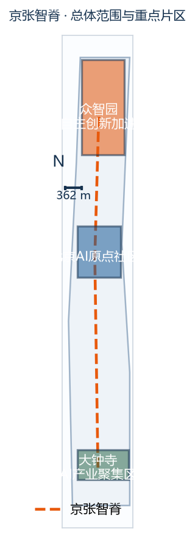
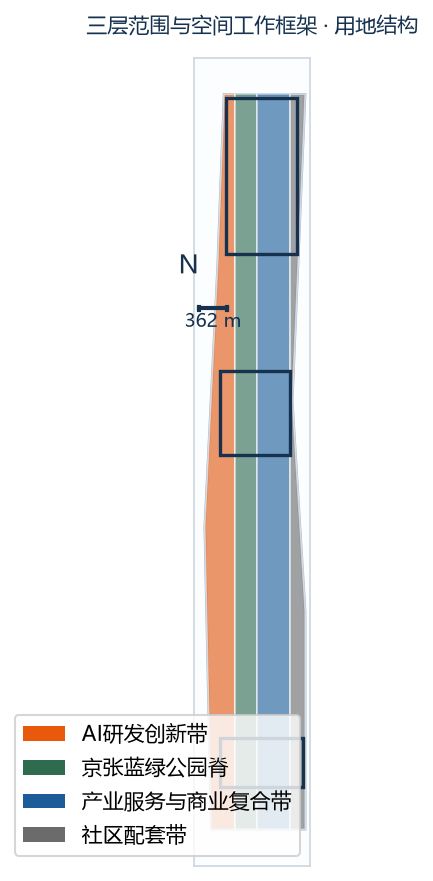
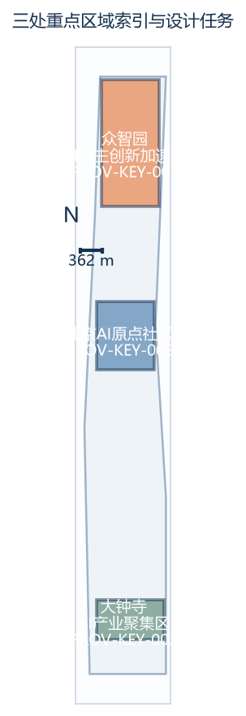
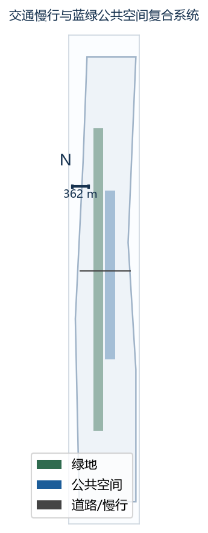
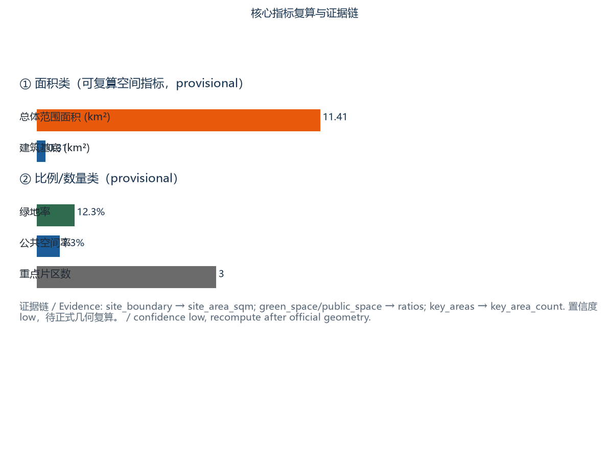

# 京张智脊——百年京张 AI 创新带城市设计

> **版本与状态说明（临时边界）**：本方案基于组织者提供的 **provisional** 粗略边界生成，所有面积、比例、建筑基底与项目数量均为 **指示性**，置信度统一标为 `low`，数值已做四舍五入以避免“勘测级精度”的误导。正式多边形发布后须整体复算。本状态说明在正文、HTML、A3/A0 与 `sources.json` 中一致呈现 [source:SOURCE-REGISTRY]。

## 设计依据与资料清单

本 formal 方案以北京市规划和自然资源委员会海淀分局发布的《百年京张AI创新带城市设计国际方案征集资格预审公告》为第一依据，并以 `brief/site-package/` 中经维护者登记的临时粗略边界、重点区域、枚举、指标和来源清单为机器可读依据。AI agent 在生成方案前必须读取 `design_brief.json`、`allowed_design_space.json`、`sources.json`、`enums/`、`ranges/`、`schemas/`、`data/source_registry.json` 和 `data/processed/agent_fact_pack.md`，并用 `project_scope_summary.csv`、`agent_task_requirements.csv`、`source_use_matrix.csv`、`missing_data_checklist.csv` 建立任务、范围、资料用途和缺口清单。所有设计判断都要拆分为可追溯来源、可复算指标、可校验图层和可人工复核假设。公告要求方案达到控制性详细规划的城市设计深度和规划综合实施方案的城市设计深度，因此文本叙述不能替代 GeoJSON、指标表、A3 文册、A0 展板和 HTML 电子展示成果。

方案不是独立愿景文本，而是从公告、面向智能体任务书和场地资料出发组织成果；本节只把最关键依据放在判断旁边 [source:OFFICIAL-ANNOUNCEMENT] [source:AGENT-TASKBOOK] [depth:existing_conditions_diagnosis]。完整来源和标准覆盖分别保存在 `sources.json`、`standard_matrix.json` 与 `design_depth_matrix.json`，不在正文重复机器索引。

资料登记表的使用边界如下 [source:SOURCE-REGISTRY]：

- data/source_registry.json 登记公开、清权与临时资料的用途边界。
- 当前登记摘要：formal 可用资料 7 条，背景资料 1 条，provisional-only 资料 1 条。
- agent 不得把 background_only 或 provisional_only 资料升级为 official boundary、法定控规、正式评分依据或政府实施承诺。

`data/processed/agent_fact_pack.md` 是本方案的阅读导航层，不是新的权威来源 [source:PROCESSED-FACT-PACK]。它帮助 agent 把三层范围、三处重点区、公告任务、agent.1-agent.6、资料可用性和缺资料事项组织成可读方案；事实判断仍需回到已登记的原始材料 [source:OFFICIAL-ANNOUNCEMENT] [source:AGENT-TASKBOOK]，完整来源关系由 `sources.json` 保存。

本脚手架在官方 `SITE_BOUNDARY` 或三处 `KEY_AREA` 尚未取得时，使用 `brief/site-package/geometry/provisional_boundaries.geojson` 生成临时 formal 包。提交包中的 `geometry/site_boundary.geojson` 与 `geometry/key_areas.geojson` 均必须标注为 `provisional_constraint`、`official_boundary=false`，只能用于方案生成、自检、可视化和设计讨论，不能作为 official redline、审批依据、精确面积依据或法定控制结论。该组织方数据缺口本身不阻断内容评分；替换 official polygons 后，site boundary、key areas、land use、roads、green space、public space、buildings、phasing 和 metrics 均需重算。

本次脚手架生成的可评分状态为：**临时边界，保留精度警示并待正式数据发布后复算；不阻断内容评分**。因此，正文中的空间结构、场景、项目和指标均按“可讨论、可复核、可替换官方边界后复算”的原则写入；当官方边界和重点区 polygon 更新后，agent 必须重新运行脚手架、自检和图纸/HTML生成，不能只替换单个文件。

边界解释可回到总体范围图层和面积复算 [data:geometry/site_boundary.geojson#SITE-001] [metric:site_area_sqm]。三处重点区则由独立图层和数量指标核对 [data:geometry/key_areas.geojson#PROV-KEY-001] [metric:key_area_count]。

## 三层范围工作框架

方案按照公告确定的三个层次组织工作：统筹研究范围关注 43.6 平方公里的AI产业生态、战略定位、创新链和未来城市形态；总体设计范围关注 11.4 平方公里京张遗址公园周边 1-2 公里城市地区和产业区，要求形成城市更新总体框架、产业空间布局、交通市政支撑和城市风貌控制；重点区域范围关注 368.4 公顷三处详细设计地区，要求明确功能业态、建筑规模、拆改留分类、公共空间连通和交通组织。三层范围在 `compliance_matrix.json` 中逐条映射，保证公告 1.3、1.4、1.5 与 agent.1-agent.6 的必选任务都有章节、图层、指标、图纸和 HTML 证据。

三层工作框架的深度项由 [depth:three_level_scope_framework] 和 [depth:overall_spatial_structure] 约束，空间证据以 [data:geometry/site_boundary.geojson#SITE-001] 与 [data:geometry/key_areas.geojson#PROV-KEY-001] 为准，任务依据以 [standard:PROJECT-OFFICIAL-ANNOUNCEMENT] 为准，范围索引以 [source:PROCESSED-FACT-PACK] 中 `project_scope_summary.csv` 的三层范围表为导航。

三层工作不是互相割裂的图纸集合。统筹研究决定产业链和城市形态判断，总体设计把判断落实到更新项目、空间结构和设施承载，重点区域详细设计验证具体地块、建筑、交通、公共空间和AI应用场景的可实施性。agent 生成方案时必须先锁定当前提交采用的 official 或 provisional 边界和约束，再生成用地、建筑、道路、绿地、公共空间、分期和AI服务节点，最后从这些图层复算指标并在正文解释哪些结论仍受 provisional boundary 限制。任何无法从结构化数据复算的面积、比例、规模或项目数量，不得写入正式结论。

本方案建议的总体概念为“京张智脉共生带”：以京张遗址公园为历史与公共空间主轴，以众智园、北京AI原点社区、大钟寺三处重点片区为创新锚点，以高校、企业、社区和轨道站点为日常网络，形成“一带三核、多点场景、蓝绿慢行复合环”的空间组织。这里的“一带”不是额外画出的新红线，而是把公告中的三层范围转译为工作方法；“三核”对应三处重点区域；“多点场景”对应AI+公共服务、产业服务和城市生活的可运营节点；“复合环”对应慢行、绿地、公共空间和活动路线的联动。

| 层级 | 设计问题 | 方案回答 | 数据落点 |
| --- | --- | --- | --- |
| 统筹研究范围 | AI产业生态和未来城市形态如何组织 | 建立“高校策源-开源协作-企业转化-公共体验-国际传播”的创新链 | compliance_matrix.json、standard_matrix.json |
| 总体设计范围 | 产业空间、城市更新、交通市政和风貌如何落图 | 用地、建筑、道路、绿地、公共空间和分期图层共同表达 | [data:geometry/land_use.geojson#LU-001]、[data:geometry/roads.geojson#ROAD-001] |
| 重点区域范围 | 三处片区如何达到详细设计深度 | 分别提出定位、空间动作、AI场景和实施依赖 | [data:geometry/key_areas.geojson#PROV-KEY-001]、#PROV-KEY-002、#PROV-KEY-003 |

## 总体概念与命名体系（agent.1）

面向智能体任务书要求“命名方案和 logo 设计应服务于整体辨识度”。本方案给出可继续深化的命名系统与双语对照，避免停留在口号。

**中文命名体系**
- 总体品牌：**京张智脊**（Jīng-Zhāng Zhì-Jǐ）——取“京张铁路之脊、AI 创新之脊”双关，强调历史廊道与未来产业的连续脊柱。
- 副品牌/活动品牌：**京张智脉共生带**（概念层，非红线）。
- 三处重点片区命名沿用任务书定位并补充识别名：众智园（Zhòng-Zhì Yuán，AI 自主创新加速区）、北京 AI 原点社区（Běijīng AI Yuándiǎn Shèqū，成果转化与人才社区）、大钟寺 AI 产业聚集区（Dàzhōngsì AI Chǎnyè Jùjíqū，智能经济与国际交往街区）。
- 年度活动品牌：**全球 AI 活动周 · 京张线**（Global AI Week · Jing-Zhang Line）。

**English naming system**
- Master brand: **Jing-Zhang AI Spine** (京张智脊).
- Concept layer: **Jing-Zhang Symbiotic AI Belt**.
- Key areas: **Zhongzhi Park** (AI self-innovation accelerator), **Beijing AI Origin Community** (translation & talent community), **Dazhongsi AI Industry Cluster** (intelligent economy & international exchange).
- Annual program: **Global AI Week · Jing-Zhang Line**.

命名逻辑把“铁路遗产—开源协作—产业转化—公共体验—国际传播”串成一条可记忆的叙事线，服务于重点片区、活动路线与朝圣地标的统一辨识 [source:AGENT-TASKBOOK]。

## 视觉识别系统与 Logo 方向（agent.1）

本方案不提交最终 Logo 文件，但给出 **Logo 方向、色彩分区与视觉层级**，供专业团队深化 [source:AGENT-TASKBOOK]。

- **Logo 方向 A（脊线）**：以京张铁路“人”字形折线的负空间构成一条向上的脊线，中段嵌入方形节点代表 AI 算力/开源栅格；可双色（深墨绿 + 信号橙）。
- **Logo 方向 B（共生环）**：以京张遗址公园慢行环为外圈，内嵌三枚点位代表三处重点片区，环上断开处代表“待连接的慢行断点”，呼应更新项目 JZ-01。
- **色彩分区（与用地/功能带一致）**：AI 研发创新带 = 信号橙（#E8590C），京张蓝绿公园脊 = 京张绿（#2F6B4F），产业服务与商业复合带 = 智蓝（#1C5D99），社区配套带 = 暖灰（#6B6B6B）。
- **视觉层级**：主标识（master）+ 片区子标识（sub-mark）+ 活动标识（event mark）+ 朝圣地标印章（landmark seal）。所有图形、图标、字体与图像均须清权；字体采用开源 **Noto Sans SC（SIL OFL 1.1）**，登记见 `report/copyright_statement.md`。

## 三区两翼协同框架（agent.1）

任务书要求回应“五大功能”和“三区两翼”协同。本方案将“三区”定义为 **统筹研究区、总体设计区、重点详细设计区** 三个工作层级；“两翼”定义为 **创新策源翼（高校/院所/开源）** 与 **产业转化翼（企业/资本/国际）**，二者通过京张智脊在重点片区交汇。

- **五大功能 ↔ 空间落点**：AI 研发创新（众智园/智蓝带）、产业服务与商业（大钟寺/智蓝带）、公共空间与蓝绿（京张遗址公园脊）、人才居住与转化（原点社区/暖灰带）、国际交往与展示（大钟寺国际路演 + 全球 AI 活动周）。
- **协同回路**：高校策源 → 开源协作（原点社区）→ 企业转化（众智园/大钟寺）→ 公共体验（遗址公园脊）→ 国际传播（活动周）→ 回流人才与资本。该回路在 [data:geometry/land_use.geojson#LU-001] 与 [data:geometry/phasing.geojson#PHASE-001] 中可定位。
- 协同图见 `assets/figures/land-use-structure.png`（已重绘，含地理基底、比例尺与方位）。

## 区域创新协同机制（agent.1）

京张智脊不是封闭园区，而是区域创新网络的节点。本方案明确其与周边创新载体的协同关系与接口 [source:OFFICIAL-ANNOUNCEMENT]：

- **北纬社区 / 北太地区**：通过慢行与轨道接驳共享人才与开放空间，作为“近校转化”外溢承接。
- **未来科学城**：在自主模型测试、安全治理沙盒（JZ-02/JZ-05）上形成“测试—中试—场景”分工，避免重复建设。
- **怀柔科学城**：在科学装置公共数据、低碳算力上建立数据—算力协同接口，呼应“数据要素会客厅”。
- **经开区（北京经济技术开发区）**：在企业转化、国际路演与制造配套上承接京张的孵化成果。
- **京津冀协同**：以“全球 AI 活动周 · 京张线”为年度接口，联动天津、河北的算力与产业腹地，形成“研发在京张、转化在京津冀”的分工叙事。

上述关系均为 **协同建议/参考方案**，非已确定的政府安排，须由专业团队深化与官方确认。

## 统筹研究范围产业与未来城市研究

统筹研究范围的核心任务是构建世界级 AI 创新生态体系。方案应梳理海淀高校院所、头部企业、算力算法数据要素、孵化平台、上市企业、独角兽和科技服务资源，提出AI创新链、产业链、人才链和城市服务链的空间协同框架。命名方案和 logo 设计应服务于“百年京张文化带、都市AI生活体验带、AI融合创新带”的整体辨识度，不能只停留在口号，应说明与产业生态、公共空间和文化资源的关联。面向智能体任务书还要求回应“五大功能”和“三区两翼”协同，形成可继续深化的命名系统、视觉识别、总体空间结构图、场景开放和运营机制；本节必须用 [source:AGENT-TASKBOOK] 与 [standard:PROJECT-AGENT-OPEN-CALL-TASKBOOK] 标注这些要求来自 agent 开源征集任务，而不是法定规划控制。

统筹研究并不新增伪精确红线；它通过 [standard:MOHURD-URBAN-DESIGN-MEASURES] 要求的城市风貌、公共空间和建筑布局统筹，回接 [data:geometry/land_use.geojson#LU-001]、[data:geometry/public_space.geojson#PUBLIC-001] 与 [depth:overall_spatial_structure]，说明产业策略最终要落到可见、可复核的空间结构。

未来城市形态研究应回答人工智能如何改变工作、生活、社交、学习、交通和公共服务。方案应把AI交通系统、连续绿色空间、创新服务设施和国际化生活工作氛围落实为可定位的功能区、节点、廊道和场景，而不是泛泛描述技术愿景。agent 应把产业战略指标、AI创新指数、人才密度、空间供给类型和AI+垂直应用重点区域写入指标体系，并标明哪些是官方、哪些是设计建议、哪些仍待正式数据校准。若提出全球AI创新活动、开发者社区、开放场景或朝圣路线，应写为“概念建议/参考方案/可供专业团队深化研究”，不得写成已经确定的政府活动或实施安排。

## 全球 AI 创新走廊案例（agent.2）

为建立可借鉴的参照系，本方案梳理 6 条全球 AI / 创新城区案例，提炼与京张相关的经验与警示（均为公开资料综述，非精确对标）[source:OFFICIAL-ANNOUNCEMENT]：

| # | 案例 | 类型 | 可借鉴经验 | 对京张的警示 |
| --- | --- | --- | --- | --- |
| 1 | 深圳河套深港科创合作区 | 跨境科创园区 | 以“一带一区”统筹深港、新型举国体制下开放合作 | 避免重复建设，需明确与怀柔/未来的分工 |
| 2 | 首尔板桥科技谷（Pangyo） | 企业主导创新城 | 龙头企业 + 风险投资 + 人才社区的紧凑混合 | 防止“睡城”，须补足公共空间与慢行 |
| 3 | 新加坡裕廊创新区（JID） | 产研居一体园区 | 产业—研发—居住—绿地 20 分钟复合圈层 | 绿地与公共空间须前置，而非补丁 |
| 4 | 阿姆斯特丹 Zuidas / Amsterdam Smart City | 车站导向创新区 | 轨道一体化 + 城市级数据平台 + 公民参与 | 数据治理须以隐私与人工复核为前提 |
| 5 | 波士顿 Kendall Square | 高校策源创新区 | MIT 外溢 + 近校转化 + 开放实验室网络 | 近校转化要与社区利益共享，防绅士化 |
| 6 | 巴黎 Station F / 创新街区 | 存量建筑激活 | 以旧厂房激活为开源与初创枢纽，低成本启动 | 存量更新须解决权属与消防前置条件 |
| 7 | 赫尔辛基 Kalasatama | 新区数据底座 | 以开放数据 + 数字孪生支撑运营 | 数字孪生依赖官方底图，京张先用 provisional 复算 |
| 8 | 多伦多 Quayside（Sidewalk 教训） | 失败警示 | 过度依赖单一企业数据治理引发公众反弹 | 京张坚持数据最小化、人工复核、公共优先 |

案例结论：成功的 AI 创新带 = **紧凑混合 + 轨道一体 + 绿地前置 + 数据治理可信 + 公共优先**；失败的共性 = 数据治理不透明、公共空间缺位、与社区利益冲突。这些经验直接汇入下方“七要素保障机制”。

## AI 创新生态图谱（agent.2）

本方案用“创新生态图谱”描述参与者、资源与场景的关系（图见 `assets/figures/metrics-evidence.png` 扩展页与 `visual/index.html`）：

- **策源层**：清华、北大、中科院等高校院所，开源社区，新型研发机构。
- **转化层**：众智园（自主模型测试/标准）、原点社区（成果孵化/开源发布）、大钟寺（企业总部/国际路演）。
- **要素层**：算力（端侧算力驿站 JZ-05）、数据（数据要素会客厅）、算法（开源模型）、资本（风险投资/政府基金）、人才（人才特区）。
- **服务层**：企业服务 copilot、AI 生活服务样板街、法律/知识产权/投融资服务。
- **体验层**：京张遗址公园脊、AI 朝圣地标、全球 AI 活动周路线。
- **治理层**：安全治理沙盒、数据最小化、人工复核、公开来源。

图谱以“反馈回路”表达：体验与治理回流到策源与转化，形成自增强生态。

## 七要素保障机制（agent.2）

任务书要求建立“土地—空间—产业—资金—人才—算力—数据—场景”的协同机制。本方案给出八要素（含“空间”单列）的保障逻辑与责任接口：

| 要素 | 机制 | 空间/制度落点 | 责任接口（建议） |
| --- | --- | --- | --- |
| 土地 | 存量更新优先，拆改留分类供应 | 原点社区/大钟寺首层业态 | 海淀更新平台 + 权属主体 |
| 空间 | 蓝绿慢行复合环串联三核 | 京张遗址公园脊 + 慢行断点缝合 JZ-01 | 园林/交通部门 |
| 产业 | 龙头 + 初创 + 开源三层企业矩阵 | 众智园/大钟寺/原点社区 | 产业主管部门 |
| 资金 | 政府基金引导 + 风投 + 场景采购 | 活动周/测试场景采购 | 财政/国资平台 |
| 人才 | 人才特区 + 开源声誉 + 近校转化 | 原点社区人才服务 | 人社/教育部门 |
| 算力 | 端侧算力驿站 + 区域算力协同 | JZ-05 + 怀柔科学城接口 | 算力运营商 |
| 数据 | 数据要素会客厅（授权/可审计） | 大钟寺数据客厅 | 数据集团/合规 |
| 场景 | 10 张场景卡 + 3 个测试验证场景 | 全带节点 | 运营主体（见场景卡） |

该机制为 **设计建议/参考方案**，具体牵头方、资金与审批须由官方与专业团队确认。

## 总体设计范围城市更新与控规深度城市设计

总体设计范围要求达到控制性详细规划的城市设计深度。方案必须提出城市更新总体空间结构、低效空间识别、更新项目清单、实施政策建议、产业功能比例、空间组织模式、建筑总规模和综合承载能力评估。`geometry/land_use.geojson` 应完整覆盖设计边界且无重叠，`geometry/buildings.geojson` 应表达更新建筑基底或保留建筑基底，`geometry/roads.geojson` 应表达微循环、慢行和轨道接驳关系，`metrics.json` 应复算核心面积、比例和图层数量。

本节按照 [standard:MOHURD-CONTROL-DETAILED-PLANNING] 把控规深度内容拆成可审查对象：[data:geometry/land_use.geojson#LU-001] 表达用地结构，[data:geometry/buildings.geojson#BLDG-001] 表达建筑基底，[data:geometry/roads.geojson#ROAD-001] 表达交通组织，[metric:building_footprint_area_sqm] 用于复核建筑基底面积，[depth:land_use_layout] 与 [depth:development_intensity_controls] 约束成果深度。

总体设计还必须支撑交通、轨道、市政和配套设施。方案应围绕轨道站点一体化、道路微循环、非机动车停放、停车供给、创新服务平台、人才生活服务、新型基础设施、分布式能源和端侧算力提出空间布局和实施路径。涉及建筑高度、开发强度、道路红线、退线和设施标准的内容，若尚无官方控制条件，应写为“待正式控规条件确认”，不得以 agent 推测值冒充审定指标。

## 重点区域详细设计

重点区域详细设计是必选项。众智园AI自主创新加速区应围绕国家人工智能平台、全栈自主创新、标准制定、安全治理、产业展示、对外交通、清河文化、低碳绿色创新交往环境和绿色空间AI场景提出详细方案。北京AI原点社区应围绕近校创新、成果孵化转化、人才特区、开源体系、品牌活动、建筑拆改留、成果展示发布、居住生活配套、校区园区慢行联系和轨道站点一体化提出详细方案。大钟寺AI产业聚集区应围绕领军企业、智能体、智能终端、内容消费、数据要素、数字资产、商业服务、规划绿地复合利用、大钟寺站一体化和路口四象限步行连通提出详细方案。

三处重点区域详细设计必须引用 [data:geometry/key_areas.geojson#PROV-KEY-001]、#PROV-KEY-002、#PROV-KEY-003，并由 [depth:three_key_area_detailed_design] 检查是否达到规划综合实施方案深度。若只描述“打造示范区”而没有功能、建筑、交通、公共空间和实施项目证据，应被视为未完成。

三处重点区域必须在 `geometry/key_areas.geojson` 中出现。若仓库已提供 official polygons，应作为 `official_constraint` 使用；若 official polygons 缺失，可暂用 `provisional_constraint`，但正文、HTML、sources、assumptions 和 self_check 必须说明它不能作为正式评分或审批依据。`compliance_matrix.json` 应分别覆盖公告 1.5.3.1、1.5.3.2、1.5.3.3。设计表达应包含功能业态、建筑规模、建筑形态、拆改留分类、公共空间系统、交通组织、慢行连通和实施项目。HTML 页面应能切换查看三处重点区域，A3 文册和 A0 展板应至少包含重点片区总图、局部详图和指标说明。

| 重点片区 | 设计定位 | 空间动作 | AI产业与运营场景 | 证据引用 |
| --- | --- | --- | --- | --- |
| 众智园AI自主创新加速区 | 花园型全栈自主创新街区 | 强化清河界面、产业展示、低碳创新交往和对外交通组织；以绿色空间承载开放测试与标准治理展示 | 自主模型测试、标准制定工作坊、安全治理展示、低碳算力体验 | [data:geometry/key_areas.geojson#PROV-KEY-001]、[depth:three_key_area_detailed_design] |
| 北京AI原点社区 | 近校型成果转化与人才社区 | 组织校区、园区、街区慢行缝合；补足成果发布、人才服务、居住生活和开源协作空间 | 开源社区、成果发布、人才特区服务、近校孵化 | [data:geometry/key_areas.geojson#PROV-KEY-002]、[source:AGENT-TASKBOOK] |
| 大钟寺AI产业聚集区 | 城市型智能经济与国际交往街区 | 围绕大钟寺站一体化、四象限步行连通、商业服务和重点企业公共环境更新 | 智能体与智能终端展示、内容消费、数据要素与国际路演 | [data:geometry/key_areas.geojson#PROV-KEY-003]、[metric:key_area_count] |

## AI 创新生态、人才画像与 AI+ 场景（agent.3 / agent.4）

方案建立面向 AI 人才与企业的空间需求画像，覆盖研发办公、开源协作、成果发布、企业服务、人才居住、社交学习、消费生活、运动休闲和国际交往。AI+场景围绕公告提出的交通、服务、消费、医疗、教育、法律、生活服务等方向形成。每个场景须说明服务对象、空间位置、数据来源、隐私边界、人工复核机制和运营主体 [source:AGENT-TASKBOOK]。

### 用户画像（含包容性群体）

| 用户画像 | 典型需求 | 空间响应 | 隐私/自检边界 |
| --- | --- | --- | --- |
| 开源开发者 | 发布、协作、测试、社区声誉 | 原点社区开源发布厅、公共代码墙、夜间协作空间 | 不采集个人行为轨迹；活动数据只做聚合统计 |
| 初创团队 | 低成本办公、算力入口、产品试验场 | 众智园共享测试场、端侧算力服务点 | 算力和数据服务需另行授权 |
| 头部企业访客 | 展示、商务、国际接待、人才招聘 | 大钟寺国际路演客厅、轨道接驳 | 企业标识和案例须清权 |
| 周边居民 | 通勤、休闲、社区服务、低扰动更新 | 京张遗址公园慢行环、社区服务嵌入 | 不将居民画像用于商业推荐 |
| 高校师生 | 成果转化、跨校协作、日常慢行 | 校区-园区慢行缝合、成果转化驿站 | 校园数据和科研成果需授权 |
| **老年人** | 无障碍、清晰指引、人工服务 | 无障碍连续路径、人工服务台、语音导引 | 非数字服务降级通道 |
| **儿童** | 安全、游戏、教育体验 | 公园安全活动区、AI 教育体验点 | 不采集儿童生物特征 |
| **残障人士** | 无障碍连续、设施可达 | 无障碍坡道/电梯、盲道连续、轮椅可达 | 机器视觉检查不能替代合规验收 |
| **低数字能力者** | 简易界面、人工协助 | 人工服务台、纸质/语音替代 | 提供非数字服务降级 |
| **夜间劳动者** | 安全照明、夜间可达、低干扰 | 夜间照明分级、24h 慢行连通 | 仅用聚合安全数据，不画像个人 |

### 十大 AI 场景卡（升级版：含数据/隐私/复核/主体/成熟度/失败降级/KPI）

| 卡号 | 名称/载体 | 输入数据 | 隐私边界 | 人工复核 | 运营主体(建议) | 技术成熟度 | 失败降级 | KPI |
| --- | --- | --- | --- | --- | --- | --- | --- | --- |
| 01 开源发布厅 | 原点社区 | 公开代码贡献元数据 | 仅聚合，不采集个人轨迹 | 社区 moderator 审核 | 开源基金会+社区 | TRL7 | 转线下发布 | 年发布≥50 场 |
| 02 安全治理沙盒 | 众智园 | 授权模型/评测集 | 评测数据隔离存储 | 红队+专家复核 | 标准机构+园区 | TRL6 | 暂停测试并人工接管 | 年测试≥20 模型 |
| 03 端侧算力驿站 | 总体节点 | 能效/负载聚合 | 不采集用户内容 | 运维巡检 | 算力运营商 | TRL5 | 转区域算力 | 驿站可用率≥99% |
| 04 AI慢行导航 | 遗址公园脊 | 匿名 crowd/断点 | 不识别个人 | 规划师周审 | 园林+交通 | TRL7 | 静态导视 | 断点识别≥90% |
| 05 大钟寺国际路演客厅 | 大钟寺 | 公开企业信息 | 案例须清权 | 品牌审核 | 运营公司 | TRL8 | 转线上路演 | 年路演≥30 场 |
| 06 清河低碳创新廊 | 众智园临河 | 能耗/雨洪聚合 | 不涉及个人 | 环境师复核 | 园区+水务 | TRL6 | 常规绿地维护 | 碳排降≥5%/年 |
| 07 近校成果转化街 | 原点社区 | 公开成果/专利 | 成果需授权 | 法务复核 | 高校+孵化器 | TRL7 | 转线上对接 | 年转化≥40 项 |
| 08 数据要素会客厅 | 大钟寺 | 授权数据集 | 授权+可审计 | 合规官复核 | 数据集团 | TRL6 | 暂停并离线 | 合规流通≥10 主题 |
| 09 AI生活服务样板街 | 社区/商业 | 聚合服务请求 | 不画像个人 | 街道审核 | 街道+运营商 | TRL7 | 人工服务台 | 满意度≥80% |
| 10 全球AI活动周路线 | 一带公共空间 | 活动聚合数据 | 不采集个人 | 安保+组委会 | 活动组委会 | TRL8 | 分流/限流 | 年参与≥5 万人次 |

### 不少于 3 个产业测试验证场景（明确标识）

- **T1 自主模型开放测试**（众智园）：在沙盒中对自主大模型做安全/性能基准测试，输出可审计报告；验证“测试—中试—场景”闭环。
- **T2 端侧算力便民试点**（JZ-05）：在驿站部署低功耗推理，验证隐私敏感场景的本地化处理延迟与能耗。
- **T3 慢行断点 AI 识别**（JZ-01）：用匿名传感器+人工复核验证断点识别准确率，形成可复用的更新清单。

### AI 朝圣地标（不少于 3 个）

1. **清华园车站记忆站**：以京张铁路清华园站遗址为起点，讲述“人字形”铁路与 AI 脊柱的时空对话。
2. **开源之墙（Origin Wall）**：原点社区的开源贡献实时可视化墙，作为开发者“朝圣”与荣誉展示节点。
3. **智脊之眼（Spine Eye）**：大钟寺站上空的 AI 艺术装置/观景台，成为国际路演与城市打卡点。
4. （备选）**低碳创新灯塔**：众智园清河界面的零碳展示塔。

### 荣誉展示体系

建立“贡献墙 + 年度榜单 + 开源声誉章”三级荣誉：贡献墙展示个人/团队开源与场景贡献；年度榜单在活动周发布；开源声誉章作为可继续深化的数字/实物徽章。所有肖像与案例须清权 [source:AGENT-TASKBOOK]。

### 公共空间组件库

提供可复用的公共空间“组件”清单（非固定图纸，供深化）：① 慢行缝合节点、② 开源发布厅模块、③ 无障碍连续路径模块、④ 低碳创新交往亭、⑤ 数据要素会客厅模块、⑥ AI 教育体验点、⑦ 夜间安全照明单元、⑧ 朝圣地标印章。每个组件标注适用片区、最小规模与可复核指标，进入 [data:geometry/public_space.geojson#PUBLIC-001]。

AI 场景必须落到空间和治理边界：公共空间场景引用 [data:geometry/public_space.geojson#PUBLIC-001]，慢行与交通场景引用 [data:geometry/roads.geojson#ROAD-001]，开放空间场景引用 [data:geometry/green_space.geojson#GREEN-001] 和 [metric:public_space_ratio]、[metric:green_ratio]。agent 生成的 AI 治理建议必须遵守数据最小化、公开来源、可解释和人工复核原则；城市智能体可辅助识别慢行断点、公共空间热力、设施维护、企业服务需求和活动安全风险，但不能替代规划审批、不能输出未经授权的个人画像、不能声称获得官方实施承诺。

## 用地、建筑规模与拆改留方案

用地方案应依据国土空间调查、规划、用途管制分类等公开标准表达，形成完整、闭合、无缝的用地分区。建筑方案应区分保留、改造、更新、新建或待确认对象，明确建筑基底、功能、规模、风貌、屋顶、体量和高度控制的建议层级。若缺少现状建筑、权属、控规和工程条件，方案只能提出方法和待校准清单，不能编造拆改留结论。

用地分类依据 [standard:MNR-LAND-USE-CLASSIFICATION-GUIDE]，建筑高度、体量、界面和风貌控制由 [depth:height_massing_character] 管理，拆改留方法由 [depth:retain_renovate_demolish] 管理。用地和建筑的主要证据是 [data:geometry/land_use.geojson#LU-001]、[data:geometry/buildings.geojson#BLDG-001] 和 [metric:building_footprint_area_sqm]。

建筑规模和强度指标必须与 `metrics.json` 和图层一致。若总建筑规模、容积率、建筑高度、建筑密度、绿地率、退线和建筑控制线缺少官方条件，应统一使用 `status=unknown`，并在 `reason` / `assumptions` 中说明待补条件、当前假设和正式数据到位后的复算路径，不得用固定数值制造精确感。A3 文册应给出更新项目清单和指标复核表，A0 展板应把关键空间结构和重点片区表达清楚，HTML 页面应提供指标和图层联动查看。

## 交通、轨道、市政与公共服务设施

交通方案应回应公告对轨道站点一体化、道路微循环、慢行断点、对外交通、停车、非机动车停放和绿色交通系统的要求。重点应覆盖北五环、京张遗址公园跨环路节点、五道口、清华东路西口、大钟寺站及重点企业周边交通联系。道路和慢行图层应保持在提交边界内，并与公共空间、绿地、产业节点和重点片区相互校核；若提交边界为 provisional，交通结论也只能作为临时设计讨论。

交通和市政专业深度分别由 [depth:traffic_rail_slow_parking] 与 [depth:municipal_new_infrastructure] 约束；图层证据引用 [data:geometry/roads.geojson#ROAD-001]、[data:geometry/public_space.geojson#PUBLIC-001] 和 [data:geometry/constraints.geojson#CONSTRAINTS]。当道路红线、管线、消防和市政条件缺失时，应通过 assumptions 说明待补，而不是把策略写成审定条件。

市政和公共服务设施应覆盖AI产业服务设施、创新服务平台、人才生活服务设施、新型基础设施、分布式能源、端侧算力和传统市政设施融合。方案应说明设施标准、空间布局、服务半径、运营模式和分期实施逻辑。缺少管线、能源、排水、防洪、消防等工程资料时，应列为正式深化前置条件。

## 蓝绿空间、公共空间与城市风貌（agent.5）

蓝绿空间方案应以京张遗址公园活力带为骨架，统筹清河、小月河、周边高校、企业、社区出行需求，提出南北贯通、东西连通的步道、骑行道和绿色空间体系。方案应识别慢行断点、上跨环路节点、公园南端和北端景观节点，提出停车、体育、创新交往、科技测试、应用展示和公共服务复合利用策略。

蓝绿公共空间由设计深度项和绿地、公共空间图层共同校核 [depth:blue_green_public_space] [data:geometry/green_space.geojson#GREEN-001] [data:geometry/public_space.geojson#PUBLIC-001]。绿地与公共空间比例在正文解释设计意义（绿地比约 0.123、公共空间比约 0.073，均为 provisional 复算值），完整复算保存在 `metrics.json`；城市风貌、公共空间和建筑控制的统筹则回到专业标准矩阵 [standard:MOHURD-URBAN-DESIGN-MEASURES]。

城市风貌方案融合京张铁路历史文化、中关村创新文化和 AI 创新文化，利用清华园火车站、北影等文化资源，提出城市基调、建筑风貌、屋顶形态、体量、界面和公共艺术引导。导视标识、文化符号、国际传播叙事、AI 朝圣地标、贡献墙与荣誉展示体系已在 agent.4/agent.1 章节给出方向；所有品牌、字体、图像、肖像和企业标识都必须有清权来源。风貌控制应分清官方管控、设计建议和待确认条件，严禁在没有文保或控规依据时给出伪精确控制线。

## 更新项目清单、实施政策与分期计划（agent.6）

实施方案形成可审查的更新项目清单，说明项目位置、类型、功能、责任主体、依赖条件、实施阶段、风险和评估指标。政策建议覆盖城市更新统筹实施、空间供给、运营机制、产业服务、公共参与、数据治理和产权协同。`geometry/phasing.geojson` 表达分期范围，`compliance_matrix.json` 把每个任务与分期和图纸挂接。

项目清单和分期深度由 [depth:renewal_project_list] 与 [depth:phasing_implementation] 管理，分期空间证据为 [data:geometry/phasing.geojson#PHASE-001]。如果没有权属、资金、实施主体和审批路径，方案必须把它写成实施风险，而不是承诺落地。

| 项目 | 名称 | 类型 | 建议牵头方 | 协作方 | 时间窗 | 资源需求 | 试点最小规模 | 阶段 KPI | 风险闸门 | 退出机制 |
| --- | --- | --- | --- | --- | --- | --- | --- | --- | --- | --- |
| JZ-01 | 京张遗址公园慢行断点缝合 | 公共空间/交通 | 海淀园林+交通 | 街镇、志愿者 | 近期(0-12月) | 桥下空间许可、慢行设计 | 1 个断点示范段 | 断点识别≥90% | 红线/权属未定→暂停 | 转常规养护 |
| JZ-02 | 众智园清河创新界面 | 蓝绿/产业展示 | 众智园运营 | 水务、生态 | 近期-中期 | 河道蓝线、防洪条件 | 200m 示范界面 | 碳排降≥5% | 防洪未批→缩规模 | 转绿地维护 |
| JZ-03 | 原点社区近校成果转化街 | 更新/产业服务 | 高校+孵化器 | 街道、知识产权 | 近期-中期 | 校区边界、首层业态 | 1 条街坊 | 年转化≥40 项 | 权属争议→分段 | 转线上对接 |
| JZ-04 | 大钟寺站四象限步行连通 | 轨道一体/慢行 | 轨道+交通 | 市政、企业 | 中期(12-36月) | 站点一体、管线 | 1 个路口象限 | 步行连通率≥95% | 管线冲突→改方案 | 转信号优化 |
| JZ-05 | AI公共服务与端侧算力节点 | 新基建/公服 | 算力运营商 | 能源、合规 | 近期-中期 | 能源、安全主体 | 3 个驿站 | 可用率≥99% | 能耗超限→降载 | 转区域算力 |
| JZ-06 | 全球AI活动周公共路线 | 运营/品牌 | 活动组委会 | 文旅、公安 | 年度持续 | 公共空间许可、版权清权 | 1 条年度路线 | 年参与≥5 万 | 安全/版权→限流 | 转线上活动 |

分期与 100 天征集设计周期区分：征集周期是提交成果的时间要求，实施分期是城市更新和项目建设的推进路径。方案提出近期试点、中期更新和长期治理框架，并标明哪些内容可先以轻量设施、运营活动和服务平台启动，哪些必须等待正式控规、市政、交通和权属条件确认。

### 年度 AI 创新活动体系

- **全球 AI 活动周 · 京张线**：年度旗舰活动，串联遗址文化—开源社区—产业展示—国际路演，作为国际招引与公共体验入口。
- **开源发布季 / 标准工作坊**：季度性，由原点社区与众智园承接。
- **场景开放日**：月度，开放测试场景（T1-T3）供企业与公众体验。
- **开发者社区运营**：以开源之墙、贡献榜与声誉章维持活跃度，提供文档、算力度与展示位。
- **国际招引转化路径**：活动周 → 路演客厅 → 落地服务（法务/知识产权/投融资）→ 转化跟踪，形成“体验—对接—落地”闭环。

以上活动与运营均为 **概念建议/参考方案**，频率、责任边界与转化路径须由专业团队与官方确认，不得写成已确定的政府安排。

## 指标体系、面积复算与合规矩阵

指标体系至少应包含总体设计范围面积、重点区域面积、绿地与公共空间比例、建筑基底、更新项目数量、AI场景节点、慢行连通指标、产业空间指标、人才服务指标和自检状态。所有 known 指标必须能从 GeoJSON 或可信来源复算；unknown 指标必须给出原因和正式提交前置条件。`scripts/spatial_review.py` 和 `scripts/visual_review.py` 的结果是 formal 自检的重要证据。

指标复算遵循统一的设计深度要求 [depth:metrics_recalculation]。正文重点解释指标的设计含义；完整数值、公式、来源文件和置信度保存在 `metrics.json`（当前为 provisional 复算：site_area ≈ 11.41 km²、green_ratio ≈ 0.123、public_space_ratio ≈ 0.073、building_footprint ≈ 0.31 km²、key_area_count = 3，置信度均为 `low`）。

合规矩阵是任务响应性的主控文件。每条公告任务和 agent_taskbook 任务必须对应到报告章节、图层、指标、图纸、HTML 页面、来源、假设和自检项。本版已为 agent.1-agent.6 分别引用专属成果（命名/VI、案例/图谱/机制、场景卡/测试场景、公共空间组件库/朝圣地标、文化叙事、实施路径/活动体系），不再把全部任务映射到同一组证据。未能覆盖公告 1.3、1.4、1.5 或 agent.1-agent.6 的任一必选任务，方案不得进入 formal professional scoring。

正式深化时，agent 还应把每个指标分为三类：第一类是可由提交几何直接复算的空间指标；第二类是需要官方控规或任务书附件支撑的管控指标（容积率、高度、密度、退线、红线、设施标准，当前 `unknown`）；第三类是需要运营或产业数据持续校准的绩效指标（AI 创新指数、人才密度、满意度、可达性、参与度、使用频次）。三类指标分别进入 `metrics.json`、`assumptions.json` 和 `compliance_matrix.json`，避免把运营愿景误写成审定规划条件。

## 风险、版权与合规说明

**要求双语言。** 方案主文件可使用中文或英文，但必须通过 `proposal.en.md` 提供完整对照译文；A3/A0、HTML 和含文字图件也必须提供对应语言副本。所有图片、图纸、图标、数据和代码资产必须在 `sources.json` 或 `report/copyright_statement.md` 中说明来源、许可和授权状态。HTML 页面不得加载远程脚本、远程地图瓦片、远程字体、iframe、表单或外部 API，不得跟踪评审者行为（本包 HTML 已内嵌开源字体，零外部网络依赖）。

风险和缺资料清单由风险深度项、约束图层和场地包共同校核 [depth:risk_missing_data] [data:geometry/constraints.geojson#CONSTRAINTS] [source:SITE-PACKAGE]。`missing_data_checklist.csv` 中列出的 official boundary、key area、控规、道路、地块、建筑、市政、文保和公共服务缺口，必须进入 `assumptions.json`、自检和正文风险章节。任何缺少官方控规、道路红线、权属、市政、消防或文保条件的结论，都必须降级为待确认事项；完整专业核对保存在标准矩阵中。

本方案不声称官方批准、审定控规、最终土地权属、最终建设规模或保证实施。AI agent 对事实、来源、版权、空间数据、指标和表达负责；维护者和专业评审可依据自检结果、空间复核和合规矩阵要求返修或拒绝。

## 参考资料

- brief/public-brief.md
- brief/site-package/design_brief.json
- brief/site-package/allowed_design_space.json
- brief/site-package/enums/
- brief/site-package/ranges/planning_limits.json
- data/processed/agent_fact_pack.md
- data/processed/project_scope_summary.csv
- data/processed/agent_task_requirements.csv
- data/processed/source_use_matrix.csv
- data/processed/missing_data_checklist.csv
- 完整机器索引：见 `sources.json`、`metrics.json`、`compliance_matrix.json`、`standard_matrix.json` 与 `design_depth_matrix.json`
- 本节书目入口依据场地包登记，完整出处和许可见结构化来源清单 [source:SITE-PACKAGE]
