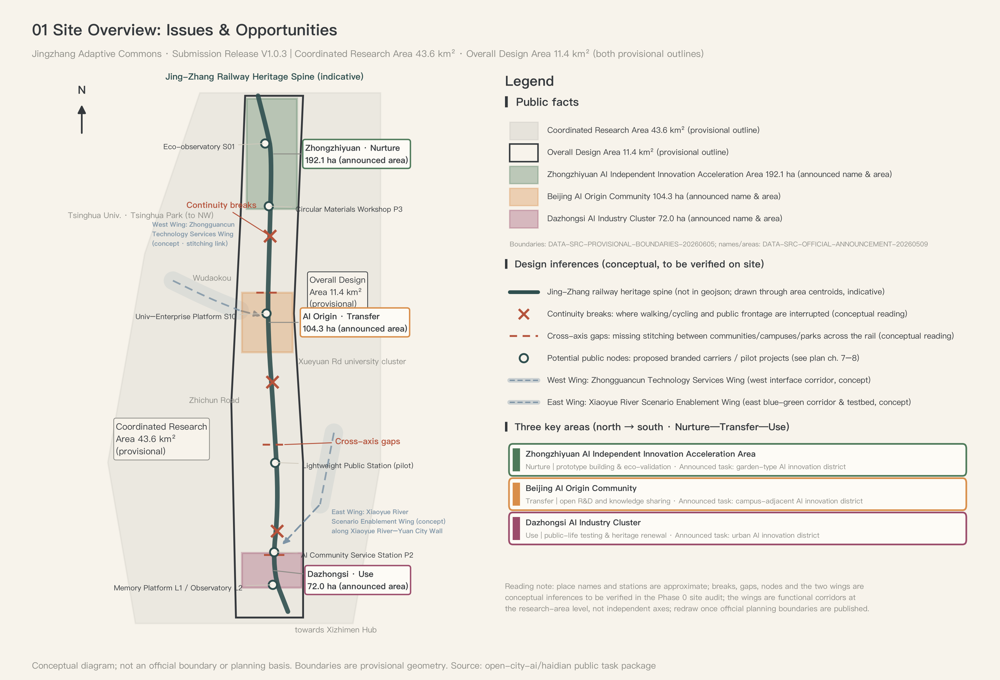
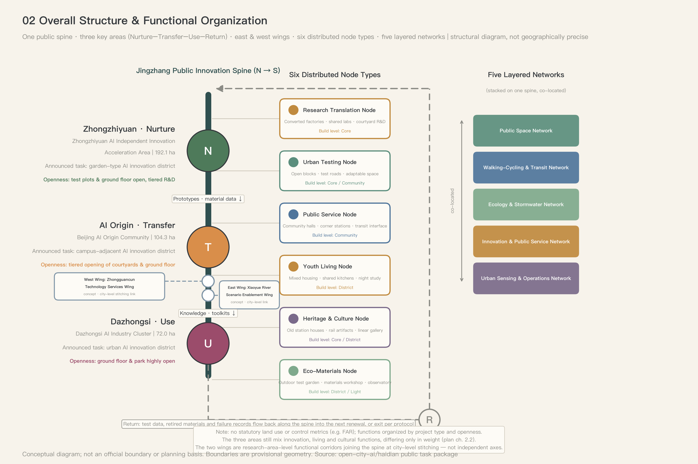
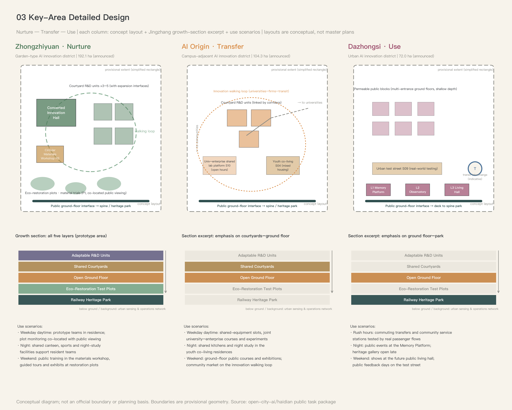
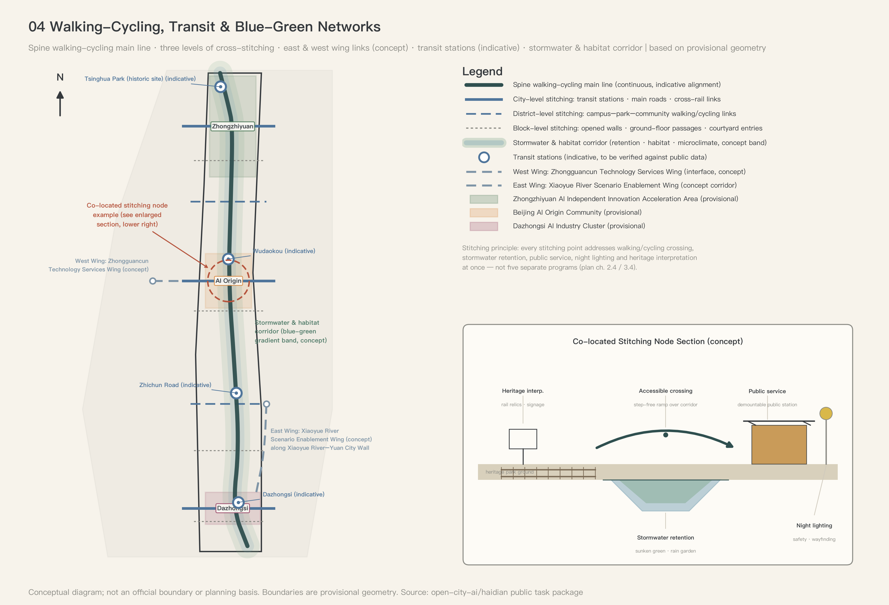
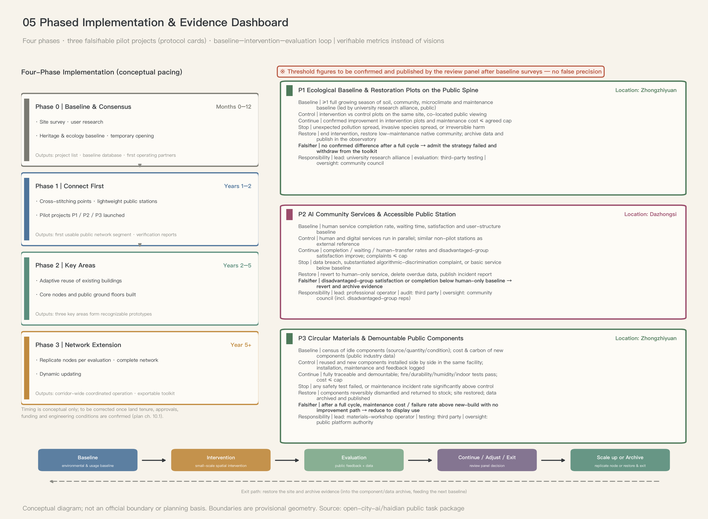

# Jingzhang Adaptive Commons (JINGZHANG ADAPTIVE COMMONS)

**A Distributed Public Infrastructure and Adaptive Renewal Proposal for the Centennial Jing-Zhang AI Innovation Belt**

> **Release status | v1.0.3 · 2026-08-26: open co-creation proposal; not a formal plan; not an engineering conclusion; not officially approved.**

Tagline: **Let innovation enter everyday urban life**.

## Conclusions First

This proposal does not read the AI innovation belt as a showcase axis strung with landmark buildings. Instead, it organizes the Jing-Zhang Railway Heritage Park, universities and research institutes, technology parks, communities, and ecological spaces into a **network of urban public infrastructure that is connectable, exchangeable, incrementally buildable, sustainably operable, and replicable at scale**. The overall structure can be summarized as:

> **One public main axis, three key areas, two wings (east and west), six types of distributed nodes, and a five-layer composite network.**

The core spatial move is not large-scale demolition and reconstruction, but: using the railway heritage and park system to establish a continuous public base; stitching together the communities, campuses, and parks on both sides of the railway with lateral connections; arranging innovation resources as public nodes of varying sizes and complementary functions; raising everyday vitality through open ground floors, mixed use, and adaptable buildings; and enabling the construction process to keep correcting itself through monitoring, evaluation, and small-step iteration.

Every spatial judgment in this proposal answers to a single litmus: **Along Jing-Zhang, the city is no longer built once and for all, but renews itself through continuous exchange.** The operational form of this litmus is the Three Litmus Questions (判准三问) — every spatial move must answer all three at once; if it cannot, it is not built:

1. **Connection**: which specific rupture does it stitch together — the two sides of the railway, the inside and outside of institutional walls, old and new communities?
2. **Exchange**: what resources does it set genuinely flowing between which actors — space, equipment, materials, knowledge, data?
3. **Growth**: what interfaces does it leave behind, so that the next stage of expansion, adjustment, or exit remains possible?

---

## 1. Design Basis and Source List

**Judgment**: this proposal is built on three tiers of material — task facts, background material, and provisional geometry. The three carry different evidentiary weight, are strictly distinguished in the text, and background material is never used to support statutory spatial-control conclusions.

**Task facts** (the official brief the proposal must answer): the call announcement gives the project name, the area figures for the three scope levels (a Coordinated Research Area of about 43.6 square kilometers, an Overall Design Area of about 11.4 square kilometers, and three key areas totaling about 368.4 hectares), the names and design tasks of the three key areas, and the "Three Zones and Two Wings" structure [source:DATA-SRC-OFFICIAL-ANNOUNCEMENT-20260509]; the agent taskbook gives ten co-creation principles, three positionings, five functions, and six agent tasks (agent.1–agent.6) [source:DATA-SRC-AGENT-TASKBOOK-20260518]. The orientation of the two wings uses the context described by a background report: the Zhongguancun Technology Services Wing on the west and the Xiaoyue River Scenario Enablement Wing on the east. That report is not a basis for formal spatial control or implementation [source:DATA-SRC-BEIJING-GOV-20260403].

**Provisional geometry**: the boundaries of the Overall Design Area and the three key areas currently exist only as provisional rough boundaries published by the repository. In this package, `site_boundary.geojson` carries only the Overall Design Area (PROV-SITE-001) and `key_areas.geojson` carries the three key areas (PROV-KEY-001/002/003); the provisional outlines of the Coordinated Research Area and the aggregated key-area scope are stored in `constraints.geojson` (PROV-RESEARCH-001 / PROV-KEY-SCOPE-001) as planning-control reference polygons. All are labeled provisional constraints; they are not official planning boundaries or a basis for precise area figures. PROV-RESEARCH-001 has been conceptually recalculated at low confidence in EPSG:4548 using `polygon_area(constraints#PROV-RESEARCH-001)`, yielding 43,609,232.558 sqm only for a magnitude check against the announced approximately 43.6 km². Once the organizer publishes an official polygon with version, CRS, precision, and applicable-scope metadata, it must replace the provisional outline and trigger recalculation and redrawing [source:DATA-SRC-PROVISIONAL-BOUNDARIES-20260605] [metric:research_area_sqm] [data:geometry/constraints.geojson#PROV-RESEARCH-001].

**Background material**: the eight global innovation-district cases and the submission-package preparation guidelines are used for mechanism reference and process checking only; they are background only and do not support statutory conclusions [source:DATA-SRC-SITE-PACKAGE-DOCS].

**Gaps and handling rules**: none of the following official materials has been obtained; their impacts and recalculation triggers are registered item by item in the assumptions list — official boundary polygons for the three scope levels, official polygons for the three key areas, regulatory detailed planning conditions (FAR, building height, building coverage ratio, setbacks), road red lines and baseline traffic volumes, parcel ownership and existing-building surveys, cultural-heritage protection boundaries and construction control zones, municipal utility and capacity data, and public-service facility baselines. The handling rule: any metric involving these materials remains to be confirmed with official data and no numerical conclusion is drawn; all derived geometry and metrics will be recalculated and rebuilt once official materials are released [depth:existing_conditions_diagnosis] [depth:risk_missing_data].

**Professional-standard response status**: the five formal mandatory registry items — the announcement, agent taskbook, urban design, regulatory detailed planning, and land-use classification — all have registered snapshots, access dates, and source paths, and this proposal responds to them in direction. Accessibility, cultural-relics protection, and data security remain package-level supplementary standards. `review_status=addressed` means only that the evidence chain responds; it does not claim project-level clause review, site inspection, or professional sign-off (see Chapter 12 and `standard_matrix.json`).

**Still missing**: the complete password-controlled pre-qualification package and project-specific materials for official polygons, regulatory controls, roads, title, heritage, and utilities. Registry snapshots do not replace these site materials or licensed professional review.

---

## 2. Three-Level Scope Framework

**Judgment**: the three scope levels are nested, not parallel — the Coordinated Research Area governs industry and corridor structure; the Overall Design Area governs urban renewal and regulatory-plan-level urban design; the Key-Area Detailed Design Area governs detailed design and first-phase projects. Area figures follow the announcement; geometry is expressed with the help of recalculated values from the provisional boundaries.

- **Coordinated Research Area (announced at about 43.6 km²)**: the strategic research tier. No official polygon has been obtained. It is represented by the provisional_only rough outline PROV-RESEARCH-001 and recalculated at low confidence in EPSG:4548 as 43,609,232.558 sqm (about 43.6092 km²). This supports only industry positioning, regional coordination, the “Three Zones and Two Wings” structure, and east–west corridor research; it is not an official area, red line, or control basis, and no parcel-level design is performed. The announcement basis is registered in the Chapter 1 task facts; the formula, provisional-outline source, and official-polygon replacement/recalculation/redrawing trigger are recorded in `metrics.json` and A-BOUNDARY-001 [source:DATA-SRC-PROVISIONAL-BOUNDARIES-20260605] [metric:research_area_sqm] [data:geometry/constraints.geojson#PROV-RESEARCH-001].
- **Overall Design Area (about 11.4 km²)**: the working tier for urban renewal and overall urban design. It is currently expressed with a provisional rough boundary; the recalculated area is about 1,141.28 hectares, consistent in magnitude with the announced figure of about 11.4 km². This value is a conceptual design-model figure with low confidence, not an official planning indicator [metric:site_area_sqm] [data:geometry/site_boundary.geojson#PROV-SITE-001].
- **Key-Area Detailed Design Area (three areas totaling about 368.4 hectares)**: the detailed design tier. From north to south: the Zhongzhiyuan AI Independent Innovation Acceleration Area (announced at about 192.1 hectares), the Beijing AI Origin Community (announced at about 104.3 hectares), and the Dazhongsi AI Industry Cluster (announced at about 72.0 hectares). In the provisional geometry the three areas do not overlap and lie within the overall boundary [data:geometry/key_areas.geojson#PROV-KEY-001] [depth:three_level_scope_framework].



*Figure 1. Site overview and problems-and-opportunities map: the three scope levels, the Jing-Zhang railway heritage main line, the provisional positions of the three key areas, major innovation resources, rail stations, continuity breaks, gaps in lateral connections, and the conceptual corridors of the two wings (at the Coordinated Research Area level). The boundaries shown are provisional constraints, not official planning boundaries.*

**Why it fits this site**: the innovation resources of the Jing-Zhang corridor (universities, research institutes, parks) are densely distributed along the line but closed to one another. The three-level nesting puts strategic judgment, renewal design, and project delivery each in its place, avoiding the double distortion of "research at too large a scale to land, design at too small a scale to see structure."

**How to verify**: the three area figures and spatial relationships can be recalculated from this package's GeoJSON under the agreed projection (see Chapter 11). The Coordinated Research Area uses `polygon_area(constraints#PROV-RESEARCH-001)` in EPSG:4548. Differences between provisional boundaries and announced areas, plus the official-polygon replacement, recalculation, redrawing, and difference-report trigger, are registered in A-BOUNDARY-001.

**Still missing**: the official precise boundary polygons of the three scope levels; once obtained, all geometry, metrics, and figures must be recalculated and redrawn.

---

## 3. Coordinated Research Area: Industry and Future City Research

**Judgment**: at the Coordinated Research Area scale, this proposal's future-city hypothesis is — an innovation district in the AI era no longer relies on a single landmark or a closed park, but on a distributed, verifiable network of public infrastructure; AI's role is limited to assisting identification, prediction, matching, and evaluation, while important public decisions remain explainable and human-accountable.

**Why it fits this site**: the site must simultaneously resolve five structural problems. Common approaches each have their limits; this proposal's responses are as follows:

| Structural problem | Limit of common approaches | This proposal's response |
|---|---|---|
| The railway corridor is continuous but laterally under-connected | Treating the park as linear landscape only | Set high-frequency lateral stitching points and cross-boundary public interfaces |
| Innovation resources are dense but closed to one another | Treating parks or campuses as independent units | Form a network of shared facilities, joint experiments, and results display |
| AI scenarios easily become device showcases | Chasing short-term "black-tech" spectacle | Focus on public services, space operations, and closed loops of real use |
| Heritage display is disconnected from contemporary life | Isolated protected objects, single visiting routes | Turn heritage spaces into public living rooms and vehicles for education and innovation |
| Insufficient operating momentum after construction | Build space first, find content later | Projects, operating bodies, and evaluation metrics enter the design at the same time |

**Industry positioning**: the proposal answers the announcement's three positionings and five functions at once — the Centennial Jing-Zhang Culture Belt (heritage as a continuous carrier of public-space order and urban memory), the Metropolitan AI Life Experience Belt (AI first serving everyday needs such as commuting, education, health, accessibility, ecology, and community governance), and the AI-Integrated Innovation Belt (universities, research, enterprises, communities, and government forming a collaborative network through shared spaces and urban experiments). The Full-Stack Independent AI Innovation System is carried by Zhongzhiyuan through the R&D–testing–pilot-production chain; AI-enabled scenario empowerment is carried jointly by the east wing and the test scenarios of the three key areas; international outreach is carried by the annual forum and the open toolkit mechanism (see Chapters 6 and 10) [source:DATA-SRC-AGENT-TASKBOOK-20260518].

**Regional innovation collaboration matrix**: the task book names Beiwei Community, Future Science City, Huairou Science City, Beijing E-Town, and the Beijing–Tianjin–Hebei region as collaboration counterparts to address, but this proposal has obtained no cooperation agreement, resource inventory, or implementation commitment from any of them [source:DATA-SRC-AGENT-TASKBOOK-20260518]. Everything below is a conceptual recommendation. Evidence grade T means only that the task book names the counterpart; it does not prove that collaboration exists. C means an interface hypothesis proposed here and pending verification. Every row is T+C and may enter project design only after counterpart intent, authority, openable resources, data compliance, and operating costs are verified.

| Counterpart | Exchangeable resources (candidates) | Spatial / platform interface (concept) | Lead-body types | Return loop | Evidence grade |
|---|---|---|---|---|---|
| Beiwei Community | Resident needs; accessibility and human-service feedback; community issues | Dazhongsi public-service station; P2 minimum-sufficiency service; Urban Observatory | Community governance, public-service operator, accessibility representative, and third-party evaluator types | Appeal volume, waiting time, human fallback, and satisfaction thresholds feed service adjustment; failed cases return to human handling | T+C; no evidence of cooperation or data authorization |
| Future Science City | Publicly releasable research outputs, talent courses, validation needs, and technology-transfer methods | West-wing professional-service station, shared labs, and annual challenge | Public-platform, university, research, and technology-transfer body types | Validation results enter the open toolkit; problem lists return to the R&D agenda | T+C; resources and access conditions unverified |
| Huairou Science City | Publicly releasable methods, science-communication content, cross-scale observation, and urban questions | Memory Platform; science courses at the Future Public Life Hall; open toolkit and joint questions | Public-platform, research, science-communication, and data-compliance body types | Anonymized results, failure records, and public questions return to research and science-communication content | T+C; no assumption that major facilities, data, or personnel are available |
| Beijing E-Town | Engineering validation capability, manufacturing and supply needs, and product prototypes | Zhongzhiyuan, Materials Workshop, and E02 urban-test interface | Park public-platform, manufacturer, testing-body, and scenario-operator types | Engineering results return to prototype iteration; complaints, maintenance, and exit records return to admission rules | T+C; no investment-attraction, capacity, computing, or procurement commitment |
| Beijing–Tianjin–Hebei | Regional application questions, talent exchange, legally shareable aggregate-data catalogues, and reusable governance tools | Rail-station nodes, annual forum, bilingual toolkit, and project call | Regional public-platform, urban-operator, university, and industry-organization types | Reasons for adoption, rejection, and exit return to the toolkit, with differences published | T+C; no regional agreement, funding, or policy commitment |

The matrix defines only a “pose the question–validate at small scale–publish results–feed back corrections” interface. Before any counterpart enters implementation, the parties must publish responsibility boundaries, data and intellectual-property rules, cost allocation, public return, exit arrangements, and contacts. A counterpart's name is not evidence that collaboration exists.

**Global case references**: eight cases covering seven mechanism types — old industrial district transformation, anchor-institution drive, station-city renewal, corridor networks, government-led parks, content-industry clustering, and waterfront heritage regeneration. Only mechanisms are extracted, never forms transplanted; each case notes the conditions for local validity:

| # | Case | Core mechanism | Applicability limits | Local translation for Jing-Zhang |
|---|---|---|---|---|
| C1 | 22@ Barcelona (Spain) [source:DATA-SRC-CASE-22AT-BCN] | About 200 hectares of industrial land converted into a productive innovation district: industrial relics retained and mixed with housing; development-right transfers incentivize replacement | Depends on unified municipal planning power; mixed use without housing protection displaces existing residents | "Retain + insert" into existing factory buildings rather than wholesale replacement; permeable public blocks keep wet markets and convenience retail |
| C2 | one-north, Singapore [source:DATA-SRC-CASE-ONENORTH-SGP] | A 200-hectare R&D district developed under unified government leadership, rolled out by theme and by phase | Depends on long-term single-owner holding; a top-down model is hard to graft onto a multi-ownership existing urban area | Corresponds to the coordinating role of the "public platform governing body" and the four-stage phasing; start from renewal and retrofit rather than one-time build-out |
| C3 | King's Cross Central, London [source:DATA-SRC-CASE-KINGSX-LON] | High-speed rail driving the regeneration of about 27 hectares of railway land; an anchor institution (Central Saint Martins) arriving first; adaptive reuse of listed buildings; public space first | Depends on mega-event infrastructure and patient capital over 20+ years | The Jing-Zhang heritage corridor and rail stations are equivalent triggers; AI Origin takes universities as anchor institutions; public carriers come first |
| C4 | Kendall Square, Boston [source:DATA-SRC-CASE-KENDALL-BOS] | A near-campus innovation ecosystem co-locating university research output with enterprises | Depends on knowledge spillover from a world-class research university; gentrification must be hedged with low-cost retention | The "near-campus incubation" prototype at AI Origin; Youth Co-Creation Residences hedge the innovation premium |
| C5 | Toronto–Waterloo Innovation Corridor [source:DATA-SRC-CASE-TORWAT-CORRIDOR] | A 112-kilometer corridor organized around hubs, forming a talent–enterprise cycle | Loose nodes without physical hubs easily remain an alliance in name only | The Jing-Zhang main axis assigns distinct roles to the three areas (Nurture–Transfer–Use) plus public-platform hubs, avoiding fragmentation |
| C6 | Nanshan District, Shenzhen (Yuehai Subdistrict / High-Tech Zone) [source:DATA-SRC-CASE-NSHAN-SHZ] | High-density R&D agglomeration and source-innovation platform building | High-density agglomeration brings tidal commuting and cost-of-living pressure | Zhongzhiyuan's R&D density must be balanced with youth-life and public-service nodes to avoid a park-style island |
| C7 | Digital Media City (DMC), Seoul [source:DATA-SRC-CASE-DMC-SEOUL] | Brownfield regenerated into a content-industry cluster, with multi-layer governance and tenancy theme controls | Strong theme control demands high leasing resilience; heavy upfront public investment | A governance reference for Dazhongsi's new business formats; the Six Admission Questions are a lightweight version of theme control |
| C8 | Minato Mirai 21, Yokohama [source:DATA-SRC-CASE-MM21-YOKOHAMA] | About 186 hectares of shipyard and rail-yard regeneration, continuously rolled out toward the goal of "connecting two existing centers" | Whole-parcel development of a super-large site depends on long cycles and a single consortium | The homologous judgment of the main axis stitching existing centers; a reference for converting heritage buildings into public carriers |

**How to verify**: every industry and spatial judgment lands in a specific key area, project package, and metric (Chapters 6, 10, 11); all case translations are annotated with local validity conditions — no collage-style benchmarking.

**Still missing**: regional industry baselines (lists of enterprises, employment, and R&D institutions) and footfall data have not been obtained, so industry-scale judgments remain qualitative; formal lists of universities, parks, enterprises, and communities are pending.

---

## 4. Overall Design Area: Urban Renewal and Regulatory-Plan-Level Urban Design

**Judgment**: the overall structure is "one public main axis, three key areas, two wings (east and west), six types of distributed nodes, and a five-layer composite network"; the renewal strategy is existing-stock first, phased implementation, and circular construction. All development-intensity control indicators (FAR, building height, building coverage ratio, setbacks) remain to be confirmed with official data until regulatory detailed planning materials are obtained [depth:overall_spatial_structure] [depth:development_intensity_controls].

**Brand visual identity (agent.1)**: the original mark combines Jing-Zhang double rails, the branching outline of the Chinese character 人 (person), and the node-and-return loop of Nurture–Transfer–Use–Return. Deep ink rails stand for the continuous public axis; the copper crossbar stands for knowledge exchange; the celadon open loop stands for resource return; and the signal-blue terminal node is the interface for the next growth cycle. The mark is drawn entirely from original vector geometry and borrows no existing railway, institutional, or corporate identity [depth:overall_spatial_structure].


Usage rules: the primary mark uses only ink `#1A1A2E`, copper `#C9A227`, celadon `#5BA4A4`, signal blue `#4A90D9`, and paper white `#FAFAF8`; monochrome applications convert every stroke to black or white without changing proportions. Minimum width is 18 mm in print or 72 px on screen, with clear space no smaller than the central-node diameter; rotation, stretching, shadows, and node-color substitution are prohibited. In the Chinese lockup, “京张生长网络” is the primary title and `JINGZHANG ADAPTIVE COMMONS` the subtitle; the English lockup reverses that order. Titles use Noto Serif CJK SC 700, subtitles IBM Plex Mono 500, at an approximate 3:1 size ratio with default letter spacing. The mark is the corridor-wide agent.1 master identity. Agent.5 wayfinding inherits only the rail line, nodes, and four-color hierarchy as directional and level syntax, never competing beside the master mark. Agent.6 event identities use a temporary “master mark + event name + year” lockup and do not alter the mark. L1–L3 venues are distinguished only by names and node colors, with no separate master logos. SVG and font generation, licenses, and reuse boundaries are registered in the copyright statement and manifest.

**One axis — the Jing-Zhang Public Innovation Main Axis**: the railway heritage park and its continuous open space form the main axis, superimposing five functions: a railway-heritage narrative path, a continuous walking and cycling system, a habitat–stormwater–microclimate corridor, AI public services and urban-observation facilities, and an open interface for displaying innovation results and civic activities. The axis does not pursue an identical landscape form along its whole length; instead it uses unified paving interfaces, signage, data specifications, and public-facility modules so that different segments remain recognizable while being allowed to grow on their own.

**Three zones — Nurture, Transfer, Use, Return (育—传—用—还)**: the three key areas carry a complete urban exchange chain that holds only for Jing-Zhang — it depends on each area's announced task and on their north-to-south spatial order:

| Key area | Announced design task | Exchange-chain role | Core proposition |
|---|---|---|---|
| Zhongzhiyuan AI Independent Innovation Acceleration Area (northernmost; announced at about 192.1 ha) | A garden-type AI innovation district that is smarter and more future-oriented | **Nurture**: prototype building and ecological validation | Make ecological test plots, material trials, and prototype construction the everyday ground floor of the garden-type district |
| Beijing AI Origin Community (central; announced at about 104.3 ha) | A near-campus AI innovation district with greater talent appeal, innovation vitality, and technology-transfer capacity | **Transfer**: open R&D and knowledge sharing | Make the knowledge production of universities and institutes mutually visible and mutually usable with everyday community life |
| Dazhongsi AI Industry Cluster (southernmost; announced at about 72.0 ha) | An urban-type AI innovation district with greater global influence and urban-development vitality | **Use**: public-life testing and heritage renewal | Let AI and spatial prototypes undergo the test of use in the most everyday, most urbanized environment |

Zhongzhiyuan builds the new things and completes their testing; AI Origin turns validated prototypes into teachable, replicable public knowledge; Dazhongsi subjects the results to the test of real public life; and test data, retired materials, and failure records flow back along the main axis (Return) into the next round of renewal or exit by agreement. The three areas are not independent zones: they exchange daily through shared projects, joint events, public transport, and data platforms [source:DATA-SRC-OFFICIAL-ANNOUNCEMENT-20260509].

**Two wings — east–west supporting arms** (orientation described by a background report, for context only and not as a control basis: the Zhongguancun Technology Services Wing on the west and the Xiaoyue River Scenario Enablement Wing on the east) [source:DATA-SRC-BEIJING-GOV-20260403]:

- **Relationship to the main axis**: the axis governs the longitudinal growth rhythm (baseline–intervention–evaluation–expansion); the wings govern lateral resource exchange. Each wing connects to the main axis through city-level lateral stitching points; the connection points are exchange interfaces, and no new independent axis is added. The three key areas remain the only detailed-design scope; the wings express functional and corridor relationships at the Coordinated Research Area level, and their specific boundaries are provisional expressions.
- **West wing · Zhongguancun Technology Services Wing (an interface belt for technology transfer and professional services)**: relying on the Zhongguancun innovation hinterland west of the main axis, it focuses on retrofitting existing buildings, east–west walking corridors, and shared service facilities — no large-scale demolition and reconstruction. It hosts producer services such as intellectual property, technology finance, testing and certification, technology transfer, incubation and acceleration, and legal and compliance consulting, opening toward the axis's three areas along the stitching corridors. Its exchange duties: connecting Zhongzhiyuan's prototypes and AI Origin's toolkits to capital and professional services (Transfer→Return), and feeding real enterprise demand back into research agendas (Return→Nurture). Several "professional service interface stations" (a variant of the Lightweight Public Station family) are proposed, operated by enterprise project partners under unified opening hours and annual evaluation rules. Corridor alignments and building setbacks are to be confirmed with official data.
- **East wing · Xiaoyue River Scenario Enablement Wing (a blue-green corridor and scenario-testing belt)**: a waterfront blue-green corridor along the Xiaoyue River toward the Yuan Dynasty city-wall relics; per the announcement it is a cluster area for featured application scenarios such as embodied AI, AI healthcare, and AI+ film and video. This proposal organizes scenarios through waterfront public-space renewal, activation of idle spaces under bridges and along the water, Lightweight Public Stations, and designated test segments. Its exchange duties: receiving pilot scenarios spilling over from Dazhongsi's Urban Test Street and prototypes awaiting testing from Zhongzhiyuan (Nurture→Use), and returning test data, public feedback, and failure records to the Urban Intelligence Observatory (Use→Return). The specific extent to which the relics proper are avoided is to be confirmed with public materials from the cultural-relics authority.
- **Design boundaries of the two wings**: at the detailed-design stage only corridor- and node-level conceptual expression is provided; red lines, land-use adjustments, and intensity indicators are all to be confirmed with official data. West-wing commercial service facilities must not replace the free public services on the main axis; east-wing experiments must not intrude into quiet interfaces and habitat buffers. The Three Litmus Questions apply to the wings as well.

**Six types of distributed nodes**:

| Node type | Buildings and spatial carriers | Core functions | Construction tier |
|---|---|---|---|
| Research-transfer node | Retrofitted factory buildings, shared lab buildings, courtyard R&D units | Joint R&D, prototyping, technical services | Core tier |
| Urban-experiment node | Open blocks, test roads, adaptable public spaces | Real-scenario testing, public participation, evaluation and display | Core / community tier |
| Public-service node | Community halls, street-corner service stations, transit-transfer interfaces | Education, health, government affairs, accessibility and digital services | Community tier |
| Youth-life node | Mixed housing, shared kitchens, study spaces, sports grounds | Living, socializing, entrepreneurship, nighttime vitality | District tier |
| Heritage-culture node | Old station buildings, railway structures, linear galleries | Memory display, public education, cultural events | Core / district tier |
| Ecology-materials node | Outdoor test gardens, materials workshops, environmental observation stations | Habitat monitoring, restoration trials, circular-construction display | District / lightweight tier |

**Five-layer composite network**: a public-space network, a walking-cycling-transfer network, an ecology-and-stormwater network, an innovation-and-public-service network, and an urban-observation-and-operations network — five layers superimposed on the main axis and connected into the six node types. The network layers must be co-located and coordinated: one lateral stitching point should simultaneously solve walking and cycling crossing, stormwater retention, public services, nighttime lighting, and heritage interpretation, rather than becoming five independent sectoral projects.

**Core section — the Jingzhang Growth Section**: the basic spatial unit recurring along the whole corridor, organizing ecology, buildings, AI, and public life in a single section:

```text
Above ground  Adaptable R&D units — demountable envelopes and independent MEP modules, reconfigurable on a 3–5 year cycle
─────────  Shared courtyards — inter-institutional exchange interfaces: equipment, samples, courses, joint experiments
─────────  Open ground floors — publicly accessible: exhibition, courses, community services, small-scale retail
─────────  Ecological restoration plots — productive landscape: habitat monitoring, stormwater retention, material trials
─────────  Railway heritage park — the continuous public base: the walking/cycling main line, heritage narrative, urban observation
Background  Urban observation and operations network — sensing, data archiving, and maintenance routes
```

Every interface in the section is an "exchange": the park exchanges ecological data with the plots, the plots exchange display content with the ground floors, the ground floors exchange users with the courtyards, and the courtyards exchange results with the R&D units. Different segments take different slices of the section according to site conditions: Zhongzhiyuan shows all five layers in full; AI Origin strengthens the courtyard–ground-floor stretch; Dazhongsi strengthens the ground-floor–park stretch, with R&D units receding into the background or absent. The section is the litmus drawn on paper: any design fragment that cannot point out "on which layer the exchange happens" cannot proceed to further development.



*Figure 2. Overall structure and functional organization: one axis, three key areas (Nurture–Transfer–Use–Return), the east- and west-wing interfaces, six node types, and the five-layer network. The two wings are functional corridors at the Coordinated Research Area level, shown here as conceptual indications. No statutory land-use adjustments lacking a basis are drawn; project types and openness intensity replace fabricated control indicators.*

**Land use and renewal framework**: the land-use layout within the Overall Design Area targets a mixed organization of innovation and R&D, education and research, blue-green space, public services, residential support, and commercial services; see the conceptual land-use model in this package's land-use layer and in Chapter 7 [data:geometry/land_use.geojson] [depth:land_use_layout]. Seven renewal-strategy principles: existing-stock first, continuous base, distributed configuration, functional reciprocity, phased implementation, circular construction, and feedback correction.

**How to verify**: the structure and land-use relationships can be recalculated from the land-use layer; every spatial move must pass the Three Litmus Questions.

**Still missing**: formal regulatory detailed planning conditions, project-specific land-use approval, ownership, and existing-condition surveys. The registered land-use guide snapshot is available but cannot replace site-specific planning conditions; land-use ratios and intensity indicators draw no statutory conclusions before materials arrive.

---

## 5. Detailed Design of Key Areas

**Judgment**: the three key areas share the building prototypes (Chapter 7) and the "Jingzhang Growth Section" (Chapter 4), but each answers the distinct task assigned by the announcement and carries a different link in the Nurture–Transfer–Use–Return exchange chain. All three area boundaries are currently provisional geometry and must be recalculated and corrected once official planning boundaries are released [data:geometry/key_areas.geojson#PROV-KEY-001] [depth:three_key_area_detailed_design].



*Figure 3. Detailed design of the three key areas: positioning, conceptual master plan, spatial sequences, typical sections, and first-phase project hooks for each area; the Zhongzhiyuan section adopts the complete "Jingzhang Growth Section."*

### 5.1 Zhongzhiyuan AI Independent Innovation Acceleration Area (announced at about 192.1 ha) — Prototyping and Validation Ground (Nurture)

**Site judgment**: located at the northernmost end of the corridor, currently a suburbanizing technology-park segment with relatively ample room for growth; it is the announcement's core carrier for the Full-Stack Independent AI Innovation System. The problems: a closed park fabric, a broken memory link with the historic Qinghe settlement, and poor "last-mile" walking quality between the rail station and the park. This is the only segment where all five layers of the "Jingzhang Growth Section" appear in full.

**Spatial proposition**: "garden-type" is not a greening-rate indicator; it means making ecological test plots, material trial fields, and prototype construction yards the district's everyday ground floor — making "building and verifying the future" itself a watchable public landscape.

**Spatial moves**:

1. Full-stack R&D space: one Retrofitted Innovation Hall plus 3–5 clusters of Courtyard R&D Units carry the chip–framework–model–application R&D–testing–pilot-production chain; small individual volumes with phasing interfaces reserved, avoiding one-time build-out;
2. Reserved potential land: identify land for near-term implementation and for medium-to-long-term reserve; reserve land is opened first as temporary green space, test plots, and Lightweight Public Stations, with no physical hoarding (specific parcels to be confirmed with ownership and survey data);
3. Transport optimization: strengthen the station–park–main-axis three-line connection with a city-level stitching point; logistics flows and low-speed delivery share a corridor organized by time slots; the station-access section retrofit is to be confirmed with road red-line data;
4. Qinghe culture: bring the historic layering of Qinghe ancient town and the canal–railway crossing into the northern start of the heritage narrative path; the materials workshop prioritizes components from demolition and renovation within this area, letting "Qinghe memory" enter the provenance stories of the component library;
5. Garden-type district: ecological restoration plots and material trial fields become watchable productive landscape on the block's ground floor — green space is not an indicator but a working interface.

**First-phase project package**: P1 ecological baseline and restoration plots, P3 circular materials workshop and component library, the S01 environmental observation anchor station, one Courtyard R&D Unit retrofit pilot, and one station–main-axis stitching point; corresponding to project packages E04 (circular construction platform) and E01 (shared experimental facilities, northern section).

### 5.2 Beijing AI Origin Community (announced at about 104.3 ha) — Open R&D and Knowledge-Sharing Campus (Transfer)

**Site judgment**: located mid-corridor, surrounded by Tsinghua and other universities and research institutes, with the highest knowledge density of the whole corridor — yet campus, park, and neighborhood walls stand side by side. The announcement calls for a "near-campus" district; the key is turning "near campus" from a geographic fact into a fact of use. The existing built fabric is dense; every move must be low-disturbance.

**Spatial proposition**: make the knowledge production of universities and institutes mutually visible and mutually usable with the everyday life of surrounding communities, rather than facing each other across courtyard walls.

**Spatial moves**:

1. Near-campus incubation: university–enterprise shared lab platforms are placed where campus boundaries meet the main axis, with equipment open to community booking during open hours; incubation space is embedded at small scale as Courtyard R&D Units — no standalone incubation park;
2. Talent attraction: Youth Co-Creation Residences (mixed housing, shared kitchens, nighttime study spaces) hedge the innovation premium with low-cost retention; talent-policy interfaces are provided through the west wing's professional service interface stations;
3. Low-disturbance renewal: block-level stitching mainly by opening walls, ground-floor passages, and courtyard entrances, preserving mature trees and existing social networks; new construction is limited to connecting corridors, Lightweight Public Stations, and retrofits of existing buildings — no large-scale demolition and reconstruction;
4. Station–city linkage: sort out the walking breaks between the rail station, campuses, and communities; an innovation walking loop links universities–enterprises–station–main axis; works involving station entrances and municipal roads are to be confirmed with official data;
5. Heritage interface: the old Jing-Zhang station remains (the former Qinghuayuan Station site lies within the corridor's first opened phase) serve as knowledge-narrative anchors and enter the priority collection scope of the Railway Memory Digital Archive; protection boundaries and intervention depth follow public materials from the cultural-relics authority [standard:CULTURAL-RELICS-PROTECTION-LAW].

**First-phase project package**: the first open unit of the S10 university–enterprise shared lab platform, the first converted building of the S04 Youth Co-Creation Residence, 1–2 station–campus stitching points, and the S07 archive-collection launch; corresponding to project packages E01 and E03.

### 5.3 Dazhongsi AI Industry Cluster (announced at about 72.0 ha) — Public-Life Testing and Heritage-Renewal Living Room (Use)

**Site judgment**: the smallest and most urbanized of the three areas, at a highly accessible position where the Third Ring Road meets a rail interchange. Pain points: the four-quadrant fragmentation caused by large-scale roads and the rail station, static traffic crowding out walking space, and heritage resources coexisting with everyday retail but lacking organization. This area is the corridor-wide "testing ground": any AI service or spatial prototype counts as established only when residents who do not use smartphones, commuters, and visitors actually use it here.

**Spatial moves**:

1. Carrying new business formats: a Permeable Public Block carries the display, trading, and experience of new formats such as agents, smart terminals, and AI content; ground floors have multiple entrances, shallow depths, and high visibility; new formats are mixed with wet markets, convenience retail, and facilities for children and the elderly — no pure tech showroom;
2. Four-quadrant walking connections at the metro station: establish continuous, shaded, barrier-free walking connections among the four quadrants around the station — concourse-level connections, improved street-crossing interfaces, and integrated public platforms; specific passage alignments and sections are to be confirmed with road red-line and metro data;
3. Static traffic: gradually convert the station-area negative spaces occupied by parking into public ground floors and walking/cycling space; total static-traffic control, shared parking, and underground-space coordination strategies are to be confirmed with transport-sector data;
4. Testing and disclosure: the Urban Test Street receives prototypes from Zhongzhiyuan and AI Origin; the Urban Intelligence Observatory opens corridor-wide baselines, pilot results, and failure records to the public;
5. Heritage-renewal living room: the Jingzhang Memory Platform and the Future Public Living Hall use railway heritage spaces to carry narrative, public events, and international exchange, keeping old and new materials and structures legible; the specific extent of cultural-relics protection objects and intervention depth follows public materials from the cultural-relics authority, and everything at this stage is labeled a conceptual recommendation [standard:CULTURAL-RELICS-PROTECTION-LAW].

**First-phase project package**: the first station of P2 AI community services and accessibility public stations, the S05 accessible-mobility assistant transfer segment, the first segment of the S09 Urban Test Street, one four-quadrant stitching point, and the L2 observatory preparatory exhibition; corresponding to project packages E02 and E06.

**Still missing**: official boundary red lines for the three areas, existing-building and tree surveys, and ownership baselines. Area master plans, key axonometrics, and site-specific sections must be deepened after data arrives; Figure 3 is currently a conceptual version.

---

## 6. AI Innovation Ecosystem, Personas, and AI+ Scenarios

**Judgment**: AI+ scenarios are not device showcases. Every scenario must specify its users, spatial carrier, operating body, AI role and data boundaries, core metrics, and stop/exit conditions; test boundaries are publicized before launch, and exits and failures are equally public. This chapter gives six user personas, twelve scenario cards, three falsifiable first-mover validation projects, and three signature public carriers [source:DATA-SRC-AGENT-TASKBOOK-20260518].

**agent.2 eight-factor safeguard matrix**: the following items are safeguard interfaces that must be verified one by one before implementation design; they are not an inventory of secured resources. Bodies are identified only by type and no institution is represented as having agreed to participate. Funding, computing, land, policy, and scenario permissions are all uncommitted [source:DATA-SRC-AGENT-TASKBOOK-20260518].

| Factor | Carrier (concept) | Provider / operator types | Open rules | Public return | Risk boundary | Data to verify |
|---|---|---|---|---|---|---|
| Land | Existing parcels, renewal buildings, and temporary test sites | Planning and natural-resources, rights-holder, and public-platform body types | Public calls only after ownership and planning conditions are verified; time-limited, reversible, and within permitted use | Public ground floors, open space, or public-service hours | No assumption of land supply, use change, or FAR adjustment; no entry before contamination and title are cleared | Formal boundaries, title, planning conditions, existing use, and contamination survey |
| Space | Shared labs, public-service stations, and Youth Co-Creation Residences | Rights-holder, professional-operator, and community-governance body types | Publish booking, fees, accessibility, fire capacity, and open hours | Free public hours, low-threshold workspaces, and convenience services | Prevent commercial displacement, rent exclusion, fire overload, and accessibility failure | Available area, building condition, capacity, retrofit permissions, and operating costs |
| Industry | E01–E06 project packages and Urban Test Street | Public-platform, research, manufacturing, and service body types | Open call, Six Admission Questions, annual evaluation, and exit | Shared equipment, public courses, open results, and local service improvement | No assumed enterprise list, leasing result, investment, or procurement; agree intellectual property first | Industry baseline, enterprise needs, equipment list, intellectual property, and safety requirements |
| Funding | Phased project ledger and public-value procurement interface | Fiscal, rights-holder, social-capital, and foundation body types as potential providers | Source-specific approval, milestone payment, and disclosed cost and performance; no hidden cross-subsidy | Public services, maintenance funding, failure archive, and reusable outputs | No amount, source, or financing is guaranteed; no procurement or financing before approval | Capital and operating costs, funding eligibility, budget procedures, procurement, and audit requirements |
| Talent | Youth Co-Creation Residences, courses, developer and community co-creation networks | University, employer, professional-operator, and community body types | Transparent eligibility, time-limited use, disclosed prices, and no exclusion by algorithmic score | Affordable short stays, mentor hours, public courses, and community projects | No talent policy, quota, or subsidy is promised; prevent discrimination, displacement, and unpaid labor | Talent demand, rent and pay baselines, course supply, and service capacity |
| Computing | Compliant shared-computing application gateway; no assumed self-built data center | Qualified cloud and computing operator, university-platform, and public-operator types as potential providers | Publish quotas, fees, security tiers, energy use, and exit rules | Public-interest pilot quotas, reproducible experiments, and cost disclosure | No capacity, subsidy, or access is promised; prevent cybersecurity, energy, and vendor-lock-in risks | Workloads, capacity, network, energy, fees, security tiers, and compliance conditions |
| Data | Urban Observatory, data catalogue, and controlled sandbox | Data-controller, professional-operator, compliance-review, and third-party-audit body types | Data minimization, purpose limitation, authorization, tiered aggregation, retention, deletion, and appeal | Open definitions, lawfully shareable aggregate results, failure records, and methods | Personal and raw cross-domain data are not shared by default; algorithms cannot determine public-service eligibility | Data inventory, lawful basis, sensitivity, quality, retention, security, and authorization |
| Scenarios | Small-scale test units for E02, P1–P3, and S01–S12 | Public-management, community, professional-operator, and testing/evaluation body types | Open call, baseline and control, informed notice, stop, and restoration | Service improvement, open evaluation, reusable protocols, and complaint response | No deployment permission or procurement is assumed; safety, privacy, and accessibility are not relaxed for pilots | Site permission, users and baselines, liability insurance, maintenance, and exit costs |

The eight factors proceed through a “verify information–publish rules–validate at small scale–independent evaluation–continue or exit” loop. Any factor lacking a confirmed lawful source, accountable body, whole-life cost, or public return does not enter the implementation list. Statutory indicators still await confirmation with official data, and all spatial geometry remains provisional.

### 6.1 User personas

1. **Community residents**: care about convenient services, environmental quality, privacy, and construction disturbance.
2. **Young researchers and students**: need low-cost workspace, short stays, exchange, and equipment sharing.
3. **Startups and enterprise teams**: need real-scenario validation, collaboration interfaces, and results display.
4. **Universities and research institutions**: need cross-institution platforms, long-term test plots, and trustworthy data.
5. **Children, the elderly, and users with disabilities**: need accessibility, low cognitive load, and available human support.
6. **Visitors and international partner institutions**: need a clear narrative, public access, and understandable demonstration results.

Maintenance, cleaning, security, and operations staff enter back-of-house routing and facility design as the implicit seventh user group across all scenarios.

### 6.2 Twelve scenario cards

Threshold numbers are left blank until the baseline survey is complete; they will be confirmed by the review panel against the baseline report and published — no false precision is preset.

**S01 Jing-Zhang Environmental Observation Station** | Users: researchers, citizens, school teachers and students | Spatial carrier: a Lightweight Public Station plus outdoor test plots, anchored on the green land along the main axis in Zhongzhiyuan | Operating body: led by the university research consortium, maintained by a professional operations team | AI role and data boundaries: anomaly detection and trend forecasting for sensor data; only non-identifying environmental and space-use data is collected, anonymized and aggregated; both raw and processed data are published | Core metrics: continuous data availability rate, public query volume, course citations by schools | Stop/exit: if the sensor misjudgment rate exceeds the agreed threshold or maintenance is interrupted beyond the agreed period, display is suspended and the reason published; decommissioned equipment is removed and recycled under reversible installation.

**S02 Urban Ecological Restoration Garden** | Users: residents, students, maintenance and operations staff | Spatial carrier: rain gardens and intervention/control plot pairs; first site in Zhongzhiyuan (P1) | Operating body: the university research consortium plus a third-party testing institution, supervised by the community deliberation mechanism | AI role and data boundaries: archiving soil and habitat data, comparative simulation of restoration strategies; no restoration effect is claimed without control-group confirmation | Core metrics: changes in soil physicochemical and habitat indicators of the intervention group relative to the control group, maintenance cost per unit area | Stop/exit: unexpected pollution spread, invasive species, or irreversible negative effects — terminate the intervention, restore low-maintenance native communities, and archive and publish the data.

**S03 AI Community Service Station** | Users: the elderly, children, users with disabilities, community residents | Spatial carrier: community halls, street-corner service stations; first site in Dazhongsi (P2) | Operating body: led by the professional operations team, audited by a third-party evaluation institution, supervised by the community deliberation mechanism (representatives of vulnerable groups must sit on the review) | AI role and data boundaries: assisted service guidance, form pre-filling, multimodal interaction; data minimization, human fallback, clear notice, and opt-out; algorithmic scoring never replaces service-eligibility judgment [standard:DATA-SECURITY-PIPL] | Core metrics: service completion rate, waiting time, human handoff rate, satisfaction of vulnerable groups, complaint rate | Stop/exit: a data breach, a substantiated algorithmic-discrimination complaint, or service quality below baseline — revert to pure human service, delete overdue data, and publish an incident report.

**S04 Youth Co-Creation Residence** | Users: young researchers and students, startup teams | Spatial carrier: mixed housing, shared kitchens, study spaces; located in AI Origin and Zhongzhiyuan | Operating body: park operator plus universities plus a foundation (E03) | AI role and data boundaries: space and equipment booking-matching, energy optimization; residential data is used only for operational improvement, never for personal behavior scoring | Core metrics: occupancy rate, number of cross-institution collaboration projects, community research outputs, retention rate | Stop/exit: if usage falls below the agreed floor for two consecutive evaluation cycles, units are converted to other public uses; if a residential-data management complaint is substantiated, smart-service modules are suspended during rectification.

**S05 Accessible Mobility Assistant** | Users: people with visual or mobility impairments, all pedestrians | Spatial carrier: transfer nodes, walking/cycling paths, and lateral stitching points — deployed corridor-wide | Operating body: the public platform governing body plus the professional operations team, with disability organizations participating in acceptance | AI role and data boundaries: route guidance, obstacle detection, and problem reporting; voice and location data are processed at the edge and personal trajectories are not retained long-term [standard:GB-55019-ACCESSIBILITY] | Core metrics: accessibility continuity rate, guidance task completion rate, problem response time, user trust | Stop/exit: guidance errors causing a safety incident or consecutive failed audits — revert to purely physical accessibility facilities and publish the rectification.

**S06 Shared Corridor for Low-Speed Delivery** | Users: merchants, residents, operations staff; the testing party is enterprise project partners | Spatial carrier: logistics interfaces and designated test segments (within the Urban Test Street), extensible to the embodied-AI test segment in the east wing | Operating body: operated by enterprise project partners, with admission and oversight by the public platform governing body | AI role and data boundaries: path scheduling and conflict avoidance for low-speed robots; test vehicles are clearly marked; data collection is limited to what operational safety requires | Core metrics: last-mile delivery conflict events, pedestrian yield rate, changes in merchant usage cost | Stop/exit: pedestrian complaints or conflict events exceeding the agreed cap, or conflicts with barrier-free passage — shrink or stop the test segment and restore the road's original traffic rules.

**S07 Railway Memory Digital Archive** | Users: citizens, visitors, researchers | Spatial carrier: heritage galleries, the Jingzhang Memory Platform (L1), the online archive room (E05) | Operating body: an archival institution plus a cultural team plus the community deliberation mechanism | AI role and data boundaries: oral-history transcription, linking and retrieval assistance for old photographs; public-contributed content enters the archive only after human verification; AI-generated content is clearly labeled | Core metrics: public contribution volume, verification pass rate, educational events | Stop/exit: if factual errors or ownership disputes cannot be clarified, the disputed entries are taken down and the handling record published.

**S08 Circular Materials Workshop** | Users: designers, craftspeople, students, citizens | Spatial carrier: retrofitted factory buildings, open workshops; located in Zhongzhiyuan (P3/E04) | Operating body: the materials-workshop operator plus a third-party testing institution plus the public platform governing body | AI role and data boundaries: component-library retrieval and matching suggestions, processing-parameter assistance; material-passport data is traceable end-to-end | Core metrics: component reuse rate, demountability rate, life-cycle cost comparison, public training participation | Stop/exit: any failed safety test or a maintenance-event rate significantly above the control — components are retired to storage, the site is restored, and use shrinks to display only; testing thresholds for new materials are not relaxed as pilots scale up.

**S09 Urban Test Street** | Users: enterprises, residents, management departments, the community deliberation mechanism | Spatial carrier: adaptable streets and public squares; located in Dazhongsi, with the east-wing scenario-testing belt as its extension | Operating body: admission by the public platform governing body, operation by enterprise project partners, evaluation by a third-party evaluation institution | AI role and data boundaries: the tested objects themselves plus operational data collection; test boundaries, data inventories, and exit mechanisms are publicized before launch | Core metrics: test-result disclosure rate, evidence of service improvement, exit execution rate, complaint rate of nearby residents | Stop/exit: failed evaluation or complaints exceeding the cap — exit per agreement and restore the site; if no valid test applications arrive for two consecutive years, revert to ordinary street management.

**S10 University–Enterprise Shared Lab Platform** | Users: universities and research institutions, enterprises and startup teams, public-course learners | Spatial carrier: innovation halls, R&D courtyards; located in AI Origin and Zhongzhiyuan (E01) | Operating body: the university research consortium plus enterprise partners, with unified open hours and booking rules | AI role and data boundaries: equipment scheduling and usage records, experimental data management; data in public-course areas and lab-safety zones is segregated by tier | Core metrics: shared-equipment hours, cross-institution projects, public-course participation, pilot conversion rate | Stop/exit: if the equipment-sharing rate stays below the agreed floor, open-hours rules are reviewed; after a safety incident, the affected equipment is suspended until it passes re-inspection.

**S11 International Innovation Forum** | Users: international institutions, industry teams, citizens | Spatial carrier: the Future Public Living Hall (L3) and city living rooms; located in Dazhongsi | Operating body: the professional operations team plus the public platform governing body plus partner academic institutions | AI role and data boundaries: bilingual simultaneous interpretation and content archiving assistance; published content is subject to human editorial approval | Core metrics: annual continuity (not a one-off event), bilingual output volume, renewing partner institutions | Stop/exit: if for two consecutive years investment-signing dominates and the share of public topics falls below the agreed floor, the forum is downgraded to an ordinary industry conference and the venue is released for public events.

**S12 Four-Season Public Calendar** | Users: all citizens, visitors, maintenance and operations staff | Spatial carrier: main-axis nodes, community squares, the heritage park corridor-wide | Operating body: scheduled by the professional operations team, proposed and reviewed by the community deliberation mechanism | AI role and data boundaries: event scheduling and venue-conflict optimization, anonymized participation statistics; no facial recognition or personal tracking | Core metrics: share of free events, participation, resident satisfaction, zero-intrusion record on quiet interfaces | Stop/exit: commercialization crowding out free events or intrusion into quiet interfaces triggers a review of event permits; chronically underused event types exit the calendar.

### 6.3 Three first-mover validation projects (falsifiable protocols)

Each project is written to a unified protocol: purpose, space, baseline, control, responsible parties, continue conditions, stop conditions, restoration actions, falsification point.

**P1 Main-Axis Ecological Baseline and Restoration Plots**: Purpose — establish the site's ecological baseline and validate soil improvement, habitat creation, and low-maintenance landscape strategies; recommended location: the green land along the main axis in Zhongzhiyuan. Baseline — no less than one full growing season of background records on soil physics and chemistry, biological communities, microclimate, and maintenance, completed and published under the lead of the university research consortium. Control — intervention and control groups within the same plot, with a public observation interface co-located with both groups. Responsible parties — led by the university research consortium; independent evaluation by a third-party testing institution; oversight by the community deliberation mechanism. Continue conditions — the intervention group shows review-panel-confirmed meaningful improvement on agreed indicators relative to the control group, and maintenance cost per unit area does not exceed the agreed cap. Stop conditions — discovery of unexpected pollutant-spread risk, invasive-species spread, or irreversible negative effects as determined by the review panel. Restoration actions — terminate the intervention, restore the plots to low-maintenance native communities, and archive all data and publish it in the observatory. Falsification point — after a full evaluation cycle, if the intervention and control groups show no meaningfully confirmed difference, publicly acknowledge that the strategy does not work on this site and withdraw it from the toolkit. Threshold — before pollutant testing is complete, no specific pollution or restoration effect is claimed; native species and small-scale trials take priority.

**P2 AI Community Services and Accessibility Public Station**: Purpose — validate whether AI can reduce the time and comprehension costs for residents accessing public services; recommended first station in the Dazhongsi area. Baseline — before the pilot, record background completion rates, waiting times, and satisfaction for human services, plus anonymized statistics on the served population structure. Control — human and digital services run in parallel over the long term; testing never replaces human service; comparable non-pilot community service stations serve as external reference. Responsible parties — led by the professional operations team; algorithm and data audit by a third-party evaluation institution; oversight by the community deliberation mechanism (representatives of vulnerable groups must sit on the review). Continue conditions — completion rate, waiting time, human handoff rate, and satisfaction of vulnerable groups improve relative to baseline, and the complaint rate does not exceed the agreed cap. Stop conditions — a data breach occurs, an algorithmic-discrimination complaint is substantiated, or basic service quality falls below baseline. Restoration actions — revert to pure human service, delete overdue data, publish an incident report. Falsification point — if satisfaction or completion rates of vulnerable groups fall below the pure-human baseline, acknowledge that AI intervention does not hold in this scenario; the station reverts to human mode and the evidence is archived. Threshold — data minimization, human fallback, clear notice, opt-out, and never lowering basic service quality in the name of testing [standard:DATA-SECURITY-PIPL].

**Persona journey for testing**: Auntie Wang, 72, lives nearby and does not use a smartphone. She comes to the service station to make a health appointment — she sees a staffed counter, not a wall of screens; staff can call on AI assistance, and she can speak plainly the whole way through. During one system outage, the human fallback completes the service within the promised time, and the outage and handoff records enter the monthly evaluation; if the human-fallback rate exceeds the agreed threshold, a service-simplification review is triggered. She does not need to know what a large model is — her waiting time decides whether this system continues to exist.

**P3 Circular Materials and Demountable Public Components**: Purpose — validate the applicability of reused existing components and new non-load-bearing materials in public space; the workshop is located in Zhongzhiyuan, and the first component application point may be at any Lightweight Public Station. Baseline — a survey of the provenance, quantity, and condition of idle components from existing demolition and renovation projects; reference values for the cost and carbon emissions of comparable newly fabricated components (using published industry data with registered sources). Control — reused and newly fabricated components are installed side by side in the same public facility, with installation, maintenance, and public feedback recorded in parallel. Responsible parties — led by the materials-workshop operator; testing by a third-party testing institution; oversight by the public platform governing body. Continue conditions — components are traceable, maintainable, and demountable end-to-end; fire, durability, heat-and-moisture, and indoor-environment tests are passed; life-cycle cost does not exceed the agreed cap. Stop conditions — any failed safety test, or a maintenance-event rate significantly above the control. Restoration actions — components are removed back to storage via reversible connections (see the nine-step cycle in Chapter 7), the site is restored to its original state, and testing and usage data are archived and published. Falsification point — after a full use cycle, if reused components show higher maintenance cost or failure rates than the new-build control with no improvement path, they are scaled back to display use and not rolled out at scale. Threshold — new bio-based materials are used only in tested non-structural, non-exposure-risk scenarios, with inactivated materials preferred; this threshold is not relaxed as pilots scale up.

### 6.4 Three signature public carriers

Their signature quality comes from unique urban public functions, not from overscaled form. The three answer "where we come from, how we understand the present, and where we go together," forming a complete communication narrative:

- **L1 Jingzhang Memory Platform**: organized around the railway-platform prototype for heritage exhibitions, urban archives, and public events; the starting point of the corridor-wide historical narrative; recommended location: the Dazhongsi area.
- **L2 Urban Intelligence Observatory**: presents ecology, traffic, public-space use, and pilot results (including failure records) in understandable form; the shared interface for citizen oversight and urban research; recommended location: the Dazhongsi area.
- **L3 Future Public Living Hall**: combines the international forum, results launches, public courses, and community events in a convertible hall showing how Beijing's AI innovation serves real life; recommended location: the Dazhongsi area, offset from Zhongzhiyuan's launch function.

### 6.5 agent.4 Recognition Display System and Public-Space Component Library

**Positioning of this output**: “recognition” here is not an award, ranking, or institutional endorsement. It is a time-limited display of verifiable public value. A team, project, person, or institution becomes a **candidate display subject** only after open nomination, evidence review, and a public objection period. This proposal preselects no recipients and does not imply that any named institution participates.

| Display category | Public-value admission standard | Evidence and review | Update/removal condition | Spatial mapping |
|---|---|---|---|---|
| Railway and community memory | Traceable provenance; contributor authorization; explains shared place history | Archive provenance, consent record, community verification | Temporarily remove unresolved ownership or factual disputes; annual review | Primarily L1 Memory Platform; Lightweight Public Stations act as neighborhood collection points |
| Public-service and inclusion practice | Improves real use; includes non-smartphone and disabled users; maintains human fallback | Baseline, usage records, complaints and appeals | Remove if service falls below baseline, discrimination is substantiated, or maintenance cannot continue | Evidence shown at L2 Observatory; service stations show local results |
| Falsifiable pilots and failure archive | Publishes objectives, controls, stop conditions, failures, and recovery actions together | P1–P3 evaluation records, independent review, public feedback | Remove and correct if evidence is irreproducible, data provenance is unclear, or failures were concealed | Main display at L2; field index at the pilot’s Lightweight Public Station |
| Open works and shared tools | Public-resource use returns reusable output with clear license, authorship, and version | Open license, author declaration, adoption and return-flow records | Remove if license lapses, attribution is disputed, or repeated review finds no public use value | Annual works display at L3; version history retained in the online open archive |

**Governance cycle**: communities, users, operations teams, and research teams may nominate. The public platform governing body only receives submissions; a rotating panel including community representatives, disabled-user representatives, archive/copyright staff, and relevant professionals reviews them against the standards above. Candidate lists, evidence summaries, and conflicts of interest are published before a time-limited display begins and only after objections are resolved. Every item shows its nomination–review–display term–reassessment–removal/renewal status, evidence link, responsible editor, and expiry date. Review occurs at least annually; expired content, invalid evidence, or lost public value triggers removal with a retained correction record. Disputed items are paused, and AI never decides admission or removal automatically.

| Component family | Standardized elements | Accessible information hierarchy | Proposed carrier and siting rule | Maintenance/exit |
|---|---|---|---|---|
| H Display and archive | Replaceable panel, low-glare cover, material passport/QR code, paper-summary slot | Level 1: large high-contrast title and one-sentence finding; Level 2: easy-read text and diagrams; Level 3: QR/audio/full evidence; core information never phone-only | Historical archive at L1, data/failure archive at L2, open works at L3; stations carry only site-specific micro-units | Reversible modules return to storage after display; migrate digital links before expiry |
| R Rest and exchange | Seats with backs/arms, wheelchair companion space, movable table, shade/rain unit | Preserve wheelchair turning and continuous clear passage; readable from seated eye level; screens never block staffed service | Quiet rest points between entrances and displays at L1–L3; stations adjoin staffed service and maintenance interfaces; exact siting awaits survey | Record use, repair, and thermal-comfort feedback; relocate/retire if passage or maintenance limits fail |
| W Wayfinding and service | Master-identity node colors, direction sign, tactile/audio trigger, staffed-help sign | At least two of visual, tactile, audio, and plain-language channels in parallel; important services offer Chinese/English and human explanation | One information grammar across L1–L3; stations show only the nearest public service, accessible route, and exit; never replace statutory traffic signs | Immediately cover and update wrong directions or changed accessible routes; retain revision log |

**Copyright and dispute red lines**: before display, register the author, rightsholder, license scope, source, AI-generation/assistance status, and expiry date for every item. Photographs, institutional marks, personal information, and non-public data without clear permission are excluded. Contributors may request attribution corrections or withdrawal. The public platform governing body retains an audit trail of the dispute, handling process, and final decision, but does not keep restricted material public. Structural, fire, durability, tactile, and information-legibility aspects of components require review by the relevant professionals before implementation. Without site, heritage, and operations permission, this remains a conceptual component library and no physical unit is installed.

**Still missing**: interviews with target users and the workflows of maintenance and operations staff have not been conducted; all scenario thresholds await confirmation by the review panel after the baseline survey; equipment lists and budgets for each scenario will be prepared at the project-initiation stage.

---

## 7. Land Use, Building Scale, and Retain-Renovate-Demolish Strategy

**Judgment**: land use is organized around mixture, compatibility, and adjustability; the building strategy centers on existing-stock first and circular construction. In the absence of formal regulatory detailed planning, total floor area, FAR, building coverage ratio, building height, and building setbacks all remain to be confirmed with official data, and the text draws no numerical conclusions [metric:floor_area_ratio] [metric:building_height].

**Land-use judgment**: the conceptual land-use model organizes the Overall Design Area into six function categories — education and research about 243.3 hectares, green space and water about 319.0 hectares, industry and R&D about 206.7 hectares, residential support about 148.6 hectares, public space about 125.4 hectares, and commercial services about 98.2 hectares. The model is derived from provisional geometry and expresses functional proportions; it is not a statutory land-use plan [metric:land_use_area_education_research_sqm] [metric:land_use_area_green_water_sqm] [data:geometry/land_use.geojson].

**Retain-renovate-demolish strategy**: first identify retainable buildings, mature trees, existing public spaces, and social networks; only then decide on new construction. Existing factory buildings, warehouses, and large-span spaces are prioritized for adaptive reuse as innovation halls and workshops; low-quality structures with no retention value that obstruct public connectivity enter demolition evaluation; the rest are mainly renovated. The 14 building footprints in this package's building layer are conceptual illustrations, and the retain-renovate-demolish judgments are expressed at the strategy level; no per-building conclusions are drawn before parcel boundaries, ownership, and existing-condition surveys are obtained [data:geometry/buildings.geojson] [depth:retain_renovate_demolish].

**The nine-step cycle of one component** (the complete resource journey of circular construction, executed jointly by the circular construction platform E04 and the materials workshop P3):

| Step | Action | Responsible party | Records | Failure branch |
|---|---|---|---|---|
| 1 Register | Idle components from demolition/renovation projects (rails, sleepers, bricks, steel beams, etc.) are registered into the component library | Public platform governing body, construction enterprises | Material passport number, provenance vouchers, photos | Unclear ownership or provenance — not admitted |
| 2 Test | Structural performance and hazardous-substance testing | Third-party testing institution | Test report | Failed — safe disposal |
| 3 Grade | Determine reusable structurally / non-load-bearing only / display only | Testing institution, materials workshop | Grading conclusion | Indeterminate — downgraded to display use |
| 4 Shelve and publish | The component library is searchable online; designers and communities may apply | Workshop operator | Inventory ledger | No applications over a long period — proceed to step 9 evaluation |
| 5 Redesign | Designers and the community deliberation mechanism jointly determine the new use | Design institutions, community | Design documents, public-opinion records | Community opposition — change the use or return to inventory |
| 6 Reinstall | Installed with reversible connections on public ground floors, galleries, or Lightweight Public Stations | Construction enterprises | Installation records, connection details | Reversible installation impossible — redesign |
| 7 Monitor in use | Usage frequency, maintenance events, and public feedback continuously recorded | Professional operations team | Data published in the observatory | Failure rate exceeds the limit — trigger step 8 |
| 8 Assess failure | Evaluate repair, downgraded use, or retirement | Materials workshop, operations team | Evaluation conclusion | Repair infeasible — retire |
| 9 Return or dispose | Return to the library if reusable; otherwise safe disposal | Workshop operator | Life-cycle archive published | —— |

Every component entering public space carries a provenance story readable by scanning a code: which stretch of railway it came from, which building, how many times it has been regenerated. Jing-Zhang memory thus lives not only in the gallery but also in the benches, canopies, and display racks citizens use every day — this is "heritage renewal" landed at component scale.

**Four building prototypes**:

- **A. Retrofitted Innovation Hall**: adaptive reuse of existing factory buildings, warehouses, or large-span spaces; a central shared hall connects lab, roadshow, exhibition, and making spaces; independent MEP modules and movable partitions adapt to changing team sizes; publicly visible display, course, and service functions line the urban interface.
- **B. Courtyard R&D Unit**: small-scale R&D buildings enclosing a shared courtyard; shared meeting, equipment, and sample spaces on the ground floor with divisible-and-combinable work units above; connecting corridors link campus, park, and the main axis; individual volumes are controlled so that continuous open space forms the overall identity.
- **C. Permeable Public Block**: ground floors with multiple entrances, shallow depths, and high visibility; community services, food and beverage, learning, sports, and cultural facilities along the main axis; internal walking paths continuous with surrounding community streets — no enclosed park; housing, offices, and public services mixed at walking scale.
- **D. Lightweight Public Station**: demountable structure, standardized interfaces, and minimal foundation intervention; carries service information, ecological observation, micro-exhibitions, rest, and repair; deployed first as pilots, with location and function adjusted from usage data; forming a corridor-wide family of public facilities that is unified yet locally adaptable.

**Character control**: the proposal rejects over-curved "natural-form" expression and adopts an architectural language suited to the Jing-Zhang Railway and Zhongguancun innovation culture — clear structural grids and extensible units; linear platforms, canopies, pergolas, and cross-line structures; brick, steel, timber, and reused components forming a legible old-and-new material relationship; courtyards, lanes, grey spaces, and public ground floors forming a porous interface; equipment, services, and envelope layers that are maintainable and replaceable. Iconicity comes from public activity and structural order, not from a one-off sculptural skin [depth:height_massing_character].

**Still missing**: existing-building surveys (floors, structure, quality, ownership), parcel ownership, and regulatory planning indicators; building-scale estimates must be completed to regulatory-plan depth after materials arrive.

---

## 8. Transport, Rail, Municipal Infrastructure, and Public Services

**Judgment**: the core of the transport strategy is not adding corridor capacity but three levels of lateral stitching — reconnecting, tier by tier, the everyday links cut by the railway, arterial roads, and institutional walls. The municipal strategy focuses on new infrastructure (sensing, data, energy) and the urban observation and operations network. Road red lines, sections, traffic volumes, parking baselines, and municipal capacity data have not been obtained; all alignments are conceptual expressions, and no engineering alignments are fabricated [data:geometry/roads.geojson] [depth:traffic_rail_slow_parking].



*Figure 4. Walking, cycling, transfer, and blue-green networks: three levels of lateral stitching superimposed with rail transfers, cycling and walking, accessibility, stormwater, and habitat connections; emphasis on the sectional logic of co-locating multiple sectors at the same node.*

**Three levels of lateral stitching**:

1. **City-level stitching**: rail stations, major roads, and cross-line passages, carrying transfers and cross-district connections; both wings connect to the main axis through stitching points of this level;
2. **District-level stitching**: walking and cycling passages connecting campuses, parks, communities, and the park system, such as the innovation walking loop at AI Origin;
3. **Block-level stitching**: opening walls, ground-floor passages, and courtyard entrances to shorten everyday walking distances.

All stitching points must be checked for accessibility continuity, shade and rain shelter, nighttime safety, wayfinding, and operating responsibility. The accessibility design direction responds to the national accessibility-environment construction standard; the formal basis awaits the official standard document [standard:GB-55019-ACCESSIBILITY].

**Rail and stations**: Dazhongsi establishes continuous four-quadrant walking connections centered on the rail station (concourse-level connections, improved crossing interfaces, integrated public platforms); AI Origin sorts out walking breaks between the station, campuses, and communities; Zhongzhiyuan strengthens the station–park–main-axis three-line connection and "last-mile" walking quality. Station-access sections and passage alignments are to be confirmed with road red-line and metro data.

**Static traffic**: negative spaces around the Dazhongsi station occupied by parking are gradually converted into public ground floors and walking/cycling space; total static-traffic control, shared parking, and underground-space coordination strategies are to be confirmed with transport-sector data — no figures are preset.

**Municipal and new infrastructure**: the urban observation and operations network runs corridor-wide as a background layer (sensing, data archiving, and maintenance routes), sharing facilities and data specifications with scenarios such as the environmental observation station (S01) and the accessible mobility assistant (S05). Traditional municipal utility coordination, fire protection, flood control and drainage, and capacity data are not public; related indicators remain to be confirmed with official data [metric:utility_capacity] [depth:municipal_new_infrastructure].

**Public service facilities**: public-service nodes (community halls, street-corner service stations, transfer interfaces) carry education, health, government affairs, accessibility, and digital services, configured at community level and incorporated into S03/S05 scenario operations. Baselines and distribution data for existing public-service facilities have not been obtained; node layouts are conceptual configurations and must be rechecked by service radius at the formal sectoral-planning stage.

**Still missing**: road red lines and sections, traffic volumes and parking baselines, rail-station engineering data, municipal utility and capacity data. Until these four categories of data arrive, all alignments and sections in this chapter are conceptual recommendations.

---

## 9. Blue-Green Network, Public Space, and Urban Character

**Judgment**: blue-green space is not a supporting indicator but a working interface — habitat, stormwater, and microclimate corridors, together with the heritage interface and the walking/cycling main line, form an accessible public base. Public space stays continuously open and free of charge, quiet interfaces are preserved, and corridor-wide commercialization and over-programming are avoided [depth:blue_green_public_space].

**Blue-green network**: the main axis superimposes habitat, stormwater, and microclimate corridor functions; Zhongzhiyuan forms the northern anchor of the corridor-wide ecological baseline with ecological restoration plots and material trial fields; the east wing organizes a waterfront blue-green corridor along the Xiaoyue River, carrying waterfront-environment and ecological-restoration observation scenarios; the specific extent of avoidance of the Yuan Dynasty city-wall relics proper is to be confirmed with public materials from the cultural-relics authority. Under the conceptual model, green space and water cover about 319.0 hectares, about 27.96% of the recalculated area within the provisional boundary of the Overall Design Area; this ratio is a design-model value expressing the magnitude of the blue-green skeleton, not a statutory greening rate — the statutory greening rate remains to be confirmed until regulatory planning materials are obtained [metric:green_ratio] [data:geometry/green_space.geojson].

**Three types of public-space interfaces**:

- **Continuous interfaces**: the walking/cycling main line, heritage display, tree shade, and nighttime lighting remain basically continuous;
- **Exchange interfaces**: shared halls, squares, and public ground floors placed where campuses, parks, and communities meet the main axis;
- **Quiet interfaces**: habitat buffers, rain gardens, and low-disturbance rest areas are preserved, and no activity or experiment may intrude.

Under the conceptual model, public space covers about 126.8 hectares, about 11.11% of the recalculated area within the provisional boundary; the publicness of public space is guaranteed by open hours, the share of free events, and operating rules — not by area alone [metric:public_space_ratio] [data:geometry/public_space.geojson].

**Urban character**: the architectural language follows the character controls of Chapter 7 — structural grids, linear platform vocabulary, and a legible old-and-new relationship of brick, steel, timber, and reused components. The heritage narrative takes the Jingzhang Memory Platform (L1) as the southern living room, the historic layering of Qinghe ancient town and the canal–railway crossing as the northern start, and the former Qinghuayuan Station site mid-corridor as the knowledge-narrative anchor, all linked by the Railway Memory Digital Archive (S07). The extent of cultural-relics protection objects and intervention depth follows public materials from the cultural-relics authority; everything at this stage is labeled a conceptual recommendation [standard:CULTURAL-RELICS-PROTECTION-LAW].

**Stormwater and habitat**: stormwater retention and habitat creation are co-located and coordinated with walking/cycling and services at the network layer, rather than forming a separate sectoral project; claims of ecological improvement rest solely on the controlled monitoring of the P1 protocol — no claim of improvement without a baseline.

**Still missing**: surveys of existing trees, water systems, and public spaces; baselines for soil, water bodies, habitat, and microclimate; cultural-heritage protection boundaries and construction control zones.

---

## 10. Renewal Projects, Implementation Policy, and Phasing

**Judgment**: projects, operating bodies, and evaluation metrics enter the proposal together with spatial design; implementation unfolds progressively in four stages; every incoming or pilot project must pass the Six Admission Questions, and exits and failures are equally public [data:geometry/phasing.geojson] [depth:renewal_project_list].

### 10.1 Six innovation-ecosystem project packages

Project packages are the middle layer connecting spatial construction with industrial operation, mapped one-to-one to the three key areas, operating bodies, and public returns. Each package may be operated by a different team, but all follow unified open hours, data recording, results archiving, and annual evaluation rules:

| Project package | Spatial carriers | Partner bodies | Public returns |
|---|---|---|---|
| E01 Shared experimental facilities | Innovation halls, R&D courtyards | Universities, research institutions, enterprises | Open equipment hours, public courses, technical consulting |
| E02 Urban real-scenario testing | Test streets, community service stations | Enterprises, communities, the platform governing body | Published test results, service improvements, problem-exit mechanisms |
| E03 Youth residency and co-creation | Youth residences, shared ground floors | Universities, foundations, park operators | Community research topics, annual works, talent retention |
| E04 Circular construction platform | Materials workshops, retrofitted buildings | Design institutions, construction enterprises, research teams | Material passports, component library, public training |
| E05 Open heritage archive | Memory platform, digital archive room | Archival institutions, communities, cultural teams | Publicly accessible archives, oral histories, educational events |
| E06 Public-value procurement | Distributed nodes, online project platform | Public departments, enterprises, third-party evaluation institutions | Verifiable public outcomes as the basis for project renewal |

The composition of first-phase project packages for the three areas is given in the Chapter 5 sections; the spatial siting of all projects is preconditioned on formal ownership and survey data.

### 10.2 Four-stage implementation

| Stage | Suggested timing | Main actions | Stage outcomes |
|---|---|---|---|
| 0 Baseline and consensus | Months 0–12 | Site survey, user research, heritage and ecological baselines, temporary opening | Project list, baseline database, first operating partners |
| 1 Connect first | Years 1–2 | Lateral stitching points, Lightweight Public Stations, the three validation projects | A usable first segment of the public network and validation reports |
| 2 Key areas | Years 2–5 | Retrofit of existing buildings, construction of core nodes and public ground floors | Three key areas forming recognizable exemplars |
| 3 Network expansion | After year 5 | Replicating nodes by evaluation, completing the network, dynamic updating | Corridor-wide coordinated operation and an outreach toolkit |

Timings are conceptual pacing only and must be corrected once ownership, approvals, funding, and engineering conditions are clear; the correspondence between the phasing layer and the project list is in this package's `phasing.geojson` [depth:phasing_implementation].

### 10.3 Operating organization and admission rules

A five-party structure is proposed — "public platform governing body + professional operations team + university research consortium + community deliberation mechanism + enterprise project partners": the governing body is responsible for public objectives, resource coordination, admission rules, and performance oversight; the operations team for space leasing, event scheduling, facility maintenance, and data archiving; the research consortium for method design, long-term monitoring, peer review, and talent programs; the community deliberation mechanism for raising needs, supervising pilots, feeding back impacts, and recommending exits; and enterprise partners for technology investment, scenario operation, risk bearing, and results transformation.

**Six Admission Questions for projects** — every incoming or pilot project must answer: whose real problem it solves and what that problem is; which type of space and public resources it uses; what visible return it offers the public; what data it collects and how it protects users; by what metrics it decides to continue, adjust, or exit; and how the site and facilities are restored after exit.

### 10.4 Long-term operations loop

On top of the four stages and the five-party structure, four mechanisms form an annual "build–use–evaluate–communicate" loop:

- **Annual public-event calendar** (corresponding to S12): spring — the main-axis ecology observation season (public open days at the test plots) and the annual launch of new pilots; summer — the youth co-creation season (residency results exhibition, summer public courses) and waterfront night events; autumn — the heritage and memory season (archive collection, railway culture week) and the annual forum; winter — the evaluation and deliberation season (annual pilot review, community deliberation assembly, co-creation of the next calendar). All events are free or low-cost by default; the share of commercial events is capped and published in the annual operations report.
- **Developer and researcher community**: an open "Jingzhang Workshop" community anchored physically in the shared lab platform and the component library — monthly open nights, quarterly joint topics (universities pose the questions, enterprises and communities answer), and an annual works review (results exhibited at L3). Using public resources requires a commitment to archiving and openly sharing results — a "use it, contribute" rule; community outputs uniformly enter the open archive for corridor-wide replication.
- **Scenario access and launch rhythm**: two annual launch windows — a spring release and an autumn supplementary intake; applications are reviewed against the Six Admission Questions. New scenarios always start small-scale and reversible; after one full evaluation cycle a decision is made to expand, adjust, or exit. The observatory hosts a permanent "exit archive" exhibition, treating exit reasons and restoration outcomes as urban learning assets; scenario capacity caps are set by per-area carrying-capacity assessments to keep experiment density from intruding on residents' daily lives.
- **International communication loop**: annual reports, toolkits, and scenario evaluation summaries are published bilingually in sync; the annual forum is held at L3 on a fixed basis with rotating topics, co-initiated with international institutions; mechanisms proven effective (component-library workflows, scenario admission protocols, observation-station data specifications) are packaged into replicable open toolkits for other districts to adopt and feed back; the number of international partner institutions and toolkit adoptions enter the metrics framework, with an annual review of which outreach brought real collaboration and return visits.

**Still missing**: investment estimates and funding sources for each project (remaining to be confirmed with official data), the legal form of operating bodies, and the approval path for first-phase project initiation.

---

## 11. Metrics, Area Recalculation, and Compliance Matrix

**Judgment**: target values for all metrics are set after the baseline survey; no false precision is preset where baselines are missing. Metrics that can be recalculated from provisional geometry are given as-is and labeled conceptual; statutory control indicators that cannot be recalculated all remain to be confirmed [depth:metrics_recalculation].



*Figure 5. Implementation phasing and evidence dashboard: the four-stage projects, the three falsifiable validation projects, operating bodies, and the baseline–intervention–evaluation–expansion loop; verifiable metrics replace renderings that offer vision without verification.*

**Area recalculation conventions**: coordinates are exchanged in EPSG:4326; areas are recalculated under the EPSG:4548 projection from the provisional geometry by a programmatic script (retained in the authoring environment and not shipped with this package; formulas and source files are registered in `metrics.json`), consistent with `metrics.json`. Three core metrics: the recalculated Overall Design Area is about 1,141.28 hectares [metric:site_area_sqm]; the green-space-and-water share is about 27.96% [metric:green_ratio]; the public-space share is about 11.11% [metric:public_space_ratio]. All three are conceptual design-model values derived from provisional geometry (low confidence), not official planning indicators; publication of official planning boundaries triggers a full recalculation and rebuild.

**Metrics remaining to be confirmed**: total floor area, FAR, building coverage ratio, building height, statutory greening rate, building setbacks, road red lines, road area ratio, municipal capacity, investment estimates, and phased areas — all remain to be confirmed until formal regulatory planning and sectoral materials are obtained, and neither the text nor the figures renders them as fixed numbers [metric:total_floor_area_sqm] [metric:investment_estimate].

**Operations evaluation metrics framework**:

| Objective | Example core metrics | Evidence sources |
|---|---|---|
| Spatial connectivity | Number of lateral connections, 15-minute walking coverage, accessibility continuity rate | GIS, field audits, user testing |
| Public openness | Open ground-floor area, public hours, share of free events | Operations ledgers, space surveys |
| Innovation collaboration | Cross-institution projects, shared-equipment hours, pilot conversion rate | Project contracts, platform records |
| Community benefit | Service completion rate, usage rate of vulnerable groups, resident satisfaction | Anonymized service records, third-party surveys |
| Ecological improvement | Changes in soil, habitat, tree canopy, stormwater, and maintenance | Controlled monitoring, test reports |
| Circular construction | Share of retained buildings, quantity of reused components, demountability rate | Material passports, completion records |
| Long-term operation | Space utilization, maintenance response, project renewal/exit ratio | Annual operations reports |
| International outreach | Bilingual outputs, partner institutions, replicable-toolkit adoption | Publication records, cooperation agreements |

**Compliance matrix**: the task coverage matrix registers, item by item, the response locations for announcement tasks 1.3.1–1.3.3, the three scope levels 1.4.1–1.4.3, overall and key-area tasks 1.5.1.*–1.5.3.*, and agent tasks agent.1–agent.6; each item links proposal chapters, spatial or data evidence, and check items, with the complete index kept in `compliance_matrix.json`. The professional-standards matrix records five formal mandatory registry items with their current reference status and three package-level supplementary standards; the design-depth matrix registers the true completion status of the fifteen depth items, honestly marking items limited by organizer-undisclosed data rather than writing them up as complete.

**Still missing**: the three core metrics await recalculation and confirmation once official polygons arrive; the project-level applicability of registered standards awaits professional review.

---

## 12. Risk, Copyright, and Compliance

**Judgment**: this proposal is an open co-creation proposal and claims no official approval, government endorsement, or implementation commitment; all scopes, metrics, phasing, and investment are conceptual in nature, and risk countermeasures are built into the proposal as design red lines [depth:risk_missing_data].

**Risks and design red lines**:

| Risk | Design red line |
|---|---|
| Concept outrunning the site | Every core judgment must land on a specific location, section, user, or project body |
| AI as spectacle | Robot counts, screen counts, or algorithm names never substitute for public value |
| Park commercialization | Preserve continuous free access, quiet habitats, and non-consumptive places to linger |
| Heritage as stage set | New functions must support sustained use and keep old and new materials and structures legible |
| Data intrusion | Data minimization, human fallback, appealability, opt-out |
| Ecological over-promising | No claim of improvement without a baseline; no claim of pollution remediation without testing |
| New-material recklessness | New materials are tested first and enter only suitable non-structural scenarios |
| One-time construction | Every new node specifies maintenance, replacement, exit, and reuse |
| Misreading administrative boundaries | All scopes, metrics, phasing, and investment are labeled conceptual |

**Data governance boundaries**: data collection must correspond to an explicit public purpose; anonymized, aggregated, and non-identifying data is preferred; algorithmic scoring never replaces public-service eligibility judgment; responsible bodies, retention periods, and appeal and exit mechanisms are specified before a scenario launches; the observatory publicly presents metric definitions, data timestamps, and uncertainty. The data-compliance direction responds to personal-information-protection and data-security legal requirements; project-level review by legal and data-compliance professionals is required before deployment [standard:DATA-SECURITY-PIPL].

**Copyright statement**: the five core figures are conceptual-expression figures self-generated for this proposal from provisional geometry and conceptual deduction; they are not site photographs, not approved plans, and not engineering drawings. All cited cases come from public web pages or open-access publications, with publisher, URL, license, and restrictions registered item by item (Chapter 13 and `sources.json`); only mechanisms are extracted, and no drawings are copied. No rights-uncleared commercial maps, images, fonts, logos, portraits, or paper illustrations are used; no classified maps, internal enterprise data, personal privacy, or unauthorized materials are used.

**Missing materials that must be disclosed** (consistent with the assumptions list): official polygons of the three scope levels, official polygons of the three key areas, regulatory planning conditions, road red lines and traffic/parking baselines, parcel ownership and existing-building surveys, cultural-heritage protection boundaries and construction control zones, municipal utility and capacity data, and public-service facility baselines. The organizer's data gaps do not in themselves block content review, but all precision-sensitive metrics must be recalculated once official materials arrive.

**Limits of machine self-checks**: subsequent structured validation results for this package only indicate that the submission package meets the basic conditions to enter checks and content review; they do not represent professional-quality certification, formal selection, government approval, or engineering feasibility.

**Still missing**: project-specific official materials, project-level clause applicability checks, and third-party professional review. The central source and standards registries were reconciled on 2026-08-26.

---

## 13. References

The following are all sources actually cited in this proposal; complete metadata (publisher, URL, date, access method, coverage, license, restrictions, and permitted-use level) is registered in sync in `sources.json`.

**Task facts**:

1. `[source:DATA-SRC-OFFICIAL-ANNOUNCEMENT-20260509]` International Open Call for Urban Design of the Centennial Jing-Zhang AI Innovation Belt, the call organization body (led by Haidian District), 2026-05-09. Covers: project name, area figures for the three scope levels, names and tasks of the three key areas, the Three Zones and Two Wings structure. Limitations: no precise planning boundaries or regulatory planning indicators; area names and figures follow the announcement.
2. `[source:DATA-SRC-AGENT-TASKBOOK-20260518]` Cleared excerpt of the agent-oriented open-call taskbook, 2026-05-18, `https://github.com/open-city-ai/haidian/blob/main/brief/site-package/agent_taskbook.json`. Central registry status: approved, usable_for_formal=yes. It supports agent-task responses, but not redlines, statutory controls, engineering feasibility, or government implementation commitments.
3. `[source:DATA-SRC-BEIJING-GOV-20260403]` Beijing municipal government portal ("Capital Window"): coverage of the Centennial Jing-Zhang AI Innovation Belt (the Three Zones and Two Wings account), 2026-04-03, `https://www.beijing.gov.cn/fuwu/lqfw/gggs/202604/t20260403_4574351.html`. Covers: the orientation and functional positioning of the two wings. Background only.

**Provisional geometry and process**:

4. `[source:DATA-SRC-PROVISIONAL-BOUNDARIES-20260605]` open-city-ai/haidian repository provisional_boundaries.geojson (provisional rough boundaries), 2026-06-05, `https://github.com/open-city-ai/haidian/blob/main/brief/site-package/geometry/provisional_boundaries.geojson`. Central registry status: provisional, usable_for_formal=provisional_only. It is limited to generation, visualization, intake checks, and clearly labeled provisional design discussion; it is not an official boundary, precise-area basis, statutory control, or implementation basis.
5. `[source:DATA-SRC-SITE-PACKAGE-DOCS]` open-city-ai/haidian skill and submission-guideline documents (local reference copies), `https://github.com/open-city-ai/haidian`. Process reference; the reference copies may lag the repository's main branch.

**Case background (mechanisms extracted only; does not support statutory conclusions)**:

6. `[source:DATA-SRC-CASE-22AT-BCN]` 22@ Barcelona innovation district, the morethangreen case study and an MDPI Urban Science governance study, `http://www.morethangreen.es/en/22barcelona-the-innovation-district/`, `https://www.mdpi.com/2413-8851/4/2/16`.
7. `[source:DATA-SRC-CASE-ONENORTH-SGP]` one-north R&D district, Singapore, Centre for Liveable Cities Knowledge Hub, `https://knowledgehub.clc.gov.sg/publications-library/one-north-fostering-research-innovation-and-entrepreneurship/`.
8. `[source:DATA-SRC-CASE-KINGSX-LON]` King's Cross Central railway-land regeneration, London, King's Cross official site and Centre for Cities, `https://www.kingscross.co.uk/about-the-development`, `https://www.centreforcities.org/reader/making-places/learning-from-kings-cross-regeneration/`.
9. `[source:DATA-SRC-CASE-KENDALL-BOS]` Kendall Square innovation district, Boston, MIT Kendall Square official site, `https://kendallsquare.mit.edu/`.
10. `[source:DATA-SRC-CASE-TORWAT-CORRIDOR]` Toronto–Waterloo Innovation Corridor, McKinsey Tech North fact base, `https://www.mckinsey.com/featured-insights/americas/tech-north`.
11. `[source:DATA-SRC-CASE-NSHAN-SHZ]` Innovation agglomeration in Nanshan District, Shenzhen (Yuehai Subdistrict / High-Tech Zone), People's Daily Online (China Economic Weekly, 2020-08-15) and Shenzhen Government Online, `http://paper.people.com.cn/zgjjzk/html/2020-08/15/content_2005437.htm`, `https://www.sz.gov.cn/cn/zjsz/fwts_1_3/qyfb/gqcyjs/content/post_12494184.html`.
12. `[source:DATA-SRC-CASE-DMC-SEOUL]` Digital Media City (DMC), Sangam, Seoul, Seoul Solution policy archive and Wikipedia (CC BY-SA), `https://seoulsolution.kr/en/content/sangam-digital-media-city-complex-0`, `https://en.wikipedia.org/wiki/Digital_Media_City`.
13. `[source:DATA-SRC-CASE-MM21-YOKOHAMA]` Minato Mirai 21, Yokohama, Wikipedia (CC BY-SA) and GDRC, `https://en.wikipedia.org/wiki/Minato_Mirai_21`, `https://www.gdrc.org/uem/observatory/mm21/index.html`.

---

*This proposal is an open co-creation submission to the "Centennial Jing-Zhang AI Innovation Belt Open Call for Urban Design"; all content is a conceptual recommendation. Provisional boundaries, conceptual metrics, and items pending confirmation are subject to recalculated results after formal official materials are released.*
