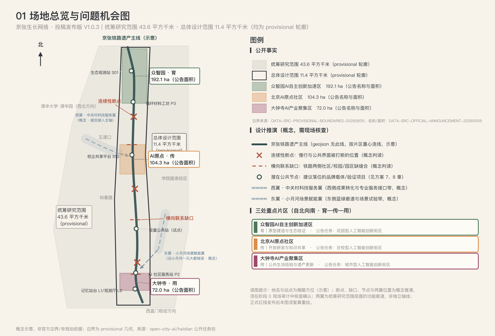
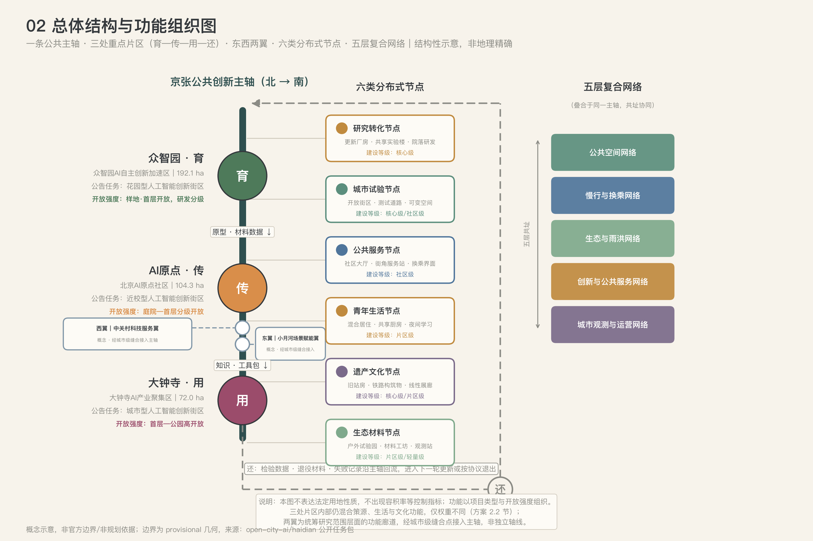
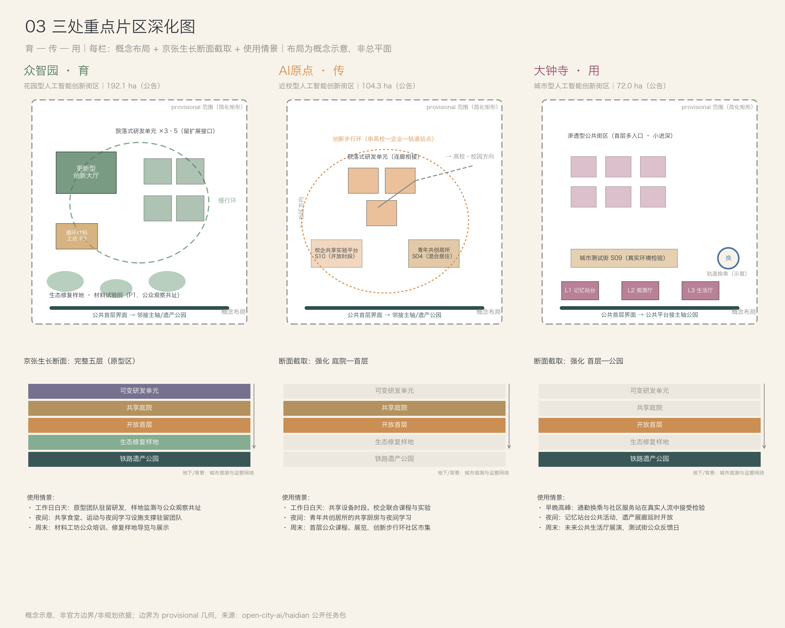
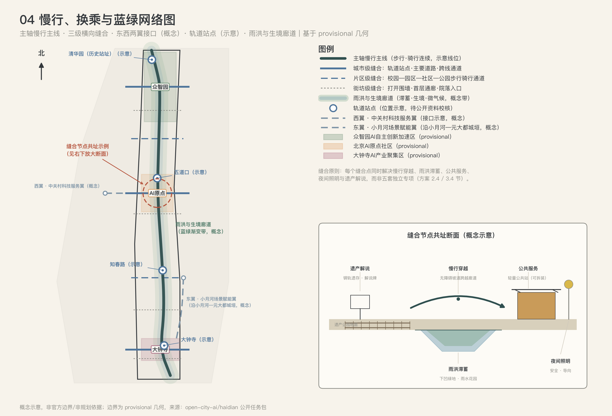
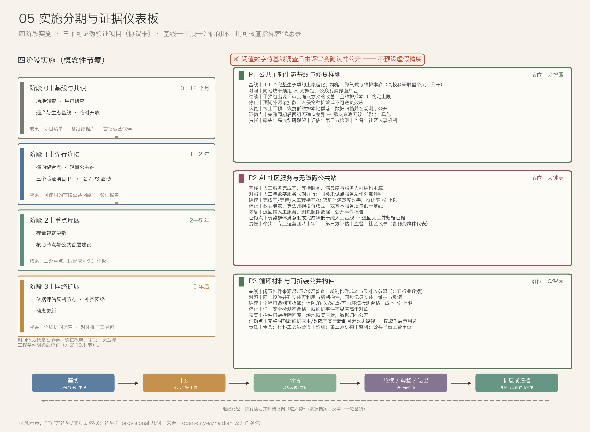

# 京张生长网络 JINGZHANG ADAPTIVE COMMONS

**百年京张 AI 创新带的分布式公共基础设施与适应性更新方案**

> **发布状态｜v1.0.3 · 2026-08-26：公开共创建议；非正式规划；非工程结论；非官方批准。**

传播语：**让创新进入城市日常**。

## 结论先行

本方案不把 AI 创新带理解为一条由标志建筑串联的展示轴，而是将京张铁路遗址公园、高校院所、科技园区、社区和生态空间组织成一套**可连接、可交换、可增量建设、可持续运营、可复制扩展的城市公共基础设施网络**。总体结构概括为：

> **一条公共主轴、三处重点片区、东西两翼、六类分布式节点、五层复合网络。**

核心空间动作不是大拆大建，而是：以铁路遗产和公园系统建立连续公共基底；用横向连接缝合铁路两侧的社区、校园和园区；将创新资源布置为大小不同、功能互补的公共节点；以首层开放、混合使用和可变建筑提高日常活力；通过监测、评估和小步迭代，使建设过程能够持续校正。

本方案的全部空间判断服从一条判准：**沿京张，让城市不再一次建成，而在持续交换中更新。** 判准的操作化形式是三问——任何空间动作必须同时回答，答不出即不建：

1. **连接**：它缝合了哪一处具体的断裂——铁路两侧、院墙内外、新老社区？
2. **交换**：它让什么资源在哪些主体之间真实流动——空间、设备、材料、知识、数据？
3. **生长**：它留下了什么接口，使下一阶段的扩展、调整或退出成为可能？

---

## 1. 设计依据与资料清单

**判断**：本方案建立在三级资料之上——任务事实、背景资料与临时几何，三者的证明力不同，正文中严格区分使用，不以背景资料支撑法定空间控制结论。

**任务事实**（方案必须回应的正式口径）：征集公告给出项目名称、三层范围面积口径（约 43.6 平方公里统筹研究范围、约 11.4 平方公里总体设计范围、三处合计约 368.4 公顷重点区域）、三处重点区域名称与设计任务、"三区两翼"结构 [source:DATA-SRC-OFFICIAL-ANNOUNCEMENT-20260509]；智能体任务书给出十条共创原则、三大定位、五大功能与六项智能体任务（agent.1–agent.6）[source:DATA-SRC-AGENT-TASKBOOK-20260518]。两翼方位采用背景报道所述语境：西侧为中关村科技服务翼、东侧为小月河场景赋能翼；该报道不作为正式空间控制或实施依据 [source:DATA-SRC-BEIJING-GOV-20260403]。

**临时几何**：总体设计范围与三处重点片区的边界当前仅有仓库发布的临时粗略边界。本包 `site_boundary.geojson` 仅承载总体设计范围（PROV-SITE-001），`key_areas.geojson` 承载三处重点片区（PROV-KEY-001/002/003）；统筹研究范围与重点区域汇总范围的临时轮廓以规划控制图层存入 `constraints.geojson`（PROV-RESEARCH-001 / PROV-KEY-SCOPE-001）。以上全部标注为临时约束范围（provisional constraint），不作为官方红线或精确面积依据。PROV-RESEARCH-001 已按 `polygon_area(constraints#PROV-RESEARCH-001)` 在 EPSG:4548 下完成低置信度概念复算，结果为 43,609,232.558 平方米，仅与公告约 43.6 平方公里作量级校核；组织方发布带版本、坐标系、精度和适用范围说明的官方 polygon 后，必须替换、复算并重绘 [source:DATA-SRC-PROVISIONAL-BOUNDARIES-20260605] [metric:research_area_sqm] [data:geometry/constraints.geojson#PROV-RESEARCH-001]。

**背景资料**：八个全球创新区案例与投稿包编制规范文档用于机制参照与流程校核，仅作背景，不支撑法定结论 [source:DATA-SRC-SITE-PACKAGE-DOCS]。

**缺口与处理规则**：下列正式资料均未取得，已在假设清单中逐项登记影响与复算触发器——三层范围官方红线 polygon、三处重点区官方 polygon、控规条件（容积率、建筑高度、建筑密度、退线）、道路红线与交通流量底数、宗地权属与现状建筑测绘、文物保护范围与建设控制地带、市政管线与容量资料、公共服务设施底数。处理规则为：涉及上述资料的指标一律保持待确认，不作数值结论；全部派生几何与指标在正式资料发布后触发复算重建 [depth:existing_conditions_diagnosis] [depth:risk_missing_data]。

**专业标准响应状态**：主仓库登记的公告、智能体任务书、城市设计、控规编制和用地分类五项 formal 强制标准均已有登记快照、访问日期和来源路径，本方案已按方向响应；无障碍、文物保护和数据安全作为包内补充标准继续保留。`review_status=addressed` 只表示证据链已应答，不表示已完成项目级条文审查、现场核查或签章（详见第 12 章与本包 `standard_matrix.json`）。

**还缺什么**：需密码申请的资格预审完整文件包，以及官方 polygon、控规、道路、权属、文保、市政等项目专项资料；登记快照不能替代这些场地资料或持证专业审查。

---

## 2. 三层范围工作框架

**判断**：三层范围是嵌套而非并列关系——统筹研究范围管产业与廊道结构，总体设计范围管城市更新与控规深度城市设计，重点区域范围管详细设计与首期项目；面积口径以公告为准，几何以临时边界复算值辅助表达。

- **统筹研究范围（公告约 43.6 平方公里）**：战略研究层。官方 polygon 未取得；现以 provisional_only 粗略轮廓 PROV-RESEARCH-001 表达，并在 EPSG:4548 下低置信度复算为 43,609,232.558 平方米（约 43.6092 平方公里），仅用于产业定位、区域协同、“三区两翼”结构与东西向廊道研究，不做地块级设计，不作为官方面积、红线或控制依据。公告依据见第 1 章任务事实；公式、临时轮廓来源与正式 polygon 到位后的替换/复算/重绘触发器见 `metrics.json` 和 A-BOUNDARY-001 [source:DATA-SRC-PROVISIONAL-BOUNDARIES-20260605] [metric:research_area_sqm] [data:geometry/constraints.geojson#PROV-RESEARCH-001]。
- **总体设计范围（约 11.4 平方公里）**：城市更新与总体城市设计工作层。当前以临时粗略边界表达，复算面积约 1,141.28 公顷，与公告口径约 11.4 平方公里量级一致；该数值为概念设计模型值、低置信度，不是官方规划指标 [metric:site_area_sqm] [data:geometry/site_boundary.geojson#PROV-SITE-001]。
- **重点区域范围（三处合计约 368.4 公顷）**：详细设计层。自北向南为众智园 AI 自主创新加速区（公告约 192.1 公顷）、北京 AI 原点社区（公告约 104.3 公顷）、大钟寺 AI 产业聚集区（公告约 72.0 公顷）；三处片区在临时几何中互不重叠且位于总体边界内 [data:geometry/key_areas.geojson#PROV-KEY-001] [depth:three_level_scope_framework]。



*图 1 场地总览与问题机会图：表达三层范围、京张铁路遗产主线、三处重点片区的临时位置、主要创新资源、轨道站点、连续性断点与横向联系缺口，以及东西两翼的概念廊道（统筹研究范围层面）。图中边界为临时约束范围（provisional），非官方红线。*

**为什么适合这里**：京张走廊的创新资源（高校、院所、园区）沿线密集但彼此封闭，三层嵌套让战略判断、更新设计与项目落地各归其位，避免"研究尺度过大落不了地、设计尺度过小看不见结构"的双重失真。

**如何验证**：三层面积与空间关系可由本包 GeoJSON 在约定投影下复算（见第 11 章）；统筹研究范围的公式为 `polygon_area(constraints#PROV-RESEARCH-001)`，面积计算坐标系为 EPSG:4548。临时边界与公告面积的差异、以及官方 polygon 到位后的替换、复算、重绘和差异报告触发器，均在 A-BOUNDARY-001 中登记。

**还缺什么**：三层范围的官方精确红线 polygon；取得后全部几何、指标、图件须重算重绘。

---

## 3. 统筹研究范围产业与未来城市研究

**判断**：在统筹研究范围尺度，本方案的未来城市假设是——AI 时代的创新城区不再依赖单一地标或封闭园区，而依赖一套分布式的、可验证的公共基础设施网络；AI 的角色限定为辅助识别、预测、匹配和评估，重要公共决策保持可解释和人工负责。

**为什么适合这里**：场地需要同时解决五个结构性问题，常见做法各有局限，本方案的回应如下：

| 结构性问题 | 常见方案局限 | 本方案回应 |
|---|---|---|
| 铁路廊道连续但横向联系不足 | 把公园只做成线性景观 | 设置高频横向缝合点和跨界公共界面 |
| 创新资源密集但彼此封闭 | 以园区或校园为独立单元 | 形成共享设施、联合试验和成果展示网络 |
| AI 场景容易成为设备陈列 | 追求短期"黑科技"可视化 | 聚焦公共服务、空间运营和真实使用闭环 |
| 遗产展示与当代生活脱节 | 保护对象孤立、参观路径单一 | 将遗产空间转化为公共客厅、教育和创新载体 |
| 建成后运营动力不足 | 先造空间、后找内容 | 项目、运营主体和评估指标同步进入设计 |

**产业定位**：方案同时回应公告三重定位与五项功能——百年京张文化带（遗产是公共空间秩序与城市记忆的连续载体）、都市 AI 生活体验带（AI 首先服务通勤、教育、健康、无障碍、生态和社区治理等日常需求）、AI 融合创新带（高校、科研、企业、社区与政府以共享空间和城市试验形成协同网络）；AI 全栈自主创新体系由众智园承载研发—测试—中试链条，AI+ 场景赋能由东翼与三片区测试场景共同承载，国际化传播由年度论坛与开放工具包机制承载（见第 6、10 章）[source:DATA-SRC-AGENT-TASKBOOK-20260518]。

**区域创新协同矩阵**：任务书点名北纬社区、未来科学城、怀柔科学城、经开区与京津冀作为区域协同回答对象，但本方案未取得任何一方的合作协议、资源清单或实施承诺 [source:DATA-SRC-AGENT-TASKBOOK-20260518]。以下均为概念建议。证据等级 T 仅表示任务书点名该协同对象，不能证明合作已成立；C 表示本方案提出的待核实接口假设。所有行均为 T+C，须在对方意愿、权责、可开放资源、数据合规与运营成本核实后才可进入项目设计。

| 协同对象 | 可交换资源（候选） | 空间 / 平台接口（概念） | 牵头主体类型 | 回流机制 | 证据等级 |
|---|---|---|---|---|---|
| 北纬社区 | 居民需求、无障碍与人工服务反馈、社区议题 | 大钟寺公共服务站、P2 最小充分性服务、城市观测站 | 社区治理、公共服务运营、无障碍代表、第三方评估主体类型 | 申诉量、等待时间、人工兜底与满意度触发阈值回到服务调整；失败样本回到人工流程 | T+C；无合作或数据授权证据 |
| 未来科学城 | 可公开科研成果、人才课程、验证需求、技术转化方法 | 西翼专业服务站、共享实验室、年度挑战 | 公共平台、高校、科研与技术转化主体类型 | 验证结果进入开放工具包；问题清单回到研发议程 | T+C；资源与接入条件待核实 |
| 怀柔科学城 | 可公开方法、科学传播内容、跨尺度观测、城市问题 | 记忆平台、未来公共生活馆的科学课程、开放工具包与联合议题 | 公共平台、科研、科学传播与数据合规主体类型 | 匿名化结果、失败记录与公众问题回流研究和科普内容 | T+C；不预设大科学装置、数据或人员可用 |
| 经开区 | 工程验证能力、制造与供应需求、产品原型 | 众智园、材料工坊、E02 城市试验接口 | 园区公共平台、制造企业、检测机构与场景运营主体类型 | 工程结果回到原型迭代；投诉、维护与退出记录回到准入规则 | T+C；无招商、产能、算力或采购承诺 |
| 京津冀 | 区域应用问题、人才交流、依法可共享的汇总数据目录、可复用治理工具 | 轨道站点节点、年度论坛、双语工具包与项目征集 | 区域公共平台、城市运营、高校与行业组织主体类型 | 采纳、拒绝与退出原因回到工具包并公开差异 | T+C；无区域协议、资金或政策承诺 |

矩阵只定义“提出问题—小规模验证—公开结果—回流修正”的接口。任何对象进入实施时，须先公开责任边界、数据与知识产权规则、成本承担、公共回报、退出机制及联系人；对象名称本身不是合作成立的证据。

**全球案例参照**：选取八个覆盖"工业老区转型、锚点机构驱动、站城更新、走廊网络、政府主导园区、内容产业聚集、滨水遗产再生"七类机制的案例，只提取机制、不移植形态，每例注明本地成立的条件：

| # | 案例 | 核心机制 | 适用边界 | 对京张的本地转化 |
|---|---|---|---|---|
| C1 | 巴塞罗那 22@（西班牙）[source:DATA-SRC-CASE-22AT-BCN] | 约 200 公顷工业用地转为生产性创新城区：保留工业遗存与居住混合，开发权转移激励置换 | 依赖市政统一规划权；混合用途缺乏住房保护会挤出原住民 | 存量厂房"保留+植入"而非整体置换；渗透型公共街区保留菜场与便民商业 |
| C2 | 新加坡纬壹 one-north [source:DATA-SRC-CASE-ONENORTH-SGP] | 政府主导统一开发的 200 公顷研发城区，分主题分期滚动开发 | 依赖单一业主长期持有；自上而下模式难嫁接多权属存量城区 | 对应"公共平台主管单位"统筹角色与四阶段分期；以更新改造起步而非一次建成 |
| C3 | 伦敦 King's Cross Central [source:DATA-SRC-CASE-KINGSX-LON] | 高铁带动约 27 公顷铁路用地再生；锚点机构（中央圣马丁）先行，登录建筑适应性再利用，公共空间先行 | 依赖大事件基建与 20 年以上耐心资本 | 京张遗产廊道与轨道站点是同等触发器；AI 原点以高校为锚点机构；公共载体先行 |
| C4 | 波士顿 Kendall Square [source:DATA-SRC-CASE-KENDALL-BOS] | 大学科研成果与企业近距离共址的近校创新生态 | 依赖世界级研究型大学知识溢出；绅士化须以低成本留驻对冲 | AI 原点"近校孵化"原型；青年共创居所对冲创新溢价 |
| C5 | 多伦多—滑铁卢创新走廊 [source:DATA-SRC-CASE-TORWAT-CORRIDOR] | 112 公里走廊以枢纽组织形成人才—企业循环 | 松散节点若无实体枢纽易停留在名义联盟 | 京张主轴以三片区分角色（育—传—用）加公共平台枢纽，避免各自为政 |
| C6 | 深圳南山区（粤海街道/高新区）[source:DATA-SRC-CASE-NSHAN-SHZ] | 高密度研发集聚与源头创新平台建设 | 高密度集聚伴随通勤潮汐与生活成本压力 | 众智园研发密度必须配平青年生活与公共服务节点，避免园区化孤岛 |
| C7 | 首尔数字媒体城 DMC [source:DATA-SRC-CASE-DMC-SEOUL] | 棕地再生为内容产业聚集区，多层治理与入驻主题管控 | 强主题管制对招商韧性要求高；前期公共投入大 | 大钟寺新业态的治理参照；项目准入六问即主题管控的轻量化版本 |
| C8 | 横滨港未来 21 [source:DATA-SRC-CASE-MM21-YOKOHAMA] | 约 186 公顷造船所与铁路场站再生，以"连接两个既有中心"为目标持续滚动开发 | 超大地块整体开发依赖长周期与单一财团 | 主轴缝合既有中心的同构判断；遗产建筑改造为公共载体的手法参照 |

**如何验证**：每项产业与空间判断落到具体片区、项目包与指标（第 6、10、11 章）；案例转化均标注本地成立条件，不做拼贴式对标。

**还缺什么**：区域产业底数（企业、就业、研发机构清单）与人流数据未取得，产业规模判断保持定性；高校、园区、企业、社区的正式清单待补。

---

## 4. 总体设计范围城市更新与控规深度城市设计

**判断**：总体结构为"一条公共主轴、三处重点片区、东西两翼、六类分布式节点、五层复合网络"；更新策略为存量优先、渐进实施、循环建造；所有强度控制指标（容积率、建筑高度、建筑密度、退线）在控规资料取得前一律待正式资料确认 [depth:overall_spatial_structure] [depth:development_intensity_controls]。

**品牌视觉识别（agent.1）**：原创标志以京张铁路的双轨、汉字“人”的分叉轮廓和“育—传—用—还”的节点回路叠合构成：深墨蓝双轨表示连续公共主轴，铜金横梁表示知识交换，青瓷色开口回路表示资源回流，信号蓝末端节点表示下一轮生长接口。标志采用纯矢量几何绘制，不借用铁路、机构或企业既有标识 [depth:overall_spatial_structure]。


使用规则：主色标志仅使用墨蓝 `#1A1A2E`、铜金 `#C9A227`、青瓷 `#5BA4A4`、信号蓝 `#4A90D9` 与纸白 `#FAFAF8`；单色场景将全部笔画统一为黑或白，不改变比例。标志最小印刷宽度 18 mm、最小屏幕宽度 72 px，四周净空不少于中心节点直径；不得旋转、拉伸、添加阴影或替换节点色。中文组合以“京张生长网络”为主标题、`JINGZHANG ADAPTIVE COMMONS` 为副标题，英文组合反之；标题采用 Noto Serif CJK SC 700，副标题采用 IBM Plex Mono 500，字号比约 3:1，字距保持字体默认值。标志是 agent.1 的全线母品牌；agent.5 导视只继承轨道线、节点和四种颜色作为方向/分级语法，不与母标并列争夺识别；agent.6 活动品牌以“母标 + 活动名称 + 年份”组成临时锁定式，不改造母标。具体载体 L1–L3 只用名称与节点色区分，不另建主标。SVG、字体生成方式与许可边界登记于版权声明和 manifest。

**一轴——京张公共创新主轴**：以铁路遗产公园及其连续开放空间为主轴，叠合五项功能：铁路遗产叙事路径、连续步行与骑行系统、生境与雨洪和微气候廊道、AI 公共服务与城市观测设施、创新成果开放展示与市民活动界面。主轴不追求全线相同的景观形式，而采用统一的铺装接口、标识系统、数据规范和公共设施模数，使不同区段保持识别度并允许各自生长。

**三区——育、传、用、还**：三处重点片区承担一条完整的城市交换链，该链条只对京张成立——它依赖三处片区各自的公告任务和自北向南的空间次序：

| 重点片区 | 公告设计任务 | 交换链角色 | 核心命题 |
|---|---|---|---|
| 众智园 AI 自主创新加速区（最北，公告约 192.1 公顷） | 更具智慧型与未来感的花园型人工智能创新街区 | **育**：原型建造与生态验证 | 让生态样地、材料试验和原型建造成为花园型街区的日常首层 |
| 北京 AI 原点社区（居中，公告约 104.3 公顷） | 更具人才吸引力、创新活力、科技成果转化能力的近校型人工智能创新街区 | **传**：开放研发与知识共享 | 让高校院所的知识生产与社区日常互相可见、互相可用 |
| 大钟寺 AI 产业聚集区（最南，公告约 72.0 公顷） | 更具世界影响力、城市发展活力的城市型人工智能创新街区 | **用**：公共生活检验与遗产更新 | 让 AI 与空间原型在最日常、最城市化的环境里接受使用检验 |

众智园把新东西造出来并完成检测；AI 原点把验证过的原型转化为可教学、可复制的公共知识；大钟寺让成果接受真实公共生活的检验；检验数据、退役材料与失败记录沿主轴回流（还），进入下一轮更新或按协议退出。三处片区不是独立分区，而通过共享项目、联合活动、公共交通和数据平台形成日常交换 [source:DATA-SRC-OFFICIAL-ANNOUNCEMENT-20260509]。

**两翼——东西向支撑臂**（按背景报道所述方位，仅作语境、不作控制依据：西侧中关村科技服务翼、东侧小月河场景赋能翼）[source:DATA-SRC-BEIJING-GOV-20260403]：

- **与主轴的关系**：主轴管纵向的生长节奏（基线—干预—评估—扩展），两翼管横向的资源交换；两翼各经城市级横向缝合点接入主轴，接入点即交换界面，不新增独立轴线。三区仍是唯一重点设计范围，两翼在统筹研究范围层面表达功能与廊道关系，具体边界为临时表达。
- **西翼·中关村科技服务翼（成果转化与专业服务接口带）**：依托主轴以西的中关村创新腹地，以既有楼宇更新、东西向慢行走廊和共享服务设施为主，不大拆大建；承载知识产权、科技金融、检测认证、技术转移、孵化加速、法律与合规咨询等生产性服务业，沿缝合通道向主轴三片区开放。交换职责是把众智园的原型与 AI 原点的工具包对接资本与专业服务（传→还），把企业真实需求反向输入研究选题（还→育）；建议设若干"专业服务接口站"（轻量公共站家族变体），由企业项目伙伴运营，纳入统一开放时段与年度评估规则。走廊选线与建筑退线待正式资料确认。
- **东翼·小月河场景赋能翼（蓝绿廊道与场景试验带）**：沿小月河及元大都城垣遗址方向的滨水蓝绿廊道，公告口径为具身智能、AI 医疗、AI+ 影视等特色应用场景集聚区；本方案以滨水公共空间更新、桥下与滨水闲置空间激活、轻量公共站与指定测试段组织场景。交换职责是承接大钟寺城市测试街外溢的中试场景与众智园输出的待检原型（育→用），把试验数据、公众反馈与失败记录回流城市智能观测厅（用→还）。避让遗址本体的具体范围待文物部门公开资料确认。
- **两翼的设计边界**：详细设计阶段只做廊道与节点层面的概念表达，红线、用地调整与强度指标全部待正式资料确认；西翼商业服务设施不得替代主轴上的免费公共服务，东翼试验不得侵入安静界面与生境缓冲。判准三问对两翼同样有效。

**六类分布式节点**：

| 节点类型 | 建筑与空间载体 | 核心功能 | 建设等级 |
|---|---|---|---|
| 研究转化节点 | 更新厂房、共享实验楼、院落式研发单元 | 联合研发、原型制作、技术服务 | 核心级 |
| 城市试验节点 | 开放街区、测试道路、可变公共空间 | 真实场景测试、公众参与、评估展示 | 核心级/社区级 |
| 公共服务节点 | 社区大厅、街角服务站、交通换乘界面 | 教育、健康、政务、无障碍与数字服务 | 社区级 |
| 青年生活节点 | 混合居住、共享厨房、学习空间、运动场地 | 居住、社交、创业与夜间活力 | 片区级 |
| 遗产文化节点 | 旧站房、铁路构筑物、线性展廊 | 记忆展示、公共教育、文化活动 | 核心级/片区级 |
| 生态材料节点 | 户外试验园、材料工坊、环境观测站 | 生境监测、修复试验、循环建造展示 | 片区级/轻量级 |

**五层复合网络**：公共空间网络、慢行与换乘网络、生态与雨洪网络、创新与公共服务网络、城市观测与运营网络，五层共叠于主轴并接入六类节点。网络层之间必须共址协同——一个横向缝合点应同时解决慢行穿越、雨洪滞蓄、公共服务、夜间照明和遗产解说，而不是形成五套彼此独立的专项工程。

**核心剖面——京张生长断面**：全线反复出现的基本空间单元，把生态、建筑、AI 与公共生活组织在同一断面中：

```text
地面以上   可变研发单元 —— 可拆装围护与独立机电模块，3—5 年尺度可重构
─────────  共享庭院 —— 机构间交换界面：设备、样品、课程、联合实验
─────────  开放首层 —— 公众可达：展示、课程、社区服务、小型商业
─────────  生态修复样地 —— 生产性景观：生境监测、雨洪滞蓄、材料试验
─────────  铁路遗产公园 —— 连续公共基底：慢行主线、遗产叙事、城市观测
背景层     城市观测与运营网络 —— 传感、数据归档与维护动线
```

断面上每个界面都是一次"交换"：公园与样地交换生态数据，样地与首层交换展示内容，首层与庭院交换使用者，庭院与研发单元交换成果。不同区段按场地条件截取断面的不同片段：众智园五层完整出现；AI 原点强化庭院—首层一段；大钟寺强化首层—公园一段，研发单元退为背景或缺席。断面即判准的图面形态：任何一段设计如果无法指出"交换发生在哪一层"，就不能进入深化。



*图 2 总体结构与功能组织图：表达一轴、三处重点片区（育—传—用—还）、东西两翼接口、六类节点与五层网络；两翼为统筹研究范围层面的功能廊道，图中为概念示意；不绘制未经依据的法定用地调整，用项目类型和开放强度替代虚构控制指标。*

**用地与更新框架**：总体设计范围内的用地布局以创新研发、教育科研、蓝绿空间、公共服务、居住配套与商业服务的混合组织为目标，概念用地模型见本包用地图层与第 7 章 [data:geometry/land_use.geojson] [depth:land_use_layout]。更新策略七原则：存量优先、连续基底、分布式配置、功能互惠、渐进实施、循环建造、反馈校正。

**如何验证**：结构与用地关系可由用地图层复算；每项空间动作须经判准三问检查。

**还缺什么**：正式控规条件、项目正式用地批准、权属与现状测绘；用地分类指南登记快照已取得，但不能替代场地专属规划条件，用地比例与强度指标在资料到位前不作法定结论。

---

## 5. 重点区域详细设计

**判断**：三处重点片区共用建筑原型（第 7 章）与"京张生长断面"（第 4 章），但各自回答公告赋予的不同任务，并在"育—传—用—还"交换链中承担不同环节；三处片区边界当前均为临时几何，正式红线发布后须复算修正 [data:geometry/key_areas.geojson#PROV-KEY-001] [depth:three_key_area_detailed_design]。



*图 3 三处重点片区深化图：各片区定位、总平面概念、空间序列、典型断面与首期项目抓手；众智园断面采用完整"京张生长断面"。*

### 5.1 众智园 AI 自主创新加速区（公告约 192.1 公顷）——原型与验证场（育）

**场地判断**：位于走廊最北端，现状为近郊化、增量空间相对充裕的科技园区段，是公告定位的 AI 全栈自主创新核心承载；问题是园区肌理封闭、与清河历史聚落记忆断裂、轨道站点与园区"最后一公里"步行品质差。本片区是五层"京张生长断面"唯一完整出现的区段。

**空间命题**："花园型"不是绿化率指标，而是把生态样地、材料试验田和原型建造场做成街区的日常首层——让"制造与验证未来"本身成为可观看的公共景观。

**空间动作**：

1. 全栈研发空间：以 1 个更新型创新大厅加 3—5 组院落式研发单元承载芯片、框架、模型、应用的研发—测试—中试链条，单体小尺度、预留分期接口，避免一次建成；
2. 潜力用地留白：识别可近期实施与中长期储备用地，储备用地以临时绿地、样地与轻量公共站先行开放，不设实体围挡（具体地块待权属与测绘资料确认）；
3. 交通优化：以城市级缝合点强化轨道站点—园区—主轴三线衔接，后勤流线与低速配送共用走廊分时段组织，站点接驳断面改造待道路红线资料确认；
4. 清河文化：将清河古镇与运河—铁路交汇的历史层理纳入遗产叙事路径北端起点，材料工坊优先使用本片区拆改构件，让"清河记忆"进入构件库的来源故事；
5. 花园型街区：生态修复样地与材料试验田做成街区首层可观看的生产性景观，绿地不是指标而是工作界面。

**首期项目包**：P1 生态基线与修复样地、P3 循环材料工坊与构件库、S01 环境观测站锚点站、1 组院落式研发单元更新试点、站点—主轴缝合点 1 处；对应项目包 E04（循环建造平台）与 E01（共享实验设施北段）。

### 5.2 北京 AI 原点社区（公告约 104.3 公顷）——开放研发与知识共享校园（传）

**场地判断**：位于走廊中段，被清华等高校院所环绕，知识密度全线最高，但校园—园区—社区三重围院并存；公告要求"近校型"街区，关键是把"近校"从地理事实变成使用事实。现状建成度高，任何动作都须低扰动。

**空间命题**：让高校、院所的知识生产与周边社区的日常生活互相可见、互相可用，而不是隔院墙相望。

**空间动作**：

1. 近校孵化：校企共享实验平台沿校园边界与主轴交汇处布置，设备开放时段面向社区预约；孵化空间以院落式研发单元小尺度嵌入，不建独立孵化园区；
2. 人才吸引：青年共创居所（混合居住、共享厨房、夜间学习空间）以低成本留驻对冲创新溢价；人才政策接口经西翼专业服务接口站提供；
3. 低扰动更新：以打开围墙、首层通廊和院落入口的街坊级缝合为主，保留成熟树木与既有社会网络；新增建设限于连廊、轻量公共站与存量建筑改造，不设大拆大建动作；
4. 站城联系：梳理轨道站点与校园、社区的步行断点，以创新步行环串联高校—企业—站点—主轴；涉及站点出入口与市政道路的改造内容待正式资料确认；
5. 遗产界面：京张老站遗存（清华园站旧址位于走廊一期开放段）作为知识叙事锚点，纳入铁路记忆数字档案优先采集范围；文保范围与干预深度以文物部门公开资料为准 [standard:CULTURAL-RELICS-PROTECTION-LAW]。

**首期项目包**：S10 校企共享实验平台首个开放单元、S04 青年共创居所首栋改造、站点—校园缝合点 1—2 处、S07 档案采集启动；对应项目包 E01 与 E03。

### 5.3 大钟寺 AI 产业聚集区（公告约 72.0 公顷）——公共生活检验与遗产更新客厅（用）

**场地判断**：三片区中尺度最小、城市化程度最高，位于三环与轨道换乘交汇的强到达性位置；痛点是大尺度道路与轨道站点造成的四象限割裂、静态交通挤占步行空间、遗产资源与日常商业并存但缺乏组织。本片区是全线"检验场"：任何 AI 服务与空间原型，只有在这里被不用智能手机的居民、通勤者和访客真正用起来，才算成立。

**空间动作**：

1. 新业态承载：以渗透型公共街区承载智能体、智能终端与 AI 内容等新业态的展示、交易与体验；首层多入口、小进深、高可见度，新业态与菜场、便民商业、儿童与老人设施混置，不做纯科技卖场；
2. 地铁四象限步行联系：以轨道站点为中心的四个象限之间建立连续、遮阴、无障碍的步行联系——站厅层连通、过街界面改善与公共平台整合组织；具体通道线位与断面待道路红线及地铁资料确认；
3. 静态交通：将站点周边被停车挤占的消极空间逐步转化为公共首层与慢行空间；静态交通总量控制与共享停车、地下空间统筹策略待交通专项资料确认；
4. 检验与公开：城市测试街接受来自众智园与 AI 原点的原型；城市智能观测厅向市民公开全线基线、试点成效与失败记录；
5. 遗产更新客厅：京张记忆站台与未来公共生活厅以铁路遗产空间承载叙事、公共活动与国际交流，新旧材料与结构保持可辨识；涉及文物保护对象的具体范围与干预深度以文物部门公开资料为准，现阶段全部标注为概念建议 [standard:CULTURAL-RELICS-PROTECTION-LAW]。

**首期项目包**：P2 AI 社区服务与无障碍公共站首站、S05 无障碍出行助手换乘段、S09 城市测试街首段、四象限缝合点 1 处、L2 观测厅筹备展；对应项目包 E02 与 E06。

**还缺什么**：三处片区的正式边界红线、现状建筑与树木测绘、权属底数；片区总平面、关键轴测与场地化断面须在资料到位后深化，当前图 3 为概念版。

---

## 6. AI 创新生态、人才画像与 AI+ 场景

**判断**：AI+ 场景不做设备陈列，每个场景必须写明使用者、空间载体、运营主体、AI 角色与数据边界、核心指标、停止/退出条件；场景上线前公示测试边界，退出与失败同样公开。本章给出六类用户画像、十二张场景卡、三个可证伪先行验证项目与三个品牌性公共载体 [source:DATA-SRC-AGENT-TASKBOOK-20260518]。

**agent.2 八要素保障矩阵**：以下是进入实施设计前必须逐项核验的保障接口，不是已落实资源清单。主体仅写类型，不代表任何机构已同意参与；资金、算力、土地、政策与场景许可均未获承诺 [source:DATA-SRC-AGENT-TASKBOOK-20260518]。

| 要素 | 载体（概念） | 供给 / 运营主体类型 | 开放规则 | 公共回报 | 风险边界 | 待核实数据 |
|---|---|---|---|---|---|---|
| 土地 | 存量地块、更新建筑、临时试验用地 | 规划自然资源、权利人、公共平台等主体类型 | 核清权属与规划条件后再公开征集；限时、可逆、用途不越界 | 公共首层、开放空间或公共服务时段 | 不预设供地、用途变更或容积率调整；污染与权属未清不得进场 | 正式边界、权属、规划条件、现状用途、污染调查 |
| 空间 | 共享实验室、公共服务站、青年共创居所 | 权利人、专业运营、社区治理等主体类型 | 预约、费用、无障碍、消防容量和开放时段公开 | 免费公共时段、低门槛工位与便民服务 | 防止商业挤出、租金排斥、消防超载和无障碍失效 | 可用面积、建筑条件、容量、改造许可、运营成本 |
| 产业 | E01–E06 项目包与城市测试街 | 公共平台、科研、制造、服务等主体类型 | 公开征集、准入六问、年度评估与退出 | 共享设备、公众课程、开放结果和本地服务改善 | 不预设企业名单、招商结果、投资额或采购；知识产权先约定 | 产业底数、企业需求、设备清单、知识产权与安全要求 |
| 资金 | 分期项目台账与公共价值采购接口 | 财政、权利人、社会资本、基金会等潜在主体类型 | 分来源审批、里程碑支付、成本与绩效公开，不隐性跨补贴 | 公共服务、维护经费、失败档案与可复用成果 | 不保证金额、来源或融资成立；未审批不得启动采购或融资 | 建设与运营成本、资金资格、预算程序、采购与审计要求 |
| 人才 | 青年共创居所、课程、开发者与社区共创网络 | 高校、用人单位、专业运营、社区等主体类型 | 资格透明、限期使用、价格公开，不用算法评分排除申请者 | 可负担短住、导师时段、公众课程与社区课题 | 不承诺人才政策、名额或补贴；防歧视、挤出和无偿劳动 | 人才需求、租金与薪酬基线、课程供给、服务容量 |
| 算力 | 合规共享算力申请网关，不预设自建数据中心 | 合格云与算力运营、高校平台、公共运营等潜在主体类型 | 配额、费用、安全分级、能耗和退出规则公开 | 公益试点额度、可复现实验与成本披露 | 不承诺容量、补贴或接入；防网络安全、能耗与供应商锁定 | 工作负载、容量、网络、能耗、费用、安全等级与合规条件 |
| 数据 | 城市观测站、数据目录与受控沙箱 | 数据控制、专业运营、合规审查、第三方审计等主体类型 | 最小必要、目的限定、授权、分级汇总、留存删除与申诉 | 开放定义、依法可共享的汇总结果、失败记录和方法 | 个人与原始跨域数据不默认共享；不得用算法决定公共服务资格 | 数据清单、合法基础、敏感级别、质量、留存、安全与授权 |
| 场景 | E02、P1–P3、S01–S12 的小规模测试单元 | 公共管理、社区、专业运营、检测评估等主体类型 | 公开征集、基线与对照、知情告示、停止和恢复 | 服务改善、开放评估、可复用协议与投诉响应 | 不预设部署许可或采购；安全、隐私、无障碍不因试点降级 | 场地许可、使用者与基线、责任保险、维护和退出成本 |

八要素按“资料核实—公开规则—小规模验证—独立评估—继续或退出”闭环推进。任何一项未能确认合法来源、责任主体、全生命周期成本和公共回报，即不进入实施清单；法定指标仍待正式资料确认，空间几何仍为 provisional。

### 6.1 用户画像

1. **社区居民**：关心便捷服务、环境品质、隐私和建设扰动。
2. **青年科研人员与学生**：需要低成本工作、短住、交流和设备共享。
3. **初创及企业团队**：需要真实场景验证、合作接口和成果展示。
4. **高校与科研机构**：需要跨机构平台、长期样地和可信数据。
5. **儿童、老人及残障使用者**：需要无障碍、低认知负担和可获得的人工支持。
6. **访客与国际合作机构**：需要清晰叙事、公共到达和可理解的示范成果。

维护、保洁、安保和运营人员作为所有场景的隐含第七类用户，进入后台动线与设施设计。

### 6.2 十二张场景卡

阈值数字在基线调查完成前一律留空，由评审会依据基线报告确认并公开，不预设虚假精度。

**S01 京张环境观测站**｜使用者：研究者、市民、学校师生｜空间载体：轻量公共站加户外样地，锚点落位众智园沿主轴绿地｜运营主体：高校科研联盟牵头，专业运营团队维护｜AI 角色与数据边界：传感数据异常识别与趋势预测；只采集环境与空间使用类非识别性数据，匿名聚合，公开原始与处理后两级数据｜核心指标：数据连续可用率、公众查询量、学校课程引用次数｜停止/退出：传感器误判率超约定阈值或维护中断超约定周期，暂停展示并公开原因；设备退役按可逆安装拆除回收。

**S02 城市生态修复花园**｜使用者：居民、学生、维护运营人员｜空间载体：雨水花园、干预组/对照组样地，首站众智园（P1）｜运营主体：高校科研联盟加第三方检测机构，社区议事机制监督｜AI 角色与数据边界：土壤与生境数据归档、修复策略对比推演；不宣称未经对照确认的修复效果｜核心指标：干预组相对对照组的土壤理化与生境指标变化、单位面积维护成本｜停止/退出：预期外污染扩散、入侵物种或不可逆负效应，终止干预、恢复低维护本地群落、数据归档公开。

**S03 AI 社区服务站**｜使用者：老人、儿童及残障使用者、社区居民｜空间载体：社区大厅、街角服务站，首站大钟寺（P2）｜运营主体：专业运营团队牵头，第三方评估机构审计，社区议事机制监督（弱势群体代表必须进入评审）｜AI 角色与数据边界：辅助办事导引、表单预填、多模态交互；数据最小化、人工兜底、清晰告知、可退出，不以算法评分替代服务资格判断 [standard:DATA-SECURITY-PIPL]｜核心指标：服务完成率、等待时间、人工转接率、弱势群体满意度、投诉率｜停止/退出：数据泄露、算法歧视投诉成立或服务质量低于基线，退回纯人工服务、删除超期数据、公开事件报告。

**S04 青年共创居所**｜使用者：青年科研人员与学生、初创团队｜空间载体：混合居住、共享厨房、学习空间，落位 AI 原点与众智园｜运营主体：园区运营方加高校加基金会（E03）｜AI 角色与数据边界：空间与设备预约匹配、能耗优化；居住数据仅用于运营改进，不作个人行为评分｜核心指标：入住率、跨机构协作项目数、社区课题产出、留驻率｜停止/退出：连续两个评估周期使用率低于约定下限，单元改造为其他公共用途；居住数据管理投诉成立，整改期间暂停智能服务模块。

**S05 无障碍出行助手**｜使用者：视障与行动不便者、全体行人｜空间载体：换乘节点、慢行路径、横向缝合点全线部署｜运营主体：公共平台主管单位加专业运营团队，残障人士组织参与验收｜AI 角色与数据边界：路径导引、障碍识别与问题上报；语音与定位数据边缘处理、不长期留存个人轨迹 [standard:GB-55019-ACCESSIBILITY]｜核心指标：无障碍连续率、导引任务完成率、问题响应时长、用户信任度｜停止/退出：导引错误造成安全事件或连续审计不通过，退回纯物理无障碍设施并公开整改。

**S06 低速配送共用走廊**｜使用者：商户、居民、运营人员；测试方为企业项目伙伴｜空间载体：后勤接口与指定测试段（城市测试街内），东翼具身智能测试段可延伸｜运营主体：企业项目伙伴运行，公共平台主管单位准入与监管｜AI 角色与数据边界：低速机器人路径调度与冲突规避；测试车辆标识清晰，采集数据限定于运行安全所需｜核心指标：末端配送冲突事件数、行人让步率、商户使用成本变化｜停止/退出：行人投诉或冲突事件超约定上限、或与无障碍通行冲突，缩减测试段或停止，道路恢复原通行规则。

**S07 铁路记忆数字档案**｜使用者：市民、访客、研究者｜空间载体：遗产展廊、京张记忆站台（L1）、线上档案室（E05）｜运营主体：档案机构加文化团队加社区议事机制｜AI 角色与数据边界：口述史转写、老照片关联与检索辅助；公众补充内容须经人工校核后入库，AI 生成内容明确标注｜核心指标：公众投稿量、校核通过率、教育活动场次｜停止/退出：史实错误或权属争议无法澄清，撤下争议条目并公开处理记录。

**S08 循环材料工坊**｜使用者：设计师、工匠、学生、市民｜空间载体：更新厂房、开放工坊，落位众智园（P3/E04）｜运营主体：材料工坊运营方加第三方检测机构加公共平台主管单位｜AI 角色与数据边界：构件库检索与匹配建议、加工参数辅助；材料护照数据全程可追溯｜核心指标：构件再利用率、可拆卸率、全生命周期成本对照、公众培训人次｜停止/退出：任一安全检测不合格或维护事件率显著高于对照，构件退役回库、场地恢复、缩减至展示用途；新型材料检测门槛不因试点扩大而放宽。

**S09 城市测试街**｜使用者：企业、居民、管理部门、社区议事机制｜空间载体：可变街道、公共广场，落位大钟寺，东翼场景试验带为其延伸｜运营主体：公共平台主管单位准入，企业项目伙伴运行，第三方评估机构评估｜AI 角色与数据边界：被测试对象本身加运行数据采集；测试边界、数据清单与退出机制上线前公示｜核心指标：测试结果公开率、服务改善证据、问题退出执行率、周边居民投诉率｜停止/退出：评估不通过或投诉超限，按协议退出并恢复场地；连续两年无有效测试申请，恢复常规街道管理。

**S10 校企共享实验平台**｜使用者：高校与科研机构、企业与初创团队、公众课程学员｜空间载体：创新大厅、研发庭院，落位 AI 原点与众智园（E01）｜运营主体：高校科研联盟加企业伙伴，统一开放时段与预约规则｜AI 角色与数据边界：设备调度与使用记录、实验数据管理；公众课程区与实验安全区数据分级隔离｜核心指标：共享设备时长、跨机构项目数、公众课程参与量、试点转化率｜停止/退出：设备共享率连续低于约定下限，开放时段规则重审；安全事故，相关设备暂停开放直至复验合格。

**S11 国际创新论坛**｜使用者：国际机构、产业团队、市民｜空间载体：未来公共生活厅（L3）、城市客厅，落位大钟寺｜运营主体：专业运营团队加公共平台主管单位加合作学术机构｜AI 角色与数据边界：双语同传与内容归档辅助；发布内容以人工审定为准｜核心指标：年度连续性（非一次性事件）、双语成果产出量、合作机构续约数｜停止/退出：连续两年以招商签约为主、公共议题占比低于约定下限，降级为常规行业会议，释放场地给公共活动。

**S12 四季公共日历**｜使用者：全体市民、访客、维护运营人员｜空间载体：主轴节点、社区广场、遗产公园全线｜运营主体：专业运营团队排期，社区议事机制提议与评议｜AI 角色与数据边界：活动排期与场地冲突优化、参与数据匿名统计；不做人脸识别与个人追踪｜核心指标：免费活动占比、参与人次、居民满意度、安静界面零侵入记录｜停止/退出：商业化挤占免费活动或侵入安静界面，活动许可重审；使用率持续低迷的活动类型退出日历。

### 6.3 三个先行验证项目（可证伪协议）

每个项目按统一协议书写：目的、空间、基线、对照、责任人、继续条件、停止条件、恢复动作、证伪点。

**P1 公共主轴生态基线与修复样地**：目的——建立场地生态基线，验证土壤改良、生境营造和低维护景观策略，建议落位众智园沿主轴绿地。基线——不少于一整个生长季的土壤理化、生物群落、微气候与维护本底记录，由高校科研联盟牵头完成并公开。对照——同地块内设干预组与对照组，公众观察界面与两组共址。责任人——牵头为高校科研联盟，独立评估为第三方检测机构，监督为社区议事机制。继续条件——干预组相对对照组在约定指标上出现评审会确认意义的改善，且单位面积维护成本不超过约定上限。停止条件——发现预期外污染物扩散风险、入侵物种扩散，或评审会认定的不可逆负效应。恢复动作——终止干预，样地恢复为低维护本地群落，全部数据归档并在观测厅公开。证伪点——完整评估周期后干预组与对照组无确认意义的差异，公开承认该策略在该场地无效并退出工具包。门槛——未完成污染物检测前，不宣称具体污染或修复效果；优先采用本地物种与小尺度试验。

**P2 AI 社区服务与无障碍公共站**：目的——验证 AI 能否降低居民获取公共服务的时间和理解成本，建议首站落位大钟寺片区。基线——试点前记录人工服务的完成率、等待时间与满意度本底，以及服务人群结构的匿名统计。对照——人工服务与数字服务长期并行，不以测试替代人工；同类型未试点社区服务站作为外部参照。责任人——牵头为专业运营团队，算法与数据审计为第三方评估机构，监督为社区议事机制（弱势群体代表必须进入评审）。继续条件——完成率、等待时间、人工转接率、弱势群体满意度相对基线改善，且投诉率不超过约定上限。停止条件——发生数据泄露、算法歧视投诉成立，或基本服务质量低于基线。恢复动作——退回纯人工服务，删除超期数据，公开事件报告。证伪点——弱势群体满意度或完成率低于纯人工基线，承认 AI 介入在该场景不成立，服务站退回人工模式并归档证据。门槛——数据最小化、人工兜底、清晰告知、可退出、不得以测试降低基本服务质量 [standard:DATA-SECURITY-PIPL]。

**检验用人物旅程**：72 岁的王阿姨住在附近，不用智能手机。她到服务站办理健康预约——看见的是人工窗口而不是屏幕墙；工作人员可以调用 AI 辅助，她也可以全程只说人话；某次系统故障，人工兜底在承诺时限内完成服务，故障与转接记录进入月度评估；若人工兜底率超过约定阈值，触发服务流程简化评审。她不需要知道什么是大模型——她的等待时间决定这套系统是否继续存在。

**P3 循环材料与可拆装公共构件**：目的——验证存量构件再利用及新型非承重材料在公共空间中的适用性；工坊落位众智园，首个构件应用点可选在任一轻量公共站。基线——既有拆改项目闲置构件的来源、数量与状况普查；同类新制构件的成本与碳排放参照值（采用公开行业数据并登记来源）。对照——同一公共设施中并列安装再利用构件与新制构件，同步记录安装、维护与公众反馈。责任人——牵头为材料工坊运营方，检测为第三方检测机构，监督为公共平台主管单位。继续条件——构件全程可追溯、可维护、可拆卸；消防、耐久、湿热与室内环境检测合格；全生命周期成本不超过约定上限。停止条件——任一安全检测不合格，或维护事件率显著高于对照。恢复动作——构件按可逆连接拆除回库（见第 7 章九步循环），场地恢复原状，检测与使用数据归档公开。证伪点——完整使用周期后，再利用构件的维护成本或故障率高于新制对照且无改进路径，缩减至展示用途，不作规模推广。门槛——新型生物基材料仅用于经检测的非结构、非暴露风险场景，优先采用失活材料，此门槛不因试点规模扩大而放宽。

### 6.4 三个品牌性公共载体

品牌性来自独特的城市公共功能，不依赖超尺度造型。三者分别回答"从哪里来、如何认识当下、共同走向哪里"，形成完整传播叙事：

- **L1 京张记忆站台**：以铁路站台原型组织遗产展览、城市档案和公共活动，是全线历史叙事的起点，建议落位大钟寺片区。
- **L2 城市智能观测厅**：将生态、交通、公共空间使用和试点成效（包括失败记录）以可理解方式呈现，是市民监督与城市研究的共同界面，建议落位大钟寺片区。
- **L3 未来公共生活厅**：集国际论坛、成果发布、公众课程和社区活动于一体，以可转换大厅展示北京 AI 创新如何服务真实生活，建议落位大钟寺片区，与众智园的发布功能错位配置。

### 6.5 agent.4 荣誉展示体系与公共空间组件库

**成果定位**：这里的“荣誉”不是授牌、排名或机构背书，而是对可核查公共价值的阶段性展示。任何团队、项目、人物或机构均只在完成公开提名、证据审核与异议期后成为**候选展示对象**；本方案不预设入选名单，也不表示相关机构已经参与。

| 展示类别 | 公共价值准入标准 | 证据与复核 | 更新/撤下条件 | 空间映射 |
|---|---|---|---|---|
| 铁路与社区记忆 | 来源可追溯；尊重当事人授权；能解释场所共同历史 | 档案来源、授权记录、社区校核 | 权属或史实争议未解决即暂时撤下；年度复核 | L1 京张记忆站台为主，轻量公共站提供社区征集点 |
| 公共服务与包容实践 | 改善真实使用体验；包含无智能手机和无障碍使用者；有人工兜底 | 基线、使用记录、投诉与申诉结果 | 服务低于基线、歧视投诉成立或无法继续维护即撤下 | L2 城市智能观测厅公示证据，服务型轻量公共站展示在地结果 |
| 可证伪试点与失败档案 | 同时公开目标、对照、停止条件、失败与恢复动作 | P1–P3 评估记录、第三方复核、公众意见 | 证据不可复现、数据来源不清或隐瞒失败即撤下并更正 | L2 主展，试点所在轻量公共站提供现场索引 |
| 开放作品与共享工具 | 使用公共资源后形成可复用成果；许可、作者和版本清楚 | 开放许可、作者声明、采用与回流记录 | 许可失效、署名争议或连续复核无公共使用价值即下架 | L3 年度作品展；线上开放档案保留版本记录 |

**治理流程**：社区、使用者、运营团队或研究团队均可提名；公共平台主管单位只做材料受理，由包含社区代表、无障碍使用者代表、档案/版权人员和相关专业人员的轮换审核组按上述标准审查；候选清单、证据摘要和利益冲突先公示，异议处理完成后才限期展示。每项展示标注“提名—审核—展期—复核—撤下/续展”状态、证据链接、责任编辑与到期日；至少年度复核，内容过期、证据失效或公共价值不再成立时撤下并保留更正记录。争议期间暂停传播，不用 AI 自动决定入选或撤下。

| 组件家族 | 标准化构成 | 无障碍信息层级 | 建议载体与布点规则 | 维护/退出 |
|---|---|---|---|---|
| H 展示与档案 | 可更换展板、低反射罩、材料护照/二维码、纸质摘要槽 | 第一层为大字高对比标题与一句话结论；第二层为易读正文和图示；第三层为二维码、音频与完整证据；核心信息不得只存在手机端 | L1 使用历史档案版，L2 使用数据/失败档案版，L3 使用开放作品版；轻量公共站只放与所在地直接相关的微型单元 | 模块可逆连接；展期结束回库，电子链接失效前迁移归档 |
| R 停留与交流 | 有靠背/扶手座椅、轮椅并排位、可移动桌、避雨遮阳单元 | 保持轮椅回转和连续通行净宽；坐姿视线可读；不以屏幕遮挡人工服务窗口 | L1–L3 入口与展项之间设置安静停留点；轻量公共站邻近人工服务和维护界面，具体布点待现场测绘 | 记录使用、维修和热舒适反馈；妨碍通行或维护超限即移位/退役 |
| W 导视与服务 | 母品牌节点色、方向牌、触觉/语音触发点、人工求助标识 | 视觉、触觉、听觉与简明文字至少两种通道并行；重要服务提供中英双语和人工解释 | L1–L3 保持同一信息语法；轻量公共站只显示最近公共服务、无障碍路径和退出方向，不替代法定交通标识 | 错误导向或无障碍通道变化时立即遮蔽并更新；保留修订日志 |

**版权与争议红线**：展示前逐项登记作者、权利人、许可范围、素材来源、AI 生成/辅助情况和到期日；无明确许可的照片、机构标识、个人信息和未公开数据不展示。贡献者可申请署名更正或撤回；公共平台主管单位保留争议内容、处理过程和最终决定的审计记录，但不继续公开受限素材。组件的结构、消防、耐久、触觉和信息可读性须由对应专业方在实施前复核；未取得场地、文保或运营许可时仅作为概念组件库，不布设实体。

**还缺什么**：目标用户访谈与维护运营人员工作流未开展；场景阈值全部待基线调查后由评审会确认；各场景的设备清单与预算待立项阶段编制。

---

## 7. 用地、建筑规模与拆改留方案

**判断**：用地组织以混合、兼容、可调整为原则；建筑策略以存量优先和循环建造为核心；在缺少正式控规的条件下，总建筑面积、容积率、建筑密度、建筑高度与建筑退线全部保持待正式资料确认，正文不作数值结论 [metric:floor_area_ratio] [metric:building_height]。

**用地判断**：概念用地模型将总体设计范围组织为六类功能——教育科研约 243.3 公顷、绿地水系约 319.0 公顷、产业研发约 206.7 公顷、居住配套约 148.6 公顷、公共空间约 125.4 公顷、商业服务约 98.2 公顷；该模型由临时几何派生，用于表达功能比例关系，不是法定用地方案 [metric:land_use_area_education_research_sqm] [metric:land_use_area_green_water_sqm] [data:geometry/land_use.geojson]。

**拆改留策略**：先识别可保留建筑、成熟树木、既有公共空间和社会网络，再决定新增建设。既有厂房、库房与大跨空间优先适应性再利用为创新大厅与工坊；低质量、无保留价值且阻碍公共连通的建构筑物进入拆除评估；其余以改造为主。本包建筑图层中 14 个建筑基底为概念示意，拆改留判断为策略层面表达，宗地界线、权属与现状测绘未取得前不做单体结论 [data:geometry/buildings.geojson] [depth:retain_renovate_demolish]。

**一块构件的九步循环**（循环建造的完整资源旅程，由循环建造平台 E04 与材料工坊 P3 共同执行）：

| 步骤 | 动作 | 责任主体 | 记录 | 失败分支 |
|---|---|---|---|---|
| 1 登记 | 拆改项目闲置构件（钢轨、枕木、砖、钢梁等）登记入构件库 | 公共平台主管单位、施工企业 | 材料护照编号、来源凭证、照片 | 权属或来源不清，不入库 |
| 2 检测 | 结构性能与有害物质检测 | 第三方检测机构 | 检测报告 | 不合格，安全处置 |
| 3 分级 | 判定可结构再用/仅非承重/仅展示 | 检测机构、材料工坊 | 分级结论 | 无法判定，降级为展示用途 |
| 4 入库公开 | 构件库线上可查，设计师与社区可申请 | 工坊运营方 | 库存台账 | 长期无人申请，进入步骤 9 评估 |
| 5 再设计 | 设计师与社区议事机制共同确定新用途 | 设计机构、社区 | 设计文件、公众意见记录 | 社区反对，更换用途或退回库存 |
| 6 再安装 | 以可逆连接安装于公共首层、展廊或轻量公共站 | 施工企业 | 安装记录、节点详图 | 无法可逆安装，重新设计 |
| 7 使用监测 | 使用频率、维护事件、公众反馈持续记录 | 专业运营团队 | 观测厅公开数据 | 故障率超限，触发步骤 8 |
| 8 失效判定 | 评估维修、降级使用或退役 | 材料工坊、运营团队 | 评估结论 | 维修不可行，退役 |
| 9 回库或处置 | 可再用则回库，否则安全处置 | 工坊运营方 | 全生命周期档案公开 | —— |

每个进入公共空间的构件携带可扫码阅读的来源故事：来自哪一段铁路、哪一栋建筑、经过几次再生。京张记忆因此不只陈列在展廊里，也存在于市民每天使用的座椅、雨棚与展架中——这是"遗产更新"在构件尺度上的落地。

**四种建筑原型**：

- **A 更新型创新大厅**：对既有厂房、库房或大跨空间适应性再利用；以中央共享大厅连接实验、路演、展览和制造空间；独立机电模块与可移动隔断适应团队规模变化；沿城市界面布置公众可见的展示、课程和服务功能。
- **B 院落式研发单元**：小尺度研发楼围合共享庭院；首层共享会议、设备和样品空间，上层为可分可合工作单元；连廊连接校园、园区和主轴；控制单体体量，以连续开放空间形成整体识别。
- **C 渗透型公共街区**：建筑首层多入口、小进深、高可见度；沿主轴布置社区服务、餐饮、学习、运动和文化设施；内部步行路径与周边社区道路连续，不形成封闭园区；居住、办公和公共服务在步行尺度内混合。
- **D 轻量公共站**：可拆装结构、标准化接口和低基础干预；承载服务咨询、生态观测、微型展览、休息和维修；先作为试点部署，依据使用数据调整位置和功能；形成全线统一但可因地制宜的公共设施家族。

**形态控制**：方案拒绝过度曲线化的"自然形态"表达，采用与京张铁路和中关村创新文化相适应的建筑语言——清晰的结构网格和可扩展单元；线性站台、雨棚、廊架和跨线构筑物；砖、钢、木及再利用构件形成新旧可读的材料关系；庭院、夹道、灰空间和公共首层构成多孔界面；设备、管线和围护层可维护、可替换；标志性来自公共活动和结构秩序，而不是一次性异形表皮 [depth:height_massing_character]。

**还缺什么**：现状建筑测绘（层数、结构、质量、产权）、宗地权属、控规指标；建筑规模测算须在资料到位后按控规深度完成。

---

## 8. 交通、轨道、市政与公共服务设施

**判断**：交通策略的核心不是新增通道容量，而是三级横向缝合——把被铁路、主干路和院墙切断的日常联系逐级接回；市政策略以新型基础设施（感知、数据、能源）与城市观测运营网络为重点；道路红线、断面、交通流量、停车底数与市政容量资料均未取得，全部线位为概念表达，不伪造工程线位 [data:geometry/roads.geojson] [depth:traffic_rail_slow_parking]。



*图 4 慢行、换乘与蓝绿网络图：叠合三级横向缝合、轨道换乘、骑行步行、无障碍、雨洪和生境联系；重点表达多专项在同一节点共址的断面逻辑。*

**三级横向缝合**：

1. **城市级缝合**：轨道站点、主要道路和跨线通道，承担换乘与跨区联系；东西两翼各经此级缝合点接入主轴；
2. **片区级缝合**：连接校园、园区、社区和公园的步行骑行通道，如 AI 原点的创新步行环；
3. **街坊级缝合**：打开围墙、首层通廊和院落入口，缩短日常到达距离。

所有缝合点均需核查无障碍连续性、遮阴避雨、夜间安全、导向识别和运营责任，无障碍设计方向响应国家无障碍环境建设标准，正式依据待取得官方标准文件 [standard:GB-55019-ACCESSIBILITY]。

**轨道与站点**：大钟寺片区以轨道站点为中心建立四象限连续步行联系（站厅层连通、过街界面改善、公共平台整合）；AI 原点梳理站点与校园、社区的步行断点；众智园强化站点—园区—主轴三线衔接与"最后一公里"步行品质。站点接驳断面与通道线位待道路红线及地铁资料确认。

**静态交通**：大钟寺站点周边被停车挤占的消极空间逐步转化为公共首层与慢行空间；静态交通总量控制、共享停车与地下空间统筹策略待交通专项资料确认，不预设数值。

**市政与新型基础设施**：城市观测与运营网络作为背景层贯穿全线（传感、数据归档与维护动线），与环境观测站（S01）、无障碍出行助手（S05）等场景共用设施与数据规范；传统市政管线综合、消防、防洪排涝与容量资料未公开，相关指标保持待正式资料确认 [metric:utility_capacity] [depth:municipal_new_infrastructure]。

**公共服务设施**：公共服务节点（社区大厅、街角服务站、换乘界面）承担教育、健康、政务、无障碍与数字服务，按社区级配置并纳入 S03/S05 场景运营；现状公共服务设施底数与分布资料未取得，节点布局为概念配置，正式专项规划阶段须按服务半径复核。

**还缺什么**：道路红线与断面、交通流量与停车底数、轨道站点工程资料、市政管线与容量资料；四级数据到位前，本章全部线位与断面均为概念建议。

---

## 9. 蓝绿空间、公共空间与城市风貌

**判断**：蓝绿空间不是配套指标而是工作界面——生境、雨洪和微气候廊道与遗产界面、慢行主线共同构成可达的公共基底；公共空间保持连续免费开放，保留安静界面，避免全线商业化和活动化 [depth:blue_green_public_space]。

**蓝绿网络**：主轴叠合生境、雨洪和微气候廊道功能；众智园以生态修复样地与材料试验田形成全域生态基线的北端锚点；东翼沿小月河组织滨水蓝绿廊道，承接滨水环境与生态修复观测场景，避让元大都城垣遗址本体的具体范围待文物部门公开资料确认。概念模型下，绿地水系面积约 319.0 公顷，占总体设计范围临时边界复算面积约 27.96%；该比例为设计模型值，用于表达蓝绿骨架量级，非法定绿地率——法定绿地率在控规资料取得前保持待确认 [metric:green_ratio] [data:geometry/green_space.geojson]。

**公共空间的三类界面**：

- **连续界面**：步行骑行主线、遗产展示、绿荫和夜间照明保持基本连续；
- **交换界面**：在校园、园区、社区与主轴交汇处布置共享大厅、广场和公共首层；
- **安静界面**：保留生境缓冲、雨水花园和低干扰休憩区，任何活动与试验不得侵入。

概念模型下公共空间面积约 126.8 公顷，占临时边界复算面积约 11.11%；公共空间的公共性由开放时段、免费活动占比与运营规则保障，而非仅由面积保障 [metric:public_space_ratio] [data:geometry/public_space.geojson]。

**城市风貌**：建筑语言与第 7 章形态控制一致——结构网格、线性站台语汇、砖钢木与再利用构件的新旧可读关系；遗产叙事以京张记忆站台（L1）为南端客厅、以清河古镇与运河—铁路交汇层理为北端起点，中段以清华园站旧址为知识叙事锚点，全线由铁路记忆数字档案（S07）串联。涉及文物保护对象的范围与干预深度以文物部门公开资料为准，现阶段全部标注为概念建议 [standard:CULTURAL-RELICS-PROTECTION-LAW]。

**雨洪与生境**：雨洪滞蓄与生境营造在网络层与慢行、服务共址协同，不单列专项工程；生态改善的宣称以 P1 协议的对照监测为唯一依据，无基线不宣称改善。

**还缺什么**：现状树木、水系与公共空间测绘；土壤、水体、生境与微气候基线；文保范围与建设控制地带资料。

---

## 10. 更新项目清单、实施政策与分期计划

**判断**：项目、运营主体和评估指标与空间设计同步进入方案；实施以四阶段渐进展开，每个入驻或试点项目必须通过准入六问，退出与失败同样公开 [data:geometry/phasing.geojson] [depth:renewal_project_list]。

### 10.1 六个创新生态项目包

项目包是连接空间建设与产业运营的中间层，与三处重点片区、运营主体和公共回报一一映射；每个项目包可以由不同团队运营，但采用统一的开放时段、数据记录、成果归档和年度评估规则：

| 项目包 | 空间载体 | 合作主体 | 公共回报 |
|---|---|---|---|
| E01 共享实验设施 | 创新大厅、研发庭院 | 高校、科研机构、企业 | 开放设备时段、公众课程、技术咨询 |
| E02 城市真实场景测试 | 测试街、社区服务站 | 企业、社区、平台主管单位 | 测试结果公开、服务改善、问题退出机制 |
| E03 青年驻留与共创 | 青年居所、共享首层 | 高校、基金会、园区运营方 | 社区课题、年度作品、人才留驻 |
| E04 循环建造平台 | 材料工坊、更新建筑 | 设计机构、施工企业、研究团队 | 材料护照、构件库、公众培训 |
| E05 遗产开放档案 | 记忆站台、数字档案室 | 档案机构、社区、文化团队 | 公众可访问档案、口述史与教育活动 |
| E06 公共价值采购 | 分布式节点、线上项目平台 | 公共部门、企业、第三方评估机构 | 以可验证公共成效作为项目续约依据 |

三处片区首期项目包构成见第 5 章各节；全部项目的空间落位以正式权属与测绘资料为前置条件。

### 10.2 四阶段实施

| 阶段 | 时间建议 | 主要动作 | 阶段成果 |
|---|---|---|---|
| 0 基线与共识 | 0—12 个月 | 场地调查、用户研究、遗产与生态基线、临时开放 | 项目清单、基线数据库、首批运营伙伴 |
| 1 先行连接 | 1—2 年 | 横向缝合点、轻量公共站、三个验证项目 | 可使用的首段公共网络和验证报告 |
| 2 重点片区 | 2—5 年 | 存量建筑更新、核心节点和公共首层建设 | 三处重点片区形成可识别样板 |
| 3 网络扩展 | 5 年后 | 依据评估复制节点、补齐网络、动态更新 | 全线协同运营与对外推广工具包 |

时间仅为概念性节奏，需在权属、审批、资金和工程条件明确后校正；分期图层与项目清单对应关系见本包 `phasing.geojson` [depth:phasing_implementation]。

### 10.3 运营组织与准入规则

建议建立"公共平台主管单位＋专业运营团队＋高校科研联盟＋社区议事机制＋企业项目伙伴"的五方结构：主管单位负责公共目标、资源协调、准入规则和绩效监督；运营团队负责空间招商、活动排期、设施维护和数据归档；科研联盟负责方法设计、长期监测、同行评议和人才计划；社区议事机制负责需求提出、试点监督、影响反馈和退出建议；企业伙伴负责技术投入、场景运行、风险承担和成果转化。

**项目准入六问**——每个入驻或试点项目必须回答：解决谁的什么真实问题；使用哪一类空间和公共资源；对公众提供何种可见回报；采集什么数据、如何保护使用者；以什么指标决定继续、调整或退出；退出后场地和设施如何恢复。

### 10.4 长期运营闭环

在四阶段与五方结构之上，四条机制形成"建设—使用—评估—传播"的年度闭环：

- **年度公共活动日历**（对应 S12）：春——主轴生态观察季（公众样地开放日）与年度试点上新发布；夏——青年共创季（驻留成果展、暑期公众课程）与滨水夜间活动；秋——遗产与记忆季（档案征集、铁路文化周）与年度论坛；冬——评估与议事季（试点年度评审、社区议事大会、次日历共创）。所有活动默认免费或低收费，商业活动占比设上限并在运营年报公开。
- **开发者与研究者社区**：以共享实验平台与构件库为实体锚点建立开放的"京张工坊"社区——月度开放夜、季度联合课题（高校出题、企业与社区答题）、年度作品评审（成果在 L3 展出）；使用公共资源须承诺成果归档与公开分享，形成"使用即贡献"规则；社区产出统一进入开放档案供全线复制。
- **场景开放与上新节奏**：每年设春季发布与秋季补录两个上新窗口，申请按准入六问评审；新场景一律以小尺度、可逆介入起步，运行一个完整评估周期后决定扩大、调整或退出；观测厅设"退出档案"常设展，把退出原因与恢复结果作为城市学习资产；场景容量上限按片区承载评估设定，避免试验密度侵入居民日常。
- **国际传播闭环**：年报、工具包与场景评估摘要中英同步发布；年度论坛固定在 L3 举办、议题轮换并与国际机构共同发起；把验证有效的机制（构件库流程、场景准入协议、观测站数据规范）整理为可复制的开放工具包，供其他城区采用并回传使用反馈；国际合作机构数与工具包被采用次数进入指标框架，年度回顾哪些传播带来了真实合作与回访。

**还缺什么**：各项目投资估算与资金来源（保持待正式资料确认）、运营主体的法律形态、首期项目立项审批路径。

---

## 11. 指标体系、面积复算与合规矩阵

**判断**：所有指标在基线调查后设定目标值，缺少基线时不预设虚假精度；可由临时几何复算的指标如实给出并标注概念属性，不可复算的法定控制指标一律保持待确认 [depth:metrics_recalculation]。



*图 5 实施分期与证据仪表板：表达四阶段项目、三个可证伪验证项目、运营主体与基线—干预—评估—扩展闭环；用可核查指标替代只有愿景没有验证的效果图。*

**面积复算口径**：交换坐标采用 EPSG:4326，面积复算在 EPSG:4548 投影下由程序化脚本从临时几何自动计算（脚本留存于编制环境，未随包提交；复算公式与来源文件登记于 `metrics.json`），数值与 `metrics.json` 一致。三项核心指标：总体设计范围复算面积约 1,141.28 公顷 [metric:site_area_sqm]；绿地水系占比约 27.96% [metric:green_ratio]；公共空间占比约 11.11% [metric:public_space_ratio]。三者均为临时几何派生的概念设计模型值（低置信度），不是官方规划指标；正式红线发布后触发全部复算重建。

**保持待确认的指标**：总建筑面积、容积率、建筑密度、建筑高度、法定绿地率、建筑退线、道路红线、道路面积率、市政容量、投资估算与分期面积，在正式控规与专项资料取得前一律保持待确认，正文与图件不渲染成确定数字 [metric:total_floor_area_sqm] [metric:investment_estimate]。

**运营评估指标框架**：

| 目标 | 核心指标示例 | 证据来源 |
|---|---|---|
| 空间连通 | 横向连接数量、15 分钟步行覆盖、无障碍连续率 | GIS、现场审计、用户测试 |
| 公共开放 | 开放首层面积、公共时段、免费活动占比 | 运营台账、空间测绘 |
| 创新协同 | 跨机构项目数、共享设备时长、试点转化率 | 项目合同、平台记录 |
| 社区受益 | 服务完成率、弱势群体使用率、居民满意度 | 匿名服务记录、第三方调查 |
| 生态改善 | 土壤、生境、树冠、雨洪和维护变化 | 对照监测、检测报告 |
| 循环建造 | 保留建筑比例、再利用构件量、可拆卸率 | 材料护照、竣工记录 |
| 长期运营 | 空间使用率、维护响应、项目续退比例 | 年度运营报告 |
| 国际传播 | 双语成果、合作机构、可复制工具包使用 | 发布记录、合作协议 |

**合规矩阵**：任务覆盖矩阵逐条登记公告任务 1.3.1–1.3.3、三层范围 1.4.1–1.4.3、总体及重点区任务 1.5.1.*–1.5.3.* 与智能体任务 agent.1–agent.6 的响应位置，每项关联正文章节、空间或数据证据与检查项，完整索引保存在 `compliance_matrix.json`；专业标准矩阵登记六类强制标准的响应状态（当前均为"需取得官方文件"）；设计深度矩阵登记十五项深度项的真实完成状态，受组织方未公开数据限制的项如实标注，不写成已完成。

**还缺什么**：三项核心指标待官方 polygon 到位后复算确认；登记标准的项目级条文适用性待专业团队复核。

---

## 12. 风险、版权与合规说明

**判断**：本方案是公开共创建议，不宣称获得官方批准、政府背书或实施承诺；所有范围、指标、分期和投资均为概念属性，风险对策以设计红线的形式内置于方案 [depth:risk_missing_data]。

**风险与设计红线**：

| 风险 | 设计红线 |
|---|---|
| 概念大于场地 | 每个核心判断必须落到具体位置、断面、使用者或项目主体 |
| AI 表演化 | 不以机器人数量、屏幕数量或算法名称代替公共价值 |
| 公园商业化 | 保留连续免费开放、安静生境和非消费性停留空间 |
| 遗产布景化 | 新功能需支持持续使用，并保持新旧材料和结构可辨识 |
| 数据侵扰 | 数据最小化、人工兜底、可申诉、可退出 |
| 生态过度承诺 | 无基线不宣称改善，无检测不宣称污染修复 |
| 新材料冒进 | 新型材料先检测，只进入适用的非结构场景 |
| 一次性建设 | 所有新节点说明维护、替换、退出和再利用方式 |
| 行政边界误读 | 所有范围、指标、分期和投资均标注概念属性 |

**数据治理边界**：数据采集必须与明确公共目的对应；优先使用匿名、聚合和非识别性数据；不以算法评分替代公共服务资格判断；场景上线前明确责任主体、保留期限、申诉和退出机制；观测厅公开展示指标定义、数据时间和不确定性。数据合规方向响应个人信息保护与数据安全法律要求，部署前须由法律与数据合规专业人员完成项目级核查 [standard:DATA-SECURITY-PIPL]。

**版权说明**：五张核心图为本方案基于临时几何与概念推演自生成的概念表达图，非现场照片、非批准方案、非工程图纸；引用案例均来自公开网页或开放获取出版物并逐项登记发布者、URL、许可与限制（第 13 章及 `sources.json`），仅提取机制、不复制图面；不使用未清权的商业地图、图片、字体、Logo、肖像或论文插图；不使用秘密地图、企业私有数据、个人隐私或未授权资料。

**必须披露的缺失资料**（与假设清单一致）：三层范围官方 polygon、三处重点区官方 polygon、控规条件、道路红线与交通停车底数、宗地权属与现状建筑测绘、文保范围与建设控制地带、市政管线与容量资料、公共服务设施底数。组织方数据缺口本身不阻断内容评审，但所有精度敏感指标须在官方资料到位后复算。

**机器自检边界**：本包后续的结构化校验结果只表示投稿包具备进入检查和内容评审的基础条件，不代表专业质量认定、正式入选、政府批准或工程可实施。

**还缺什么**：场地专项正式资料、标准的项目级条文适用性核查与第三方专业复核；中央来源和标准登记已于 2026-08-26 完成核对。

---

## 13. 参考资料

以下为本正文实际引用的全部来源，完整元数据（发布者、URL、日期、获取方法、覆盖范围、许可、限制与允许用途层级）同步登记于 `sources.json`。

**任务事实类**：

1. `[source:DATA-SRC-OFFICIAL-ANNOUNCEMENT-20260509]` 百年京张 AI 创新带城市设计国际方案征集公告，征集组织机构（海淀区主导），2026-05-09。覆盖：项目名称、三层范围面积口径、三处重点区域名称与任务、三区两翼结构。限制：未含精确红线与控规指标；片区名称与面积以公告为准。
2. `[source:DATA-SRC-AGENT-TASKBOOK-20260518]` 面向智能体的开源征集任务书清权摘录，2026-05-18，`https://github.com/open-city-ai/haidian/blob/main/brief/site-package/agent_taskbook.json`。中央登记状态：approved，usable_for_formal=yes；可用于 agent 任务响应，不可用于红线、控规、工程可行性或政府实施承诺。
3. `[source:DATA-SRC-BEIJING-GOV-20260403]` 首都之窗：百年京张 AI 创新带相关报道（三区两翼口径），首都之窗，2026-04-03，`https://www.beijing.gov.cn/fuwu/lqfw/gggs/202604/t20260403_4574351.html`。覆盖：两翼方位与功能定位。仅作背景。

**临时几何与流程类**：

4. `[source:DATA-SRC-PROVISIONAL-BOUNDARIES-20260605]` open-city-ai/haidian 仓库 provisional_boundaries.geojson（临时粗略边界），2026-06-05，`https://github.com/open-city-ai/haidian/blob/main/brief/site-package/geometry/provisional_boundaries.geojson`。中央登记状态：provisional，usable_for_formal=provisional_only；仅限生成、可视化、入库自检和明确标注 provisional 的设计讨论，不作为官方红线、精确面积、法定控制或实施依据。
5. `[source:DATA-SRC-SITE-PACKAGE-DOCS]` open-city-ai/haidian 技能与提交规范文档（本地参考副本），`https://github.com/open-city-ai/haidian`。流程参照；参考副本可能滞后于仓库 main 分支。

**案例背景类（仅提取机制，不支撑法定结论）**：

6. `[source:DATA-SRC-CASE-22AT-BCN]` 巴塞罗那 22@ 创新城区，morethangreen 案例研究与 MDPI Urban Science 治理研究，`http://www.morethangreen.es/en/22barcelona-the-innovation-district/`、`https://www.mdpi.com/2413-8851/4/2/16`。
7. `[source:DATA-SRC-CASE-ONENORTH-SGP]` 新加坡纬壹 one-north 研发城区，Centre for Liveable Cities 知识库，`https://knowledgehub.clc.gov.sg/publications-library/one-north-fostering-research-innovation-and-entrepreneurship/`。
8. `[source:DATA-SRC-CASE-KINGSX-LON]` 伦敦 King's Cross Central 铁路用地再生，King's Cross 官方与 Centre for Cities，`https://www.kingscross.co.uk/about-the-development`、`https://www.centreforcities.org/reader/making-places/learning-from-kings-cross-regeneration/`。
9. `[source:DATA-SRC-CASE-KENDALL-BOS]` 波士顿 Kendall Square 创新区，MIT Kendall Square 官方站点，`https://kendallsquare.mit.edu/`。
10. `[source:DATA-SRC-CASE-TORWAT-CORRIDOR]` 多伦多—滑铁卢创新走廊，McKinsey Tech North 事实库，`https://www.mckinsey.com/featured-insights/americas/tech-north`。
11. `[source:DATA-SRC-CASE-NSHAN-SHZ]` 深圳南山区（粤海街道/高新区）创新集聚，人民网（中国经济周刊，2020-08-15）与深圳政府在线，`http://paper.people.com.cn/zgjjzk/html/2020-08/15/content_2005437.htm`、`https://www.sz.gov.cn/cn/zjsz/fwts_1_3/qyfb/gqcyjs/content/post_12494184.html`。
12. `[source:DATA-SRC-CASE-DMC-SEOUL]` 首尔数字媒体城 DMC（上岩洞），首尔政策档案与 Wikipedia（CC BY-SA），`https://seoulsolution.kr/en/content/sangam-digital-media-city-complex-0`、`https://en.wikipedia.org/wiki/Digital_Media_City`。
13. `[source:DATA-SRC-CASE-MM21-YOKOHAMA]` 横滨港未来 21，Wikipedia（CC BY-SA）与 GDRC，`https://en.wikipedia.org/wiki/Minato_Mirai_21`、`https://www.gdrc.org/uem/observatory/mm21/index.html`。

---

*本方案为"百年京张 AI 创新带城市设计开源征集"的公开共创投稿，全部内容为概念建议；临时边界、概念指标与待确认项以正式官方资料发布后的复算结果为准。*
