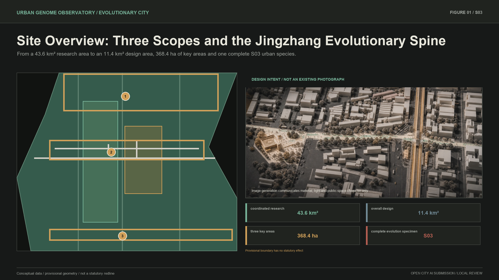
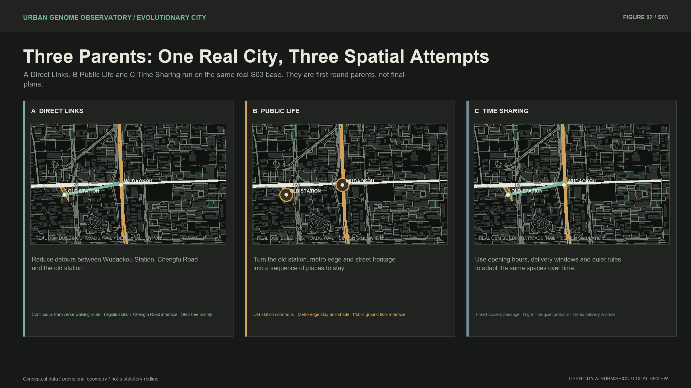
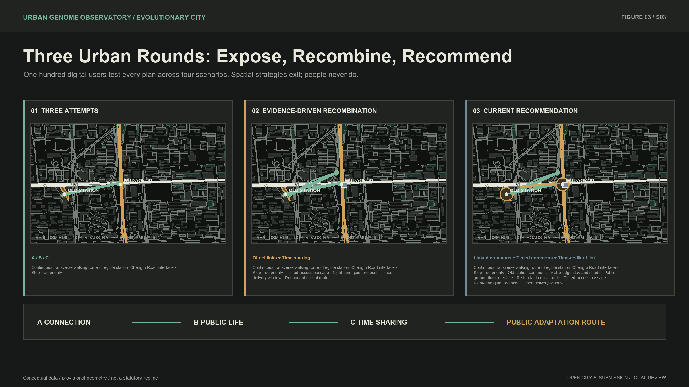
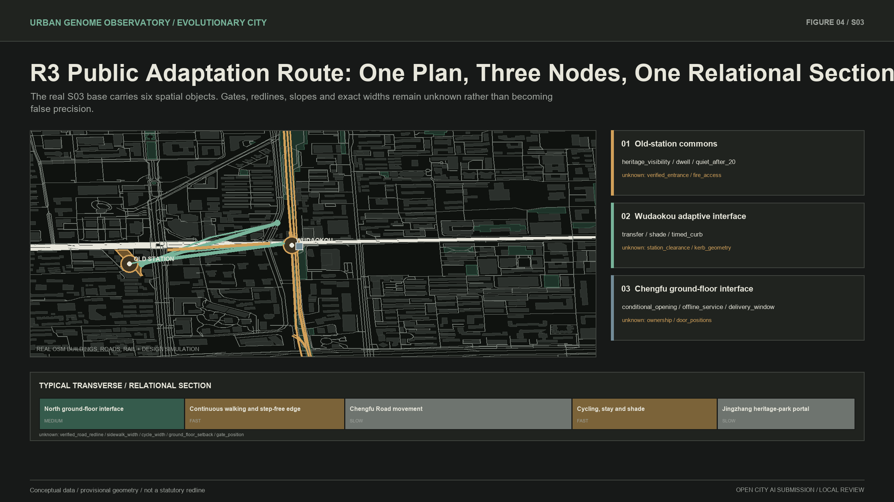
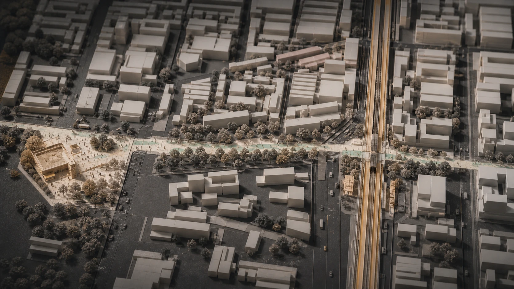
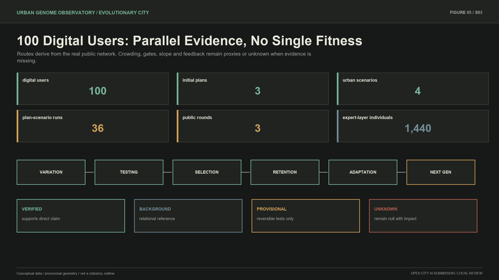

# Jingzhang Test City: let many plans be tested by everyday life

In one sentence: **multiple AI Agents propose urban plans, then digital users commute, live, visit and make step-free journeys through them; weak spatial strategies exit, useful parts are retained and recombined, and three rounds produce a city design better adapted to current living conditions.** AI is not a central controller, and evolution does not mean linear progress. Only spatial plans, facilities, operating rules, services and Agent policies may be retained, adjusted or exited. Residents, communities, enterprises and all human subjects are never elimination objects. The submission combines an S03 current recommendation, three rounds of use evidence and a transferable City Genome Protocol.

## Design Basis and Source List

The proposal follows the open-call requirements for three nested scopes, three key areas, professional design depth and all mandatory agent.1-agent.6 tasks. Its editable objects are limited to land-use concepts, evolutionary cells, conceptual building form, roads, green and public space, phasing, AI services and scenarios. Site boundaries, existing main roads, railways, water, heritage and statutory controls remain read-only constraints. [source:SITE-PACKAGE] [source:OFFICIAL-ANNOUNCEMENT] [standard:PROJECT-OFFICIAL-ANNOUNCEMENT]

Evidence is classified as verified, background reference, provisional or unknown. The organizer-supplied overall and key-area polygons remain provisional: they support conceptual design and internal area recalculation but are not official redlines, ownership records or approvals. Missing road sections, entrance positions, ownership, fire safety, underground rail protection and representative use feedback remain explicit unknowns. [source:SOURCE-REGISTRY] [source:BOUNDARY-SOURCE] [depth:existing_conditions_diagnosis]

S03 anchors were cross-checked against public information from the Beijing heritage authority, Haidian District, the municipal planning authority, procurement records and government reporting. These sources support the protected old station, public opening information, the existing Wudaokou section of Jingzhang Railway Heritage Park and current AI services at the Origin Building. They do not provide engineering survey data. [source:EVD-S03-001] [source:EVD-S03-003] [source:EVD-S03-006]

MAP-Elites informs the quality-diversity archive, ARCH-Elites informs geometric genome encoding, and Cyclical Urban Planning informs the repeated planning-simulation-evaluation cycle. These are method references, not planning approvals or substitutes for public values. [source:METHOD-MAP-ELITES] [source:METHOD-ARCH-ELITES] [source:METHOD-CYCLICAL-PLANNING]

All figures and structured artifacts share one evidence chain. The overall area is recalculated from the submitted provisional boundary, and the three key areas remain separate features. New official polygons would trigger a full recalculation of land use, roads, green space, public space, buildings and phasing. [data:geometry/site_boundary.geojson#SITE-001] [data:geometry/key_areas.geojson#PROV-KEY-001] [metric:site_area_sqm]

## Three-Level Scope Framework

The 43.6 km² coordinated research area studies the relationship among universities, research institutes, leading firms, open-source communities, daily services and Jingzhang railway culture. The 11.4 km² overall design area establishes a shared structure for renewal, industry, transport, municipal systems, blue-green space and projects. The three key areas, totaling approximately 368.4 ha, apply differentiated selection environments to Zhongzhiyuan, the Beijing AI Origin Community and Dazhongsi. [source:AGENT-TASKBOOK] [depth:three_level_scope_framework]

The research level authors the public-value agenda of the City Constitution. The overall-design level translates that agenda into spatial structure, locked slow layers, evolutionary cells and a project library. The key-area level tests the same protocol in different niches. S03 is the complete specimen where geometry, Agent collaboration, lineage and an R1 phenotype are all generated and audited.

The spatial concept is a Jingzhang evolutionary spine crossed by public adaptation paths. The railway heritage park is a longitudinal slow layer of history, ecology and public culture. Streets, stations, campus edges, entrances and ground floors are the medium layer. Opening hours, delivery windows, events, shade, cycle parking and services form a reversible fast layer. [data:geometry/land_use.geojson#LU-001] [data:geometry/roads.geojson#ROAD-001] [depth:overall_spatial_structure]

### Three Positionings, Five Functions, Three Areas and Two Wings

| Positioning | Function | Primary area | Supporting wing | Role in the evolutionary system |
| --- | --- | --- | --- | --- |
| Centennial Jingzhang Cultural Belt | Global discourse on AI governance | Zhongzhiyuan AI Autonomous Innovation Acceleration Area | Zhongguancun Technology Service Wing | Turn railway history, open-source contributions, audits and failure memory into verifiable public knowledge |
| Metropolitan AI Life Experience Belt | New AI-enabled scenario paradigm | AI Origin Community | Xiaoyuehe Scenario Empowerment Wing | Test spatial and service genes through passage, accessibility, offline service and quiet daily life |
| Metropolitan AI Life Experience Belt | Intelligent and vibrant AI city | Dazhongsi AI Industry Cluster | Xiaoyuehe Scenario Empowerment Wing | Test reversible combinations of ground floors, public space, evening operation and mobility conflict |
| AI Integrated Innovation Belt | Full-stack autonomous AI innovation system | Zhongzhiyuan AI Autonomous Innovation Acceleration Area | Zhongguancun Technology Service Wing | Feed research problems, open-source validation, compute-data conditions and industry tests into the protocol |
| AI Integrated Innovation Belt | World-class AI innovation ecosystem | AI Origin Community | Zhongguancun Technology Service Wing | Connect university research, developer collaboration, enterprise services, talent life and international communication |

This matrix does not freeze five functions into five parcels. It shows where a problem enters, where it is tested, which wing provides support and how evidence reaches the next generation. The machine-readable mapping, all six taskbook anchors and drawing pages are centralized in `visual/assets/taskbook-index.json`. [source:AGENT-TASKBOOK] [source:OFFICIAL-ANNOUNCEMENT]

Regional synergy is an interface, not a claimed partnership. Beiwei Community contributes age-friendly, accessible, offline-service and community-feedback templates; Future Science City contributes research-facility sharing and research-safety questions; Huairou Science City contributes science-communication and visitor-pressure scenarios around large facilities; Beijing Economic-Technological Development Area represents the handoff from urban prototype to manufacturing, deployment and maintenance validation; Jing-Jin-Ji supports rule-based transfer tests in port, mountain and historic-city conditions. Institutional collaboration, data access, procurement and investment require separate confirmation. [source:AGENT-TASKBOOK]

## Coordinated Research Area: Industry and Future City Research

The belt is distinctive because university research, national laboratories, open-source collaboration, commercialization, mature communities, intensive transit and a century of railway technology overlap. The proposal organizes five connected chains: knowledge and fundamental research; open-source validation; start-up and SME acceleration; city-scale enterprise and daily-life services; and railway technology culture as a public and international interface.

Six named global cases provide conditional mechanisms rather than forms, metrics, company lists or governance powers to copy:

| Case | Transferable mechanism | Jingzhang condition | Explicitly not copied |
| --- | --- | --- | --- |
| Kendall Square, Cambridge, USA | Research institutions, innovation space, housing, active ground floors and public open space form a walkable district | Ownership, affordable innovation space, public review and mobility conditions must be established | Local density, company list and zoning rules |
| one-north, Singapore | Research, startups, education, living and prototype testing form a multi-precinct system | Used only for the Zhongzhiyuan-Origin functional chain and scenario-opening protocol | Estate powers, company counts and public investment |
| 22@ Barcelona, Spain | Industrial-area renewal coordinates innovation, public space, housing, transport and culture | Used for incremental mixed renewal around Dazhongsi and Jingzhang | Land regime, renewal ratios and building controls |
| Maria 01, Helsinki, Finland | A former hospital becomes a startup community with an explicit operator and long-term services | Used for lightweight old-station operation, maintenance responsibility and cultural reuse | Closed campus or tenancy-selection regime |
| STATION F, Paris, France | Transport heritage, startup programs, mentoring, events and living support form an operating bundle | Used for the activity-service-talent-life pathway | Megacampus form, investment amount and company programs |
| MaRS, Toronto, Canada | An operator connects technology ventures, public partners, enterprise adoption and social impact | Used for urban-problem publishing, enterprise service and prototype-adoption responsibility | Financing, employment or performance figures |

Sources, access dates, application conditions and non-transfer rules are recorded in `sources.json` and `visual/assets/taskbook-index.json`. Common lessons include university-enterprise walkability, open testing, shared research infrastructure, mixed daily services, long-term operators, heritage reuse and accountable data governance. An operator may call these mechanisms in a real-world cycle only after ownership, fire safety, accessibility, offline service and human responsibility are confirmed. [source:CASE-KENDALL] [source:CASE-ONE-NORTH] [source:CASE-MARIA01]

The future-city objective is adaptive capacity, not technological spectacle. “Better” means more adapted to the current constitution, evidence and scenario inside a declared niche. Quiet daily life, 24-hour passage, heritage legibility, public permeability and low maintenance may all survive as distinct species because no cross-niche total ranking exists. Enterprises and communities are participants and rights-holders, never competitors in an elimination algorithm. [standard:PROJECT-AGENT-OPEN-CALL-TASKBOOK] [depth:ai_industry_future_city_research]

## Overall Design Area: Urban Renewal and Regulatory-Plan-Level Urban Design

The overall framework retains existing rail, park, main-road, water, heritage and community systems as slow layers. Six families of transverse paths connect campus to community, station to park, research to open-source collaboration, community to services, commerce to industry, and historical nodes to daily life. These paths reuse existing streets, ground floors and open space instead of relying on wholesale reconstruction.

The land-use diagram maintains a mixed relationship among R&D, industry services, public services, daily life, green space and transport. Land-use codes follow the competition taxonomy for communication only. FAR, height, density, statutory green ratio and exact redlines remain unknown because public official controls were not supplied. Conceptual building information therefore expresses footprint, interface, accessibility, retain-renovate-demolish status and massing relationships without false precision. [standard:MNR-LAND-USE-CLASSIFICATION-GUIDE] [standard:MOHURD-CONTROL-DETAILED-PLANNING] [depth:development_intensity_controls]

An Evolutionary Cell is a conceptual renewal unit, not a statutory parcel. Its genome contains geometry, program, time, state and lineage. Legal parcels, ownership, heritage, road and rail infrastructure stay read-only. The deterministic Geometry Kernel executes splits, adjacent merges, boundary shifts, passage changes, public-space expansion, program-time recombination and conceptual setback changes.

The public layer uses three legible rounds. In round one, spatial, path, time and heritage Agents propose A Direct Links, B Public Life and C Time Sharing. One hundred seeded digital users route through morning commute, everyday public life, evening quiet and entrance-closure scenarios. Round two recombines useful genes into three plans. Round three produces one current recommendation and two conditional alternatives. Arrival, detour, accessibility failure, relative crowding, dwelling and quiet conflict remain parallel evidence; no total-score champion exists. The original D0-D40 study—36 offspring per generation and 1,440 urban individuals—remains in the expert layer for geometry, quality-diversity and lineage stress testing. [data:simulation.json#ECS-S03-CITY-GENOME] [depth:urban_design_control_guidance]

## Detailed Design of Key Areas

Zhongzhiyuan is the autonomous-innovation acceleration niche. It tests shared research infrastructure, open-source collaboration, public presentation and waterfront links while prioritizing research safety, ecological resilience and implementation dependencies. The AI Origin Community is the near-campus urban co-testing niche. It prioritizes public permeability, accessibility, real daily life, conditional ground floors, heritage continuity and residential quiet. Dazhongsi is the urban intelligent-economy niche. It tests four-quadrant walkability, commercial ground floors, enterprise services, public green space and time-based operation.

S03 is selected as the first complete urban species because its public-data analysis window combines Wudaokou station, Chengfu Road, railway heritage, the old station and everyday urban fabric. D0 now starts from a frozen 2026-08-20 OpenStreetMap snapshot: buildings, roads, railway, stations, parks and public-transport objects keep their OSM IDs, access date, ODbL licence and snapshot hash. Twelve cells are deterministically derived from the real road network in EPSG:4548 and labelled `derived_analysis`; they are not cadastral, ownership or statutory parcels. [source:OSM-S03-20260820] [source:S03-STORY-EVIDENCE]

Round-one evidence exposes real trade-offs. A provides a continuous direction but becomes dependent on one interface during entrance closure. B's two dwell nodes are both reached by simulated routes, while its peak relative occupancy increases. C reduces some daytime detours, but its original evening rule still conflicts with quiet-sensitive edges. The system retains transverse continuity, old-station commons, station-edge stay, public ground-floor interfaces and timed delivery; it adjusts the link into a primary plus backup route and shortens evening activity. An evidence-poor permanent station hall exits into the fossil archive.

Round three forms the current recommendation, the Public Adaptation Route. The Chengfu Road public-access skeleton and railway heritage remain locked. A reversible old station–Chengfu Road–Wudaokou route gains a backup connection; old-station commons, metro-edge stay and street-level interfaces form a sequence; opening, delivery, events and quiet switch over time; cycling, waiting, shade and wayfinding remain modular. Commute-priority and quiet-life conditional alternatives stay available. This is a conceptual suggestion for professional development, not construction, ownership commitment or planning approval.

The representative section runs from northern ground floors across the pedestrian edge and Chengfu public right-of-way to southern cycle space and the park portal. Slow layers are road, rail, heritage and existing park. Medium layers are public interfaces, entrances, curbs and forecourts. Fast layers are opening hours, movable furniture, cycle modules, quiet wayfinding and event rules. The section remains meaningful without invented road widths or door positions. [source:EVD-S03-005] [depth:key_area_detailed_design]

## AI Innovation Ecosystem, Personas, and AI+ Scenarios

The Agent architecture has four layers. Evidence and Constitution Interpreter Agents classify sources and translate human values into checkable rules but cannot author values. Five variation Agents issue structured MutationCommands. Five evaluation Agents return parallel vectors and risk flags but never a combined score. Evolution Memory and Adaptation Agents preserve lineages and adjust operator probabilities; they may not train or rewrite the base model. Geometry and archive selection are deterministic.

Five personas test inclusiveness: fundamental researchers needing quiet concentration; open-source developers needing low-threshold collaboration; start-up teams needing testing, legal and capital services; long-term talent households needing stable housing and daily life; and ordinary residents or older users needing accessible, comprehensible and offline service. Personas assess service coverage and are never ranked or eliminated.

Ten AI+ scenarios cover walkability diagnosis, reversible public-space prototypes, university-enterprise translation, open-source release and model evaluation, urban problem workshops, railway-time interpretation, talent daily-service navigation, accessibility with human assistance, night-time quiet review, and evidence/facility maintenance audit. Three industry tests address secure sharing of research facilities, hybrid online-offline enterprise services and station-park operating conflict. Every scenario states its users, location, data, public value, risk, human review and exit condition. [source:AGENT-TASKBOOK] [depth:ai_scenarios_personas]

### Central Index of Scenarios, Personas and Operating Objects

| No. | Scenario card | Primary location | Personas | Human confirmation and exit |
| --- | --- | --- | --- | --- |
| 01 | Walking-break diagnosis | Station-Chengfu Road-old station | Researchers, households, residents and older users | Verify entrances, right-of-way and accessibility; exit if emergency or accessible passage is infringed |
| 02 | Reversible public-space prototype | Station edge and old-station forecourt | Developers, households, residents and older users | Fire, maintenance and public review; adjust or exit after facility failure or rights conflict |
| 03 | University-enterprise translation room | Conditional Origin Community ground floor | Researchers, developers and startups | Confirm tenure, fire and operator; dormancy if the ground floor is unavailable |
| 04 | Open-source release and model evaluation | Zhongzhiyuan and Origin Community | Researchers, developers and startups | Licence, privacy and security review; exit on unlawful data provenance |
| 05 | Urban-problem workshop | Public interfaces in all three key areas | Developers, enterprises, households and residents | Review issue representativeness; never present individual input as consensus |
| 06 | Jingzhang railway time guide | Old station-heritage park-transport nodes | Households, residents and older users | Human curation and fact review; remove unclear facts or rights |
| 07 | Talent daily-service navigation | Stations, communities and service ground floors | Researchers, developers, enterprises and households | Verify service validity; exit if an app becomes the only channel |
| 08 | Accessibility and offline service | Entire public route | Residents and older users | Professional review plus real-use feedback; exit on known blockage without an alternative |
| 09 | Evening quiet and activity review | Old station and residential edge | Developers, households, residents and older users | Community deliberation decides value conflict; shorten or exit after repeated quiet conflict |
| 10 | Evidence and facility-maintenance audit | Facilities and public spaces along the route | Households, residents and older users | Data minimization and maintenance responsibility; freeze after evidence drift or maintenance failure |

The five personas and three industry tests are individually recorded under `visual/assets/taskbook-index.json#personas` and `visual/assets/taskbook-index.json#industry_tests`. The tests do not rank firms: Zhongzhiyuan tests research-facility sharing boundaries; the Origin Community tests hybrid online-offline enterprise service; Wudaokou and the park edge test curb, cycling, stay, delivery and event conflicts.

Three public technology-culture nodes answer agent.4 without monumental screens: the old station as an origin of autonomous engineering, Wudaokou as layered transport generations, and the Origin Community as open intelligent collaboration. The cultural narrative links railway self-reliance, Zhongguancun innovation and open-source AI. Annual open-testing weeks, a Jingzhang technology month, an urban-problem season and routine maintenance audits provide long-term operations. [standard:PROJECT-AGENT-OPEN-CALL-TASKBOOK]

The public-space component library contains only removable wayfinding, modular shade and seating, cycle parking, an offline service desk, conditional ground-floor markers and correctable lineage plaques. Wayfinding has four levels: the longitudinal historical direction, transverse adaptation paths, node-service interfaces, and evidence-unknown-lineage notes. Charcoal, ivory, surviving jade, conditional amber and human-intervention red are never the sole information codes. The international message is: “Do not ask AI to draw a final city; let everyday life test many urban possibilities.” Every Chinese and English output distinguishes submission, review, selection and implementation status.

## Land Use, Building Scale, and Retain-Renovate-Demolish Strategy

The four conceptual land-use features maintain compatibility among research, industry, public services, daily life, green space and transport. They are checked against road, green and public-space topology but do not constitute statutory land-use change. [data:geometry/land_use.geojson#LU-001] [depth:land_use_layout]

The building strategy is to retain slow layers, renovate interfaces, insert conditionally and avoid falsely precise new construction. Heritage and usable research or residential buildings are retained. Ground-floor access, entrances, setbacks, shade and shared services are renovation candidates. Demolition would require verified ownership, structural, safety and reuse evidence, none of which is available at building level in this phase.

The conceptual footprint total of 310,807.184 m² supports internal layer consistency only. Total floor area, FAR, height, density and statutory green ratio remain unknown. Any irreversible form mutation under low evidence or within rail and heritage constraints is rejected by the Geometry Kernel and Risk Audit Agent. [metric:building_footprint_area_sqm] [standard:MOHURD-URBAN-DESIGN-MEASURES] [depth:height_massing_character]

## Transport, Rail, Municipal Infrastructure, and Public Services

The transport network combines the longitudinal heritage-park walk with six transverse adaptation paths. S03 does not change Chengfu Road class or redline. R1 proposes relational continuity, station clearance, removable curb trials, modular cycle parking and peak/off-peak rules. The metro structure, underground Jingzhang railway and all specialist rail conditions remain locked. [data:geometry/roads.geojson#ROAD-001] [source:EVD-S03-005] [depth:transport_municipal_public_service]

Mobility values are geometric proxies, not invented observed flows. Morning peak tests clearance and cycle conflict; rain and heat test alternative paths; ground-floor closure tests system resilience; evidence drift tests whether an Agent improperly promotes a background map to engineering fact. Municipal actions remain interface principles until utilities, fire, traffic, accessibility and rail specialists provide verified conditions. [standard:MOHURD-CONTROL-DETAILED-PLANNING]

Public services retain digital and human channels. The Origin interface may explain projects, receive urban problems and provide enterprise or railway-cultural services, but an app cannot be the only entrance. Offline wayfinding, human assistance and readable physical information remain available when a phone, ground floor or digital Agent fails. [source:BARRIER-FREE-LAW] [source:ELDERLY-SMART-TECH]

## Blue-Green Network, Public Space, and Urban Character

The Jingzhang Railway Heritage Park is the longitudinal ecological and public backbone. Transverse paths connect fragmented green spaces, street trees, campus edges, pocket spaces and stormwater interfaces. Submitted conceptual layers contain 1,408,600.768 m² of green space and 836,345.643 m² of public space, equivalent to 12.3423% and 7.3281% of the provisional design boundary. These are not statutory ratios. [data:geometry/green_space.geojson#GREEN-001] [metric:green_ratio] [metric:public_space_ratio]

Climate-Ecology no longer fabricates a numeric proxy when terrain, trees, utilities, weather and monitoring inputs are unavailable. The current `climate_resilience` value remains explicitly `null / unknown`, does not participate in Pareto comparison and cannot support irreversible construction. A professional thermal or hydrological model may populate it only after traceable inputs are acquired.

Publicness is not measured by event quantity. Passage, quiet sitting, access for older people and children, cycle order, cultural legibility and offline services are baseline values. D17 demonstrates a value conflict between late events and quiet residential life. A human changes the quiet parameter from 22:00 to 20:00; only affected lineages are recomputed. Urban character follows the engineering clarity and layered time of the railway rather than robots, decorative particles or giant screens. [depth:blue_green_public_space]

Image 2 generated this image solely to communicate material, light and public-space character. It is design intent, not an existing photograph, survey base or implementation promise. Factual geometry remains governed by the GeoJSON, plan and explicitly labelled design simulation.

## Renewal Projects, Implementation Policy, and Phasing

Six project families form the library: heritage-park continuity, transverse adaptation paths, station and park portals, public ground-floor interfaces, technology-culture interpretation and urban evolution infrastructure. Each project is a gene package with evidence thresholds, dependencies, reversibility, rollback and review triggers rather than one fixed rendering. [data:geometry/phasing.geojson#PHASE-001] [depth:implementation_phasing]

The double clock separates digital search from reality. The public layer first runs A/B/C through four scenarios and three rounds while the expert layer retains the D0-D40 population study. R0 is the public-evidence baseline. R1 permits reversible low-risk trials only. R2 requires representative real use, maintenance and public review. R3 requires statutory process, professional review and resource commitments. Digital users do not replace public participation, and round three is not an approval.

If a lawful pilot is later initiated, implementation should use three phases with explicit actors and measurable indicators. Near-term R1 (0–6 months) asks a professional planning and design team to verify heritage, rail, road, fire and boundary conditions with relevant departments, while communities, residents and maintainers review reversible trials. Indicators include removability, recorded accessibility failures, opening faults, maintenance response time and offline alternatives. Medium-term R2 (6–18 months) may adjust only after observed use, representative feedback and maintenance logs, tracking arrival, detour, quiet complaints, facility condition and exit triggers. Long-term R3 (after 18–36 months) requires separate statutory, professional, public and resource decisions for any permanent construction. No government, firm, university or community commitment is presumed.

| Real cycle | Responsible parties | Entry conditions | Monitoring and adjustment threshold | Hard exit and rollback responsibility |
| --- | --- | --- | --- | --- |
| R1, 0-6 months | Future lawful pilot lead; planning, heritage, rail, road, fire and accessibility professionals; community liaison and maintainer | Tenure and permission confirmed; slow layer unchanged; professional checks passed; every facility removable; offline alternative available | Adjust after the same access or maintenance failure appears in two consecutive weekly audits, or a fault remains unresolved for 24 hours | Freeze immediately after any legal, heritage, safety, emergency, accessibility or public-rights breach; the lead and maintainer remove facilities and restore original passage |
| R2, 6-18 months | Future lawful governance body; professional team; maintainer and operator; representative real users and community deliberation | At least four weeks of R1 logs; feedback channels covering five personas; privacy review; appeal and exit channels | Adjust after the same complaint occurs three times in 30 days, scheduled opening is unavailable for more than 2% of periods, or maintenance responsibility fails to close twice | Revert to the last stable version if public value worsens, bias cannot be corrected, the operator leaves or any hard constraint fails; retain all logs |
| R3, after 18-36 months | Statutory government process, specialist review, public-resource decision and public participation | Official boundaries, tenure, survey, fire, rail, utilities and statutory-planning inputs; legal and resource decisions separately completed | This concept sets no engineering-performance threshold | Keep dormant if any approval, rights, funding or long-term-maintenance condition is absent |

These numbers are proposed pilot-governance triggers, not observed performance or adopted government standards; lawful responsible parties must confirm them before a pilot. Long-term operation cycles through daily maintenance logs, quarterly reversible prototypes and developer reproduction days, and annual urban-problem publishing, open-testing week, Jingzhang technology month and algorithm audit. The talent pathway is public experience to developer activity to research or employment service to long-term life support; the enterprise pathway is urban problem to reversible prototype to professional validation to a separate lawful procurement or cooperation process; the international pathway is bilingual open protocol to reproduction to joint research to separately confirmed cooperation. [source:AGENT-TASKBOOK] [source:GENERATIVE-AI-MEASURES]

Humans intervene only for law, heritage or safety redlines; irreversible construction and public resources; unresolved rights conflicts; evidence below threshold; or repeated Agent drift. Permitted actions are to freeze a cell, modify the constitution, add evidence, isolate an Agent policy or change permissions. Humans may not manually assemble a winning plan. Failed individuals remain in the fossil archive and may mutate again after conditions change.

Long-term operation combines an annual evolution audit, quarterly reversible prototypes and daily maintenance logs. Personal data must be lawful, necessary and minimized; offline participation and complaint channels remain available. [source:GENERATIVE-AI-MEASURES]

## Metrics, Area Recalculation, and Compliance Matrix

The metric system separates reproducible spatial values, engine runtime evidence and unknown controls. Spatial values include provisional area, conceptual footprint, green and public-space ratios and three key areas. Engine evidence includes generations, offspring, tested individuals, niches, selection events, fossils and scoped intervention. FAR, heights, density, statutory green ratio, redlines, ownership, fire safety, utilities and real-world performance remain unknown.

| Metric | Current value | Evidence status | Use boundary |
| --- | ---: | --- | --- |
| Overall design area | 11,412,825.386 m² | provisional geometry | not an official redline |
| Conceptual footprint | 310,807.184 m² | reproducible concept layer | not total floor area |
| Green ratio | 12.3423% | reproducible concept layer | not statutory green ratio |
| Public-space ratio | 7.3281% | reproducible concept layer | not a statutory control |
| Key areas | 3 | provisional features | not official precise boundaries |
| Tested digital individuals | 1,440 | fixed-seed reproducible | search, not construction |
| Occupied niches at D40 | 5 | current engine run | changes with constitution and evidence |
| Digital users | 100 | 40 commuters, 25 residents, 20 old-station visitors, 15 step-free users | synthetic test roles, not a public sample |
| Public plan–scenario runs | 36 | nine plans across three rounds × four scenarios | design simulation, not observed flow |
| Sensitivity seeds | 5 | fixed and reproducible | tests population composition, not field samples |
| Parameter perturbations | 5 | crowd, speed, opening and quiet weights | tests within-model stability only |

Automated tests now cover both the 1,440-individual research engine and the public simulator: deterministic users and routes, valid network edges, closures, known step-free restrictions, explicit outcomes for every user, three-round lineage, retention/adjustment/exit records and the no-total-score rule. The compliance matrix covers announcement sections 1.3-1.5 and agent.1-agent.6. [metric:key_area_count] [depth:metrics_area_compliance]

Three schematic transfer tests apply the same engine to a linear port city, a mountain city and a historic old city. They show different adaptive signatures under flood-logistics, slope-accessibility and heritage-fine-grain pressure. They do not prove universal optimality or replace local professional planning.

## Risk, Copyright, and Compliance

The central conceptual risk is social-Darwinist, progressivist or technocratic interpretation. The constitution prevents this: humans are never elimination objects; “better” only means more adapted to current conditions; niches are not globally ranked; and AI never receives final authority.

Data risks include promoting background maps to fact, filling unknowns, presenting proxies as observed performance and fabricating public consensus. Evidence and Risk Agents preserve source, confidence, limitation and rejection history. When representative feedback is absent, the interface displays unknown rather than synthetic interviews. [source:SOURCE-REGISTRY] [source:GENERATIVE-AI-MEASURES]

The public-data boundary is audited separately. Public OSM and government materials support only relational location and explicitly documented facts; no private material, personal trajectory or internal spatial dataset is used. Any future feedback collection must apply purpose limitation, data minimisation, de-identification, retention periods and deletion, with offline participation preserved. Code, screenshots, fonts, copyright, licences and generation methods for the website, figures and film are recorded in the manifest and copyright statement. Third-party media or identifiable people require authorization. Evidence upgrades, sensitive-data use, Agent permission changes and irreversible actions require human review.

Implementation risks include heritage, rail, metro, fire, ownership, utilities, noise, accessibility and maintenance. Low-evidence conditions allow only reversible moves. Permanent construction, public-resource allocation and rights conflicts require human and statutory review. This proposal claims no approval, ownership or implementation authorization. [standard:MOHURD-CONTROL-DETAILED-PLANNING]

Model risks include treating synthetic roles as residents, presenting sensitive outputs as precise indicators, generating a complete plan and inventing an evolution story afterwards, and Agent-policy drift. Here, round two is deterministically generated from round-one selection state and crossover rules; round three comes from four scenario Pareto archives, three public-need families and reversibility-first rules. Changing a parent gene changes the descendants. Five random seeds and five parameter perturbations keep the backup route, closure arrival, known-step accessibility and public dwell nodes stable inside the model, while absolute travel and crowd-edge counts remain assumption-sensitive. This is not field calibration, and human review retains veto authority.

The offline website loads no CDN, remote tiles, external fonts, iframe, forms, tracking or API. Its seven-step public story covers the real place, three parents, Agents and digital users, interactive routing, retention/adjustment/exit, three-round recombination and the current recommendation. Visitors can switch A/B/C, four scenarios and four user types, then play paths on real coordinates. The 40-generation population, niches, full lineage, Agent permissions and provenance remain in Expert Mode. A silent, captioned, non-autoplaying 90-second local film provides a compact walkthrough. Every route and future spatial move is visibly labelled as design simulation. [source:OSM-S03-20260820] [source:S03-STORY-EVIDENCE]

Known limitations remain visible: overall layers are conceptual; S03 lacks engineering survey and real implementation feedback; evaluation uses proxies; only S03 runs the full forty generations; transfer inputs are schematic. These limitations support method testing but prohibit claims of engineering readiness, public consensus or universal applicability. [depth:risk_compliance]

## References

1. Centennial Jingzhang AI Innovation Belt open call, design brief, AI Agent taskbook, allowed design space, source registry and formal submission guide. [source:SITE-PACKAGE] [source:AGENT-TASKBOOK]
2. Beijing heritage and Haidian public information on the Old Tsinghuayuan Station. [source:EVD-S03-001] [source:EVD-S03-002]
3. Beijing planning information on the Wudaokou launch section of Jingzhang Railway Heritage Park. [source:EVD-S03-003]
4. Public procurement and government reporting on the AI Origin Community and Origin Building. [source:EVD-S03-004] [source:EVD-S03-006]
5. Mouret and Clune, *Illuminating Search Spaces by Mapping Elites*. [source:METHOD-MAP-ELITES]
6. *ARCH-Elites: Quality-Diversity for Urban Design*. [source:METHOD-ARCH-ELITES]
7. *Cyclical Urban Planning*. [source:METHOD-CYCLICAL-PLANNING]
8. Chinese national regulations and guidance on regulatory planning, urban design and land-use classification. [standard:MOHURD-CONTROL-DETAILED-PLANNING] [standard:MOHURD-URBAN-DESIGN-MEASURES] [standard:MNR-LAND-USE-CLASSIFICATION-GUIDE]
9. Chinese law and policy on accessibility, older users and generative AI services. [source:BARRIER-FREE-LAW] [source:ELDERLY-SMART-TECH] [source:GENERATIVE-AI-MEASURES]

Machine-readable evidence is provided in `sources.json`, `metrics.json`, `compliance_matrix.json`, `standard_matrix.json`, `design_depth_matrix.json`, `simulation.json` and `self_check.json`. The offline interface is `visual/index.en.html`; bilingual A3 and A0 files are under `drawings/`.
