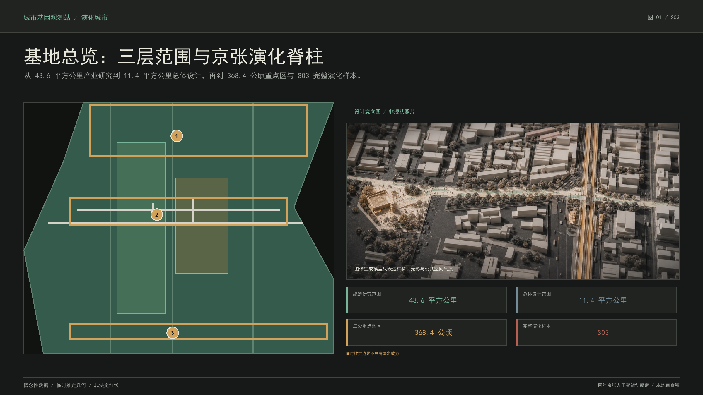
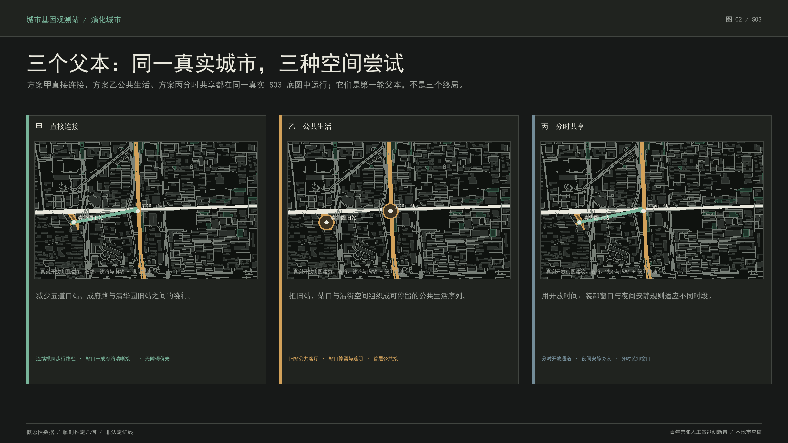
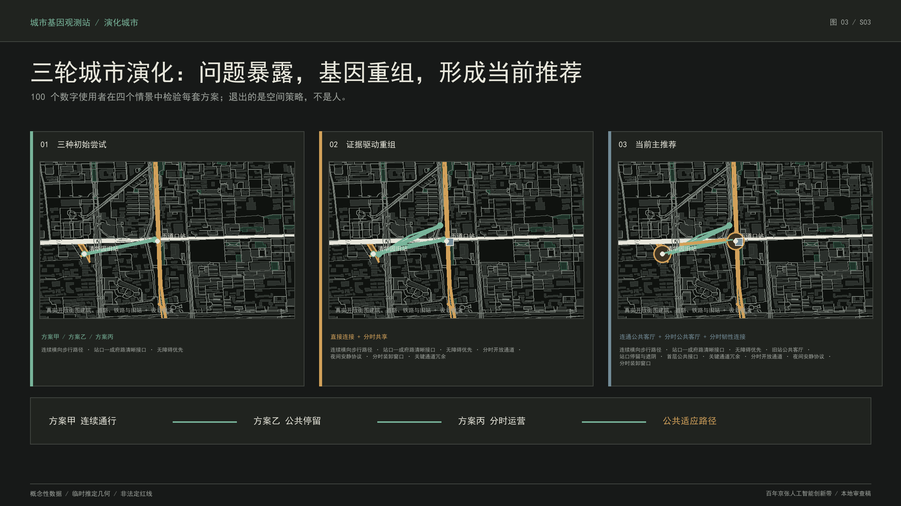
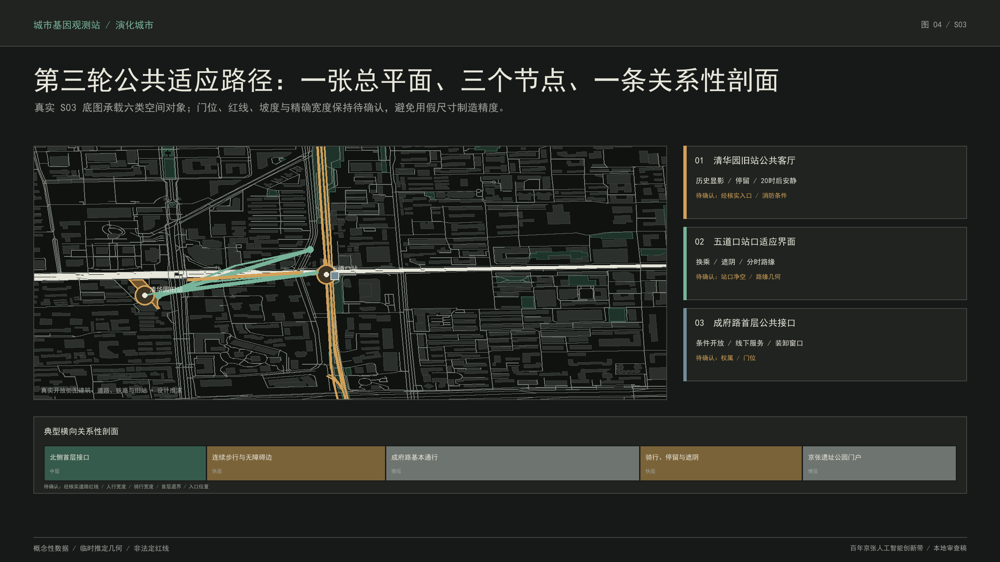
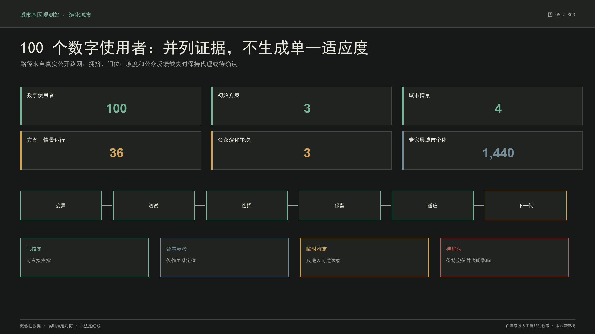

# 京张试城：让很多种城市方案先被生活检验

一句话解释本方案：**让多个智能体同时提出城市方案，再让数字使用者在里面通勤、生活、参观和无障碍出行；不好用的空间策略退出，好用的部分被保留、组合和再测试，经过三轮演化形成一套更适合当前生活条件的城市设计。** 人工智能不是自动优化城市的总控制器，“进化”也不表示越来越先进。只有空间方案、设施、运营规则、服务和智能体策略可以被保留、调整或退出；居民、社区、企业和任何人类主体从不成为淘汰对象。最终成果由 S03 当前主推荐、三轮使用证据和可迁移的城市基因协议共同构成。

## 设计依据与资料清单

本方案首先服从征集公告的三层范围、三处重点地区、专业成果深度和六项智能体必选任务；设计对象限定在任务书允许的用地、更新单元、概念建筑、道路、公共空间、蓝绿空间、实施分期与人工智能服务范围内。基地边界、既有主路与铁路、水系、文保对象和法定控制条件全部作为只读约束，不由演化引擎改写。[source:SITE-PACKAGE] [source:OFFICIAL-ANNOUNCEMENT] [standard:PROJECT-OFFICIAL-ANNOUNCEMENT]

资料采用“公开证据优先 + 明确不确定性”的四级制度：已核实 可直接支撑陈述；背景参考 只支持相对定位；临时推定 可支持可逆试验；待确认 保持空值并说明影响。总体设计边界和重点区边界使用组织方提供的 临时推定 数据，仅用于概念设计、面积复算和内容评审，不作为官方红线、产权或审批依据。[source:SOURCE-REGISTRY] [source:BOUNDARY-SOURCE] [depth:existing_conditions_diagnosis]

S03 的现实锚点由北京市文物局、海淀区政府、北京市规划自然资源部门、北京市公共资源交易记录和政府公开报道交叉核对：清华园旧站的文保关系、旧站公开开放信息、京张铁路遗址公园五道口启动区、人工智能原点社区近期更新背景和原点大厦既有 人工智能服务可以确认；道路红线、首层门位、权属消防、站口净空、地下高铁保护条件和真实代表性使用反馈仍为 待确认。[source:EVD-S03-001] [source:EVD-S03-003] [source:EVD-S03-006]

演化方法以 多样性精英档案方法 的质量—多样性档案、建筑多样性精英编码方法 的建筑几何编码和 循环城市规划方法 的“规划—生活模拟—评价—再规划”循环作为学术参照。它们只证明多样化搜索、空间基因编码和多智能体循环具有方法可行性，不构成规划审批依据或公共价值标准。[source:METHOD-MAP-ELITES] [source:METHOD-ARCH-ELITES] [source:METHOD-CYCLICAL-PLANNING]

上图与全部结构化成果共享同一证据链。总体设计范围面积由提交的 临时推定 `site_boundary.geojson` 复算，三处重点区由独立图层记录；若组织方补充官方边界，所有用地、道路、绿地、公共空间、建筑和分期图层须整体重算，而不是手工修改图上数字。[data:geometry/site_boundary.geojson#SITE-001] [data:geometry/key_areas.geojson#PROV-KEY-001] [metric:site_area_sqm]

## 三层范围工作框架

统筹研究范围约 43.6 平方公里，回答海淀北部高校、科研院所、头部企业、开源社区、生活服务与京张铁路文化如何构成可持续的 人工智能创新生态；总体设计范围约 11.4 平方公里，回答遗址公园周边 1—2 公里城市地区如何形成用地、产业、交通、市政、蓝绿、公共空间和更新项目的统一骨架；三处重点地区合计约 368.4 公顷，回答众智园、北京 人工智能原点社区和大钟寺如何在不同条件下采用不同的演化评价环境。[source:AGENT-TASKBOOK] [depth:three_level_scope_framework]

三层范围不是三张互不相干的图。统筹研究层制定“城市宪法”的公共价值和产业生态目标；总体设计层把目标转为可检查的空间骨架、慢层约束、更新单元与项目库；重点区域层把同一协议放入差异化生态位。S03 是完整验证样本，承担真实几何变异、智能体协作、谱系记录与 R1 空间表型生成；其余区域通过规则和图层保持与总体结构一致。

总体概念为“京张演化脊柱 + 横向公共适应路径”。纵向铁路遗址与公园保留历史、生态和创新展示的慢层；横向街道、站点、校园入口、首层界面和社区公共空间成为日常城市与创新资源相互渗透的中层；开放时间、装卸时窗、活动、遮阴、骑行停放和服务设施构成可快速试验的快层。演化不是另画一条未来感轴线，而是为既有城市骨架增加可回退、可评价、可积累的更新接口。[data:geometry/land_use.geojson#LU-001] [data:geometry/roads.geojson#ROAD-001] [depth:overall_spatial_structure]

### 三大定位—五大功能—三区两翼协同回路

| 三大定位 | 五大功能 | 主要承载区 | 协同翼 | 演化机制中的作用 |
| --- | --- | --- | --- | --- |
| 百年京张文化带 | 人工智能治理全球话语权 | 众智园人工智能自主创新加速区 | 中关村科技服务翼 | 把铁路工程史、开源贡献、算法审计与失败记忆转为可核验公共知识 |
| 都市人工智能生活体验带 | 人工智能场景赋能新范式 | 人工智能原点社区 | 小月河场景赋能翼 | 以通行、无障碍、线下服务与安静生活检验空间和服务基因 |
| 都市人工智能生活体验带 | 智能化人工智能活力城市 | 大钟寺人工智能产业集聚区 | 小月河场景赋能翼 | 测试首层、公共空间、夜间运营与交通冲突的可逆组合 |
| 人工智能融合创新带 | 人工智能全栈自主创新体系 | 众智园人工智能自主创新加速区 | 中关村科技服务翼 | 把科研问题、开源验证、算力数据条件和产业测试接入演化协议 |
| 人工智能融合创新带 | 世界级人工智能创新生态 | 人工智能原点社区 | 中关村科技服务翼 | 连接高校策源、开发者协作、企业服务、人才生活与国际传播 |

该表不是把五项功能固定分配给五块土地，而是明确“问题从哪里进入、在哪里测试、通过哪一翼获得服务、如何进入下一轮”的协同回路。完整机器可读映射、六项任务书锚点和成果页码集中在 `visual/assets/taskbook-index.json`。[source:AGENT-TASKBOOK] [source:OFFICIAL-ANNOUNCEMENT]

区域协同同样只定义接口，不虚构合作事实：北纬社区对应适老、无障碍和社区反馈模板；未来科学城对应科研设施共享与研究安全测试题；怀柔科学城对应大型科学装置周边的科学传播和访问压力情景；北京经济技术开发区对应城市原型向制造、部署和维护验证的交接；京津冀对应同一协议在港口、山地和老城等规则化压力测试中的迁移。任何机构合作、数据开放、采购或投资均须另行确认。[source:AGENT-TASKBOOK]

## 统筹研究范围产业与未来城市研究

京张 人工智能创新带的独特性不是“科技企业多”，而是同时拥有高校策源、科研平台、开源社区、产业转化、国际交往、成熟社区、密集轨道与百年铁路技术文化。方案把产业生态组织为五条连续链：高校与科研机构形成问题和基础研究源头；开源社区形成协同验证；众智园和原点社区形成成果转化与中小企业加速；大钟寺和成熟商业形成城市级服务与消费场景；京张遗址公园形成技术文化、公共教育和国际传播界面。

六个具名全球案例只用于提取机制，不直接复制园区形态、指标、企业名单或治理权力：

| 案例 | 可借鉴机制 | 京张适用条件 | 明确不复制 |
| --- | --- | --- | --- |
| 美国剑桥肯德尔广场 | 研究机构、创新空间、住房、活跃首层与公共开放空间共同形成步行创新区 | 权属、可负担创新空间、公共审议和交通条件成立 | 当地开发强度、产业名单和分区规则 |
| 新加坡纬壹科技城 | 研究、创业、教育、生活与原型测试形成多片区协同 | 用于众智园—原点社区功能链和场景开放机制 | 园区管理权、企业数量和财政投入 |
| 西班牙巴塞罗那二十二区 | 工业地区更新同时组织创新、公共空间、住房、交通与文化 | 用于大钟寺和京张沿线渐进混合更新 | 土地制度、更新比例与建筑指标 |
| 芬兰赫尔辛基玛丽亚零一 | 历史医院再利用为创业社区，并由明确运营主体连接空间和长期服务 | 用于旧站轻量运营、维护责任和文化再利用 | 封闭园区和租赁筛选制度 |
| 法国巴黎弗雷西内站创业园 | 历史基础设施、创业项目、导师、活动和居住支持形成运营组合 | 用于活动—服务—人才生活转化路径 | 巨型单体园区、投资额和企业项目名单 |
| 加拿大多伦多火星创新区 | 运营机构连接科技创业、公共部门、企业采用和社会影响 | 用于城市问题发布、企业服务和原型采用责任链 | 融资、就业或绩效数字 |

六项来源、访问日期、适用条件和禁止转译内容均登记在 `sources.json` 与 `visual/assets/taskbook-index.json`。归纳出的共同机制包括大学—企业步行联系、开放试验、研究基础设施共享、混合生活服务、长期运营主体、历史设施再利用与公共监督的数据治理；只有权属、消防、无障碍、线下服务和人工责任成立时，相应算子才可进入现实代。[source:CASE-KENDALL] [source:CASE-ONE-NORTH] [source:CASE-MARIA01]

未来城市研究的核心不是增加机器人、大屏和感应装置，而是提升城市面对未知变化的适应能力。系统把“越来越好”严格表述为：在当前城市宪法、环境情景和证据条件下，某一城市个体在其生态位内表现出更好的并列公共价值、证据可靠性或必要新颖性。不同生态位之间不建立总排名，因此安静生活、全天通行、历史显影、高公共渗透性和低运维负担可以同时保留为不同物种。

产业空间也采用这种多样化逻辑：大型研发平台需要稳定慢层和安全边界；开源协作与创业服务需要可调整中层；发布、展览、城市问题工作坊和活动运营属于快层。一个空间策略失败时，退出的是该设施、开放规则或智能体策略，而不是承载它的企业和人。由此，城市更新从招商导向的静态容量配置，转向“问题—原型—真实使用—复审—再配置”的长期公共能力建设。[standard:PROJECT-AGENT-OPEN-CALL-TASKBOOK] [depth:ai_industry_future_city_research]

## 总体设计范围城市更新与控规深度城市设计

总体设计以现状铁路、公园、主路、水系、文保和既有社区为慢层，提出“一条京张演化脊柱、六类横向公共适应路径、三区差异化生态位、多点城市问题接口”的结构。六类横向路径分别处理：校园—社区连接、站点—公园换乘、研发—开源协作、社区—公共服务、商业—产业服务、历史节点—日常生活。它们优先利用现状道路、首层和公共空间，不以大拆大建形成连续性。

总体用地结构保持创新研发、产业服务、公共服务、居住生活、绿地与交通之间的复合关系。提交图层使用国土空间用途分类作为表达索引，但不宣称替代正式控规。缺失的容积率、建筑高度、建筑密度、绿地率控制值统一记为 待确认；概念建筑只表达基底、界面、可进入性、拆改留类型和体量关系，不输出伪精确强度。[standard:MNR-LAND-USE-CLASSIFICATION-GUIDE] [standard:MOHURD-CONTROL-DETAILED-PLANNING] [depth:development_intensity_controls]

演化对象采用“演化更新单元”，与法定宗地严格区分。每个个体包含几何、功能、时间、状态和谱系五类基因；允许执行单元分裂、相邻合并、边界偏移、横向通道插入、公共空间伸缩、功能与开放时间重组、概念基底与退界调整。法定边界、产权、文保、道路铁路和市政条件作为只读约束进入确定性几何内核。

公众层采用三轮可理解的演化：第一轮由空间、路径、时间和遗产智能体提出 方案甲“直接连接”、方案乙“公共生活”、方案丙“分时共享”；100 个固定种子的数字使用者在早高峰、日常公共生活、傍晚安静与入口关闭四个情景中寻路；第二轮保留有效基因并重组为三套组合方案；第三轮形成一个当前主推荐和两个条件型方案。到达、绕行、无障碍失败、相对拥挤、停留节点与安静冲突并列呈现，不生成总分冠军。原 D0—D40、每代 36 个后代和 1,440 个城市个体继续作为专家研究层，用于几何合法性、质量—多样性和谱系压力测试，不再承担公众主叙事。[data:simulation.json#ECS-S03-CITY-GENOME] [depth:urban_design_control_guidance]

## 重点区域详细设计

众智园定位为“自主创新加速生态位”。慢层保留科研平台、清河文化与区域交通条件；中层重点测试研发共享、开源协作、成果发布和滨水公共联系；快层测试行业任务周、研究设施预约与公共科普。评价环境更关注研发安全、开放协作、生态韧性和大型平台的实施依赖，避免把园区公共性等同于全天开放。

北京 人工智能原点社区定位为“近校转化与城市共测生态位”。高校、轨道、成熟商业、居住和京张遗址在此密集叠合，最适合验证横向演化断面。评价环境强调公共渗透性、无障碍、真实日常、首层条件、历史连续与安静生活。S03“成府路—五道口—清华园旧站”被选为第一件完整城市物种标本，因为它在约 500 米内同时呈现旧铁路、地面遗址公园、空中地铁、地下高铁、人工智能原点社区和居民生活的多重时间。

大钟寺定位为“城市型智能经济生态位”。慢层保留轨道、道路和既有城市肌理；中层测试四象限慢行连接、商业首层、企业服务和公共绿地复合；快层测试智能体新业态、城市发布与夜间运营。评价环境更关注高强度城市界面的通行冲突、商业运营、公共资源配置与活动时窗，防止以事件化运营挤压日常公共空间。

S03 的第零代由 2026-08-20 固定的开放街图公共数据快照建立：建筑、道路、轨道、站点、公园和公共交通对象保留原始要素编号、抓取日期、开放数据库许可与快照哈希。12 个演化单元由真实道路网络在国家大地坐标系下确定性派生，属于道路关系分析单元，不是法定宗地、产权或控规边界；铁路遗产与旧站相关单元锁定，其余只采用可撤、可退、可改的设计推演。[source:OSM-S03-20260820] [source:S03-STORY-EVIDENCE]

第一轮测试显示：A 的连续方向有效，但入口关闭情景暴露单点依赖；B 的旧站与站口公共客厅均被模拟路径触达，但高峰相对占用增加；C 的白天分时通道减少部分绕行，但原夜间规则仍产生安静敏感边冲突。系统因此保留横向连续、旧站公共客厅、站口停留、首层公共接口和分时装卸，调整直连为“主路径＋备用连接”，缩短夜间活动并降低站口夜间停留容量；证据不足的永久站厅退出并进入化石档案。

第三轮形成当前主推荐“公共适应路径”：成府路公共通行骨架与铁路遗产保持锁定；旧站—成府路—五道口站形成可逆的连续横向路径及备用连接；旧站公共客厅、站口停留和沿街首层接口串联；入口开放、装卸窗口、活动和安静规则分时切换；骑行、等候、遮阴与导向采用模块化设施。通勤优先和安静生活两套条件型方案继续保留。该结果是供专业团队深化的概念建议，不是建成终局、产权承诺或规划许可。

典型横向剖面从北侧首层—人行界面—成府路公共通行骨架—南侧骑行停留—京张公园入口依次展开。慢层包括轨道安全、道路基本功能、文保和既有公园；中层包括首层公共界面、入口、路缘关系和站前空间；快层包括开放时段、移动家具、骑行模块、安静导向和活动规则。剖面以“连续可达 + 条件开放 + 可逆设施”成立，不依赖当前缺失的精确红线和入口尺寸。[source:EVD-S03-005] [depth:key_area_detailed_design]

## AI 创新生态、人才画像与 AI+ 场景

多智能体集群分为四层。数据层的证据智能体和规则解释器整理来源、置信度、待确认信息和机器可检查规则，但不能制定公共价值。变异层的单元形态、路径网络、功能时间、公共空间和遗产智能体只输出带来源、权限、可逆性和目标对象的结构化变异命令。评价层的交通、气候生态、公共价值、可实施性和风险审计智能体输出并列证据向量和风险标记，不生成综合总分。演化层的记忆与适应智能体保存谱系、失败和策略表现，调整算子调用概率；基础模型不得自行训练或改写权重。

服务对象至少包括五类人才画像：需要安静深度工作的基础研究者；需要低门槛协作空间的开源开发者；需要试验客户、法务和资本连接的创业团队；需要稳定通勤、居住、托育和文化生活的长期人才家庭；需要无障碍、线下协助和可理解 人工智能服务的普通居民与老年使用者。画像用于检查空间和服务是否包容，不参与算法分类、优劣排序或淘汰。

十类 人工智能+ 场景共享同一空间逻辑：一是慢行断点诊断，二是公共空间可逆原型，三是校企成果转化客厅，四是开源发布与模型评测，五是城市问题工作坊，六是京张铁路时间导览，七是人才日常服务导航，八是无障碍与线下服务协同，九是夜间安静与活动运营复核，十是环境证据和设施维护审计。每张场景卡说明服务对象、位置、输入、公共价值、风险、人工复核与退出条件。

三类产业测试场景分别为：研究设施共享时的安全与开放边界；企业服务智能体在首层公共界面的线上线下协同；城市运营智能体在站点、公园和活动时段的路权冲突审计。它们测试的是服务与空间机制，不对企业进行排名或淘汰。agent.3 的人物画像、行业测试和场景数量由 `compliance_matrix.json` 逐项映射。[source:AGENT-TASKBOOK] [depth:ai_scenarios_personas]

### 场景、画像与运营对象集中索引

| 编号 | 场景卡 | 主要位置 | 主要画像 | 人工确认与退出条件 |
| --- | --- | --- | --- | --- |
| 01 | 慢行断点诊断 | 站点—成府路—旧站 | 研究者、家庭、居民与老人 | 核对入口、路权和无障碍；侵犯应急或无障碍通道即退出 |
| 02 | 可逆公共空间原型 | 站口与旧站前场 | 开发者、家庭、居民与老人 | 消防、维护和公共审议；设施故障或权利冲突即调整或退出 |
| 03 | 校企成果转化客厅 | 原点社区条件性首层 | 研究者、开发者、创业团队 | 权属、消防和运营主体确认；首层不可获得即休眠 |
| 04 | 开源发布与模型评测 | 众智园与原点社区 | 研究者、开发者、创业团队 | 数据许可、隐私和安全审核；来源不合法即退出 |
| 05 | 城市问题工作坊 | 三处重点区公共接口 | 开发者、企业、家庭和居民 | 人工审议议题代表性；不得把个体意见冒充共识 |
| 06 | 京张铁路时间导览 | 旧站—遗址公园—交通节点 | 家庭、居民与老人 | 人工策展和史实复核；事实或版权不清即撤下 |
| 07 | 人才日常服务导航 | 站点、社区和企业服务首层 | 研究者、开发者、企业、家庭 | 核验服务有效性；应用程序成为唯一入口即退出 |
| 08 | 无障碍与线下服务协同 | 全线公共路径 | 居民与老年使用者 | 专业审查与真实使用反馈；已知断路且无替代即退出 |
| 09 | 夜间安静与活动复核 | 旧站和居住界面 | 开发者、家庭、居民与老人 | 社区审议价值冲突；重复安静冲突即缩时或退出 |
| 10 | 环境证据与设施维护审计 | 全线设施和公共空间 | 家庭、居民与老人 | 数据最小化和维护责任；证据漂移或维护失责即冻结 |

五类画像与三类产业测试分别在 `visual/assets/taskbook-index.json#personas` 和 `visual/assets/taskbook-index.json#industry_tests` 逐项记录。三个产业测试不评价企业优劣：众智园测试研究设施共享边界，原点社区测试企业服务的线上线下协同，五道口—公园界面测试路缘、骑行、停留、装卸与活动冲突。

agent.4 的 人工智能朝圣与荣誉体系不建设纪念性大屏，而形成三个可步行、可更新的技术文化节点：清华园旧站“自主工程起点”、五道口“多代交通叠层”、原点社区“开源智能协作”。荣誉内容采用公开可核实资料、定期复核和人工策展；错误内容可以退出，历史人物和群体不参与算法排名。agent.5 以“铁路自主建造—电子信息与中关村创新—开源人工智能协作”形成连续叙事，agent.6 则以年度开放测试周、京张技术文化月、城市问题发布季和常态维护审计形成长期运营日历。[standard:PROJECT-AGENT-OPEN-CALL-TASKBOOK]

公共空间组件库只包含可撤导向标记、模块化遮阴与座椅、骑行停放、线下服务台、条件性首层接口标识和可纠错谱系铭牌。导视分为京张纵向历史方向、横向公共适应路径、节点服务接口、证据与未知说明四级；使用深石墨、象牙白、存活青绿、条件保留琥珀和人工介入红色刻痕，但不以颜色作为唯一信息。国际传播核心句为：“不是让人工智能画一座终局城市，而是让多种城市方案先被生活检验。”中英文成果必须区分投稿、评审、入选和实施状态。

## 用地、建筑规模与拆改留方案

用地方案以现状混合城市为基础，增加研发转化、公共服务、文化展示和蓝绿公共空间之间的兼容关系。结构化 `land_use.geojson` 的四个概念用地单元覆盖总体范围，并与道路、绿地和公共空间图层进行拓扑复核；其用途代码用于本次设计表达，不构成法定变更。[data:geometry/land_use.geojson#LU-001] [depth:land_use_layout]

建筑策略遵循“保留慢层、改造界面、条件插入、避免伪精确新建”。保留对象包括文保建筑、与京张技术史相关的空间骨架、可继续使用的研发和生活建筑；更新对象包括首层公共界面、入口可达、退界、遮阴和共享服务；拆除只针对经专业鉴定后确认的违章、危险、严重阻断公共系统且无再利用价值的对象。本阶段没有获得逐栋权属、结构安全和竣工资料，因此不提出确定拆除清单。

提交的概念建筑基底总面积为 310,807.184 平方米，只用于结构化图层完整性和总体关系表达。总建筑面积、容积率、建筑高度、建筑密度和绿地率法定控制值均为 待确认；正式深化必须取得控规、测绘、产权、结构和消防资料后逐地块复核。[metric:building_footprint_area_sqm] [standard:MOHURD-URBAN-DESIGN-MEASURES] [depth:height_massing_character]

S03 的形态基因只调整概念性更新单元、公共界面、退界和建筑基底关系。任何提出不可逆结构建设的命令，如果证据低于阈值、触及文保或轨道条件，将被确定性几何内核和风险审计智能体硬约束拒绝。由语言模型直接绘制的多边形不进入结果；所有几何操作由确定性内核执行并检查越界、重叠、最小尺度和锁定对象。

## 交通、轨道、市政与公共服务设施

交通方案以京张遗址公园纵向慢行与六类横向公共适应路径构成网络，优先修复站点、公园、校园、社区和首层之间的短距离断点。成府路 S03 不改变道路等级和正式红线，R1 只提出连续人行关系、站口净空、路缘可撤试验、骑行停放模块和高峰—平峰切换规则。五道口站、空中地铁结构、地下京张高铁和铁路保护条件全部锁定。[data:geometry/roads.geojson#ROAD-001] [source:EVD-S03-005] [depth:transport_municipal_public_service]

慢行评价不使用虚构客流。交通智能体依据几何连通、入口数量、公共渗透性和场景压力形成代理值，明确标注不是实测流量。早高峰情景检查站口净空、通行和停放冲突；强降雨与高温情景检查替代路径和停留条件；首层不可获得情景检查公共系统是否仍能运行；证据漂移情景检查智能体是否把背景地图错误提升为工程事实。

市政方案遵循“不明地下条件不做永久动作”。绿色雨洪、照明、电力、通信、环卫、消防和应急设施在总体层设置接口原则，具体线位、容量和工程量保持 待确认。进入 R3 前必须由相应专业团队完成管线、消防、交通组织、无障碍和铁路专项审查。任何临时设施不得侵占无障碍路径，并须设置替代通道和回退方式。[standard:MOHURD-CONTROL-DETAILED-PLANNING]

公共服务采用数字与人工双通道。原点大厦公共界面可承载城市问题提交、项目说明、铁路文化和企业服务，但不得以应用程序作为唯一入口；旧站闭馆、手机不可用或数字服务失效时，仍可通过线下导向、人工窗口和可读的实体信息完成基本任务。该原则与无障碍环境建设和适老化政策中“保留现场指导、人工办理和传统服务方式”的要求一致。[source:BARRIER-FREE-LAW] [source:ELDERLY-SMART-TECH]

## 蓝绿空间、公共空间与城市风貌

蓝绿系统以既有京张铁路遗址公园为纵向生态公共骨架，把分散绿地、道路树阵、校园开放边缘、口袋空间和雨洪接口通过横向路径连接。提交图层复算的绿地面积为 1,408,600.768 平方米，绿地比为 12.3423%；公共空间面积为 836,345.643 平方米，公共空间比为 7.3281%。这些比值针对 临时推定 总体范围和概念图层，只用于方案内部一致性，不冒充法定绿地率或审批指标。[data:geometry/green_space.geojson#GREEN-001] [metric:green_ratio] [metric:public_space_ratio]

气候生态智能体不再在缺少地形、树木、管网、气象和监测数据时生成数值代理；当前气候韧性维度明确保持空值并标记为待确认，因此不能参与帕累托比较或支撑不可逆建设。未来取得可追溯数据后，才由专业热环境和水文模型补充该维度。

公共空间不以事件数量证明活力。日常通行、安静停留、老人儿童可达、骑行秩序、文化理解和线下服务是基本公共价值；大型活动只在容量、噪声、消防和居民安静条件成立时作为快层运行。D17 人工介入演示 22:00 夜间活动与旧站周边安静生活发生无法自动解决的权利冲突，人类将宪法参数修改为 20:00，系统仅重算受影响谱系，未受影响档案保持不变。

城市风貌采用“未来自然史博物馆”而非科幻装置语言。京张铁路的工程理性、砖石与钢构记忆、线性地景和多代交通叠层成为连续底色；人工智能通过可追溯标签、可变空间单元和谱系展示被理解，而不是通过机器人雕塑、大屏和装饰粒子被消费。新设施控制为轻量、可拆、耐维护，并让旧站、铁路方向和日常城市界面保持主导。[depth:blue_green_public_space]

该图由图像生成模型生成，只表达材料、光影和公共空间气质，显著属于设计意向，不是现状照片、测绘底图或工程承诺。事实几何仍以地理图层、总平面和明确标注的设计推演为准。

## 更新项目清单、实施政策与分期计划

总体更新项目库分为六类：京张遗址公园连续性修复、横向公共适应路径、站点与公园门户、首层公共接口、技术文化显影、城市演化基础设施。每个项目不是一张固定效果图，而是一组带实施依赖、证据阈值、可逆性、回退方式和复审触发条件的基因包。`phasing.geojson` 记录总体分期关系，S03 则由 `simulation.json` 保存数字代和现实代的对应。[data:geometry/phasing.geojson#PHASE-001] [depth:implementation_phasing]

实施采用双时钟。数字层先以甲乙丙三套方案、四种情景和三轮重组形成当前候选，同时保留 D0—D40 的大种群研究；现实层 R0 是公开证据现状，R1 只进行可逆低风险试验，R2 必须吸收具有代表性的真实使用、维护和公共审议证据，R3 才能进入法定程序、专业审查和资源承诺。数字使用者不能替代真实公众参与，第三轮也不是建成终局或审批。

如未来依法进入试点，建议把落地路径拆为三个阶段并明确参与主体与可衡量指标。近期 0—6 个月的 R1 由专业规划设计团队会同文保、轨道、道路和消防等相关部门核对红线条件，社区、居民和维护者共同审议可逆试点；指标包括通道是否可撤、无障碍失败记录、开放故障数量、维护响应时长与线下替代服务。中期 6—18 个月的 R2 只在取得真实使用监测、代表性反馈和维护台账后调整，指标包括不同人群到达、绕行、安静投诉、设施完好率和退出触发次数。远期 18—36 个月以后的 R3 若涉及永久建设，必须另行完成法定程序、专业评估、公众意见征询和资源决策；本方案不预设政府、企业、高校或社区已经承诺实施。

| 现实代 | 责任主体 | 进入条件 | 监测与调整阈值 | 硬退出与回退责任 |
| --- | --- | --- | --- | --- |
| R1，0—6个月 | 未来合法试点牵头方；规划、文保、轨道、道路、消防、无障碍团队；社区联络与维护主体 | 权属和权限明确；慢层不变；专业核对通过；设施全部可撤；线下替代可用 | 连续两次周审计出现同类可达或维护失败，或故障24小时未修复，调整受影响单元 | 任一法律、文保、安全、应急、无障碍或公共权利硬约束失败立即冻结；牵头方与维护者撤除设施并恢复原通行 |
| R2，6—18个月 | 未来合法治理主体；专业团队；维护运营者；代表性真实使用者和社区审议机制 | 至少四周R1日志；覆盖五类画像的反馈渠道；隐私审查；申诉和退出渠道可用 | 同类投诉30日内重复三次、计划开放不可用超过2%时段，或维护责任连续两次未闭环，必须调整 | 公共利益恶化、偏差不可修正、运营主体退出或硬约束失败时，回退到最近稳定版本并保留全部日志 |
| R3，18—36个月以后 | 政府法定程序、专项审查、公共资源决策与公众参与主体 | 正式红线、产权、测绘、消防、轨道、市政和控规资料齐备，法定与资源决策分别成立 | 本概念方案不预设工程绩效阈值 | 任一审批、权利、资金或长期维护条件不成立则保持休眠 |

上述数字是建议的试点治理触发器，不是实测绩效或政府既定标准；合法试点启动前仍须由责任主体确认。长期运营按“日常维护台账—季度可逆原型与开发者复现日—年度城市问题发布、开放测试周、京张技术文化月和算法审计”循环。人才转化路径是公共体验—开发者活动—研究或就业服务—长期生活支持；企业转化路径是城市问题—可逆原型—专业验证—独立合法采购或合作程序；国际路径是双语开放协议—复现实验—联合研究—另行确认合作。[source:AGENT-TASKBOOK] [source:GENERATIVE-AI-MEASURES]

城市宪法由人类主创与未来合法治理主体制定，智能体只能把它翻译为机器可检查规则。人工介入限于五类事件：法律文保或安全红线；不可逆建设和公共资源配置；无法自动化解决的公共权利冲突；证据低于允许阈值；智能体连续失准、偏差或漂移。介入动作只能冻结单元、修改宪法、补充证据、隔离智能体策略或调整权限，不能手工拼接所谓获胜方案。

演化记忆保存成功、失败、休眠、替换、适用条件和智能体版本。失败个体不被删除，而进入化石库；当环境、证据或宪法改变时，失败基因可以在不同条件下重新突变。适应智能体根据拒绝原因调整算子调用概率和智能体策略组合，不自行训练基础模型，也不静默扩大权限。由此形成可持续的“变异—测试—选择—保留—适应—下一代”。

长期运营由“年度演化审计 + 季度可逆原型 + 日常维护台账”构成。年度审计发布生态位、失败原因、智能体版本、人工介入和 待确认 清单；季度原型只测试低风险快层；日常维护记录开放、故障、投诉和替代服务。涉及个人信息时只使用合法、必要、去标识数据，并保留线下参与和申诉入口。[source:GENERATIVE-AI-MEASURES]

## 指标体系、面积复算与合规矩阵

指标体系分为三类。第一类是可从提交图层复算的空间指标，包括总体范围面积、概念建筑基底、绿地比、公共空间比和重点区数量；第二类是演化运行指标，包括代数、每代后代数、测试个体、占据生态位、选择事件、化石记录和人工介入范围；第三类是 待确认 控制，包括容积率、高度、密度、法定绿地率、道路红线、权属、消防、市政和真实使用绩效。

| 指标 | 当前值 | 证据状态 | 使用边界 |
| --- | ---: | --- | --- |
| 总体设计范围 | 11,412,825.386 ㎡ | 临时推定 图层可复算 | 非官方红线 |
| 概念建筑基底 | 310,807.184 ㎡ | 概念图层可复算 | 非总建筑面积 |
| 绿地比 | 12.3423% | 概念图层可复算 | 非法定绿地率 |
| 公共空间比 | 7.3281% | 概念图层可复算 | 非法定指标 |
| 重点地区 | 3 | 临时推定 图层 | 非官方精确边界 |
| 数字测试个体 | 1,440 | 固定种子可复现 | 数字搜索，不是建成项目 |
| D40 占据生态位 | 5 | 当前引擎运行 | 随宪法、证据和随机种子改变 |
| 数字使用者 | 100 | 40 通勤者、25 居民、20 旧站访客、15 无障碍角色 | 合成测试角色，不是真实公众样本 |
| 公众层方案—情景运行 | 36 | 9 套三轮方案 × 4 个情景 | 设计推演，不是实测人流 |
| 敏感性随机种子 | 5 | 固定种子可复现 | 测试人群组合变化，不是现场样本 |
| 参数扰动案例 | 5 | 拥挤、速度、开放与安静权重 | 只判断模型内稳定性 |

空间复算由 `metrics.json` 与 GeoJSON 保持一致，网页中的 `data-metric` 和 `data-value` 与结构化值对应。当前自动测试同时覆盖：原演化内核的固定种子、几何合法、慢层锁定、多生态位、智能体权限和 1,440 个体，以及数字使用者的路网合法、关闭边、无障碍边界、100 人显式结果、三轮谱系、保留/调整/退出和无总分规则。合规矩阵覆盖公告 1.3、1.4、1.5 与 agent.1—agent.6。[metric:key_area_count] [depth:metrics_area_compliance]

三个迁移压力测试使用同一引擎和输入协议：港口型线性城市强调洪涝、滨水公共性和物流冲突；山地城市强调坡度、可达性和单元形态；历史老城强调细颗粒、遗产锁定和渐进更新。它们只证明环境压力变化会产生不同适应结果，不宣称协议已经适用于所有城市，更不输出自动最优规划。

## 风险、版权与合规说明

最主要的概念风险是把演化误读为社会达尔文主义、技术进步主义或算法治理。方案以城市宪法明确：只有空间方案、设施、运营规则、服务和智能体策略可以被选择；人类主体永不被淘汰；“更好”只表示在当前环境下更适应；不同生态位不建立总排名；最终决定权不交给 人工智能。

数据风险包括背景地图被提升为工程事实、待确认信息被模型补齐、代理指标被误读为真实绩效和公众反馈代表性不足。证据智能体必须保留来源、访问状态、置信度和限制；风险审计智能体可阻断但不能豁免硬规则；真实反馈缺失时，界面必须显示待确认，不能用合成访谈或“数字公众”代替公众审议。[source:SOURCE-REGISTRY] [source:GENERATIVE-AI-MEASURES]

公开资料边界单独审计：公开 OSM 和政府公开文件只支持关系定位与已声明事实，非公开资料、个人轨迹和内部空间数据均未使用。未来若采集使用反馈，隐私保护采用目的限定、最小必要、去标识、保存期限和删除机制，并保留线下参与。网页、图件和影片的代码、截图、字体、版权、许可与生成方法记录在 manifest 和版权声明中；任何第三方图像、声音或人物素材必须先取得授权。证据升级、敏感数据使用、智能体权限改变和不可逆动作均须人工复核，不能由模型静默批准。

实施风险包括文保、铁路、地铁、消防、产权、市政、噪声、无障碍和维护责任。低证据条件下只允许可逆动作；永久建设、公共资源配置和权利冲突必须由人类及法定程序确认。控规具有法定效力，任何修改须经过论证、意见征询、审查和报批；本方案不声称获得任何批准、建设权或运营授权。[standard:MOHURD-CONTROL-DETAILED-PLANNING]

模型风险包括把合成角色当成真实居民、把参数敏感结果包装为精确指标、生成完整方案后再倒推“演化故事”，以及智能体策略漂移。本版第二轮由第一轮选择状态与交叉规则确定性生成，第三轮由四情景非支配档案、三类公共需求覆盖和可逆优先规则生成；改变父代基因会真实改变后代。5 个随机种子与 5 组参数扰动显示备用路径、入口关闭到达、已知台阶无障碍和公共停留节点在模型内稳定，而绝对路径时间与拥挤边数量对假设敏感。该测试仍不是现场校准，人工复核必须保留对模型结论的否决权。

离线网页不加载内容分发网络、远程地图瓦片、外部字体、嵌入框架、表单、跟踪脚本或外部接口。默认体验是七步普通人故事：真实地点、三套父本、智能体与数字使用者、互动路径测试、保留调整退出、三轮重组和当前主推荐。用户可切换甲乙丙三套方案、四种城市情景与四类数字使用者并播放真实坐标路径；40 代种群、生态位、完整谱系、智能体权限与数据审计收纳在专家模式。页面另提供一段无声、带字幕且不自动播放的 90 秒本地故事片。所有路线与未来空间均显著标为设计推演。[source:OSM-S03-20260820] [source:S03-STORY-EVIDENCE]

本方案的薄弱处也明确保留：总体图层仍为概念性，S03 无工程测绘和真实实施反馈，评价使用代理指标，三区除 S03 外未运行完整 40 代，迁移测试为规则化输入。它们不阻止城市设计方法验证，但决定了成果不能越级声称工程可实施、公众共识或跨城市普适性。未来专业深化事项统一列入 `assumptions.json`，不再要求人类主创补做现场测量。[depth:risk_compliance]

## 参考资料

1. 百年京张 人工智能创新带城市设计开源征集公告、设计任务书、智能体任务书、允许设计空间、来源登记表及正式提交指南。[source:SITE-PACKAGE] [source:AGENT-TASKBOOK]
2. 北京市文物局：清华园车站旧址保护范围及建设控制地带；海淀区政府：清华园车站旧址开放公告。[source:EVD-S03-001] [source:EVD-S03-002]
3. 北京市规划和自然资源委员会：京张铁路遗址公园五道口启动区公开资料。[source:EVD-S03-003]
4. 北京市公共资源交易服务平台：人工智能原点社区周边环境整治提升项目成交信息；北京市政府门户：原点大厦和 人工智能原点社区公开报道。[source:EVD-S03-004] [source:EVD-S03-006]
5. Mouret, J.-B. & Clune, J. Illuminating Search Spaces by Mapping Elites; 多样性精英档案方法 方法资料。[source:METHOD-MAP-ELITES]
6. 建筑多样性精英编码方法: Quality-Diversity for Urban Design；建筑多边形、高度和固定状态编码方法。[source:METHOD-ARCH-ELITES]
7. 循环城市规划方法；多智能体规划、生活模拟、评价与再规划循环。[source:METHOD-CYCLICAL-PLANNING]
8. 《城市、镇控制性详细规划编制审批办法》《城市设计管理办法》《国土空间调查、规划、用途管制用地用海分类指南》。[standard:MOHURD-CONTROL-DETAILED-PLANNING] [standard:MOHURD-URBAN-DESIGN-MEASURES] [standard:MNR-LAND-USE-CLASSIFICATION-GUIDE]
9. 《中华人民共和国无障碍环境建设法》《关于切实解决老年人运用智能技术困难的实施方案》《生成式人工智能服务管理暂行办法》。[source:BARRIER-FREE-LAW] [source:ELDERLY-SMART-TECH] [source:GENERATIVE-AI-MEASURES]

所有机器可核验索引见 `sources.json`、`metrics.json`、`compliance_matrix.json`、`standard_matrix.json`、`design_depth_matrix.json`、`simulation.json` 与 `self_check.json`。本地离线交互入口为 `visual/index.html`；A3 图册与 A0 展板分别位于 `drawings/a3-booklet.pdf` 和 `drawings/a0-boards.pdf`。
