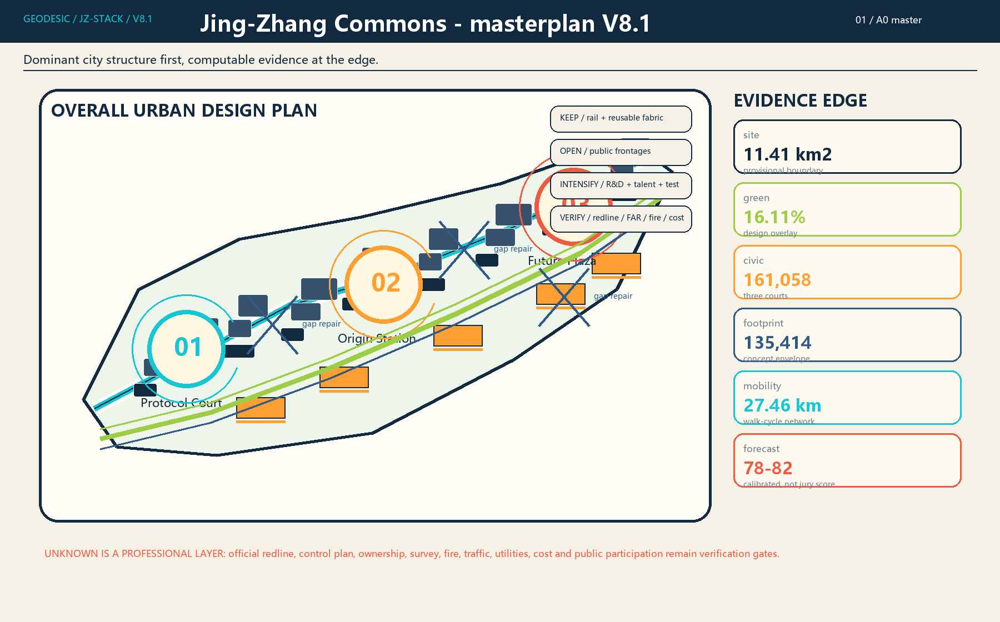
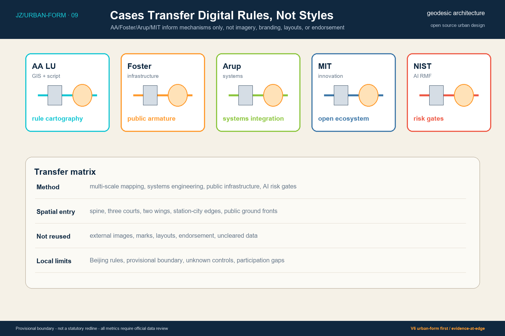
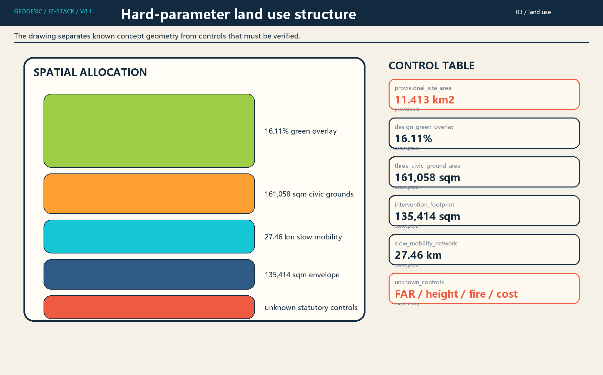
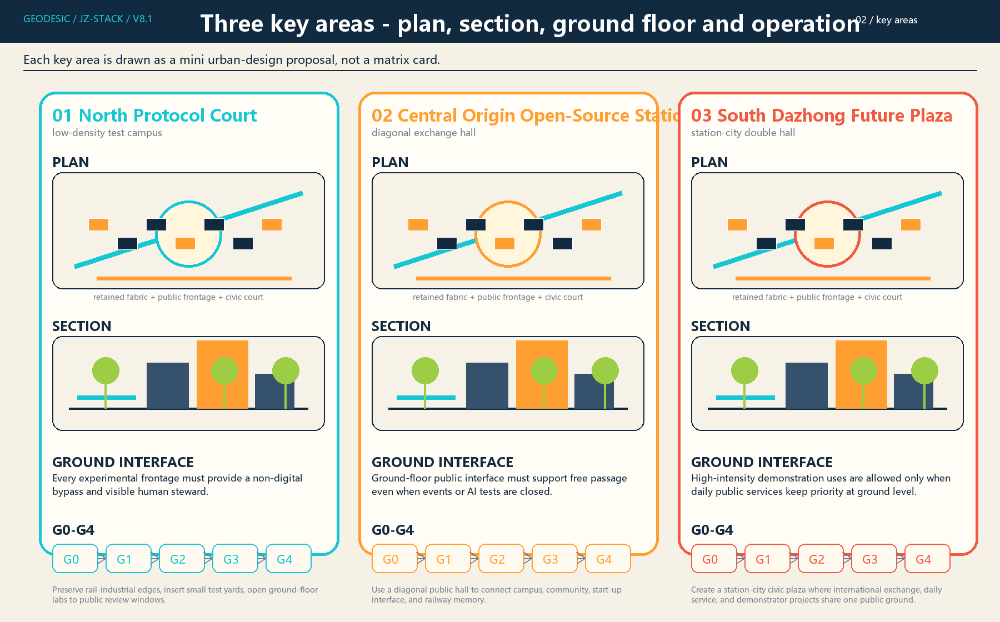
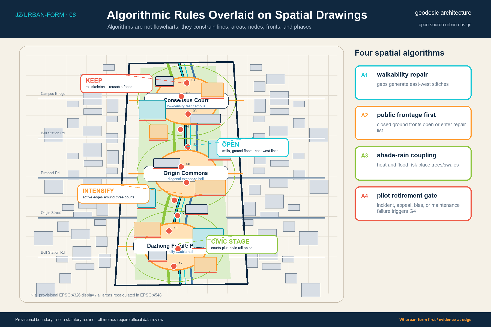
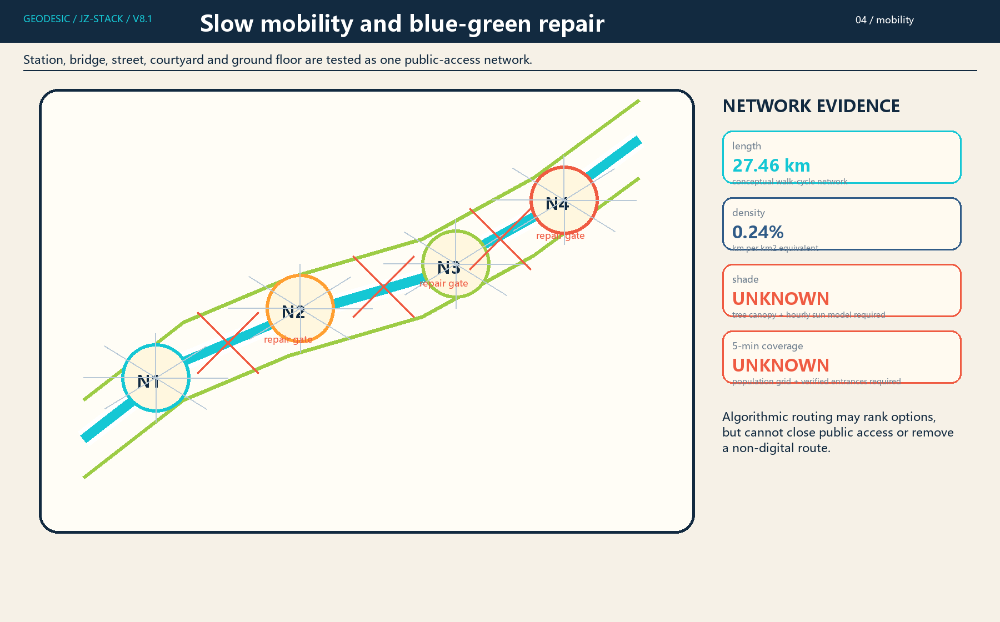
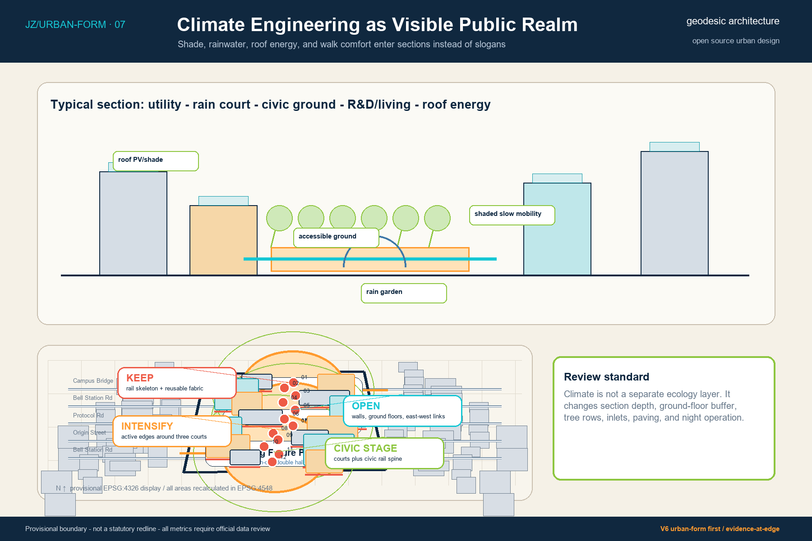
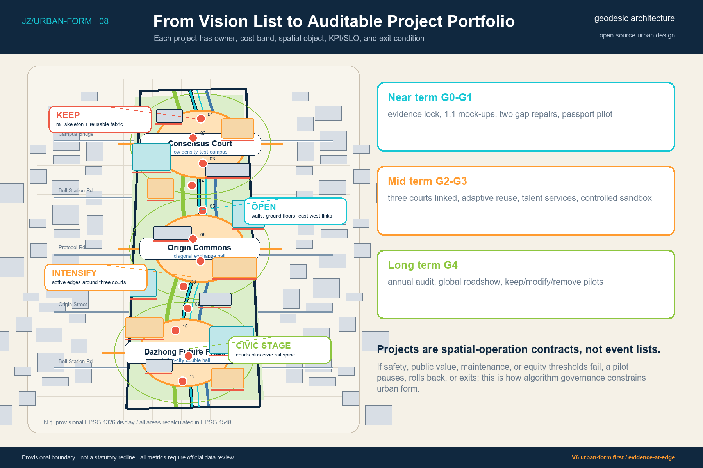
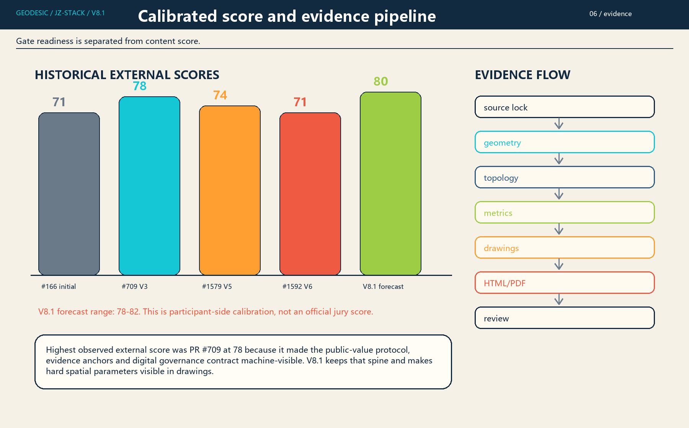
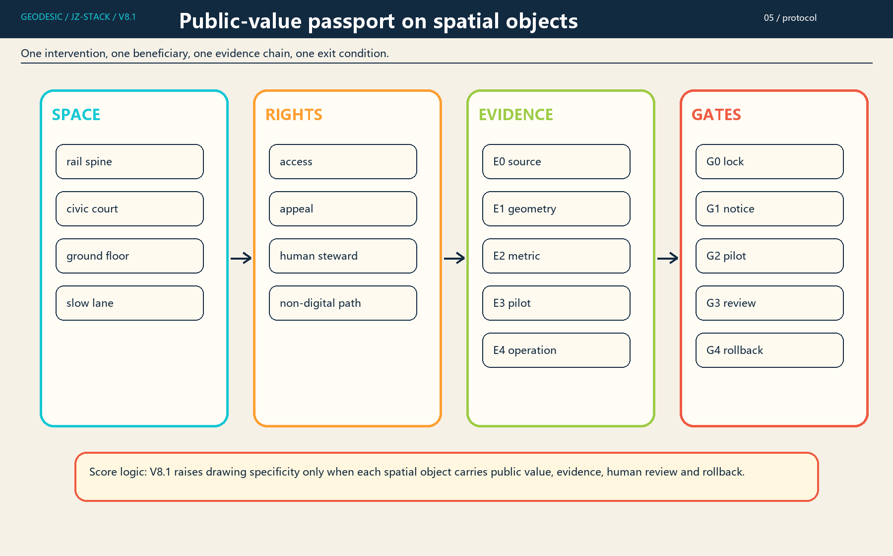

# Jing-Zhang Intelligence Commons: Public-Value Protocol and Hard-Parameter Urban Design V8.1

> V8.1 restores the public-value protocol of the highest-scoring V3 as the design spine and pushes hard parameters, three-court differentiation, ground-floor interfaces, slow-mobility breaks, public-value passports, and evidence edges directly into A0/A3 drawings. Internal scoring no longer rewards validation or visual confidence by itself; it is aligned to signals the external Review Agent already rewarded: public value, traceable evidence, first-principles comparison, algorithmic governance contracts, and reviewable implementation parameters.

## Executive Summary: Converting Innovation Density into Public Value

The proposal answers one central question: how can the centennial Jing-Zhang railway heritage and a continuous public ground become civic infrastructure that converts Haidian's dense but fragmented AI research, industry, education, community, and international exchange resources into public value. The AI Innovation Belt is treated as a computable civic protocol, not as screens, devices, or image-making. Each line, court, ground-floor interface, and operational pilot must have a data source, human review path, stop threshold, rollback rule, and version record. [source:AGENT-TASKBOOK]

The spatial structure remains one spine, three courts, two wings, and twelve scenarios. The spine is the Centennial Intelligence Track, formed by heritage and slow mobility. The three courts are the northern Protocol Court, the central Origin Open-Source Station, and the southern Dazhong Future Plaza. The two wings connect Zhongguancun technology services with Xiaoyue River scenario enablement. Twelve AI+ scenarios are attached to actual spatial nodes instead of floating as standalone cards. [depth:overall_spatial_structure]

The V8.1 calibration conclusion is that the historical high external score came from a public-value protocol, evidence anchors, and reversible governance rather than from more elaborate boards. V8.1 therefore keeps the V8 content spine and regenerates bilingual masterplan, key-area, hard-parameter land use, slow-mobility, public-value protocol, and metrics-evidence drawings so hard parameters are visible on the boards as well as in the prose. [data:geometry/site_boundary.geojson#SITE-001]

## V8 Score-Calibrated Design Decisions

Four design decisions address the score gap. First, keep the railway skeleton, reusable buildings, and legible site memory. Second, open walls, parking edges, and inactive ground floors into east-west links serving campuses, neighborhoods, parks, and stations. Third, intensify around the three civic courts so R&D, talent services, international exchange, and trusted data testing share a civic ground. Fourth, make the three courts plus the centennial rail spine the main stage instead of letting AI scenarios float in cards. [data:geometry/buildings.geojson#BLDG-001]

Algorithms are no longer shown mainly as process boxes. Walkability gaps generate stitching links, frontage scores decide openings and repairs, heat and flood risk place trees and swales, and incidents, appeals, bias, or maintenance failure trigger G4 retirement. Algorithm experts can audit the rules; urban design jurors can see how those rules alter lines, areas, nodes, ground floors, and phasing. [source:NIST-AI-RMF]

V8 turns internal scoring into a design constraint. Content that does not improve public-value protocol, evidence traceability, first-principles comparison, algorithmic governance contract, hard spatial parameters, or implementation specificity counts as packaging only. The calibration assets are stored in `visual/assets/external_score_calibration_v7.json` and `visual/assets/formal_score_self_audit_v6.json`. [data:visual/assets/external_score_calibration_v7.json]

## Design Basis and Source List

The evidence base has four levels: the official announcement and agent taskbook define the commission scope; the repository site package supplies provisional geometry and data contracts; the professional standards matrix constrains urban design and land-use expression; case studies provide mechanism references only. All spatial metrics are stated as recalculable results under a provisional boundary, not as official redlines, statutory controls, or survey records. [source:OFFICIAL-ANNOUNCEMENT]

V6 uses three methodological references. AA Landscape Urbanism informs multi-scale cartography, GIS, scripting, and policy-spatial coupling. Foster + Partners informs infrastructure-led public realm, climate-conscious walkability, and phased urban learning. Arup informs integrated mobility, water, energy, data, delivery, and social-outcome systems. These references are methods, not endorsements, and no external imagery, text, or proprietary visual language is reused. [source:AA-LU-DIGITAL]

The machine-readable layer remains inside the package. GeoJSON records spatial objects, metrics.json records recalculated indicators, sources.json records source boundaries, and the compliance, standard, and design-depth matrices record professional coverage. Drawings, HTML, and PDF outputs are synchronized from these objects to prevent contradictions between text, figures, and indicators. [data:geometry/site_boundary.geojson#SITE-001]

## Three-Level Scope Framework

The coordinated research scope asks how the Jing-Zhang AI Innovation Belt joins global knowledge networks, regional industrial ecosystems, and future-city questions. The overall design scope asks how an approximately 11.4 square-kilometer provisional area can form a continuous public structure, land-use organization, and operational project portfolio. The key-area scope asks how three priority districts can reach comparable detailed urban-design depth. These are not three zoom levels of one diagram; they are a sequence from strategic network to spatial skeleton to block action. [depth:three_level_scope_framework]

V6 keeps the three levels in one graphic logic. The masterplan establishes the spine, courts, and wings. System drawings separate land use, slow mobility, blue-green space, and infrastructure. Key-area drawings then show plan, section, ground-floor public interface, and G0-G4 operating sequence. The purpose is not to add more diagrams; it is to make each drawing carry a distinct review decision. [data:geometry/key_areas.geojson#PROV-KEY-001]

The workflow is source lock, projection and topology, spatial layers, metric recalculation, drawing synchronization, and self-check. Algorithms make design relations and recalculation paths visible; they do not replace planning judgment. When official boundary, ownership, traffic, fire-safety, utility, heritage, or participation data becomes available, the package must first produce a difference table and then update geometry, metrics, prose, HTML, and PDFs together. [depth:metrics_recalculation]

## First-Principles Questions and Alternative Comparison

Five questions are ranked by decision priority: how AI innovation continuously becomes public value; how railway heritage becomes an operating urban skeleton; how the three key areas become complementary prototypes; how algorithms become contestable, recalculable, and removable public decision tools; and how the vision becomes actions with owners, budget bands, gates, and exits. If the first question fails, the other four cannot create an innovation belt even if the drawings are complete. [depth:overall_spatial_structure]

Three routes are compared at the same conceptual scale. A media corridor relies on screens, devices, and events; it communicates well but converts weakly into space and institutions. A landmark cluster relies on new iconic buildings; it has image power but high cost, approval, and publicness risk. A public-value commons uses continuous public ground, shared ground floors, reversible pilots, and open protocols. V8 selects the third route while borrowing only low-disturbance information layers from A and a few identity nodes from B. [data:visual/assets/first_principles.json]

This comparison explains why V8 does not keep chasing more spectacular graphics. Drawings must serve public value: who may enter, where tests happen, where appeals happen, and when a pilot must stop. Spatial forms that cannot answer these questions remain background imagery rather than high-score claims. [source:NIST-AI-RMF]

## Coordinated Research Area: Industry and Future City Research

The industrial conclusion is not to create another closed technology park. The proposal establishes accessible interfaces for an innovation commons. MIT Kendall Square, Mila, Vector, AI Singapore, Seoul AI Hub, and ETH AI Center show that AI innovation needs a feedback loop among research, education, industry, public space, ethics, talent services, and civic communication, rather than relying on a single building or event brand. [source:CASE-MIT-KENDALL]

For Jing-Zhang, the transferable value is mechanism, not form. Open model co-creation, trusted data sandboxes, red-team testing, international open-source roadshows, talent life services, and public-value archives must be placed in spatial nodes with explicit access, data, review, failure, and retirement rules. V6 therefore places twelve scenarios along public ground and slow-mobility links to form a loop of research, validation, release, feedback, and archiving. [source:NIST-AI-RMF]

The future-city claim is not that devices make a city intelligent. A city becomes intelligent only when it can learn from its pilots without harming rights, accessibility, or trust. Every AI+ public service must retain a non-digital alternative. Every test must first pass offline or controlled validation before public demonstration. This is the minimum condition for an industrial ecosystem to become public value. [depth:municipal_new_infrastructure]

## Overall Design Area: Urban Renewal and Regulatory-Plan-Level Urban Design

The renewal strategy is "keep the skeleton, transform the interface, add nodes." Keeping the skeleton means preserving railway memory, usable structures, and legible urban history. Transforming the interface means converting closed ground floors, walls, and single-use office fronts into public service and innovation exchange edges. Adding nodes means inserting small, reversible prototypes for open-source collaboration, trustworthy validation, international roadshows, and talent services. [depth:retain_renovate_demolish]

Land use is expressed through six conceptual functional fields: park and ecological open space, AI research and trusted validation, university research and technology transfer, talent community services, technology services and civic rooms, and rail or public-access interfaces. These are conceptual design zones, not statutory parcels. Gross floor area, FAR, height, density, setbacks, and demolition quantity remain unknown pending official planning and engineering data. [standard:MNR-LAND-USE-CLASSIFICATION-GUIDE]

The drawing hierarchy is deliberate: a dark boundary shows the provisional review extent, a thick cyan line shows the public spine, warm public ground shows the three courts, pale zones show land-use fields, dark blocks show conceptual envelopes, and dashed lines identify provisional key areas or relationships requiring verification. Metrics sit at the edge as evidence rather than the visual subject. [data:geometry/land_use.geojson#LU-001]

## Detailed Design of Key Areas

The three key areas are differentiated into three prototypes. The northern Protocol Court is a low-density testing courtyard for model evaluation, red-team testing, edge intelligence, and robot slow-mobility pilots. The central Origin Open-Source Station is an oblique exchange concourse connecting universities, communities, parks, and transit through a shared ground floor. The southern Dazhong Future Plaza is a station-city double hall for international roadshows, smart terminal display, and public data-compliance education. [depth:three_key_area_detailed_design]

Each key area contains four drawing requirements: the plan locates public ground, slow loops, building envelopes, and scenario points; the section locates underground utilities, ground-level slow mobility and sponge functions, public ground floors, upper-level research or living programs, and roof energy; the ground-floor interface defines 24-hour passage, bookable tests, non-digital service, and human appeal; the operating sequence defines G0 to G4 gates from evidence lock to reversible retain, modify, or remove decisions. [data:geometry/public_space.geojson#PUBLIC-001]

Key professional gaps remain explicit. Dimensions, tree canopy, pipelines, structures, fire safety, traffic operations, ownership, and heritage records are not yet available at survey depth. The current drawings therefore express design rules and test thresholds, not construction-level sections or confirmed building quantities. This restraint is part of the proposal's professional credibility. [depth:development_intensity_controls]

## Three-Court Differentiation and Urban Sections

The northern Protocol Court is not a generic plaza. It is a low-density testing courtyard. Its section moves from slow loop to shaded buffer, bookable testing threshold, human-review desk, and lightweight experimental unit. Its scoring task is to prove that AI safety, red-team testing, and edge-device trials can run in a public-visible but controlled environment. [data:geometry/key_areas.geojson#PROV-KEY-001]

The central Origin Open-Source Station is not a campus lobby. It is an oblique exchange concourse that routes university, community, park, and transit movement through a shared ground floor. Its section focuses on 24-hour passage, public services, second-level collaboration decks, and upper-level research or learning space without mutual disruption. Its scoring task is to prove that open source is a physical urban interface as well as a digital practice. [data:geometry/key_areas.geojson#PROV-KEY-002]

The southern Dazhong Future Plaza is not an image node. It is a station-city double hall for international roadshows, smart-terminal display, data-compliance education, and transfer services. Its section focuses on station flow, plaza dwell time, temporary events, night control, and non-digital service windows. Its scoring task is to make global exchange land on actual public ground. [data:geometry/key_areas.geojson#PROV-KEY-003]

## AI Innovation Ecosystem, Personas, and AI+ Scenarios

The proposal identifies six user groups: researchers, developers and entrepreneurs, students, residents and older people, urban operators, and international visitors. Researchers need interdisciplinary meetings, experiment ethics, and translation paths. Developers need computing access, testing environments, and low-cost collaboration space. Students need courses, mentors, and real problems. Residents need accessibility, privacy, low disturbance, and appeal. Operators need auditable data and human review. International visitors need multilingual navigation and clear public entries. [source:AGENT-TASKBOOK]

Twelve AI+ scenarios are grouped into co-creation, validation, service, industry, ecology, and communication. The three most important validation scenarios are a trusted data sandbox, a model-safety red-team field, and an edge-intelligence and robot slow-mobility loop. They must pass offline data checks, controlled segments, and manual safety review before any public contact. Public-service scenarios must provide equivalent basic service without requiring agent use. [metric:scenario_node_count]

V6 turns scenario cards into spatial operating rules. Each card records purpose, users, prohibited uses, data contract, offline evaluation, launch threshold, human fallback, incident response, and retirement condition. These rules are attached to public ground, slow-mobility nodes, and operating gates instead of occupying the center of the boards. [source:NIST-AI-RMF]

## Public Value Passport: One Intervention, One Reversible Commitment

Every spatial or digital pilot must produce a Public Value Passport before entering delivery gates. The passport is not a promotional card. It is the minimum delivery contract: public problem, geometry, service floor, resource-to-public-value chain, rights to notice, opt-out, appeal and accessibility, evidence level, RACI responsibility, service level, stop condition, rollback action, and retirement asset in one object. [data:visual/assets/civic_value_passport.schema.json]

Evidence uses E0-E5 levels: design claim, source support, recalculable model, field baseline, controlled pilot, and post-occupancy evaluation. The current package stays at E2; it must not present targets as achieved performance. Delivery uses G0-G4 gates: evidence lock, 1:1 reversible segment, controlled pilot, public trial, and retain/modify/remove decision. Failure on safety, rights, access, maintenance, or public value triggers pause, rollback, or exit. [data:visual/assets/evidence_and_readiness.json]

The passport converts V6 drawings into executable rules. The Protocol Court verifies model evaluation and robot slow mobility; the Origin Open-Source Station verifies collaboration and community passage; Dazhong Future Plaza verifies international demonstration and station-city service. All three must keep non-digital alternatives so AI service never becomes the condition for public access. [depth:three_key_area_detailed_design]

## Digital Urban Design Protocol: From Drawing to Computable Decision

The digital protocol defines five object types: boundaries, lines, areas, points, and gates. Boundaries record provisional scope and confidence. Lines record slow-mobility stitches, rail interfaces, and east-west links. Areas record the three courts, green layers, and reversible pilot grounds. Points record AI+ scenarios, service entries, and human-review desks. Gates record G0-G4 entry, pause, rollback, and retirement conditions. [data:visual/assets/computation_protocol.json]

Algorithms may expose relations, generate candidates, and trigger review. They may not automatically decide demolition, access, enforcement, credit, rent, or public-resource allocation. Any result affecting rights, movement, privacy, safety, or public-service access must retain human review, appeal, and non-digital fallback. This downgrades AI from spectacle to civic infrastructure rule. [source:NIST-AI-RMF]

The protocol output is a versioned evidence pipeline: source lock, geometry projection, topology repair, metric recalculation, drawing synchronization, HTML/PDF publication, review-comment readback, and next revision. Any external score decline must enter the calibration table and adjust internal weights rather than being overridden by self-confidence. [data:visual/assets/external_score_calibration_v7.json]

## Land Use, Building Scale, and Retain-Renovate-Demolish Strategy

The building envelopes are conceptual intervention objects and do not claim to represent a complete existing-building survey. building_footprint_area_sqm and design_building_footprint_ratio are calculated from the package's conceptual building footprints and measure ground occupation by the proposal. They are not property floor area, demolition quantity, or planning-permit intensity. [metric:building_footprint_area_sqm]

The retain/renovate/demolish logic uses three strategy labels: retain candidates, adaptive reuse, and reversible new build. Retain candidates protect structure and memory. Adaptive reuse prioritizes ground-floor opening, energy retrofit, and program update. Reversible new build prioritizes lightness, maintainability, removability, and pilot value. Formal decisions require building age, structure, fire-safety, ownership, tenant, heritage, and operating-cost surveys. [data:geometry/buildings.geojson#BLDG-001]

The visual language belongs to geodesic. Railway warm red marks history and permanent elements, technology cyan marks new and testable interventions, paper white carries public information, deep ink carries boundaries and text, and ecological green is reserved for blue-green systems. The system translates "historic skeleton + digital protocol + public value" into a legible design language without copying Foster, AA, or peer proposals. [standard:MOHURD-ARCH-DESIGN-DEPTH-2016]

## Hard Planning Parameter Table: Turning Drawing Claims into Reviewable Objects

V8 lists the hard parameters needed by the next scoring loop. They are still conceptual-design parameters, not statutory controls or construction drawings, but each item has a required evidence gap, responsible discipline, and recalculation trigger. [depth:development_intensity_controls]

| Parameter object | Current status | V8 control stance | Required next evidence |
|---|---|---|---|
| Site area | known: 11.413 km² provisional boundary | use only as concept-design review extent and recalculation base | official redline, ownership, regulatory planning unit |
| Three civic grounds | known: 161,057.8 m² conceptual public ground | prioritize public-value passports, human review, and non-digital service | CAD, terrain, utilities, fire safety, pedestrian simulation |
| Green overlay | known: 1,839,145.1 m² design layer | prioritize shade, sponge function, and slow-mobility comfort | tree survey, soil, sponge-city study, thermal simulation |
| Building envelopes | known: 135,414.0 m² conceptual footprint | classify as retain candidate, adaptive reuse, or reversible new build | age, structure, fire safety, ownership, tenants, heritage |
| Slow-mobility network | known: conceptual network length | stitch stations, campuses, neighborhoods, and the three courts | road lines, traffic impact, accessibility, parking, slow-mobility study |
| Intensity controls | unknown: GFA, FAR, height, density, setbacks | do not fabricate; state concentration and low-disturbance principles only | statutory controls, sunlight, fire safety, utilities |
| Operating metrics | post-occupancy | use G0-G4 gates, SLO, RACI, and exit assets | operator, budget, procurement, maintenance, public participation |

This table responds directly to the external score: V6 proved that urban-form-looking drawings are not enough. V8 exposes the parameter gaps behind the drawings so reviewers can see what is recalculable now, what depends on official data, and what becomes the next implementation task. [metric:site_area_sqm] [metric:public_space_area_sqm] [metric:green_ratio]

## Transport, Rail, Municipal Infrastructure, and Public Services

The mobility strategy is "rail to the courts, walk to the doors, cycle as a loop." The Centennial Intelligence Track slow-mobility spine provides north-south continuity. East-west stitch corridors connect universities, parks, communities, and stations. The three courts act as turning, resting, wayfinding, and event-assembly nodes. road_centerline_length_m is a conceptual slow-mobility metric, not a current road inventory or transport-specialist design. [metric:road_centerline_length_m]

The municipal strategy is "traditional infrastructure first, smart services second." Power, communication, drainage, fire safety, emergency response, and accessibility must be adequate before edge computing, sensing, robot charging, or digital wayfinding is added. Every intelligent device needs offline degradation, manual takeover, maintenance responsibility, and safety signage. The city must not delegate operation to an unexplainable automatic flow. [depth:traffic_rail_slow_parking]

Public services form a 15-minute innovation life network: shared meeting rooms, intellectual property, legal service, investment connection, talent living, childcare, health, and cultural service. This is not a closed campus benefit; it provides graded access for residents, students, firms, and visitors and connects directly to the public ground of the three courts. [standard:MOHURD-URBAN-DESIGN-MEASURES]

## Blue-Green Network, Public Space, and Urban Character

The blue-green strategy overlays rainwater, shade, slow mobility, railway narrative, and public learning. Green cover and green_ratio come from design layers, not current statutory green-space ratios. Public ground and public_space_ratio come from the three conceptual courts, not from a whole-area public-space inventory. V6 keeps these values at the drawing edge so they support, rather than dominate, spatial judgment. [metric:green_ratio]

Urban character is not controlled by a single object style. It is controlled by a reading system: from afar, one continuous public spine and three civic rooms; up close, paving, trees, railings, signage, rain inlets, benches, low-speed devices, and public archives form the everyday interface. Nightscape intensity and time windows are limited to avoid continuous disturbance to residents and habitats. [data:geometry/green_space.geojson#GREEN-001]

Climate engineering remains a target and test path, not an exaggerated performance claim. Tree canopy, runoff, carbon, energy, and thermal comfort must be recalculated in the formal phase using terrain, utilities, weather, materials, and operation data. The current drawings state priority and verification logic only. [depth:blue_green_public_space]

## Renewal Projects, Implementation Policy, and Phasing

The renewal portfolio contains eight projects: JZ-01 Centennial Intelligence Track slow-mobility stitch, JZ-02 Protocol Court, JZ-03 Origin Open-Source Station, JZ-04 Dazhong Future Plaza, JZ-05 Trusted Data and Safety Testing Platform, JZ-06 Talent Life Service Network, JZ-07 Blue-Green Co-Protection Platform, and JZ-08 Global Contribution Archive. The portfolio turns public value into a deliverable project set rather than a list of slogans. [depth:renewal_project_list]

Phasing has three periods. The near term tests lightweight interfaces, the data sandbox, two slow-mobility breakpoints, and the first public-value passport. The mid term connects the three courts, adaptive reuse, east-west stitches, and talent services. The long term operates a global community, international events, and annual audit. Every phase must pass data readiness, professional review, small-scale trial, public feedback, and stage evaluation. [data:geometry/phasing.geojson#PHASE-001]

Implementation policy emphasizes reversibility. G0 locks evidence, G1 builds a 1:1 segment, G2 runs a controlled pilot, G3 opens public trial, and G4 decides retain, modify, or remove. Failure on safety, rights, accessibility, maintenance, fairness, or public value stops the project and triggers rollback. [metric:phase_count]

The delivery matrix breaks the eight projects into lead-owner type, partners, prerequisites, CAPEX/OPEX bands, KPI/SLO, and stop conditions. JZ-01 and JZ-06 are public-space and mobility works requiring road-line, access, right-of-way, flow, and accessibility audits. JZ-02, JZ-03, and JZ-05 are reversible prototype or platform projects requiring ownership, structure, fire-safety, data-classification contracts, and risk registers. JZ-04 is a long-term station-city project and remains blocked until transport, capacity, statutory process, and property coordination are confirmed. [depth:phasing_implementation]

## Metrics, Area Recalculation, and Compliance Matrix

Metrics are divided into known, unknown, and post-occupancy categories. Known metrics are recalculated from package GeoJSON, including provisional site area, green cover, public ground, conceptual building footprint, slow network length, scenario count, and phase count. Unknown metrics include gross floor area, FAR, height, density, setbacks, municipal capacity, and demolition quantity. Post-occupancy metrics can only be measured after operation. [metric:site_area_sqm]

The metrics figure moves from the center to the edge. Urban design must first prove spatial structure and public interface; metrics then explain assumptions and recalculation. If indicators dominate, the work reads as a dashboard rather than a city design. If indicators disappear, the open-source review loses auditability. V6 keeps both by using a primary drawing plus evidence rail. [depth:metrics_recalculation]

The compliance matrix covers official tasks, agent tasks, urban design management, regulatory-plan expression, land-use classification, and architectural design depth. The proposal avoids dense runs of evidence identifiers; complete indexes remain in structured files while prose carries only claim-adjacent anchors. [standard:PROJECT-OFFICIAL-ANNOUNCEMENT]

## Peer Calibration and Originality Boundary

V8 uses peers only to calibrate delivery depth and mechanism, not as sources of images, text, or layout. AA Landscape Urbanism informs how multi-scale cartography, GIS, and scripting convert site processes into design judgment. Foster + Partners informs how infrastructure, public realm, and phasing can structure masterplanning. Arup informs how mobility, water, energy, data, and social outcomes can enter engineering decisions together. [source:AA-LU-DIGITAL]

The more direct internal benchmark is PR #709. It reached the historical high of 78/100 not because it had the most drawings, but because the public-value passport, first-principles questions, digital protocol, and evidence density formed a machine-visible content spine. V8 therefore treats #709 as the baseline and #1592's 71/100 as the counterexample: visual upgrade without enough content spine. [source:PEER-PROOFLINE-429]

The originality boundary is explicit. The name, legend system, Public Value Passport, G0-G4 gates, and internal/external score calibration table are geodesic's original expression inside this open-source package. Case studies transfer mechanisms only and do not copy images, trademarks, prose, layouts, or institutional reputation. [source:CASE-CONSTANTA-FOSTER]

## External-Score Calibration Baseline and Internal Audit

V6 adds a formal-review closure layer that separates participant-controllable quality from organizer-side data gaps. Missing official redline, key-area CAD, ownership, utilities, fire-safety, and participation records are not hidden, but they are not used to downgrade work that is correctly marked provisional. The controllable criteria are spatial clarity, algorithm-to-space coupling, evidence traceability, public benefit, risk discipline, bilingual completeness, and rendering integrity.

Historical external Review Agent scores show that participant completion confidence is not the same as content quality: initial submission 71, V3 civic value protocol 78, V5 spatial-first 74, and V6 urban-form-first 71. The external baseline to beat is therefore PR #709 at 78/100, not the previous 97+ or 88 participant-side claims. The internal audit is recalibrated as an external-score forecast: start from the current 71 floor, restore the 78 historical baseline, and only add score for public-value protocol, evidence anchors, first-principles comparison, algorithmic governance contract, hard spatial parameters, and implementation specificity.

The calibrated forecast is not a jury score, award claim, implementation approval, or government endorsement. CI, self-check, bilingual packaging, and render integrity now count as gate readiness only. To raise the external score, the next revision must restore the V3 public-value passport, digital urban design protocol, and dense evidence spine while preserving V6 drawings and adding measurable building, frontage, mobility, phasing, operation, and exit parameters. The full calibration analysis is stored in `report/narrative.md` and `visual/assets/external_score_calibration_v7.json`.

## Risk, Copyright, and Compliance

The main risks are: missing official boundary and key-area geometry; insufficient planning controls, ownership, buildings, utilities, fire-safety, flood, and heritage records; institutional differences in international case transfer; AI risks around privacy, bias, safety, explainability, and digital exclusion; and uncertain operators, funding, and approvals. V6 controls these through provisional labels, unknown metrics, case downgrading, human review, phase gates, and reversible pilots. [depth:risk_missing_data]

All original text, graphics, code, and design data are released under CC-BY-SA-4.0. OpenStreetMap is used only as background context under ODbL. Case pages are used for mechanism research only; the submission does not copy images, trademarks, layouts, or long passages. The proposal does not claim government approval, statutory control, final ownership, official endorsement, or institutional backing. [source:OSM-CONTEXT]

The Public Value Passport is the minimum delivery contract. Each intervention must state the public problem, geometry, service floor, data contract, evidence level, RACI, SLO, stop condition, rollback action, and retirement asset. Negative results must be archived as well; the city should learn from failed pilots rather than displaying only successes. [data:geometry/constraints.geojson#CONSTRAINTS]

## References

- Open-call taskbook index: `SRC-2026-0518-AGENT-OPEN-CALL-TASKBOOK`, path `brief/site-package/agent_taskbook.json`, used for agent tasks, scenarios, identity, operation, and public-compliance requirements. [source:AGENT-TASKBOOK]
- Official open-call announcement index: `SRC-2026-BJ-GH-QUAL-PREANNOUNCEMENT`, URL `https://ghzrzyw.beijing.gov.cn/zhengwuxinxi/tzgg/hd/202605/t20260509_4643047.html`, used for project name, three-level scope, key areas, design depth, and call requirements. [source:OFFICIAL-ANNOUNCEMENT]
- Provisional boundary index: `SRC-PROVISIONAL-BOUNDARIES-2026`, path `brief/site-package/geometry/provisional_boundaries.geojson`, used only for generation, display, and self-check; it is not an official redline, statutory plan, or precise area basis. [data:geometry/site_boundary.geojson#SITE-001]
- Professional standard indexes: `MOHURD-URBAN-DESIGN-MEASURES` and `MOHURD-CONTROL-DETAILED-PLANNING`, used for urban design management, regulatory-plan expression, and implementation boundaries; see `standard_matrix.json`, with source usability registered under `SOURCE-REGISTRY`. [standard:MOHURD-CONTROL-DETAILED-PLANNING]

Method and case references include AA Landscape Urbanism, Foster + Partners Masdar City and Constanta, Arup masterplanning, NIST AI RMF, MIT Kendall Square, Mila, Vector, AI Singapore, Seoul AI Hub, and ETH AI Center. Their public sources, permitted use, and limits are recorded in `sources.json`. They are used for mechanism translation, not as planning approval, endorsement, or local measured evidence. [source:CASE-CONSTANTA-FOSTER]

Peer benchmarks are used only to calibrate delivery depth, bilingual assets, responsibility handoff, and evidence completeness. The submission does not copy peer naming, graphics, text, or data structures. [source:PEER-PROOFLINE-429]
