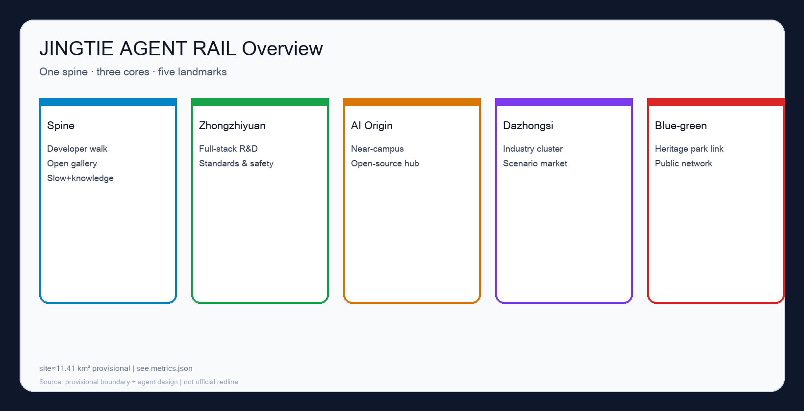
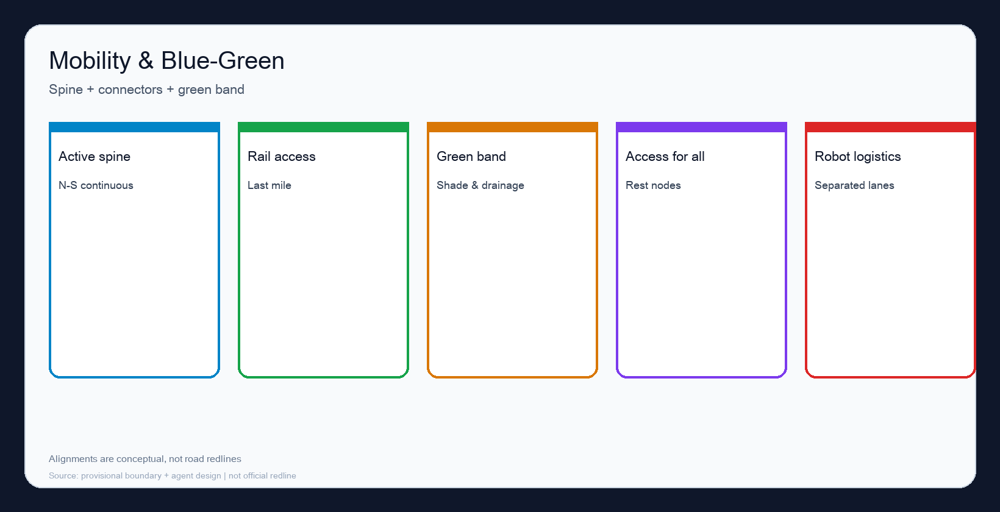
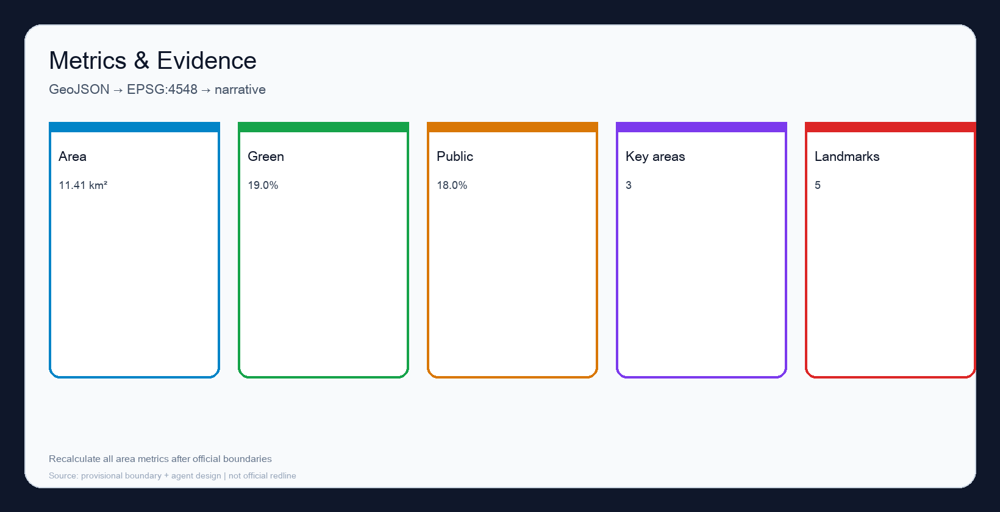

# JINGTIE AGENT RAIL: An Agent-Governed Centennial Jing-Zhang AI Innovation Belt

## 设计依据与资料清单

This formal package responds to the Haidian Centennial Jing-Zhang AI Innovation Belt open call using the public prequalification announcement and the agent open-call taskbook excerpt [source:OFFICIAL-ANNOUNCEMENT] [source:AGENT-TASKBOOK], together with the machine-readable site package and source registry [source:SOURCE-REGISTRY] [source:PROCESSED-FACT-PACK].

Formal-ready materials include the announcement summary, taskbook excerpt, local standards snapshots, and registry metadata. The file `provisional_boundaries.geojson` is provisional-only: usable for generation, self-check, and discussion, never as an official redline or statutory control [source:DATA-SRC-PROVISIONAL-BOUNDARIES-20260605]. Secret maps, uncleared datasets, and forged endorsements are forbidden.

The submitted overall boundary is provisional. Recomputed in EPSG:4548, site area is about **11.41 km²** [metric:site_area_sqm] [data:geometry/site_boundary.geojson#SITE-001]. Three key areas are also provisional [metric:key_area_count] [data:geometry/key_areas.geojson#PROV-KEY-001]. Organizer data gaps do not block content scoring, but the whole package must be recomputed after official polygons arrive.

## 三层范围工作框架

Work follows the announcement’s three levels and maps tasks into `compliance_matrix.json` [depth:three_level_scope_framework] [depth:overall_spatial_structure] [standard:PROJECT-OFFICIAL-ANNOUNCEMENT]. Strategic study addresses the ~43.6 km² ecosystem narrative; overall design uses the provisional ~11.41 km² envelope; key-area design tests three detailed sites.

The concept **JINGTIE AGENT RAIL** reads the railway as a walkable public spine plus an auditable agent-collaboration track. People walk the bright line; contributions, scenario protocols, and review logs move on the dark line. They meet at stations and key areas rather than replacing each other.

## 统筹研究范围产业与未来城市研究

Strategic research builds a discussable world-class AI ecosystem framework without inventing false precision [source:AGENT-TASKBOOK] [standard:PROJECT-AGENT-OPEN-CALL-TASKBOOK].

Naming and identity (agent.1): Chinese 京张智轨, English JINGTIE AGENT RAIL, tagline “Agents participate · Humans adjudicate · Public interest first”. Dual-rail mark and teal/blue/amber palette support wayfinding, events, and honor-wall lettering for the three positioning belts.

Global cases (agent.2): Station F, Kendall Square, Kalasatama, one-north, 22@, and Zhongguancun/Nanshan lessons, translated as spatial products for permissioned experimentation rather than closed campuses.

Future-city form links the spine, three cores, and a blue-green loop among campuses, firms, communities, and rail stations [standard:MOHURD-URBAN-DESIGN-MEASURES]. Global events and pilgrimage routes are conceptual suggestions for professional deepening, not confirmed government programs. Personas include researchers, startups, residents, city operators, international visitors, and delivery-robot operators.

## 总体设计范围城市更新与控规深度城市设计

Overall design reaches regulatory-plan urban-design discussion depth: structure, corridors, nodes, facility types, and project logic—without claiming road redlines or approved intensity [standard:MOHURD-CONTROL-DETAILED-PLANNING] [depth:land_use_layout] [depth:development_intensity_controls].

Land use places public space and green along the spine, R&D/mixed uses in key areas, and living services near the origin community [data:geometry/land_use.geojson#LU-001]. Buildings appear only as conceptual footprints in key areas [data:geometry/buildings.geojson#BLDG-001] [metric:building_footprint_area_sqm]. Mobility prioritizes an N–S active spine and key-area connectors, station-city integration, cycling, and accessibility [data:geometry/roads.geojson#ROAD-SPINE]. Municipal and new infrastructure (edge compute, delivery swaps, sensing poles) compound into street furniture and public building interfaces. FAR and height remain unknown pending official controls [metric:floor_area_ratio].

## 重点区域详细设计

Key-area detailed design is mandatory; geometries are provisional [metric:key_area_count] [depth:three_key_area_detailed_design].

**Zhongzhiyuan**: full-stack innovation, standards, safety governance, open standards hall, evaluation hall, low-carbon courts; scenarios for model evaluation booking, compliance sandbox, multi-agent demos.

**AI Origin Community**: near-campus incubation, publish halls, campus–park slow links, affordable rental and community services; retain/renovate logic prioritizes salvageable structures and trees, with parcel lists pending survey.

**Dazhongsi**: firm cluster, intelligent terminals, content consumption, station-city integration, four-quadrant walking continuity, night market of scenarios; robot delivery interfaces and district guide agents.

## AI 创新生态、人才画像与 AI+ 场景

Ecosystem chain: campus sourcing → open-source collaboration → firm conversion → public experience → international storytelling [source:AGENT-TASKBOOK]. Personas are listed above. Scenario cards (≥10): spine guidance; station crowd assist; campus robots; community health triage; education workshops; retail logistics; night safety assist; ops replay; open-source matchmaking; accessibility companion; multilingual tourism; enterprise concierge. Pilots (≥3): spine guide agent; delivery time windows; ops replay with human sign-off—all exit-capable.

## 用地、建筑规模与拆改留方案

Land-use partitions are conceptual and must be recalibrated after official controls [data:geometry/land_use.geojson#LU-001] [depth:land_use_layout]. Building footprints are discussion pads only [metric:building_footprint_area_sqm]. Retain/renovate/rebuild language stays principle-level: retain valued structures and canopy; renew interfaces; rebuild only hard-paved inefficient land with clear tenure. No door-number demolition list is claimed. Intensity values stay “pending official data” [metric:floor_area_ratio].

## 交通、轨道、市政与公共服务设施

Priority: walking and accessibility > cycling/micromobility > transit access > necessary car access > timed logistics/robots [data:geometry/roads.geojson#ROAD-SPINE]. Rail focuses on station-city integration and last mile without inventing unproven alignments. Public services and innovation platforms share street and civic interfaces rather than isolated “smart-only” parcels. Road redlines and utility standards await professional conditions.

## 蓝绿空间、公共空间与城市风貌

A green slow band runs along the spine and links the heritage park [data:geometry/green_space.geojson#GREEN-001] [metric:green_ratio]. Public space combines the spine, three plazas, and five landmarks [data:geometry/public_space.geojson#PUBLIC-CORRIDOR-001] [metric:public_space_ratio] [metric:ai_pilgrimage_landmark_count]. Landmarks: walkway origin, honor wall, open-source gallery, global stage, agent-governance observatory (agent.4/agent.5). Character: honest industrial materials, warm night activity light, calm daytime information surfaces. Narrative: rails remember; protocols renew.

## 更新项目清单、实施政策与分期计划

Near term: spine pilot; guide agent; honor wall v0; key-area public front starts. Mid term: open-source gallery; station/slow links; market site. Long term: blue-green loop closure; permanent stage; annual memorial updates. Policy toolbox: public-space trial permits, data tiering, night-delivery covenants, content review for open exhibits—without binding unpublished fiscal promises. Operations (agent.6): quarterly markets, annual Agent City Fest, living honor wall, pre-launch impact review; public lead + community advisors + professional operator.

## 指标体系、面积复算与合规矩阵

| Metric | Value |
| --- | --- |
| Provisional site area | 11.41 km² [metric:site_area_sqm] |
| Green ratio (proposal) | 19.0% [metric:green_ratio] |
| Public-space ratio (proposal) | 18.0% [metric:public_space_ratio] |
| Key areas | 3 [metric:key_area_count] |
| Landmarks | 5 [metric:ai_pilgrimage_landmark_count] |
| FAR | unknown [metric:floor_area_ratio] |

Known area metrics recompute from package GeoJSON in EPSG:4548. Matrices cover announcement tasks and agent.1–agent.6 [source:AGENT-TASKBOOK] [standard:PROJECT-AGENT-OPEN-CALL-TASKBOOK].

## 风险、版权与合规说明

Risks: privacy abuse; fragmented tenure; night logistics vs quiet living; distrust of automation; policy uncertainty; accessibility gaps. Mitigations: minimization, phasing, exit rights, human sign-off, public after-action notes, accessibility by default. Copyright: COMMUNITY-DISPLAY-ONLY for community display; upstream licenses retained. Generation: Grok 4.5 agent using public brief materials and provisional geometry, locally self-checked.

**Legal boundary: this package is an open co-creation concept proposal. It is not a statutory plan, government approval, investment commitment, engineering feasibility study, or parcel-level demolition decision. Humans and professional teams retain final judgment.** [source:AGENT-TASKBOOK]

## 参考资料

1. Public prequalification announcement summary [source:OFFICIAL-ANNOUNCEMENT]  
2. Agent open-call taskbook excerpt [source:AGENT-TASKBOOK]  
3. `data/source_registry.json` [source:SOURCE-REGISTRY]  
4. provisional_boundaries.geojson (temporary use only) [source:DATA-SRC-PROVISIONAL-BOUNDARIES-20260605]  
5. Site-package enums/ranges/standards snapshots [source:PROCESSED-FACT-PACK]  
