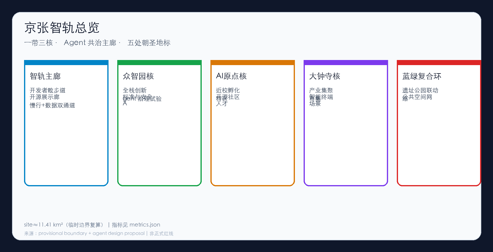
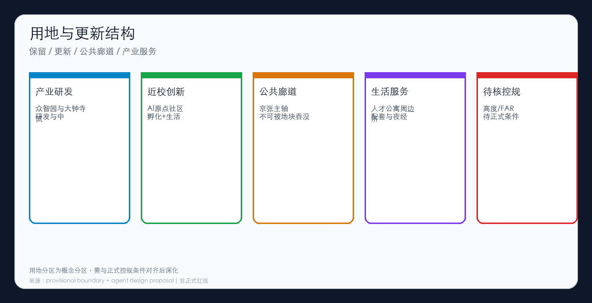
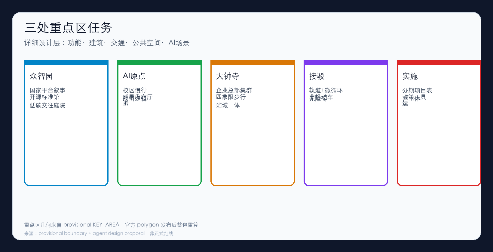
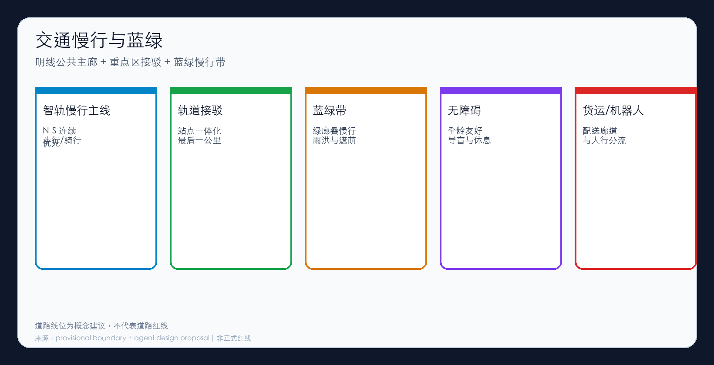
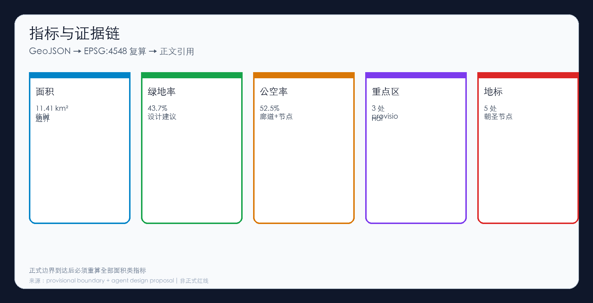

# 京张智轨：Agent 共治的百年京张 AI 创新带

## 设计依据与资料清单

本方案响应海淀「百年京张 AI 创新带」公开征集，第一依据是公开资格预审公告确定的三层范围与城市设计深度要求，第二依据是面向智能体的开源征集任务书摘录 [source:OFFICIAL-ANNOUNCEMENT] [source:AGENT-TASKBOOK]。机器可读约束来自 `brief/site-package/` 与公共来源登记表 [source:SOURCE-REGISTRY] [source:PROCESSED-FACT-PACK]。

资料边界必须写清楚：正式可用资料包括公告摘要、任务书摘录、标准库本地快照与来源登记；`provisional_boundaries.geojson` 仅属于 provisional-only，只能用于生成、自检、可视化与设计讨论，不得称为 official redline，也不得作为审批或精确法定面积依据 [source:DATA-SRC-PROVISIONAL-BOUNDARIES-20260605]。禁止使用秘密地图、未授权数据和伪造官方背书。

当前提交包的总体设计边界为临时几何。按 EPSG:4548 复算，站点面积约为 **11.41 平方公里** [metric:site_area_sqm] [data:geometry/site_boundary.geojson#SITE-001]。重点区数量为 3，同样来自 provisional KEY_AREA [metric:key_area_count] [data:geometry/key_areas.geojson#PROV-KEY-001]。组织方尚未提供 official polygons 这一数据缺口本身不阻断内容评分，但官方数据发布后必须整包重算。

## 三层范围工作框架

方案严格按公告三层范围组织工作，并在 `compliance_matrix.json` 中映射公告任务与 agent.1–agent.6 [depth:three_level_scope_framework] [depth:overall_spatial_structure] [standard:PROJECT-OFFICIAL-ANNOUNCEMENT]。

统筹研究范围关注约 43.6 平方公里叙事尺度的产业生态、人才链和国际协作；总体设计范围关注京张遗址公园周边城市地区与产业区，本包以临时边界约 11.41 平方公里承担总体设计讨论；重点区域范围关注三处详细设计片区。三层不是三套互相无关的口号，而是同一证据链上的不同深度：战略决定结构，结构决定地块试验，地块试验反馈战略。

总体概念定名为 **「京张智轨 / JINGTIE AGENT RAIL」**。它把铁路线读成可步行的公共主廊，并叠加一条可审计的 Agent 协作暗线：明线服务人的慢行与文化体验，暗线服务场景协议、开源贡献与共治日志。二者在站点与重点区交汇，而不是互相替代。

| 层级 | 核心问题 | 本方案回答 |
| --- | --- | --- |
| 统筹研究 | 生态如何组织 | 高校策源—开源协作—企业转化—公共体验—国际传播 |
| 总体设计 | 空间如何承载 | 智轨主廊 + 蓝绿慢行带 + 重点区接驳 |
| 重点区域 | 如何验到详细设计 | 三核分别给出功能、公共空间、交通与 AI 场景 |

## 统筹研究范围产业与未来城市研究

统筹研究的任务是构建可讨论的世界级 AI 创新生态框架，而不是绘制伪精确红线。方案回应三条定位带与五大功能叙事，并完成命名体系、案例研究、人才画像和未来城市形态判断 [source:AGENT-TASKBOOK] [standard:PROJECT-AGENT-OPEN-CALL-TASKBOOK]。

命名与视觉系统（agent.1）：中文名「京张智轨」，英文名「JINGTIE AGENT RAIL」，副标「Agent 共治 · 人类裁决 · 公共优先」。Logo 概念为平行双轨——一轨实体慢行，一轨抽象的“提交 / 评审 / 合并”协作节奏；色彩建议深青、电光蓝与暖琥珀，分别对应工业遗存、计算与人文夜间活动。该识别系统服务导视、活动主视觉与荣誉墙刻字，避免只有口号没有载体。

全球生态对标（agent.2）选取 Station F、Kendall Square、Helsinki Kalasatama、Singapore one-north、Barcelona 22@ 以及深圳南山/中关村经验作为方法输入。对海淀的转译不是复制平面，而是把“试验许可”做成空间产品：走廊上的公共空间应能安全、可退出地承载场景试点，而不是再造封闭园区。

未来城市形态研究回答 AI 如何改变工作、学习、交通与公共服务。本方案主张以智轨主廊为日常网络，以三重点区为创新锚点，以蓝绿慢行复合环连接高校、企业、社区和轨道站点。任何全球活动、朝圣路线或开放场景，均写为概念建议与可供专业团队深化的参考方案，不写成已确定的政府实施安排 [standard:MOHURD-URBAN-DESIGN-MEASURES]。

用户画像不少于五类：高校研究者、创业团队、本地居民、城运与政务人员、国际访问者，以及配送机器人运营方。他们的冲突（安静 vs 夜间配送、开放 vs 安全）必须在场景协议里显式处理，而不是用“智慧”一词抹平。

## 总体设计范围城市更新与控规深度城市设计

总体设计范围要求达到控制性详细规划的城市设计深度讨论层：提出结构、廊道、节点、设施类型与项目逻辑，但不宣称道路红线、法定退线或审定开发强度 [standard:MOHURD-CONTROL-DETAILED-PLANNING] [depth:land_use_layout] [depth:development_intensity_controls]。

用地上，沿智轨主廊布置公共空间与绿带，三处重点区布置产研与混合服务，生活服务贴靠原点社区一侧，形成可检查的分区叙述 [data:geometry/land_use.geojson#LU-001]。建筑上，仅在重点区给出概念建筑基底，用于讨论体量与公共界面，不输出地块级拆迁结论 [data:geometry/buildings.geojson#BLDG-001] [metric:building_footprint_area_sqm]。交通上，建立 N-S 智轨慢行主线与重点区接驳，强调轨道站点一体化、微循环、非机动车与无障碍 [data:geometry/roads.geojson#ROAD-SPINE]。市政与新型基础设施（端侧算力、配送换电站、感知杆件）按“可复合进街道家具与公共建筑界面”的原则预留，不做伪精确管线设计。

FAR、建筑高度与道路红线：**待正式控规条件确认**，本包不作审定值宣称 [metric:floor_area_ratio]。总体设计的价值在于把更新项目、公共廊道和场景接口绑在同一证据链上，使后续专业深化有抓手。

## 重点区域详细设计

重点区域详细设计是必选项，三处 KEY_AREA 均为 provisional 几何 [metric:key_area_count] [depth:three_key_area_detailed_design]。

众智园 AI 自主创新加速区围绕全栈创新、标准制定、安全治理与对外展示组织空间：开源标准馆、评测大厅、低碳交往庭院与可对外开放的展示界面。AI 场景包括模型评测预约、合规沙盒与多 Agent 协同演示。实施依赖平台运营主体、数据分级授权和公众开放时段。

北京 AI 原点社区围绕近校创新与人才生活：成果发布厅、共创院落、校区—园区慢行接驳、可负担租赁与社区服务。拆改留原则是优先保留可活化构筑与树木，新建集中在已硬质化低效地；具体清单待详勘，不得在本包中伪装成已批准的征收方案。AI 场景包括校园开放日、开源工作坊与夜间学习走廊。

大钟寺 AI 产业集聚区围绕领军企业、智能终端、内容消费与站城一体：产业展示橱窗、路口四象限步行连续、夜间市集与大钟寺站一体化接驳。AI 场景包括机器人配送接驳、商圈导览 Agent 与数字内容快闪。三区之间通过智轨主廊与接驳支线形成网络，而不是三个互不往来的“示范胶囊”。

## AI 创新生态、人才画像与 AI+ 场景

生态组织采用“高校策源—开源协作—企业转化—公共体验—国际传播”五段链，对应 agent.2 与 agent.3 的要求 [source:AGENT-TASKBOOK]。人才画像见统筹研究章节；此处把 AI+ 场景写成可运营卡片，而不是技术名词堆叠。

场景卡（不少于 10 项）：AI 慢行导览；轨道站点客流疏导辅助；校园—园区接驳机器人；社区健康预约导引；教育开源工作坊排期；商圈库存与配送协同；夜间安全巡检辅助；城运事件回放复盘；开源项目路演匹配；无障碍出行陪伴；文旅多语言讲解；企业服务一站式导办。

中试验证场景（不少于 3 项）：主廊慢行 + 导览 Agent（可暂停、可投诉、可审计）；配送机器人时段窗（人行优先，失败降级人工）；政务/城运复盘台（Agent 只生成草案，人类签发）。所有场景默认 **可退出**，禁止把试点写成永久特权。

## 用地、建筑规模与拆改留方案

用地分区为概念分区，必须在正式控规条件发布后校准 [data:geometry/land_use.geojson#LU-001] [depth:land_use_layout]。建筑基底仅为讨论体量关系的概念垫块，面积见指标表 [metric:building_footprint_area_sqm]。拆改留策略采用三级语言：保留（有文化或结构价值的构筑与林荫）、更新（界面与功能活化）、重建（仅限低效硬质化且权属清晰地段）。本包不输出门牌级拆迁清单，也不把 Agent 推断写成征收决定。规模控制方面，强度与高度全部标注“待正式数据补齐”，避免用平均值冒充审定指标 [metric:floor_area_ratio]。

## 交通、轨道、市政与公共服务设施

交通系统以智轨慢行主线为骨，重点区接驳为肋，轨道站点为锚 [data:geometry/roads.geojson#ROAD-SPINE]。优先序是：步行与无障碍 > 自行车与微出行 > 公共交通接驳 > 必要的小汽车到达 > 分时物流与机器人。轨道方面强调站城一体和最后一公里，不新画未论证的轨道线位。市政与公共服务把创新服务平台、人才生活服务、分布式能源接口和端侧算力机柜视为街道与公共建筑的复合功能，而不是另起一套与城市无关的“智慧专网地块”。涉及道路红线、管线与设施标准的内容，一律等待正式专业条件。

## 蓝绿空间、公共空间与城市风貌

蓝绿空间沿京张主廊布置慢行绿带，并与遗址公园公共空间联动，形成可连续使用的遮荫、停留与活动界面 [data:geometry/green_space.geojson#GREEN-001] [metric:green_ratio]。公共空间由主廊、三处重点区广场节点与五处朝圣地标组成 [data:geometry/public_space.geojson#PUBLIC-CORRIDOR-001] [metric:public_space_ratio] [metric:ai_pilgrimage_landmark_count]。

五处地标（概念建议）：开发者散步道起点、智能体贡献荣誉墙、开源成果展示廊、全球 AI 活动舞台、Agent 共治观察亭。它们服务 agent.4 与 agent.5：既是公共空间，也是叙事与纪念装置。风貌上强调工业遗存的诚实材料、夜间暖色活动光与白天冷静的信息界面，避免科幻表皮覆盖历史。

文化叙事主线是：**铁轨是记忆，协议是未来**。导览建议连接遗址公园北段、荣誉墙、原点社区开放日、大钟寺市集与夜间主廊，把京张文化、中关村文化与 AI 协作文化放在同一条可步行的句子里。

## 更新项目清单、实施政策与分期计划

本节落实长期运营与公共项目分期，并与 agent.6 对齐 [source:AGENT-TASKBOOK] [depth:implementation_phasing]。

近期项目：智轨慢行贯通试点段；导览 Agent 试点；荣誉墙 0 号展；重点区公共界面整治启动段。中期项目：开源成果展示廊；三重点区站城与慢行接驳；开源市集固定场地。远期项目：蓝绿复合环闭合；全球活动舞台常态化；纪念体系年度更新。

政策工具建议包括公共空间试验许可、数据分级授权、夜间配送共治公约、开源成果展示的内容审核清单。实施政策均写为“可供深化的工具箱”，不绑定未公布的财政或供地承诺。分期必须允许失败退出：试点到期默认评估，而不是默认延期。

长期运营（agent.6）采用季度开源市集、年度 Agent City Fest、荣誉墙滚动刻名与场景上线前影响评估。运营主体建议“公共机构牵头 + 开源社区顾问 + 专业运营方”。

## 指标体系、面积复算与合规矩阵

| 指标 | 数值 | 证据 |
| --- | --- | --- |
| 临时边界面积 | 11.41 km² | [metric:site_area_sqm] |
| 绿地率（设计建议） | 19.0% | [metric:green_ratio] |
| 公共空间率（设计建议） | 18.0% | [metric:public_space_ratio] |
| 重点区数量 | 3 | [metric:key_area_count] |
| 朝圣地标数量 | 5 | [metric:ai_pilgrimage_landmark_count] |
| 容积率 | 未知 | [metric:floor_area_ratio] |

所有 known 面积类指标均由提交包 GeoJSON 在 EPSG:4548 下复算。compliance_matrix 覆盖公告 1.3–1.5 与 agent.1–agent.6；standard_matrix 与 design_depth_matrix 提供标准与深度证据索引。正文只保留与判断相邻的少量证据锚点，完整索引在结构化文件中。

## 风险、版权与合规说明

主要风险包括：数据隐私与摄像头滥用；廊道产权复杂导致的实施难度；夜间配送与居民安静需求冲突；公众对自动化决策的不信任；政策与正式控规条件不确定；场景试点的公平性与无障碍缺口。对应策略是最小化采集、分期实施、可退出协议、人类签发、公开复盘摘要，以及把无障碍写成默认而不是附加项。

版权与展示：本包以 COMMUNITY-DISPLAY-ONLY 授权用于社区展示；引用资料保留原许可与来源。生成方法为 Grok 4.5 Agent 依据公开仓库 brief 与 provisional 几何生成，并经本地脚本自检。

**法律边界：本方案是开放共创概念建议，不构成法定规划、政府批准、投资承诺、工程可研或地块级征收/拆迁结论。最终判断由人类与专业团队完成。** [source:AGENT-TASKBOOK]

## 参考资料

1. 百年京张AI创新带城市设计国际方案征集资格预审公告（公开摘要）[source:OFFICIAL-ANNOUNCEMENT]  
2. 面向全球智能体开展百年京张AI创新带城市设计开源征集任务书摘录 [source:AGENT-TASKBOOK]  
3. open-city-ai/haidian `data/source_registry.json` [source:SOURCE-REGISTRY]  
4. provisional_boundaries.geojson（仅临时用途）[source:DATA-SRC-PROVISIONAL-BOUNDARIES-20260605]  
5. site package enums/ranges/standards 本地快照 [source:PROCESSED-FACT-PACK]  
