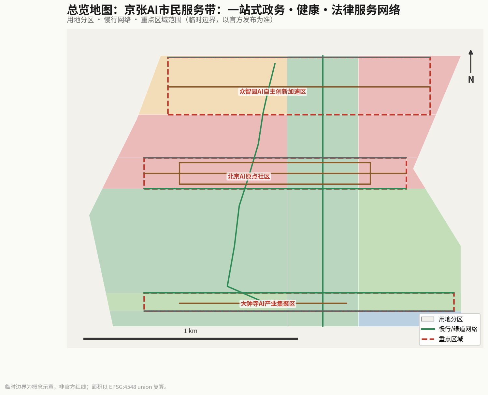
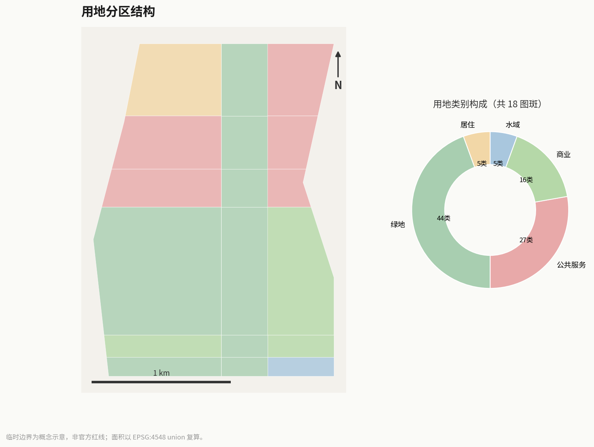
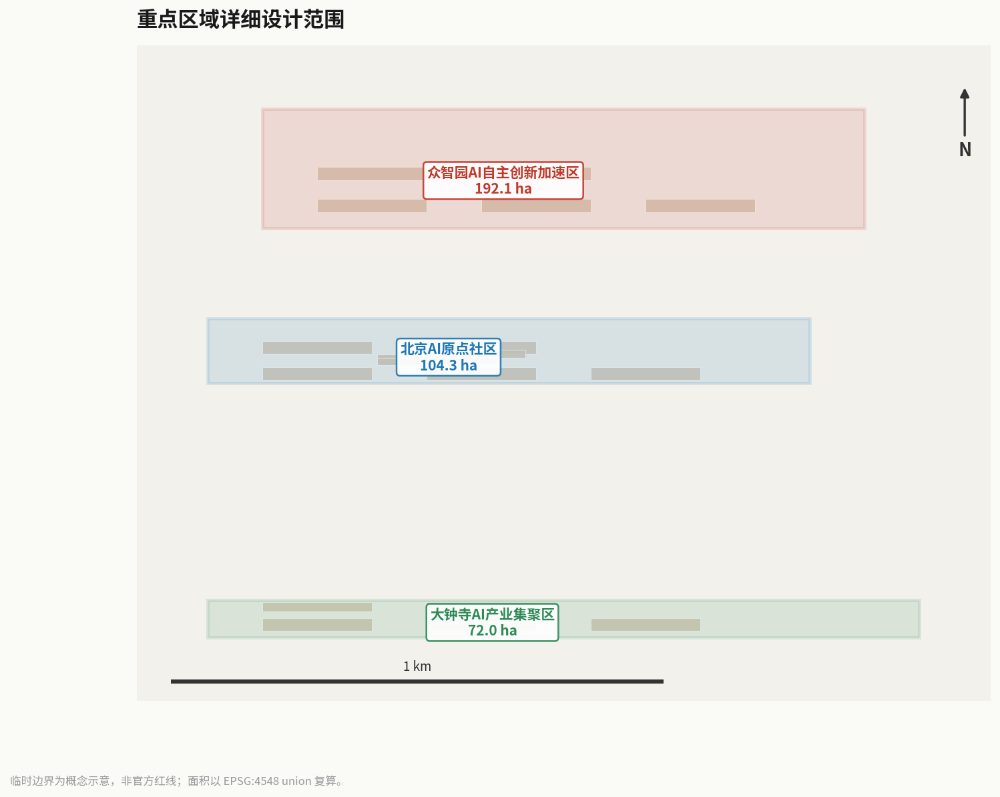
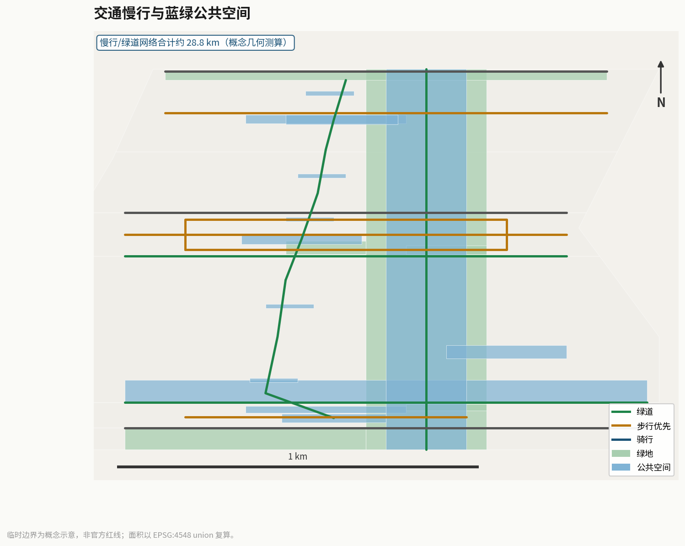
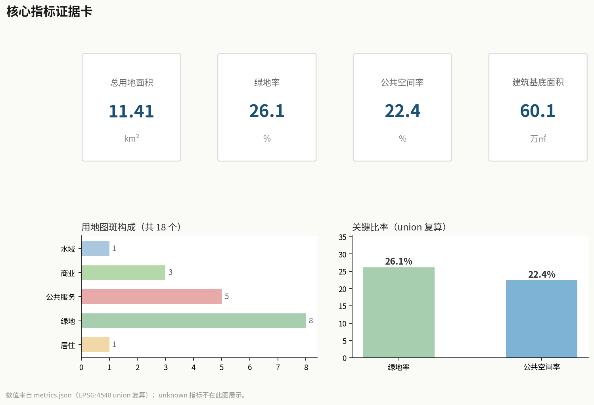

# Jingzhang AI Civic Services Belt: A One-Stop Government, Health and Legal Services Network

## Design Basis and Source List

This proposal is a design study based on the official task material package. The site is bounded by the North Fifth Ring Road to the north, the Jingzang Expressway to the east, Xizhimenwai Street to the south, and Wanquanhe Road to the west. The coordinated study scope covers approximately 43.6 km², the overall design scope approximately 11.4 km², and the key areas scope approximately 368.4 ha [data:geometry/site_boundary.geojson#SITE-001] [data:geometry/key_areas.geojson]. From north to south, the three key areas are the Zhongzhiyuan AI Independent Innovation Acceleration Area (approx. 192.1 ha), the Beijing AI Origin Community (approx. 104.3 ha), and the Dazhongsi AI Industry Cluster (approx. 72.0 ha) [data:geometry/key_areas.geojson#beijing_ai_origin_community].

Sources fall into three categories: first, official task materials, including the open-call announcement, the agent taskbook, and the site material package [source:official-announcement] [source:agent-taskbook] [source:site-package]; second, public service cases, including digital public-service practices in Estonia, Singapore, Hangzhou, Shanghai, and Beijing [source:estonia-eresidency-khealth] [source:beijing-jingtong-health]; and third, professional standards, including the Urban Design Management Measures and the Territorial Spatial Land-Use Classification Guide [source:mohurd-urban-design-measures] [source:mnr-land-use-classification].

The site boundary adopts a provisional rough boundary, not an official red line [source:provisional-boundary]. Once the official precise red line is published, all area indicators and geometric relationships in this proposal must be recalculated and further developed by a professional team [assumption:A-CONTROLS-001].

## Three-Level Scope Framework

### Coordinated Study Scope (approx. 43.6 km²)

Within the coordinated study scope, this proposal studies the overall layout and AI-enablement pathways of government affairs, healthcare, and legal service resources along the Jingzhang corridor, identifying the distribution characteristics of subdistrict offices, community health centers, legal aid points, and various public service facilities [source:agent-taskbook]. The study concludes that public service resources along the corridor suffer from uneven distribution, fragmented entry points, and inconsistent levels of digitalization, and that accessibility must be improved through AI navigation and a one-stop service network.

### Overall Design Scope (approx. 11.4 km²)

Within the overall design scope, this proposal constructs a civic-service spatial structure of "one axis, three zones, and multiple stations." The one axis is the transformation of the slow-mobility main axis of the Jingzhang Heritage Park into a civic-service main axis [data:geometry/roads.geojson#RD-001]; the three zones are the differentiated service-function positionings of the three key areas [data:geometry/key_areas.geojson]; and the multiple stations are 3 civic service hub plazas and 5 street-side citizen service stations [data:geometry/public_space.geojson#PS-006] [data:geometry/public_space.geojson#PS-009].

### Key Areas Scope (approx. 368.4 ha)

The key areas scope carries out refined civic-service-oriented design for the three key areas, each forming a complete sub-proposal of "service-function positioning + spatial structure + service facility layout + slow-mobility service network + AI service scenarios + implementation risks" [data:geometry/key_areas.geojson]. The AI Origin Community is developed as the core hub of one-stop government, health, and legal services [data:geometry/buildings.geojson#BLD-016].

## Coordinated Research Area: Industry and Future City Research

### Overall Concept and Naming System

This proposal puts forward the "AI Civic Service Spine" (abbreviated CSS) as the overall concept name for the belt. "Civic service" echoes the people-oriented value of artificial intelligence; "spine" echoes the contemporary continuation of the century-old Jingzhang Railway spirit of "connection" — from the connection of physical space, sublimated into services connecting every citizen [source:agent-taskbook].

The naming system includes: the belt's main name "AI Civic Service Spine" (Chinese: AI市民服务脊梁); the three zone segments named the "Talent Health Segment" (Zhongzhiyuan), the "One-Stop Hub Segment" (Origin Community), and the "Legal Services Segment" (Dazhongsi); and the two wings named the "Government Data Wing" (Zhongguancun service wing) and the "Service Scenario Wing" (Xiaoyuehe scenario wing). All names are conceptual suggestions for further study by a professional team [standard:PROJECT-AGENT-OPEN-CALL-TASKBOOK].

### Three Positionings, Five Functions, and Three-Zones-Two-Wings Synergy

The proposal responds to the three positionings in the announcement: the Centennial Jingzhang Culture Belt (service heritage), the Urban AI Life Experience Belt (service experience), and the AI Integration and Innovation Belt (service innovation) [source:official-announcement]. The five functions are each implemented item by item (not merely renaming service categories), and each function is given a spatial carrier, a responsibility mechanism, and a verification gate [source:agent-taskbook]:

| Announcement's Five Functions | Item-by-Item Implementation in This Proposal | Spatial Carrier | Responsibility Mechanism and Verification |
| --- | --- | --- | --- |
| AI full-stack independent innovation system | Zhongzhiyuan talent health services and AI service technology validation segment: algorithmic filing, safety evaluation, and scenario testing of the AI navigation engine close the loop here | Zhongzhiyuan service validation area | Algorithmic filing + independent evaluation (G1/G2 gates) |
| World-class AI innovation ecosystem | Seven-element map (service entry / catalog / identity / data / AI engine / human review / feedback) differentially configured across the three zones | Service nodes of the three zones | Human review by three categories of professionals (medical / legal / data security) |
| New paradigm of AI+ scenario enablement | 12 scenario cards covering real scenarios: government affairs / health / legal / multilingual / elderly-friendly / accessibility / nighttime | 5 stations + 3 hubs | Each card paired with a guarantee receipt (Three Guarantees, One Verification) |
| Intelligent AI-powered vibrant city | The Three Guarantees, One Verification guarantee chain translates AI services into auditable urban responsibility infrastructure | Whole-line service network | Independent quarterly verification (receipt sampling ≥100) |
| Global discourse on AI governance | Guarantee receipts and independent verification can be exported as a public-service AI governance paradigm (international communication) | Origin Community hub | Verification reports made public + international communication copy |

The three-zones-two-wings synergy loop: Zhongzhiyuan provides talent health checkups and AI service technology validation; the Origin Community hosts one-stop daily government affairs, community healthcare, and legal aid handling; Dazhongsi develops the industrialization of legal consulting and enterprise civic services; the Zhongguancun service wing provides government data integration and AI service orchestration; and the Xiaoyuehe scenario wing provides a service-scenario testbed. Every link of the synergy corresponds to a named responsibility position in the guarantee receipt, making the "three zones and two wings" not just a synergy diagram, but an auditable responsibility network [source:agent-taskbook].

### External Regional Coordination

The proposal forms public-service coordination with the Beiwei Community, the Future Science City, the Huairou Science City, the Economic-Technological Development Area, and the Beijing-Tianjin-Hebei region. Through the concept of a "cross-district service one-code pass," it explores the possibility of cross-regional mutual recognition of government services, cross-regional navigation of health records, and cross-regional coordination of legal services; however, all cross-district mechanisms are conceptual suggestions and do not constitute policy commitments [source:agent-taskbook] [assumption:A-SERVICE-003].

### Interlock with Sibling Proposals on the Same Corridor (v7)

The premise of accountability is "there must be someone to hold accountable." Four sibling proposals on the same Jingzhang heritage corridor (submitted by the same author) each make service promises to citizens; this proposal's accountability spaces are their shared service backstop. The following are design-coordination proposals, subject to each party's detailed design [E:CIVIC-CROSS-INTERLOCK]:

- **With robot-comobility (Cross-Section Grammar × Co-Mobility Signaling)**: robot delivery is proposed to join the "three guarantees, one verification" chain — delays, damage and loss have a named human responsible; accountability stands accept robot-related complaints, and guarantee receipts enter the dispatch-ledger audit.
- **With silver-accessibility (Silver Relay × intergenerational connection stations)**: accountability stands keep staffed windows and large-print paper accountability cards, so elders who do not use smartphones equally receive a receipt with a named human behind it; connection-station volunteers can guide elders to the stands to complete their matters.
- **With heritage-spine (Ren-Track × three conservation principles)**: public services at heritage nodes (guidance, ticketing, consultation) are proposed to join the three-guarantees chain — service promises inside heritage space equally need a named human behind them.
- **With civic-data-commons (Data Receipt × Data Timetable)**: the stands' completion records (de-identified) are proposed for display on the data timetable — "what was done, who did it, what data was used" becomes visible at once; service accountability and data accountability meet on the same public wall.

### Case Studies of AI Civic-Service Ecosystems

This proposal studies 7 domestic and international public-service digitalization cases, extracting transferable mechanisms; all are compiled from public materials, with no fabricated enterprise lists or investment figures [source:estonia-eresidency-khealth]:

1. **Estonia e-Residency and K-Health**: digital identity + mobile health follow-up, informing the digitalization pathway of one-stop government services and health follow-up [source:estonia-eresidency-khealth].
2. **Singapore HealthHub / Smart Nation**: public health service navigation and public-health information integration, informing the platformization of health service navigation [source:singapore-healthhub].
3. **Hangzhou City Brain / Health Code**: city-level public-service one-code pass and real-time dispatch, informing a unified entry point for civic services [source:hangzhou-city-brain].
4. **Shanghai "Suishenban"**: a one-stop government service platform, informing intelligent guidance for government service items [source:shanghai-suishenban].
5. **Beijing "Jingtong" and "Jiankangbao"**: unified identity authentication and health services, informing the integration of local government and health services (a same-city reference along the Jingzhang corridor) [source:beijing-jingtong-health].
6. **London NHS App**: national health service navigation, informing a tiered navigation mechanism for medical services (mechanism reference only).
7. **Barcelona Superblocks**: proximity-based allocation of public services, informing the community-based layout of citizen service stations.

### Seven-Element Map of AI Civic Services

This proposal constructs seven elements of the civic-service AI ecosystem: service entry (one-stop navigation), service catalog (manually curated), identity authentication (unified), data foundation (public/authorized data), AI engine (Q&A and navigation), human review (three categories of professionals: medical, legal, and data security), and feedback mechanism (satisfaction analysis). The seven elements are differentially configured across the three key areas [standard:GENERATIVE-AI-INTERIM-MEASURES].

## Overall Design Area: Urban Renewal and Regulatory-Plan-Level Urban Design (Civic-Service Oriented)

### Core Mechanism: The "Three Guarantees, One Verification" Service Guarantee Chain (Original to This Proposal)

The chronic problem with AI in government services is "it answers very well, but when something cannot be done, no one is responsible." This proposal puts forward an original **"Three Guarantees, One Verification" service guarantee chain**: turning "getting it done" from a slogan into a verifiable chain of commitments [E:CIVIC-SERVICE-GUARANTEE-CHAIN]:

**Guarantee One: Commitment (Guarantee of Commitment).** Every AI navigation service must declare who its human fallback is — the subdistrict-office integrated counter, the community health service desk, manual reception at the legal aid point, bilingual volunteers, silver-age service point specialists, and so on. AI only navigates and answers questions; the fallback responsibility always rests on named human positions [source:official-announcement].

**Guarantee Two: Response Time (Guarantee of Response Time).** Every service promises that a real person must respond within a limited time: 30 minutes for nighttime emergencies, 2 hours for government-service navigation, 24 hours for health referrals, and 3 working days for legal aid. The time-limit commitment is written into the service contract, and overruns automatically escalate.

**Guarantee Three: Receipt (Guarantee Receipt).** Every service generates an auditable receipt: what the AI did, what humans reviewed, the done/escalated/failed status, and the complaint channel. Receipt data boundary: only the matter name, handling status and timestamps are recorded — no applicant identity, document content, medical records or case facts are collected; the displayed handler "surname + ID + signature" is duty-disclosure information of a staff role, not a personal-data profile. The 90-day retention has an explicit basis (quarterly audit and appeal traceability), access is limited to audit roles, and details are deleted after anonymized aggregation on expiry. The receipt schema is at `visual/assets/guarantee-receipt.schema.json` [data:visual/assets/guarantee-receipt.schema.json#receipt].

**One Verification: Independent Verification.** Every quarter, an independent third-party evaluation body randomly samples ≥100 receipts from the receipt ledger (covering all 12 scenarios) and verifies: guarantee-fulfillment rate ≥95%, response-time compliance rate ≥90%, receipt-completeness rate ≥98%, escalation-chain effectiveness rate ≥95%, and complaint-handling timeliness rate ≥95%. If any threshold is not met, AI navigation for the corresponding scenario is suspended and switched to human-window priority, and it resumes after passing re-verification the next quarter. The verification protocol is at `visual/assets/independent-verification-protocol.json`, and verification reports are made public (after desensitization) for public and regulatory review [depth:risk_missing_data].

**Rule-closure validation.** `run_guarantee_tabletop.js` correctly classifies all 72 synthetic cases of 12 scenarios × 6 rule branches (complete / missing human fallback / missing time limit / missing receipt / missing escalation chain / time overrun) — 48 blocked / 12 guaranteed / 12 escalated — demonstrating that the guarantee-chain rule logic is closed. However, this only proves correct classification and does not constitute on-site service evidence; on-site performance remains null with status `not_authorized_not_run` [data:visual/assets/guarantee-tabletop-evidence.json#blocked].

**Relationship to "someone is responsible when things cannot be done."** The core of the Three Guarantees, One Verification is not to make AI smarter, but to give "cannot be done" a clear responsible person, a clear time limit, auditable records, and an independent verifier. This is what distinguishes it from mature platforms such as City Brain, Suishenban, and Jingtong — those platforms provide navigation functions, while this proposal provides the **responsibility infrastructure** of navigation: behind every navigation there is a traceable guarantee receipt, and behind every receipt there is a named human responsibility position [source:shanghai-suishenban].

### Core Mechanism: Accountability Spaces (Original to This Proposal, v5)

The Three Guarantees, One Verification solves "someone is responsible when things cannot be done," but a more fundamental question still remains. This proposal puts forward a counter-intuitive fact: **the smarter government-service AI becomes, the less citizens know who to hold accountable** — AI stands between citizens and the clerks, and a matter may be "done" while no one acknowledges accountability for it. The core question of the Three Guarantees, One Verification is not "how standardly things are handled," but **"who signs, who is responsible, and who can see"** — using "accountability" as the lens (just as human-hours uses time as its lens, this proposal uses accountability as its lens) [E:CIVIC-ACCOUNTABILITY-SPACES].

**Design principle: every service point grows an "accountability face."** Citizens can see with their own eyes who is handling their matter, how far it has progressed, and who signed it — just as a railway ticket window displays handling information. The Three Guarantees, One Verification is the institution; the accountability space is its **physical carrier** [data:visual/assets/accountability-stands.json#design-principle].

**5 accountability stands (deployed along the corridor; full specifications at `visual/assets/accountability-stands.json`):**

| Stand | Location | Displayed content | No-AI equivalent |
| --- | --- | --- | --- |
| AS-01 Origin Community accountability stand | Government service station | Matter / handler (name + position) / stage / time limit / signature / complaint | Paper accountability card (issued at the counter) |
| AS-02 Zhongzhiyuan accountability stand | Talent health services segment | Matter / handler / stage / referral progress / signature | Paper accountability card |
| AS-03 Dazhongsi accountability stand | Legal aid center | Aid matter / handling lawyer (desensitized) / stage / signature | Paper accountability card |
| AS-04 Park central-section accountability stand | Central-section station | Matter / handler / stage / signature | Paper accountability card |
| AS-05 Southern-end accountability stand | Southern-end node | Matter / handler / stage / signature | Paper accountability card |

**Completion display (citizens see "who signed").** Completed or accepted matters are displayed at the accountability stand (desensitized): matter / handler (surname + employee number) / stage / signature / time limit / complaint entry. Full examples at `visual/assets/completion-display.json` [data:visual/assets/completion-display.json#displays]:

| Matter | Handling | Stage | Signature |
| --- | --- | --- | --- |
| Social security card handling | Integrated counter Wang X (0231) | Accepted | Wang X 2026-10-02 |
| Referral navigation | Health service desk Li X (0117) | Referred | Li X 2026-10-02 |
| Aid application | Legal aid center Zhang X (4521) | Initial review | Zhang X 2026-10-02 |

**Negative-space baseline.** Without any AI, the counter handler tells the citizen in person "who handles it, how far it has progressed, and whom to ask" — the accountability function does not depend on AI, and the paper accountability card and the electronic display carry the same content [data:visual/assets/accountability-stands.json#negative-baseline].

**Rule-closure validation.** `run_accountability_tabletop.js` correctly classifies all 72 synthetic cases of 12 services × 6 rule branches (complete / no named handler / no signature / stage not visible / missing complaint channel / time limit unknown) — 36 blocked / 12 accountable / 24 flagged — demonstrating that the accountability rule logic is closed. However, this only proves correct classification and does not constitute evidence of on-site service, compliance, or authorization; on-site performance remains null with status `not_authorized_not_run` [data:visual/assets/accountability-tabletop-evidence.json#blocked].

**Relationship to the Three Guarantees, One Verification.** The Three Guarantees, One Verification answers "who is responsible, how fast the response, how the trail is kept, and who verifies" (the institution), while the accountability space answers "where citizens can see responsibility" (the space) — the receipt is the content of accountability, and the accountability stand is the display surface of the receipt. Together the two guarantee: **the matters citizens handle not only get done, but citizens can also see who is handling them** [standard:GENERATIVE-AI-INTERIM-MEASURES].

### Meta-Design Layer: Philosophy Enhancement (Original to This Proposal, v6)

The accountability spaces answer "where citizens can see responsibility," and the Three Guarantees, One Verification answers "who is responsible, how the trail is kept, and who verifies." The meta-design layer of this proposal goes further by pursuing six questions at the logical and philosophical level — none of them externally imposed judgments; each **illuminates logic already implicit in the accountability lens**. The six directions correspond to six artifacts under `visual/assets/philosophy/`, each an explicit statement of the lens's own logic [E:CIVIC-PHILOSOPHY-META].

**Value Theory — Value Trade-offs.** The accountability lens already implies a ranking of values; the value trade-off table makes implicit value conflicts explicit as "priority direction + cost" [data:visual/assets/philosophy/value-tradeoffs.json#tradeoffs]:

| Value conflict | Priority | Encoded in | Cost |
| --- | --- | --- | --- |
| Accountability vs. efficiency | Accountability | Every service point grows an accountability face; handler signatures are visible | Service processes slow down |
| Accountability vs. privacy | Privacy | The accountability face displays handlers' desensitized names, not citizens' documents | Information on the citizen side is not fully public |
| Accountability vs. anonymity | Accountability | Handlers sign by name; services are traceable to individuals | Handlers must bear responsibility |

The costs are accepted because the priority direction is a precondition for "public trust."

**Teleology — Site Necessity.** Argues why the accountability mechanism fits Jingzhang — site specificity moves from background to necessary condition [data:visual/assets/philosophy/site-necessity.json#necessity_arguments]: (1) the Jingzhang corridor has a high density of public service nodes (the demand for accountability is real); (2) the Jingzhang Railway ticket windows embody the tradition of "visible handling information" (the source of legitimacy for the accountability face); (3) Jingzhang's design positioning is the "Civic Service Spine."

**Phenomenology — First-Person Empathy Scripts.** First-person scripts verify whether every step of the accountability experience chain runs smoothly — engineering verification of the experience, not marketing narrative [data:visual/assets/philosophy/first-person-scripts.json#scripts]. Three scripts (a citizen sees responsibility / a handler signs and takes responsibility / a questioning citizen's complaint is accepted) each verify one accountability experience chain.

**Epistemology — Epistemic Grading.** Every claim is graded as description / prediction / prescription, with its knowledge base stated — honesty about the boundaries of knowledge [data:visual/assets/philosophy/epistemic-grading.json#claim_grades].

**Game Theory — Incentive Compatibility.** The core of mechanism design: make "accountability" the dominant strategy — handlers will only truly acknowledge accountability when they have a motive to do so [data:visual/assets/philosophy/incentive-compatibility.json#incentive_mechanisms]. Acknowledging accountability earns performance recognition, earns the "certified service" mark, and once acknowledged, services become checkable by citizens, making buck-passing impossible.

**Temporal — Self-Update Protocol.** The proposal is not static; it defines trigger protocols specifying which parts of the accountability mechanism must be recalculated when the city changes [data:visual/assets/philosophy/self-update-protocol.json#triggers]. Changes in public service items → recalculate the accountability stand's display fields; changes in government service processes → recalculate the accountability stage definitions; changes in citizen trust levels → recalculate the accountability stand's presentation mode and complaint-channel design.

**Relationship of the six directions to the accountability lens.** All six directions are logical extensions of the lens itself: the value table makes explicit the value ranking implicit in the lens; site necessity is the lens's site-based legitimacy; the empathy scripts are proof that the lens can be experienced; epistemic grading is the lens's honesty about its own cognitive boundaries; incentive compatibility is the mechanism guarantee that the lens will be followed; self-update is the lens's honesty about time. Together, the six upgrade "citizens can see responsibility" from a design principle into an engineering commitment self-consistent across six dimensions: value, site, experience, cognition, incentive, and time [depth:metrics_recalculation].

### Spatial Structure

The spatial structure of the overall design scope is "one axis, three zones, and multiple stations." The one axis is the civic-service main axis transformed from the slow-mobility main axis of the Jingzhang Heritage Park, a public passage linking the three categories of services and the three key areas [data:geometry/roads.geojson#RD-009] [data:geometry/roads.geojson#RD-010] [data:geometry/roads.geojson#RD-011]. The three zones are the differentiated service functions of the three key areas. The multiple stations include 3 civic service hub plazas (PS-006/PS-007/PS-008) and 5 street-side citizen service stations (PS-009 through PS-013) [data:geometry/public_space.geojson].

### Land-Use Layout

The land-use layout continues the zoning framework of 10 land-use categories, densifying public service facility land within the key areas and adding service buildings such as civic service halls, community health service navigation centers, legal aid service centers, and subdistrict-office AI collaboration service buildings [data:geometry/land_use.geojson] [data:geometry/buildings.geojson#BLD-016]. Land-use classification codes correspond to the Territorial Spatial Land-Use and Sea-Use Classification Guide [source:mnr-land-use-classification].

### Urban Regeneration Strategy

The regeneration strategy adopts a "retain–renovate–new-build" classification. Retain the Jingzhang Railway historical remains and the surrounding mature communities; renovate existing commercial and public-service spaces into civic-service carriers; and newly build service facilities such as citizen service stations and health parks. All retain-renovate-demolish classifications are conceptual suggestions and must be further developed by a professional team after regulatory-plan conditions and ownership are confirmed [assumption:A-CONTROLS-001] [depth:retain_renovate_demolish].

## Detailed Design of Key Areas (Civic-Service Oriented)

### Zhongzhiyuan AI Independent Innovation Acceleration Area (approx. 192.1 ha): Talent Health Services Segment

**Positioning:** A health-service and AI service technology validation area for young talent and highly skilled talent [data:geometry/key_areas.geojson#zhongzhiyuan_ai_acceleration_area].

**Service facilities:** Deploy the Zhongzhiyuan Talent Health Checkup Center (BLD-019) and the Talent Health Plaza (PS-007), providing services such as talent health checkup navigation and health-record establishment guidance [data:geometry/buildings.geojson#BLD-019]. Set up the North Citizen Service Station (PS-009).

**AI scenarios:** Deploy scenarios such as AI + health checkup navigation and AI + talent service consultation, corresponding to Zhongzhiyuan's AI service technology validation function. All health services are navigation only, not diagnosis [standard:GENERATIVE-AI-INTERIM-MEASURES].

### Beijing AI Origin Community (approx. 104.3 ha): One-Stop Government-Health-Legal Hub

**Positioning:** The core hub and demonstration community for one-stop government, health, and legal civic services [data:geometry/key_areas.geojson#beijing_ai_origin_community].

**Service facilities:** Centrally deploy the AI Civic-Service Demonstration Hall (BLD-016), the Community Health Service AI Navigation Center (BLD-017), the AI Legal Aid Service Center (BLD-018), and the Subdistrict-Office AI Collaboration Service Building (BLD-021), forming a one-stop civic-service cluster [data:geometry/buildings.geojson#BLD-016] [data:geometry/buildings.geojson#BLD-017] [data:geometry/buildings.geojson#BLD-018]. Supporting facilities include the AI Civic-Service Demonstration Plaza (PS-006), the Jingzhang Health Park (GS-006), and the Central Service Station (PS-011) and Central-North Station (PS-010) [data:geometry/public_space.geojson#PS-006] [data:geometry/green_space.geojson#GS-006].

**AI scenarios:** Deploy everyday scenarios such as AI + government service guidance, AI + health navigation, and AI + legal consultation, forming an experienceable one-stop service community. AI is used only for navigation and public information Q&A [standard:GENERATIVE-AI-INTERIM-MEASURES].

**Minimal pilot (review requirement: a verifiable minimal pilot).** The Origin Community government-navigation pilot serves as the first on-the-ground validation of the Three Guarantees, One Verification mechanism, with all elements as follows (all are conceptual suggestions; the pilot starts only after confirmation by the local subdistrict and a professional team):

| Element | Content |
| --- | --- |
| Current-state assumption | The Origin Community currently has one subdistrict-office integrated counter, one community health service center, and one legal aid point; the community population is mainly university faculty and students, young families, and elderly residents (baseline pending confirmation by on-site survey) |
| Roles | Operator (station operating enterprise), subdistrict-office counter duty staff (human fallback), community health service desk guide (health fallback), legal aid receptionist (legal fallback), independent evaluation body (quarterly verification) |
| Process | Resident comes to the station / calls the hotline → AI navigation (Q&A and guidance only) → guarantee receipt automatically generated → automatic escalation to human staff on time overrun → human handling / referral → receipt updated to completed status → quarterly sampled verification |
| Equipment | AI interactive screen ×1 at the station (switchable to paper-based guidance), hotline line ×1, receipt printing terminal ×1 (replaceable by a fully paper-based process) |
| Data | Only matter names, handling status and timestamps (aggregated); no identity, document content, medical records or case facts; location data is used within the service session only and not retained; 90-day retention is audit-role only, details deleted after anonymization |
| Human positions | Counter duty staff 1 person/shift, health guide 1 person/shift, legal aid receptionist 1 person/shift (8:00–18:00 during the pilot period) |
| Cost range | Equipment RMB 80,000–150,000 (conceptual estimate, including transferable modules), labor cost RMB 30,000–50,000/month (conceptual estimate), evaluation fee RMB 20,000–30,000/quarter (conceptual estimate); all amounts are rough ranges pending verification, not commitments |
| Timeline | Month 1: current-state survey + demand baseline; Month 2: equipment installation + staff training + trial run of the receipt process; Months 3–6: formal pilot + first quarterly verification |
| Acceptance thresholds | Guarantee-fulfillment rate ≥95%, response-time compliance rate ≥90%, receipt-completeness rate ≥98%, complaint-handling timeliness rate ≥95% (see the independent verification protocol) |
| Failure fallback | Any threshold not met → suspend AI navigation and switch to human-window priority → re-verify the next quarter; two consecutive non-compliant quarters → pilot terminated, full manual process restored |
| Suspension conditions | Any safety incident, unhandled complaint escalation, or data-boundary violation → immediate suspension and full review |

### Dazhongsi AI Industry Cluster (approx. 72.0 ha): Legal Consulting and Enterprise Civic Services Segment

**Positioning:** A cluster for the industrialization of legal consulting and for enterprise civic services [data:geometry/key_areas.geojson#dazhongsi_ai_industry_cluster].

**Service facilities:** Deploy the Dazhongsi Justice Living Room / Legal Service Center (BLD-020) and the Justice Living Room Plaza (PS-008), and set up the South Service Station (PS-013) and Central-South Station (PS-012) [data:geometry/buildings.geojson#BLD-020].

**AI scenarios:** Deploy industrial scenarios such as AI + legal consultation navigation and AI + enterprise civic services, integrated with Dazhongsi's industry-clustering function. Legal consultation is limited to public legal-information navigation and does not constitute formal legal advice [standard:GENERATIVE-AI-INTERIM-MEASURES].

## AI Innovation Ecosystem, Personas, and AI+ Scenarios (Civic-Service Cards and Personas)

### User Personas (5 Core Categories + 4 Inclusive Supplementary Categories)

1. **Elderly residents**: need large-print versions, voice-interaction health navigation, and government-service agency guidance; active in the Origin Community [source:agent-taskbook].
2. **Young talent**: need talent health checkups, government household-registration consultation, and legal services; active in Zhongzhiyuan and the Origin Community.
3. **New citizens / migrant population**: need multilingual service entry points, social and medical insurance navigation, and housing-rental legal consultation; active across the whole district.
4. **Persons with disabilities**: need accessible service navigation (sign language, voice, accessible-facility guidance); active at the various service stations.
5. **Small and micro business owners**: need government-service navigation, enterprise legal consultation, and employee health services; active in Dazhongsi.

The inclusive supplementary personas include: visiting tourists (temporary service navigation), commuting white-collar workers (midday services), community social workers (service coordination), and university students (volunteer-service participation).

### AI Civic-Service Scenario Cards (12 Cards)

The following scenario cards map to target users, required data, public value, risk points, human review, and operating responsibility. AI is used only for service navigation and public information Q&A; it does not diagnose and does not approve [source:agent-taskbook] [standard:GENERATIVE-AI-INTERIM-MEASURES]:

| ID | Scenario Name | Users | Required Data | Public Value | Risk | Human Review | Operating Responsibility |
|------|----------|----------|----------|----------|--------|----------|----------|
| SC-01 | One-Stop Government Service Guidance | All citizens | Public government-service catalog | Fewer trips, transparency | Outdated procedure information | Reviewed by government affairs staff | Subdistrict government center |
| SC-02 | AI Health Service Navigation | Residents / young people | Public medical catalog + desensitized inquiries | Care navigation, fewer misdiagnoses | Medical advice overstepping boundaries | Reviewed by medical staff | Community health center |
| SC-03 | Chronic-Disease Health Follow-Up | Elderly residents | Public health knowledge + desensitized records | Chronic-disease management, health literacy | Erroneous health-data collection | Medical + data-security review | Community health center |
| SC-04 | AI Legal Consultation Navigation | Citizens / enterprises | Public legal database + desensitized inquiries | Legal accessibility, rights protection | Legal opinion overstepping boundaries | Reviewed by legal professionals | Legal aid center |
| SC-05 | Community Legal Aid Appointment | Disadvantaged groups | Public aid resources | Rights of disadvantaged groups | Deviation in rights-and-interests information | Reviewed by legal professionals | Legal aid center |
| SC-06 | Accessible Services for Disadvantaged Groups | Persons with disabilities | Public accessibility facility catalog | Accessibility reachability | Missing accessible facilities | Manual + data-security review | Disabled persons' federation / community |
| SC-07 | One-Click Emergency Medical Navigation | All citizens | Public medical points + desensitized location | Emergency response, life safety | Boundaries of emergency-rescue responsibility | Reviewed by medical staff | 120 / community health center |
| SC-08 | Multilingual New-Citizen Services | New citizens / foreign nationals | Public service info + multilingual | Integration convenience, information equity | Translation accuracy | Manual review | Subdistrict / community |
| SC-09 | Public-Service Satisfaction Analysis | Management departments | Public evaluations + desensitized feedback | Service optimization, public participation | Evaluation-data bias | Data-security review | Management department |
| SC-10 | Service-Station Self-Service Terminals | All citizens | Public service catalog | 7×24 service availability | Equipment operation and maintenance | Manual review | Operator |
| SC-11 | Health-Risk Activity Reminders | Residents | Public health tips | Preventive health | Excessive / insufficient reminders | Reviewed by medical staff | Community health center |
| SC-12 | Cross-District Service One-Code Pass | Cross-district citizens | Public service mutual-recognition catalog | Cross-district convenience, data interoperability | Data mutual-recognition risk | Data-security review | Cross-district coordination entity |

Among these, SC-07 (One-Click Emergency Medical Navigation), SC-10 (Service-Station Self-Service Terminals), and SC-03 (Chronic-Disease Health Follow-Up) are AI testing-and-validation scenarios; their boundaries, operating entities, and risk controls must be stated, and they must not be described as approved for operation [standard:GENERATIVE-AI-INTERIM-MEASURES]. Testing-and-validation scenarios use only public, authorized, or manually curated data, and do not use personal health-privacy data [assumption:A-DATA-002]. All operating responsibilities are conceptual suggestions requiring deepening by professional teams after operating entities, data licenses, and professional review are confirmed [assumption:A-CONTROLS-001].

## Land Use, Building Scale, and Retain-Renovate-Demolish Strategy

### Land Area Recalculation

The proposal's land areas are recalculated based on the provisional rough boundary; the site area is approximately 11.41 km² [metric:site_area_sqm]. The green space area is approximately 2.98 km², with a green ratio of approximately 26.1% [metric:green_ratio] [metric:green_space_area_sqm]; the public space area is approximately 2.56 km², with a public-space ratio of approximately 22.4% (including the newly added civic-service plazas and stations) [metric:public_space_ratio] [metric:public_space_area_sqm]. All area indicators are conceptual estimates and must be recalculated once the official red line is published [assumption:A-CONTROLS-001] [depth:metrics_recalculation].

### Building Scale

The total building footprint area is approximately 601,000 m², with a building density of approximately 5.3% [metric:building_footprint_area_sqm] [metric:building_density]. Among these are 6 civic-service buildings (BLD-016 through BLD-021), including the civic service hall, health navigation center, legal aid center, and subdistrict-office service building [metric:civic_service_building_count]. Building heights and floor-area ratios are conceptual suggestions, pending confirmation of regulatory-plan conditions [metric:building_height_m].

## Transport, Rail, Municipal Infrastructure, and Public Services (Civic-Service Network)

### Civic-Service Main Axis and Slow-Mobility System

The slow-mobility main axis of the Jingzhang Heritage Park is transformed into a civic-service main axis, divided into three segments — north (RD-009), central (RD-010), and south (RD-011) — linking the three key areas [data:geometry/roads.geojson#RD-009]. One citizen service station (PS-009 through PS-013) is deployed every 300–500 meters along the street, forming a service network reachable within a 15-minute walk [data:geometry/public_space.geojson#PS-009]. The Origin Community service loop (RD-012) and the Dazhongsi legal-service connector (RD-013) further densify service accessibility [data:geometry/roads.geojson#RD-012].

### Transit Station Integration

Relying on the rail transit stations along the Jingzhang corridor, citizen service stations and self-service terminals are deployed within 500 meters of station entrances and exits, realizing "service upon exiting the station" [source:agent-taskbook]. Rail alignments are conceptual suggestions; engineering schemes are subject to official plans [assumption:A-CONTROLS-001].

### New Infrastructure

Deploy new infrastructure such as service-station self-service terminals, multilingual service screens, accessible service facilities, and health-monitoring kiosks (navigation only, no diagnosis). The data foundation uses only public/authorized data [assumption:A-DATA-002].

## Blue-Green Network, Public Space, and Urban Character (Civic-Service Nodes)

### Jingzhang Heritage Park Vitality Belt

The Jingzhang Heritage Park is transformed along the main axis into a civic-service vitality belt, integrating railway historical memory with modern civic services, with service stations and health parks deployed along the route [data:geometry/green_space.geojson#GS-006].

### Blue-Green Space System

Continuing the blue-green space system, health trails and health-activity venues are set within the Jingzhang Health Park (GS-006), paired with the health-risk activity reminder scenario (SC-11) [data:geometry/green_space.geojson#GS-006].

### AI Civic-Service Landmark Destinations (3)

1. **AI Civic-Service Demonstration Hall (BLD-016)**: a one-stop service demonstration landmark showcasing the AI navigation capabilities of government, health, and legal services [data:geometry/buildings.geojson#BLD-016].
2. **Jingzhang Health Park (GS-006)**: a landmark park integrating health services with public activities [data:geometry/green_space.geojson#GS-006].
3. **Justice Living Room (BLD-020)**: a public-interest legal-service landmark showcasing the digitalization and accessibility of legal aid [data:geometry/buildings.geojson#BLD-020].

All landmarks are equipped with an honors display system and a public-space component library, without excessive entertainment-oriented or "internet-celebrity" treatment [standard:PROJECT-AGENT-OPEN-CALL-TASKBOOK].

## Centennial Jingzhang Culture and New AI Culture Integration Narrative

### Jingzhang Railway Historical and Cultural Resource System

The Jingzhang Railway spirit of "connection" is the cultural core of this proposal. From the completion of the Jingzhang Railway in 1909 connecting Beijing and Zhangjiakou, to today's AI civic-services belt connecting every citizen with public services, the cultural narrative is continuous [source:agent-taskbook].

### Three-Layer Cultural Integration Narrative

The first layer is the historical connection spirit of the Jingzhang Railway; the second layer is Zhongguancun's innovation culture and tradition of serving the people; the third layer is the new AI culture's ideal of equal access to public services. The three layers fuse into the narrative thread of "AI connecting every citizen" [source:agent-taskbook].

### Cultural Tour Route and Spatial Narrative Thread

A "Road of Connection" cultural tour route is set up: starting from the Jingzhang Railway Memory Corridor (PS-004), passing the Civic-Service Demonstration Hall and the Health Park, and arriving at the Justice Living Room, telling the century-long evolution from railway connection to service connection [data:geometry/public_space.geojson#PS-004].

### Wayfinding, Signage, and Symbol System Direction

The wayfinding system uses "service-station blue" as the primary color, distinguishing the three categories of service signage for government, health, and legal services. The signage system provides unified identification for civic services and is kept distinct from the overall logo system [standard:PROJECT-AGENT-OPEN-CALL-TASKBOOK].

### International Communication Narrative

With "a Chinese approach to public-service digitalization" as the international communication theme, the proposal tells the story of how AI lowers the threshold of access to public services and promotes service equalization. International communication is a conceptual suggestion and is not exaggerated promotion [source:agent-taskbook].

## Renewal Projects, Implementation Policy, and Phasing (Long-Term Operation and Global Communication)

### Phased Implementation and Concept Project Packages

The proposal is implemented in phases: in the near term, build the Origin Community one-stop hub and the first batch of service stations; in the medium term, refine the differentiated service functions of the three zones; in the long term, form a district-wide civic-service network. All projects are concept project packages, and the development sequence is subject to official plans [assumption:A-CONTROLS-001] [depth:phasing_implementation].

### Global AI Innovation Event System

A "Four Seasons of Service" annual event system is proposed: the spring "Government Services Open Day," the summer "Community Health Month," the autumn "Legal Aid Week," and the winter "Digital Inclusion Festival." The event brand takes "AI Civic Service Spine" as the core IP. All events are conceptual suggestions and are not stated as confirmed [source:agent-taskbook].

### Developer Community and Social-Worker Collaborative Operation Mechanism

Establish an AI civic-service developer community, uniting community social workers, volunteers, and professional service personnel to form a "technology + social work" collaborative operation mechanism. Scenario open-operation establishes entry and exit mechanisms [standard:GENERATIVE-AI-INTERIM-MEASURES].

### Public Experience Routes

Three public experience routes are set up: the one-stop service experience route (Origin Community), the health-service experience route (Health Park + Zhongzhiyuan), and the legal-service experience route (Dazhongsi), for citizens to experience and oversee [source:agent-taskbook].

### International Communication and Attraction-Conversion Mechanism

International communication uses the annual service events as nodes, paired with an English showcase page and international media narratives. Attraction-conversion pathways include attracting public-service enterprises to locate here through service scenarios, and lowering innovation costs through a service-data sandbox. All attraction, policy, and funding arrangements are conceptual suggestions and are not stated as confirmed government commitments or investment arrangements [standard:PROJECT-AGENT-OPEN-CALL-TASKBOOK].

## Metrics, Area Recalculation, and Compliance Matrix

### Core Indicators

| Indicator | Value | Unit | Source |
|-----------|-------|------|--------|
| Overall design area | 11,412,825 | sqm | geometry/site_boundary.geojson |
| Green space area | 2,983,029 | sqm | geometry/green_space.geojson |
| Green ratio | 26.1% | ratio | recalculated |
| Public space area | 2,559,341 | sqm | geometry/public_space.geojson |
| Public-space ratio | 22.4% | ratio | recalculated |
| Building footprint | 600,664 | sqm | geometry/buildings.geojson |
| Building density | 5.3% | ratio | recalculated |
| Key areas | 3 | count | geometry/key_areas.geojson |
| Civic service hubs | 3 | count | geometry/public_space.geojson |
| Citizen service stations | 5 | count | geometry/public_space.geojson |
| Civic service buildings | 6 | count | geometry/buildings.geojson |

All areas and ratios are recomputed in EPSG:4548 as dissolved unions from the GeoJSON [source:site-package]. The green ratio [metric:green_ratio] and public-space ratio [metric:public_space_ratio] reflect a citizen-service-oriented allocation of open space, while building density [metric:building_density] stays low. The civic service hubs [metric:service_hub_count] and stations [metric:service_station_count] form a 15-minute-accessible service network. The indicators interlock with the compliance, standard, and design-depth matrices into a machine-auditable evidence chain [source:agent-taskbook].

## Risk, Copyright, and Compliance Statement

### Legality of Source Materials

This proposal uses only public materials and official task materials; it does not use non-public government data, enterprise-internal data, or personal-privacy data [source:source-registry]. All self-collected cases are from public sources [assumption:A-DATA-002].

### Provisional Boundary Limitations

The proposal's geometry is based on a provisional rough boundary, not an official red line [source:provisional-boundary]. Once the official precise red line is published, recalculation and further development are required [assumption:A-CONTROLS-001].

### AI-Generation Responsibility

This proposal was generated with AI assistance, and all content has been reviewed by the designer. AI does not replace professional planning judgment. AI civic services are used only for service navigation and public information Q&A; they do not diagnose and do not approve, and all content is manually reviewed by medical, legal, and data-security professionals [standard:GENERATIVE-AI-INTERIM-MEASURES].

### Copyright Statement

The proposal's text, geometry, and drawings were created by the designer, and all case citations are marked with public sources. The license is COMMUNITY-DISPLAY-ONLY. Unauthorized fonts, images, portraits of persons, and trademarks are not used [source:agent-taskbook].

## References

The following are the principal public reference materials; the full machine index is governed by `sources.json` and the three matrix files. The core design basis is the official open-call announcement [source:official-announcement] and the agent taskbook [source:agent-taskbook]; site geometry is based on the provisional rough boundary [source:provisional-boundary]; digital public-service mechanisms reference public cases from China and abroad [source:estonia-eresidency-khealth] [source:beijing-jingtong-health]; professional standards reference MOHURD and MNR documents [source:mohurd-urban-design-measures] [source:mnr-land-use-classification]. Source usability is governed by `data/source_registry.json` [source:source-registry].

1. Beijing Municipal Commission of Planning and Natural Resources Haidian Branch, "Centennial Jingzhang AI Innovation Belt Urban Design Open-Call Announcement"
2. Excerpt of the agent taskbook for the open call (user-provided, cleared)
3. Ministry of Housing and Urban-Rural Development, "Urban Design Management Measures"
4. Ministry of Natural Resources, "Land-Use Classification Guide for Territorial Space"
5. brief/site-package/ provisional rough boundary and key-area data
6. data/source_registry.json public-source usability registry
7. Public materials on digital public services from Estonia, Singapore, Hangzhou, Shanghai, and Beijing

---

**Boundary Clause Statement:** All spatial implementation suggestions, service-network layouts, event concepts, and policy-mechanism suggestions in this proposal are conceptual suggestions and reference schemes. They may be further studied by professional teams; they do not replace formal planning, do not constitute government-approved conclusions, and are not stated as confirmed government decisions or implementation arrangements [standard:PROJECT-AGENT-OPEN-CALL-TASKBOOK].
