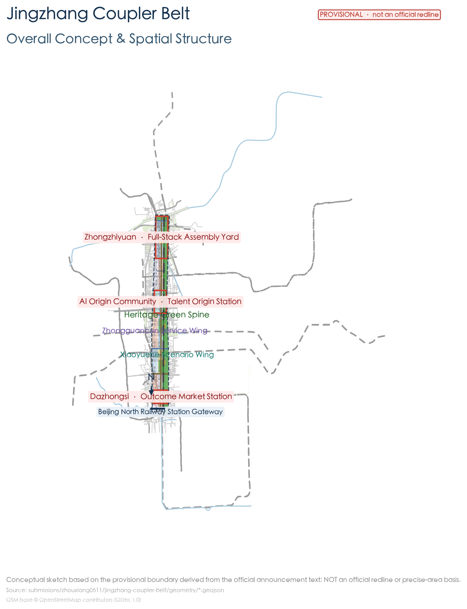
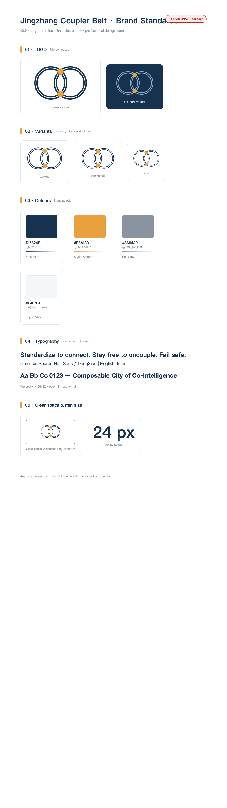
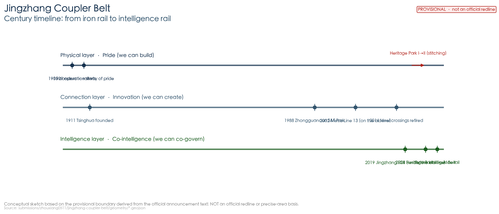
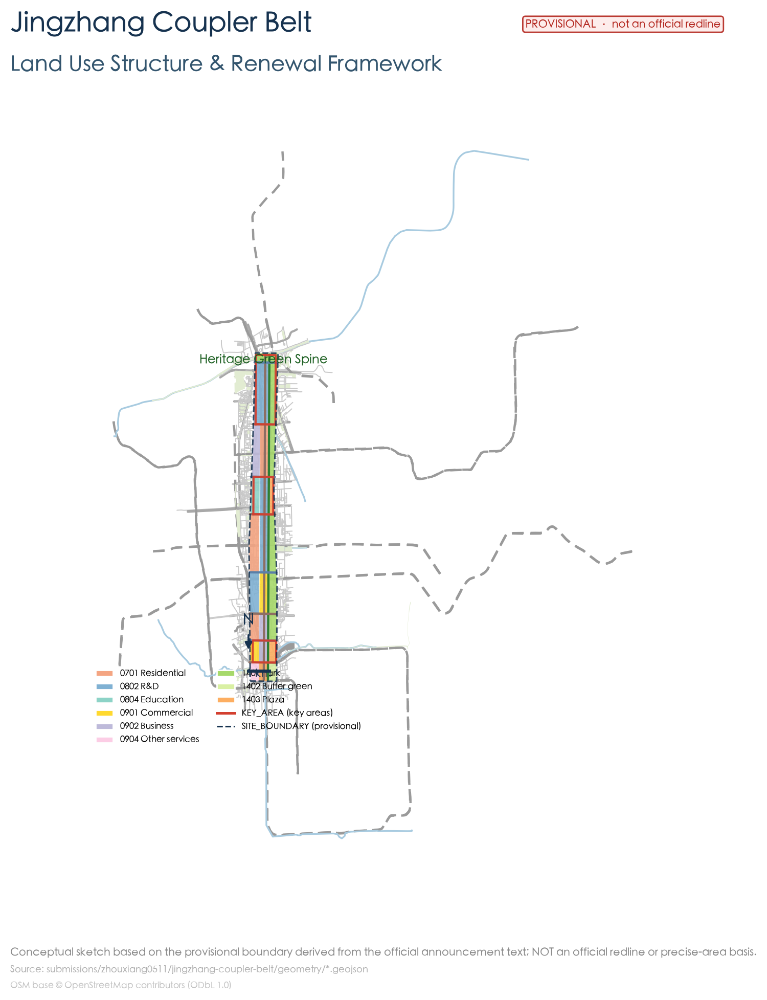
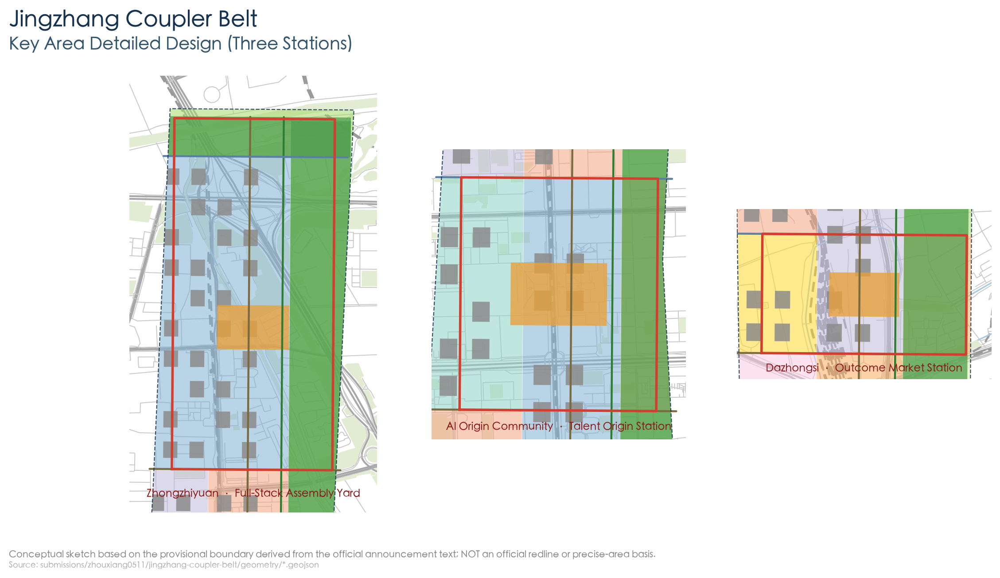
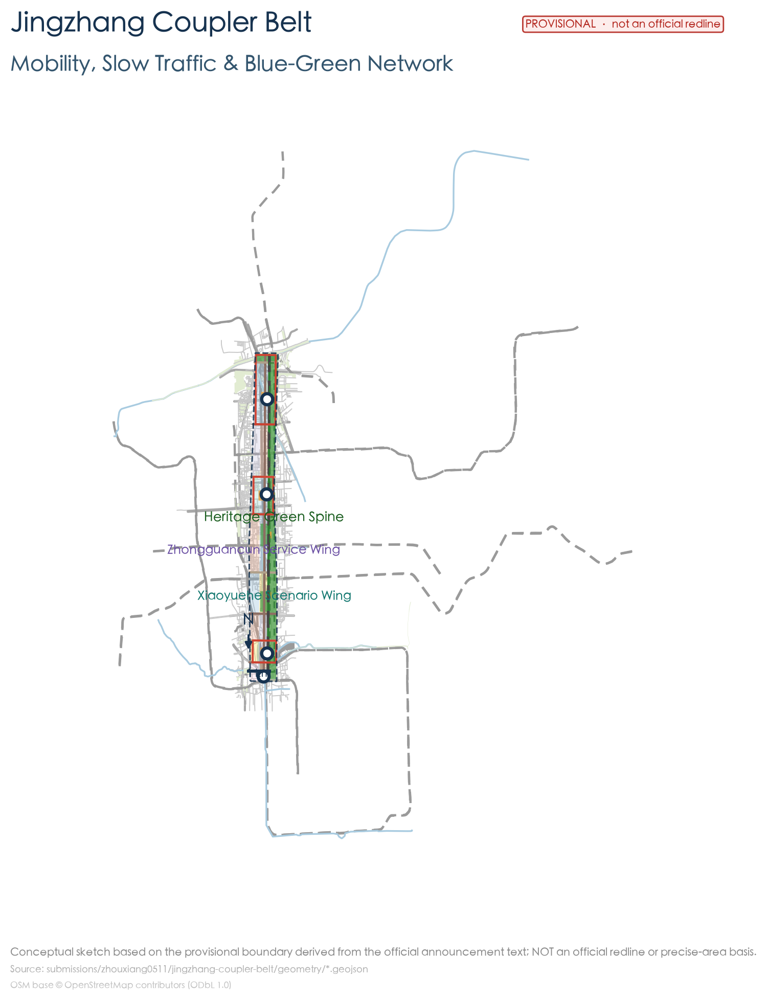
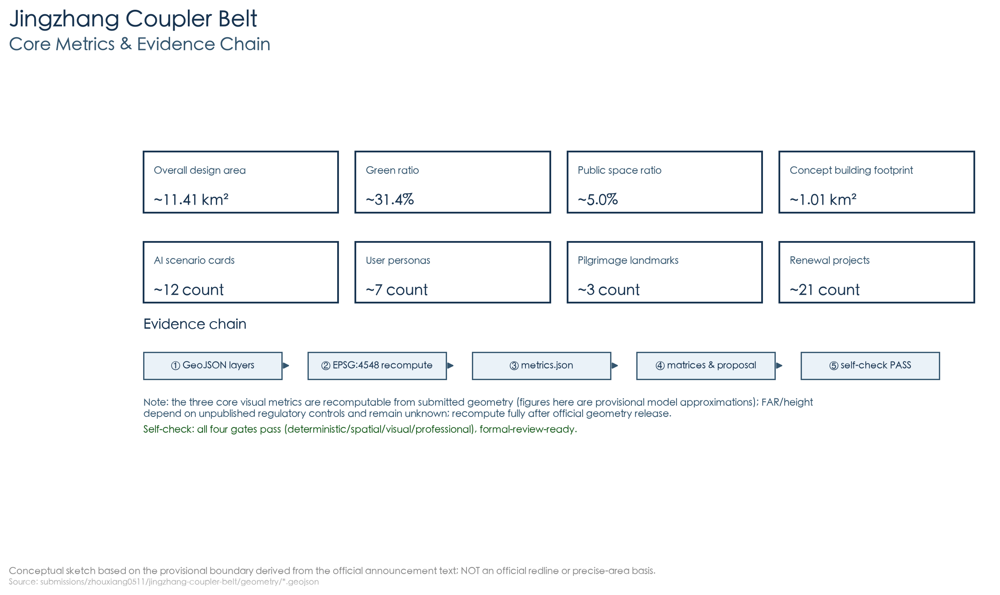

# Jingzhang Coupler Belt: A Composable City

## Design Basis and Source List

This proposal takes as its primary basis the *Prequalification Announcement for the International Open Call for Urban Design of the Centennial Jing-Zhang AI Innovation Belt*, issued by the Haidian Sub-bureau of the Beijing Municipal Commission of Planning and Natural Resources. The announcement establishes the three-level scope (the coordinated research area of approximately 43.6 km², the overall design area of approximately 11.4 km², and the key areas of approximately 368.4 ha), the three key areas, and the design tasks [source:OFFICIAL-ANNOUNCEMENT]. The agent-oriented open-call taskbook supplements the three positioning statements, the five functions, Three Zones and Two Wings, the six tasks, and the unified boundary clause [source:AGENT-TASKBOOK]. Machine-readable constraints come from the repository's `brief/site-package/` and `data/source_registry.json` [source:SITE-PACKAGE] [source:SOURCE-REGISTRY].

At the same time, the proposal cites publicly verifiable planning facts of 2026 (each with a source and date): Phase 2 of the Jingzhang Railway Heritage Park opened on 6 August 2026, forming a **ribbon green corridor about 9 km long from Xizhimen to the North Fifth Ring, with a total land area of about 53 ha**, opening 9 urban branch roads and adding 3 fishbone-shaped slow-mobility paths, directly serving about 70 communities and 450,000 residents along the corridor [source:JZ-PARK-PHASE2-20260806]; the district-level regulatory detailed plan for the "AI Innovation Street Key Area" along the park (9 blocks, about 16.7 km², 2024–2035) was approved in August 2026, establishing a "One Belt, One Axis, Two Cores, Multiple Points" structure with a dedicated chapter on "rail-integrated control and rail micro-centers" [source:JZ-CONTROL-PLAN-20260817]. The "Three Zones and Two Wings" industrial layout (the Xuebeiyuan AI Independent Innovation Acceleration Area in the north, the central AI Origin Community, the southern Dazhongsi AI Industry Cluster, the western Zhongguancun Technology Services Wing, and the eastern Xiaoyuehe Scenario Enablement Wing), Haidian's "1+X+1" industrial system, and the scale of the AI industry are cited as industrial background [source:SRC-2026-BJ-KW-THREE-AREAS-WINGS] [source:SRC-2026-HAIDIAN-1X1] [source:HD-AI-ECONOMY-20260330].

Notes on figures: ① the widely circulated figure of "about 70 ha" for the park **has not been officially confirmed**; the official figure is about 53 ha, and this proposal adopts the official figure; ② "37 km²" is the coordinated figure for the innovation belt from the Second Ring to the Fifth Ring, which is a different level from the regulatory plan's 16.7 km² and this overall design area's 11.4 km², and is noted separately when cited [source:JZ-PARK-PHASE2-20260806] [source:JZ-CONTROL-PLAN-20260817]. The official precise planning red line has not yet been publicly released; the boundary uses the repository's provisional boundaries and discloses the precision limits [source:BOUNDARY-SOURCE] [depth:existing_conditions_diagnosis].

**All spatial conclusions in this proposal are conceptual suggestions**, for professional teams to deepen and research, and do not constitute statutory planning, approvals, or government commitments [standard:PROJECT-AGENT-OPEN-CALL-TASKBOOK].

Source status note: the 2026 public industry/park/regulatory-plan/case facts cited in the proposal come from sources that have not yet been reviewed by the organisers' central source registry (`data/source_registry.json`); this proposal uses them as **background / pending-review evidence**, and each entry in this package's `sources.json` is annotated with `review_status: pending_review` plus source/date/licence/restriction; **the related quantitative facts and status-like conclusions are not treated as formal planning conditions until approved**, and official published wording prevails [source:SOURCE-REGISTRY]. The proposal meets the deliverable requirement of "urban design depth of a regulatory detailed plan + urban design depth of an integrated planning implementation plan" [standard:PROJECT-OFFICIAL-ANNOUNCEMENT].

## Three-Level Scope Framework

- **Coordinated Research Area (43.6 km²)**: bounded by the North Fifth Ring Road to the north, the Jingzang Expressway to the east, Xizhimen Outer Street to the south, and Wanquanhe Road to the west. This level answers "what the belt is": organizing the industrial and spatial strategy around the three goals of "a world-class AI innovation ecosystem, a new urban form suited to AI new productive forces, and a high-quality urban district attractive to global AI innovation talent" [source:OFFICIAL-ANNOUNCEMENT] [depth:three_level_scope_framework].
- **Overall Design Area (11.4 km²)**: the planning and design scope covers the 1–2 km urban areas and industrial areas around the Jingzhang Heritage Park. Under Article 9 of the *Measures for the Administration of Urban Design*, this belt simultaneously falls under "urban core areas, historical-heritage areas (the Jingzhang Railway), important streets, and waterfront areas (the Qinghe / Xiaoyuehe)", and should therefore be treated as **key-area urban design** [standard:MOHURD-URBAN-DESIGN-MEASURES] [depth:overall_spatial_structure].
- **Key-Area Detailed Design Area (368.4 ha)**: Zhongzhiyuan (192.1 ha), the Beijing AI Origin Community (104.3 ha), and Dazhongsi (72.0 ha), with each area receiving detailed design of "positioning + spatial structure + building renewal + transport and slow mobility + public space + AI scenarios + implementation risks" [depth:three_key_area_detailed_design].

Boundary note: the official precise polygon has not yet been released; this proposal uses the repository's provisional boundaries (`PROV-SITE-001`, `PROV-KEY-001/002/003`) for generation, display, and self-checking [data:geometry/site_boundary.geojson#SITE-001] [data:geometry/key_areas.geojson#PROV-KEY-001]. It is **not an official planning red line, an approval basis, or a basis for precise areas**; once the official data is released, everything must be recalculated as a whole according to the recalculation checklist in `assumptions.json` [assumption:A-CONTROLS-001].

## Coordinated Research Area: Industry and Future City Research

### Overall Concept and Naming System (agent.1)

**A century of one railway is the chronicle of this land, from "pride" to "co-intelligence".**

- **Act I · Pride (1909)**: the Jingzhang Railway — the first trunk railway independently designed and built by Chinese people, completed two years ahead of schedule and at about one fifth of the foreign estimate; the *Engineering Record* called it "entirely managed by Chinese staff ... the purely self-built railway of China" [source:JZ-HISTORY-MOHURD-2020]. What it fought was the prejudice that "the Chinese can't do it": **proving to the world that "we can be self-reliant"** (self-reliance in artifacts).
- **Act II · Innovation (1980s–2020s)**: universities gathered first along the railway (the Tsinghua School in 1911, etc.), then Zhongguancun rose — from "Electronics Street" to the National Independent Innovation Demonstration Zone, **proving to the path of "only following" that "we can innovate"** (technological self-reliance) [source:JZ-PARK-PHASE1-20211014].
- **Act III · Co-Intelligence (2026)**: Haidian hands 43.6 square kilometers to agents to explore humans and AI co-building the city. What this generation must prove is — **that humans can safely work alongside artificial intelligence** (governance self-reliance): connections have standards, exit has freedom, and safety is guaranteed, while **the master switch always stays in human hands**. When it opened in 2019, the Jingzhang high-speed railway was already the "world's first intelligent high-speed railway with a design speed of 350 km/h" [source:JZ-HISTORY-HSR-20191230] — the intelligent gene was already written into this track's contemporary extension.

**Primary name: "Jingzhang Coupler Belt" (English: Jingzhang Coupler Belt, JCB) — a Composable City of Co-Intelligence between humans and agents.**

The plain-language translation of the "coupler": **the automatic coupler is the "USB port" of a hundred years ago** — letting railcars connect in a standardized way, couple and uncouple at any time, and marshal safely. An honest note is needed: the coupler was not invented by Zhan Tianyou (the American engineer Janney/Jiang Ni obtained patents as early as 1868 and 1873, confirmed by both the China State Railway Group official website and the 1982 scholarly study); Zhan Tianyou **introduced and promoted** it and repeatedly stated that it was not his own work — **introducing and promoting is also self-driven innovation** [source:C-RAILWAY-JZ-COUPLER] [source:JZ-COUPLER-DEBATE-1982] (assumption A-HISTORY-001). This proposal scales this century-old coupling wisdom of "coupler = standard interface" up to the city scale:

> **Composable City of Co-Intelligence: turn a century of coupling wisdom into a city that plugs in and uses on demand, reconfigures at any time, and uncouples fail-safely. The city is a train, AI is the railcar, and humans hold the driver's seat.**

**Governing idea: the co-intelligence covenant — connections must be standardized, exit must be free, and safety must be guaranteed.**

| Coupler quality | Urban meaning | AI-era meaning | Implementation mechanism |
| --- | --- | --- | --- |
| Standardized coupling | Open interfaces, pluggable functions | AI does not lock down the city (interoperability / open source) | Open data, scenario standards, skill-pack sharing [source:JZ-CONTROL-PLAN-20260817] |
| Uncoupling at any time | Pilots can be retracted, services can exit | Humans are not held hostage by AI (human takeover) | Pilot-exit closed loop, human review checkpoints |
| Fail-safe uncoupling | Interlocking three lights, emergency stop | Red light means cut-off, humans hold final review | Signal interlocking tower, emergency drill ground |

**The historical anchor of the place name**: "Wudaokou" on the site is named because it is the **fifth crossing** of the Jingzhang Railway counting from Beijing North Station — **the place name is a railway scale mark**; the railway's "connections and switches" were already written into this city's place names and urban fabric [source:JZ-HISTORY-CROSSING-20161101]. The proposal's "switches (stitching corridors), interfaces (standard connections), and interlocking (safe governance)" are exactly the contemporary translation of this railway vocabulary.

**Naming system** (all conceptual suggestions): the main line (the vitality main axis of the heritage park), the three stations (the key areas), the two wings (the Zhongguancun Technology Services Wing / the Xiaoyuehe Scenario Enablement Wing), the switches (east–west stitching corridors), the crossing stations (community nodes), the coupler (the standard interface), and interlocking (safe governance). The logo takes "coupler + main line" as its motif: two parallel rails and an interlocking hook shape form a symbol isomorphic with the "JZ" initials and "∞" (interoperability); the palette uses steel cyan-blue + signal amber + rail gray. The final graphic must be rights-cleared and deepened by a professional design team [depth:overall_spatial_structure].

**Brand Standards (v0.9, Logo direction)**: the primary lockup is the "coupler + main line" isomorphic graphic (JZ/∞), in three variants — primary lockup / horizontal version / icon; the standard palette is steel cyan-blue #16324F (track and technology), signal amber #E8A13D (safety and vitality), rail gray #8A94A0 (historical base), and paper white #F4F7FA (interface); for Chinese, Source Han Sans / DengXian is suggested, and Inter for English; the clear space is no smaller than the coupler-ring diameter, with a minimum size of 24 px; applications cover station signage, wayfinding, digital interfaces, and event visuals. **The final graphic and typefaces must be finalized and rights-cleared by a professional design team** (see `report/copyright_statement.md`) [depth:overall_spatial_structure].

The three positioning statements (the centennial Jingzhang cultural belt, the urban AI lifestyle experience belt, and the AI convergence innovation belt) and the five functions (the full-stack AI independent innovation system, a world-class AI innovation ecosystem, a new paradigm of AI-enabled scenario empowerment, an intelligent and vibrant AI city, and global discourse power in AI governance) form the strategic framework [standard:PROJECT-AGENT-OPEN-CALL-TASKBOOK].

### World-Class AI Innovation Ecosystem Design (agent.2)

The agent taskbook requires proposing 5–8 global cases and explaining their transferable mechanisms. This proposal selects 9 cases with public sources and distills five mechanisms (university–enterprise interface, station–city integration / railway heritage regeneration, open testing grounds, event-driven, and public-space networks carrying innovation) [source:AGENT-TASKBOOK]:

| Case | Location | Transferable mechanism (for Jingzhang deepening) |
| --- | --- | --- |
| Jurong Innovation District / one-north | Singapore | Long-term government holding + themed operation; co-location of public research and industry shortens the conversion distance |
| Kendall Square | Cambridge, USA | University-led renewal planning + campus–city land release; public-space networks carry informal exchange |
| STATION F | Paris, France | A 1927 former freight station wholly regenerated into a shared startup campus; event-driven matchmaking |
| King's Cross | London, UK | Station–city integration with railway structures as the skeleton; knowledge-anchor institutions (UCL / Central Saint Martins) attract |
| Kalasatama | Helsinki, Finland | Real neighborhoods as a living-lab testing ground; shared-services community |
| Sangam DMC, Seoul | Seoul, South Korea | Stock regeneration + rail TOD; government–enterprise–research collaboration + policy-guided uses |
| Yunqi Town | Hangzhou, China | Leading-enterprise anchoring + an annual conference driving industrial discourse power |
| Shenzhen Bay Science and Technology Ecological Park | Shenzhen, China | Functional mix + leading platforms driving SMEs ecology + ecological shared spaces |
| Shibuya / Shinagawa TOD | Tokyo, Japan | Station-anchored high-density mixing; long-term railway-company investment and operation to add station-city value |

**Honest boundary**: the above cases serve only as mechanism-research references; their scale, investment, and performance data are all retained with their original sources and **are not written into the Jingzhang facts** (see the corresponding entries in `sources.json` for the detailed sources and usage boundaries) [source:AGENT-TASKBOOK].

Industrial context (with sources): Haidian has more than 2,000 AI enterprises, 26 unicorns, and 130 registered large models, with the core AI industry scale exceeding 350 billion yuan, about 30% of the national total [source:HD-AI-ECONOMY-20260330]; the enterprises, revenue, and financing along the innovation belt account for more than 70% of Haidian's total, with AI talent accounting for over 80%, making it the area with the highest "AI density" [source:SRC-2026-BJ-KW-THREE-AREAS-WINGS]; the "1+X+1" system takes AI as the apex core engine [source:SRC-2026-HAIDIAN-1X1]. In 2024, the AI Origin Community took the lead in planning the country's first AI innovation street, and in 2026 it was selected among Beijing's first four AI innovation streets (with Wudaokou as the core, about 3 km²) [source:AI-ORIGIN-COMMUNITY-20260105].

### Full-Element Innovation Ecosystem Map (agent.2)

Landing the eight factor categories required by agent.2 — land, space, industry, capital, talent, computing power, data, and scenarios — onto the three stations and two wings (conceptual placements; capital/policy do not constitute commitments) [source:AGENT-TASKBOOK]:

| Factor | Zhongzhiyuan · Full-Stack Assembly Station | AI Origin Community · Talent Origin Station | Dazhongsi · Achievement Market Station | Zhongguancun Technology Services Wing | Xiaoyuehe Scenario Enablement Wing |
| --- | --- | --- | --- | --- | --- |
| Land/Space | Renewal of low-efficiency factory buildings into computing and pilot-test space | Campus-city interface and entrepreneurship courtyards | Renewal of commercial space into an experience street | Factor-services buildings | Park slow mobility and test space |
| Industry | Full-stack independent innovation | Near-campus transformation and talent services | AI-native new business forms | IP and capital empowerment | Scenario and vitality industries |
| Capital | Platform + park co-building (conceptual) | Talent/incubation investment (conceptual) | Commercial and consumption operation (conceptual) | Zhongguancun capital network (conceptual) | Pilot-scenario funds (conceptual) |
| Talent | AI engineers/researchers | Faculty, students/entrepreneurs | Operations and consumption talent | Technology and finance talent | Experience and testing groups |
| Computing power | Public computing power and model evaluation (core) | Education and research computing power | Application-side computing power | Computing-power services scheduling (conceptual) | Edge/on-device computing power (conceptual) |
| Data | Model and evaluation data | Education and talent data | Application and consumption data | Open data-factor circulation (conceptual) | Scenario operation data (regulated) |
| Scenarios | Assembly line/emergency drill | Interlocking Tower/talent hall | Achievement market/unmanned delivery | Open-source data workshop | Cultural guide/slow-mobility feeder |
| Governance | Full-stack and evaluation governance | Human review and governance display | Application compliance | Factor compliance | Scenario-testing compliance |

### Regional Synergy: Interfaces Beyond the Belt (conceptual suggestions)

Supplementing the knowledge, computing-power, testing, capital, and talent collaboration interfaces beyond the belt (**all conceptual suggestions, not constituting existing agreements, approvals, or government commitments**) [source:AGENT-TASKBOOK]:

| Collaboration target | Knowledge interface | Computing-power interface | Testing interface | Capital/talent interface |
| --- | --- | --- | --- | --- |
| Beiwei community | Talent residence and community-life collaboration (conceptual) | — | Community-scenario testing (conceptual) | Talent housing (conceptual) |
| Future Science City | Basic research and achievement docking (conceptual) | Large-science-facility computing-power linkage (conceptual) | — | Pilot-testing and transformation collaboration (conceptual) |
| Huairou Science City | Scientific-facility and laboratory collaboration (conceptual) | Supercomputing/intelligent-computing resource linkage (conceptual) | — | Scientist and young-talent mobility (conceptual) |
| Beijing E-Town | Intelligent manufacturing and industry docking (conceptual) | Industrial computing-power collaboration (conceptual) | Embodied-intelligence/robot testing collaboration (conceptual) | Industrial chain and capital collaboration (conceptual) |
| Beijing-Tianjin-Hebei | University and talent network (conceptual) | Computing-power infrastructure collaboration (conceptual) | Testing ground and scenario-openness collaboration (conceptual) | Capital and industrial-transfer collaboration (conceptual) |

## Overall Design Area: Urban Renewal and Regulatory-Plan-Level Urban Design

### Spatial Structure: "One Track · Three Stations · Two Wings · Switches · Crossing Stations"

- **One Track**: the vitality main axis of the Jingzhang Heritage Park — organizing a "green spine + slow-mobility spine + open-source showcase spine" along the built approximately 9 km park green corridor, connecting with the park's "three paths and one green" continuous slow-mobility system [source:JZ-PARK-PHASE2-20260806] [data:geometry/green_space.geojson#GREEN-001].
- **Three Stations**: Zhongzhiyuan = the **Full-Stack Assembly Station** (full-stack AI independent innovation and a computing-power foundation), the Origin Community = the **Talent Origin Station** (campus–city stitching and talent services), and Dazhongsi = the **Achievement Market Station** (AI application experience and achievement transformation), corresponding to the three key areas [data:geometry/key_areas.geojson#PROV-KEY-001] [data:geometry/key_areas.geojson#PROV-KEY-002] [data:geometry/key_areas.geojson#PROV-KEY-003].
- **Two Wings**: the Zhongguancun Technology Services Wing to the west and the Xiaoyuehe Scenario Enablement Wing to the east [data:geometry/land_use.geojson#LU-001].
- **Switches**: along 8 east–west stitching connecting roads, echoing the 9 urban branch roads opened up by the park, achieving east–west stitching [source:JZ-PARK-PHASE2-20260806] [data:geometry/roads.geojson#ROAD-003].
- **Crossing Stations**: community-level innovation nodes placed roughly every 800 m along the main axis, responding to the service needs of the 70 communities and 450,000 residents along the park [source:JZ-PARK-PHASE2-20260806] [data:geometry/public_space.geojson#PUBLIC-005]. Spacing rationale: ~800 m corresponds to the common range of a 10-minute walking circle and rail-station interchange radius, set as a conceptual assumption (A-PHASING-NODE-001); final siting to be based on demand surveys and service-radius studies [depth:phasing_implementation].

### Xiaoyuehe Scenario-Empowerment Wing: Experience Routes and Operational Interfaces

- **Experience routes (conceptual)**: organizing a three-stage route along the Xiaoyuehe and the east side of the main axis — "cultural-guide segment (railway memory) → scenario-testing segment (robot delivery / slow-mobility feeder) → vitality-and-life segment (market and park)" [data:geometry/green_space.geojson#GREEN-001] [data:geometry/roads.geojson#ROAD-001];
- **Continuous nodes**: setting "scenario touchpoints" (AI guide kiosks, delivery stations, feeder points, experience installations) every approximately 500–800 m along the route, staggered and complementary to the main-axis crossing stations [data:geometry/public_space.geojson#PUBLIC-005];
- **Operational interface**: the Xiaoyuehe wing operates on a "scenario-open platform + regulated pilot" basis, forming mutual guidance of foot traffic and content with the park slow-mobility system, the Dazhongsi market, and the Origin Community talent corridor (conceptual suggestion) [source:AGENT-TASKBOOK].

### Overall Urban Renewal Framework

Renewal is organized through four strategies — "retain heritage, renovate low-efficiency stock, renew parks, and build new nodes". The industrial functional direction approved in the regulatory plan is to tap into the existing stock through the renovation of old factory buildings and the renewal of low-efficiency buildings, developing new business forms such as large models, agents, and embodied intelligence [source:JZ-CONTROL-PLAN-20260817]. Under Article 10 of the *Measures for the Administration of Urban Design*, character controls (height, massing, style, and color) are put forward as **guiding control suggestions**, coordinated with the landscape (the Qinghe / Xiaoyuehe), municipal infrastructure, and public space [standard:MOHURD-URBAN-DESIGN-MEASURES] [depth:retain_renovate_demolish] [depth:height_massing_character]. Building scale, development intensity, road alignments, and municipal capacity are all constrained by undisclosed regulatory-plan conditions, so the metrics remain `unknown` [depth:development_intensity_controls] [metric:floor_area_ratio].

### Transport, Rail, Municipal Infrastructure, and New Infrastructure

- **Rail**: the Jingzhang high-speed railway runs underground through the urban area inside the Fifth Ring via the Qinghuayuan Tunnel (about 6.02 km) [source:QHY-TUNNEL-20190417]; the area organizes connections via Metro Line 13 (the elevated section beside the old Qinghuayuan Station), Line 10, and the Changping Line, among others. The proposal responds to the regulatory plan's dedicated chapter on "rail-integrated control and rail micro-centers", organizing "rail + slow mobility + low-speed feeder" transfers around the rail micro-centers [source:JZ-CONTROL-PLAN-20260817] [depth:traffic_rail_slow_parking].
- **Slow mobility**: the main-axis greenway connects with the park's "three paths and one green"; safe crossing facilities are provided at the stitching switch points, and tactile paving and audible crossing signals are improved in accordance with Article 23 of the *Barrier-Free Environment Construction Law* [standard:BARRIER-FREE-ENVIRONMENT-LAW] [data:geometry/roads.geojson#ROAD-001].
- **Municipal and new infrastructure**: distributed computing-power nodes, energy microgrids, and a sensing foundation are conceptual directions, with capacities and alignments awaiting professional deepening [depth:municipal_new_infrastructure].

## Detailed Design of Key Areas

The boundaries of the three areas are provisional inferences, and the following conclusions are **directional conceptual designs**.

### Zhongzhiyuan · Full-Stack Assembly Station (approx. 192.1 ha)

- **Positioning**: a garden-type AI independent innovation street. In the official "Three Zones and Two Wings" industrial layout, the north is the **Xuebeiyuan AI Independent Innovation Acceleration Area**, with the Dongsheng Science and Technology Park · Xuebeiyuan at its northern end (total floor area of about 238,300 m²) [source:SRC-2026-BJ-KW-THREE-AREAS-WINGS]; this proposal describes this key area using the announcement's "Zhongzhiyuan" figure and connects it to the Xuebeiyuan industrial carrier [data:geometry/key_areas.geojson#PROV-KEY-001].
- **Spatial structure**: "computing-power core + pilot-test ring + garden belt"; the northern edge connects to the northern section of the park (from Qinghua East Road to the North Fifth Ring Jianning Bridge, about 30.01 ha, adjacent to the Qinghe riverside green corridor, where the "Jingzhang Ring" 1909 theme plaza is located) [source:JZ-PARK-PHASE2-20260806].
- **Building renewal**: primarily the renovation of low-efficiency parks and factory buildings, preserving the texture of factory buildings with historical value [depth:retain_renovate_demolish].
- **Public space**: the Assembly Plaza + the Qinghe riverside promenade [data:geometry/public_space.geojson#PUBLIC-001].
- **AI scenarios**: public computing-power services, the full-stack assembly line with model evaluation (testing and validation), and an urban-agent emergency drill ground.
- **Implementation risks**: complex ownership and a large renovation volume; co-building by platform enterprises and park owners and phased implementation are recommended.

### Beijing AI Origin Community · Talent Origin Station (approx. 104.3 ha)

- **Positioning**: an AI innovation street adjacent to campus. Official industrial context: the AI Origin Community takes **Wudaokou as its core** (integrating carriers such as the Dongsheng Building, Tsinghua Science Park, and the Zhiyuan Building), and in 2026 was selected among Beijing's first four AI innovation streets [source:AI-ORIGIN-COMMUNITY-20260105] [data:geometry/key_areas.geojson#PROV-KEY-002].
- **Spatial structure**: "campus–city interface + talent corridor + entrepreneurship courtyard"; the surrounding universities including Tsinghua, Peking, Beihang, and Beijing University of Posts and Telecommunications and the Chinese Academy of Sciences concentrate here (18 universities and research institutes under the Phase 1 figure) [source:JZ-PARK-PHASE1-20211014].
- **Building renewal**: functional replacement of street-front commercial and aging buildings, adding talent apartments and incubation space.
- **Public space**: the Origin Plaza + a technology park [data:geometry/public_space.geojson#PUBLIC-002].
- **AI scenarios**: a talent service hall (the Origin Platform), an AI governance experience center (the Interlocking Tower), and an AI+ education laboratory.
- **Implementation risks**: sensitive university boundaries and heavy morning/evening peak traffic; joint deliberation with the university and traffic management authorities is required.

### Dazhongsi · Achievement Market Station (approx. 72.0 ha)

- **Positioning**: an urban-type AI innovation street. In the official regulatory plan's "One Belt, One Axis, Two Cores, Multiple Points" structure, the **Dazhongsi Center** is one of the "two cores" [source:JZ-CONTROL-PLAN-20260817] [data:geometry/key_areas.geojson#PROV-KEY-003].
- **Spatial structure**: "market core + experience ring + station–city gateway"; the southern section of Phase 2 of the park (from Xizhimen Beijing North Railway Station to Zhichun Road Dayun Village) passes through Dazhongsi and the North Third Ring overpass [source:JZ-PARK-PHASE2-20260806].
- **Building renewal**: renewing existing commercial space into AI application experience stores and performance/exhibition space.
- **Public space**: the achievement market plaza and a cultural park [data:geometry/public_space.geojson#PUBLIC-003].
- **AI scenarios**: an AI application experience street, a robot low-speed delivery demonstration, and an AI cultural guide.
- **Implementation risks**: existing commercial operators and traffic distribution pressure; piloting in a "time-phased, zone-based, retractable" manner.

The "existing problems — conceptual interventions — scenario operations — risk boundaries" comparison for the three areas (directional concepts; not existing ownership or engineering conclusions):

| Key area | Existing problems (conceptual) | Conceptual intervention | Scenario operations | Risk boundary |
| --- | --- | --- | --- | --- |
| Zhongzhiyuan | Low-efficiency plants, fragmented public space | Compute core + pilot-test ring + garden belt; plant retrofit | Full-stack assembly line, emergency drill ground | Complex ownership, large retrofit scope; no demolition/retain conclusions |
| AI Origin Community | Fragmented campus-city interface, peak-hour traffic pressure | Campus-city interface + talent corridor + start-up courts | Talent hall, Interlocking Tower, education lab | Sensitive campus boundaries; joint study with universities/transport authorities |
| Dazhongsi | Commercial operation and traffic-distribution pressure | Market core + experience ring + station-city gateway | Outcome Market, robot delivery, AI guide | Coordination with existing operators; phased/zoned/reversible pilots |

## AI Innovation Ecosystem, Personas, and AI+ Scenarios

### User Personas (6 types)

1. AI engineers/researchers; 2. Entrepreneurs/startup teams; 3. University faculty and students; 4. Park and enterprise operators; 5. Nearby residents and commuters (including the service targets of the 70 communities and 450,000 residents along the park [source:JZ-PARK-PHASE2-20260806]); 6. Older adults and people with accessibility needs; 7. International developers and visitors.

### AI Scenario Cards (12)

Each scenario card registers "location mapping — target users — operational data — privacy boundaries — human review — operating entity — visualization layers — risks"; **the verifiable structured per-card fields (data category and source / authorisation and minimisation / retention period / physical-safety stop / appeal channel / KPIs / maintenance and exit, plus pass/stop criteria for the four test scenarios) are provided in `visual/assets/scenario-cards.json`** [source:AGENT-TASKBOOK].

| # | Scenario card | Location mapping | Target users | Layer |
| --- | --- | --- | --- | --- |
| 1 | Coupler Plaza · open-interface demonstration ground | middle of the main axis · toward the former Qinghuayuan Station site (beside Line 13, a Beijing municipal cultural relic protection unit [source:QHY-STATION-20230327]) | Developers, visitors | Public space [data:geometry/public_space.geojson#PUBLIC-001] |
| 2 | Interlocking Tower · AI governance experience center | station front of the Origin Community | Public, decision-makers, developers | Public space [data:geometry/public_space.geojson#PUBLIC-002] |
| 3 | Origin Platform · talent service hall | talent corridor of the Origin Community | Talent, students | Building [data:geometry/buildings.geojson#BLDG-0001] |
| 4 | Full-stack assembly line · computing and pilot-test workshop (**testing and validation**) | central Zhongzhiyuan | Enterprises, engineers | Building + land use [data:geometry/land_use.geojson#LU-002] |
| 5 | Achievement market · AI application experience street | Dazhongsi market core | Public, enterprises | Commercial land [data:geometry/land_use.geojson#LU-003] |
| 6 | Railway-memory AI guide | main axis of the heritage park (including the restored 2.4 km old-line rail section) | Visitors, residents | Green space [data:geometry/green_space.geojson#GREEN-001] |
| 7 | Robot low-speed delivery demonstration line (**testing and validation**) | main axis + Dazhongsi | Residents, merchants | Road [data:geometry/roads.geojson#ROAD-001] |
| 8 | AI + healthcare service station (**compliance testing**) | Origin Community / residential clusters | Residents, older adults | Public service land |
| 9 | AI + education laboratory | university belt / Origin Community | Faculty and students | Education land [data:geometry/land_use.geojson#LU-004] |
| 10 | Urban-agent emergency drill ground (**testing and validation**) | northern edge of Zhongzhiyuan | Governance bodies, enterprises | Scientific research land |
| 11 | Slow-mobility feeder loop · AI traffic dispatch | between the three stations | Commuters, visitors | Road network [data:geometry/roads.geojson#ROAD-002] |
| 12 | Open-source data workshop · digital-twin workbench | Zhongguancun Technology Services Wing | Developers, planning teams | Business land |

**Scenario compliance constraints**: operational data is limited to public or authorized aggregated data; for scenarios involving public service matters such as healthcare, social security, financial business, and utility payments, under Article 39, paragraph 2 of the *Barrier-Free Environment Construction Law* they **retain on-site guidance and manual service channels**, which does not generalize to the requirement that all scenarios must be handled manually [standard:BARRIER-FREE-ENVIRONMENT-LAW]; AI-generated content is marked as synthetic in accordance with Article 12 of the *Interim Measures for the Management of Generative Artificial Intelligence Services*, and services that face the public and have public-opinion attributes or social-mobilization capability carry out safety assessments and algorithm filings in accordance with law [standard:GENERATIVE-AI-INTERIM-MEASURES].

### Pre-Pilot Baseline Research and Trial Design

The proposal is currently at the conceptual mechanism level; before entering on-site pilots, the following **professional review and baseline calibration** must be completed (trigger condition 4; responsibility: shared):

- **Professional review checklist**: data protection (authorization and minimization, retention period), accessibility (baseline of accessibility-task success rate), traffic safety (safety audit of low-speed delivery / feeder services), cultural relic protection (railway heritage sites and heritage-protection nodes), algorithm compliance (generative-AI labeling and filing boundaries), operation authorization (entities and permits), and emergency stop (interlocking three lights and human-takeover drills);
- **Baseline research method (conceptual)**: taking the ~70 communities / ~450,000 residents along the park and the passenger flows of the three stations as the population, conduct a stratified-sample demand-and-use baseline survey (residents / commuters / students / merchants / older adults / people with disabilities / visitors), collecting service radius, visit frequency, expected functions, and concerns;
- **KPI calibration**: use the baseline data to calibrate the fairness goals (accessibility-task success rate ≥ 95%, etc.) and the "500–800 m node" assumption (A-PHASING-NODE-001), and during the pilot period evaluate per "baseline — intervention — re-test" and publish the results;
- **Trial design**: each test scenario (SC-04/07/08/10) runs in a "pass/stop criteria + controlled environment + human takeover" manner, with results and data-governance records written back into `visual/assets/scenario-cards.json`.

## Land Use, Building Scale, and Retain-Renovate-Demolish Strategy

The land-use zoning generates a conceptual layout based on the logic of the national territorial land-and-sea use classification, covering the entire site without overlap [data:geometry/land_use.geojson#LU-001] [standard:MNR-LAND-USE-CLASSIFICATION-GUIDE]. The classification codes are taken from the **project enumeration subset** compiled by the repository maintainers (`brief/site-package/enums/land_use_codes.json`, derived from the official code system of the *Classification Guide*); the complete official annex of the classification code table has not yet entered the local snapshot, so this proposal lists that code table as **material to be supplied (data_gap)** and does not fabricate unregistered codes [depth:risk_missing_data].

Layout highlights: scientific research and industrial land (0802) is concentrated in Zhongzhiyuan and the Origin Community; education land (0804) follows the university boundaries; commercial and business land (0901/0902/0904) is concentrated in Dazhongsi and the Zhongguancun wing; residential land (0701) is distributed west of the main axis; parks and green space (1401/1402) form the blue-green network [data:geometry/green_space.geojson#GREEN-001]; plaza land (1403) organizes the station-front plazas of the three stations [data:geometry/public_space.geojson#PUBLIC-001]; and reserved (blank) land (16) reserves flexibility.

**Demolish–Renovate–Retain**: following the principle of "retain heritage, renovate low-efficiency stock, renew parks, and build new nodes", the plot-level demolish–renovate–retain scheme must be deepened by professional teams based on official existing-condition and ownership materials; this proposal does not give plot-level demolition conclusions [depth:retain_renovate_demolish]. Building footprints are conceptual massing and do not represent building height, floor area ratio, or statutory scale [metric:building_footprint_area_sqm]; floor area ratio and building height depend on undisclosed regulatory-plan conditions and remain `unknown` [metric:floor_area_ratio] [metric:building_height_m].

## Transport, Rail, Municipal Infrastructure, and Public Services

- **Road network**: north–south through secondary arterials + 8 east–west stitching connecting roads + branch-road micro-circulation [data:geometry/roads.geojson#ROAD-002] [data:geometry/roads.geojson#ROAD-003]; connecting with the conceptual direction of the park opening up 9 urban branch roads [source:JZ-PARK-PHASE2-20260806].
- **Slow mobility**: the main-axis greenway + slow mobility on the side branch roads + slow-mobility-first zones at station fronts; crossing facilities implement accessibility requirements [data:geometry/roads.geojson#ROAD-001] [standard:BARRIER-FREE-ENVIRONMENT-LAW].
- **Rail interchange**: organize "rail + slow mobility + low-speed feeder" transfers around the rail micro-centers, with shared mobility and logistics service points within an 800 m radius of stations [source:JZ-CONTROL-PLAN-20260817] [depth:traffic_rail_slow_parking].
- **Public services**: allocate innovation services (computing power, pilot testing, legal, financing), living services (education, healthcare, culture and sports), and public governance services (scenario applications, compliance consultation) according to the "15-minute talent living circle".
- **New infrastructure**: distributed computing power, energy microgrids, and a sensing foundation are conceptual directions [depth:municipal_new_infrastructure].

## Blue-Green Network, Public Space, and Urban Character

### Blue-Green Network

Organized as "one spine, two waterways, multiple nodes": the **one spine** is the vitality main-axis green belt of the Jingzhang Heritage Park (connecting with the official 9 km green corridor) [source:JZ-PARK-PHASE2-20260806] [data:geometry/green_space.geojson#GREEN-001]; the **two waterways** are the Qinghe riverside belt and the Xiaoyuehe ecological corridor [data:geometry/constraints.geojson#CON-003] [data:geometry/constraints.geojson#CON-004]; the **multiple nodes** are community parks and corner green spaces. The green ratio is about 31.4% and the public space ratio about 5.0% [metric:green_ratio] [metric:public_space_ratio].

### AI Public Space, AI-Native New Business Forms, and Pilgrimage Landmarks (agent.4)

**Three pilgrimage landmarks** (conceptual suggestions; all require professional deepening and rights clearance):

1. **Coupler Plaza**: placed at the middle of the main axis, toward the former Qinghuayuan Station site. The Qinghuayuan Station was built in 1910, with the station name inscribed by Zhan Tianyou, and is now a Beijing municipal cultural relic protection unit, located beside the elevated section of Metro Line 13 [source:QHY-STATION-20230327]; a "coupler + rail" installation tells the honest narrative that "**introducing and promoting is also self-driven innovation**" (the coupler was invented by the American engineer Janney (Jiang Ni) and introduced and promoted by Zhan Tianyou [source:C-RAILWAY-JZ-COUPLER]) and serves as a long-term showcase for open interfaces and developer achievements — echoing the project's memorial system of "outstanding contributions are preserved long-term through inscribed monuments".
2. **Interlocking Tower**: placed at the station-front plaza of the Origin Community, displaying the review status of agents connecting to public scenarios through a readable "signal-light" interface, becoming an urban living room for transparent AI governance.
3. **Origin Platform**: placed at the gateway of Beijing North Railway Station (former Xizhimen Station). The Xizhimen Station was completed in 1906 and designed under the direction of Zhan Tianyou (boat-shaped station building / three-arched exterior arcade), the **sole first-class station** on the Jingzhang Railway, and since 2019 has been the starting point of the Jingzhang high-speed railway [source:BJ-NORTH-STATION-20260406]; a timeline installation of "the train that departed from the sole first-class station in 1909 → the AI that departs from here in 2026" tells the narrative "from the Railway of Pride to the Belt of Co-Intelligence" [data:geometry/public_space.geojson#PUBLIC-004].

Supporting elements include an **agent contribution honor wall** (placed along the main axis, connected to the project's permanent memorial system) and a **public space component library** (standardized components such as coupler-shaped seating, signal-light posts, and open-source exhibition galleries) [metric:pilgrimage_landmark_count].

### Urban Character

Under Article 10 of the *Measures for the Administration of Urban Design*, character control (height, massing, style, and color) is expressed as **guiding suggestions**: the railway cultural imagery of steel cyan-blue + signal amber fuses with an AI-tech feel; buildings on both sides of the main axis form a continuous frontage dominated by mid- and low-rise massing; railway historical elements (old station buildings, rails, and ballast paving) are retained and activated as public art; and green and photovoltaic-integrated roofs and fifth façades are encouraged as a conceptual direction [standard:MOHURD-URBAN-DESIGN-MEASURES] [depth:height_massing_character].

## Renewal Projects, Implementation Policy, and Phasing

### Renewal Project List (21 items, conceptual list)

Organized into four categories per "retain heritage, renovate low-efficiency stock, renew parks, and build new nodes", connecting with the actual elements of Phase 2 of the park:

- **Heritage-activation category (5 items)**: revitalization of the main-axis green belt (connecting with the 9 km green corridor), display of the former Qinghuayuan Station site (beside the cultural relic protection unit), linkage with the **"Jingzhang Ring" 1909 theme plaza**, cultural display of the restored old-line rail section, and adaptive reuse of the old gantry crane of the Xiaozuta rail-welding factory [source:JZ-PARK-PHASE2-20260806] [depth:renewal_project_list]
- **Slow-mobility stitching category (3 items)**: echoing the stitching of the 9 urban branch roads, extension of the 3 fishbone-shaped slow-mobility paths, and activation of the under-bridge space of Line 13
- **Renovation category (6 items)**: functional replacement of aging commercial buildings, renewal of street-front interfaces, renovation of talent apartments, etc.
- **Park-renewal category (4 items)**: renovation of low-efficiency factory buildings in Zhongzhiyuan, incubation courtyards in the Origin Community, renewal of commercial space in Dazhongsi, etc.
- **New-node category (3 items)**: the station-front plazas of the three stations, the Interlocking Tower, and the Coupler Plaza

The renewal projects total 21 items [metric:renewal_project_count]; all are conceptual suggestions, and the specific projects are subject to official existing-condition and ownership materials [source:JZ-CONTROL-PLAN-20260817].

### Phasing Plan

- **Short term (0–2 years)**: pilot the Origin Community + the main-axis green belt + the Coupler Plaza [data:geometry/phasing.geojson#PHASE-001]
- **Medium term (2–5 years)**: Zhongzhiyuan and the Zhongguancun wing, and the Dazhongsi market core [data:geometry/phasing.geojson#PHASE-002] [data:geometry/phasing.geojson#PHASE-003]
- **Long term (5+ years)**: full stitching of the two wings and realization of the reserved plots [data:geometry/phasing.geojson#PHASE-004] [depth:phasing_implementation]

Implementation policy recommendations (conceptual directions): a "application—review—testing—exit" closed loop for scenario access, open public data and open-source licensing, co-building of the developer community, and public participation and human review systems. All policy and funding arrangements are directions for deepening [source:AGENT-TASKBOOK].

### Operations Ledger and Three-Year Operating Model (agent.6)

Landing the 21 conceptual renewal projects into a "near/medium/long term × operating-entity type / preconditions / KPIs / feedback / maintenance / stop-and-exit" ledger (**entities and funding are all conceptual suggestions and do not constitute confirmed arrangements**) [depth:renewal_project_list]:

| Term | Representative projects | Operating-entity type (suggested) | Preconditions | Core KPIs (conceptual) | Public feedback | Maintenance responsibility | Risk-stop and exit |
| --- | --- | --- | --- | --- | --- | --- | --- |
| Near term 0–2 years | Origin Community + main-axis green belt + Coupler Plaza | Government platform company + park operator | Ownership/heritage/fire-safety/accessibility checks passed | Number of pilots, complaint rate, accessibility-task success rate | Co-creation workshops + online appeals | Operator + maintenance fund | Any "interlocking red light" triggers uncoupling; exit after consecutive non-compliance |
| Medium term 2–5 years | Zhongzhiyuan + Zhongguancun wing, Dazhongsi market core | Platform company + authorized third party + property holder | Regulatory-plan conditions realized, capital plan | Number of scenarios, occupancy rate, utilization rate, satisfaction | Quarterly public review | Professional operations team | Suspended and reviewed if annual evaluation is not passed |
| Long term 5+ years | Two wings stitching + reserved plots | Multiple entities + public governance | Government approval, special planning | Innovation index, talent density, public-space use | Annual public report | Long-term operation mechanism | Dynamic adjustment per planning |

### Public Participation and Human-Governance Mechanisms (agent.6)

- **Community co-creation**: organizing co-creation workshops (residents/merchants/universities/developers) in the early stage of renewal projects, with results incorporated into scheme iteration (conceptual);
- **Complaints and appeals**: AI scenarios set up public appeal channels (online + on-site manual handling), processed in a "receipt—verification—human review—feedback" closed loop; a correction process is established for algorithmic errors (conceptual) [standard:GENERATIVE-AI-INTERIM-MEASURES];
- **Testing rounds with vulnerable groups**: before healthcare/finance/payment-category scenarios go live, testing rounds with elderly and disabled groups are carried out, retaining manual handling and on-site guidance (Barrier-Free Environment Law §39-2) [standard:BARRIER-FREE-ENVIRONMENT-LAW];
- **Fairness indicators (conceptual, executable targets)**: accessibility-task success rate ≥ 95%, 100% testing coverage of vulnerable groups before launch, complaint response within 3 working days and closure within 15, and an annual sampling assessment of the diversity of public-space users — incorporated into the annual public evaluation;
- **Needs baseline (conceptual assumption)**: the park's ~70 communities / ~450,000 residents and the three stations' passenger flows serve as the needs baseline; a demand survey and service-gap study are to be conducted before formal operation (see assumption A-PHASING-NODE-001) to calibrate node spacing, service radius and KPIs.

### Global AI Innovation Events System and Long-Term Operation (agent.6)

- **Annual events system**: "Coupler Fest" every September (echoing the September implementation start), "Jingzhang Interop Week" (an open-source and interoperability standards week), the "**Crossing Festival**" (organizing a railway-memory market and a slow-mobility carnival on the place-name scale of "Wudaokou = the fifth crossing" [source:JZ-HISTORY-CROSSING-20161101]), the "AI Origin Forum", and the "Achievement Market Season".
- **Branding and communication**: a unified visual identity built on the "coupler symbol + main-line palette", with multilingual content and international communication.
- **Developer community**: operate through the open-source repository, hackathons, crowdsourced mapping, and the contributor honor system.
- **Scenario access operation**: an open platform that centrally receives applications, conducts compliance review (signal interlocking), and organizes pilots and exits.
- **Toolchain and digital twin**: taking the "open-source urban design toolchain / digital-twin workbench" as a conceptual suggestion for the long-term operation mechanism, aligned with the organizing body's open-call mechanism of "open-source sharing of skill packs" [source:JZ-CONTROL-PLAN-20260817].
- **International communication and attraction conversion**: digital-twin exhibition halls + overseas developer activities, forming a "testing → incubation → headquarters" path.

## Metrics, Area Recalculation, and Compliance Matrix

Core metrics are recalculated from the submitted geometry under EPSG:4548; **all areas on this page are provisional approximations from the provisional boundary, not official figures** [metric:site_area_sqm] [metric:green_ratio] [metric:public_space_ratio]. Key readings:

- The overall design area is approximately 11.41 km² (recalculated from the provisional boundaries, consistent with the announcement's approximately 11.4 km²) [metric:site_area_sqm]
- Green space and open space are approximately 3.58 km², with a green ratio of approximately 31.4% [metric:green_ratio]
- Public space is approximately 0.57 km², with a public space ratio of approximately 5.0% [metric:public_space_ratio]
- The conceptual building footprint is approximately 1.01 km² (illustrating spatial organization only) [metric:building_footprint_area_sqm]
- The three key areas total approximately 3.69 km² [metric:key_area_total_sqm]
- Proposal outputs: 12 AI scenario cards [metric:ai_scenario_card_count], 7 user persona types [metric:user_persona_count], 3 pilgrimage landmarks [metric:pilgrimage_landmark_count], 4 industry testing and validation scenarios [metric:industry_test_scenario_count], and 21 renewal projects [metric:renewal_project_count]

Floor area ratio and building height depend on undisclosed regulatory-plan conditions, remain `unknown`, and their recalculation preconditions are registered [metric:floor_area_ratio] [metric:building_height_m]. All mandatory items of announcement tasks 1.3/1.4/1.5 and agent tasks agent.1–agent.6 are mapped one by one to sections, layers, metrics, drawings, HTML pages, sources, standards, and self-check items — see `compliance_matrix.json`, `standard_matrix.json`, and `design_depth_matrix.json` (all core depth items are `complete`) [depth:metrics_recalculation].

## Risk, Copyright, and Compliance

- **Material compliance**: only public or rights-cleared materials are used; the provisional boundary is explicitly marked as `provisional_constraint` [source:BOUNDARY-SOURCE].
- **Boundary clause**: all spatial implementation, event operations, brand communication, and policy mechanisms are "conceptual suggestions / reference schemes / materials for professional teams to deepen", and do not constitute statutory planning, approval conclusions, or government commitments [standard:PROJECT-AGENT-OPEN-CALL-TASKBOOK].
- **Regulatory-plan red line**: under Article 20 of the *Measures for the Formulation and Approval of Regulatory Detailed Plans*, an approved regulatory detailed plan has statutory effect and may not be arbitrarily modified; this proposal does not put forward conclusions on regulatory-plan adjustments or floor-area-ratio changes [standard:MOHURD-CONTROL-DETAILED-PLANNING].
- **Privacy and ethics**: scenario operational data is limited to public or authorized aggregated data; AI-generated content is marked in accordance with the *Interim Measures for Generative AI*, and the author is responsible for the facts, citations, copyright, and expression [standard:GENERATIVE-AI-INTERIM-MEASURES].
- **Intellectual property**: under the announcement's intellectual-property clause, the intellectual property of the submitted works is jointly held by the organizer/co-organizer and the entrant, with the entrant holding the right of attribution; this proposal contains no unauthorized trademarks, typefaces, images, portraits, or paper figures; see `report/copyright_statement.md` for the copyright statement [source:OFFICIAL-ANNOUNCEMENT] [depth:risk_missing_data].
- **Accessibility and inclusion**: the manual service requirement of Article 39, paragraph 2 of the *Barrier-Free Environment Construction Law* is implemented in AI+ healthcare/social-security/finance/payment scenarios; intelligent and traditional services run in parallel [standard:BARRIER-FREE-ENVIRONMENT-LAW].
- **Materials to be supplemented**: official boundary, regulatory-plan conditions, road red lines, ownership, municipal, and engineering materials are to be recalculated as a whole once official/rights-cleared documents are available (see the checklists in `assumptions.json` and `risk.json`).

### Conditional-Trigger Response (Data gaps · Responsibility · Action)

| Trigger condition | Responsibility | Action |
| --- | --- | --- |
| The organizer publishes the official three-level scope / key-area polygon | participant | Replace the provisional boundaries per the recalculation trigger in `assumptions.json`; recalculate the area / green ratio / public-space ratio / key-area areas, redraw all figures, and record version differences |
| Official regulatory-plan / red-line / ownership / municipal / fire-safety / heritage-protection / existing-building materials are obtained | shared | Professional teams review land use, demolish–renovate–retain, transport, municipal works, capacity, phasing, and engineering feasibility; related metrics remain unknown until then |
| The 2026 fact and case sources pass central source_registry review | organizer | Upgrade the corresponding entries from background / pending-review to formal evidence and sync the status in the main text (application channel: Issue #3963) |
| Any AI scenario enters an on-site pilot | shared | Complete the professional reviews of data protection / accessibility / traffic safety / heritage protection / algorithm compliance / operation authorization / emergency stop, and calibrate KPIs and node assumptions against a real-user baseline (see "Pre-Pilot Baseline Research and Trial Design") |

## References

1. Haidian Sub-bureau, Beijing Municipal Commission of Planning and Natural Resources: *Prequalification Announcement for the International Open Call for Urban Design of the Centennial Jing-Zhang AI Innovation Belt* (2026-05-09)
2. Haidian Sub-bureau, Beijing Municipal Commission of Planning and Natural Resources: *Approval Public Notice of the District-Level Regulatory Detailed Plan of the Area Along the Jingzhang Railway Heritage Park (AI Innovation Street Key Area)* (2026-08-17)
3. CNR (China National Radio): *Phase 2 of the Jingzhang Railway Heritage Park Completed and Opened* (2026-08-06)
4. People's Daily Online – Beijing Channel: *Phase 2 of the Jingzhang Railway Heritage Park Opens on 6 August* (2026-08-12)
5. Beijing Municipal Science & Technology Commission / Zhongguancun Administrative Committee: *"Three Zones and Two Wings" to Build a World-Class AI Agglomeration* (2026-04-03)
6. People's Government of Haidian District, Beijing: *Haidian District Releases the "1+X+1" Modern Industrial System Construction and Layout* (2026-03-02)
7. Xinhua Daily Telegraph (reprinted by Yunnan Net): *The Construction of the "Centennial Jing-Zhang AI Innovation Belt" Kicks Off* (2026-03-30)
8. Guangming Online – Beijing Youth Daily: *Qinghuayuan Station Has Been Listed as a Beijing Municipal Cultural Relic Protection Unit* (2023-03-27)
9. Beijing Daily / Beijing Number: *The Past and Present of Xizhimen Railway Station* (2026-04-06)
10. Qianlong Net / Beijing Municipal Commission of Housing and Urban-Rural Development: *The Qinghuayuan Tunnel of the Jingzhang High-Speed Railway* (2019-04-17)
11. People's Daily Online – Beijing Channel: *Beijing Releases 4 AI Innovation Streets* (2026-01-05)
12. Beijing Daily (reprinted by People's Daily Online): *Phase 1 of the Jingzhang Railway Heritage Park* (2021-10-14)
13. Excerpt of the open-call taskbook addressed to global agents (rights-cleared material provided by the user, 2026-05-18)
14. Ministry of Housing and Urban-Rural Development: *Measures for the Administration of Urban Design* (2017); *Measures for the Formulation and Approval of Regulatory Detailed Plans for Cities and Towns*
15. Ministry of Natural Resources: *Guidelines for the Classification of Land and Sea Use in Territorial Spatial Survey, Planning, and Use Control* (No. 234 [2023] of the Ministry of Natural Resources)
16. Standing Committee of the National People's Congress: *Barrier-Free Environment Construction Law of the People's Republic of China* (2023); Cyberspace Administration of China and six other departments: *Interim Measures for the Management of Generative Artificial Intelligence Services* (2023)
17. Public taskbook, provisional boundaries, source registry, and validation rules of the open-city-ai/haidian repository
18. OpenStreetMap contributors (© OpenStreetMap, ODbL 1.0, background verification only)
