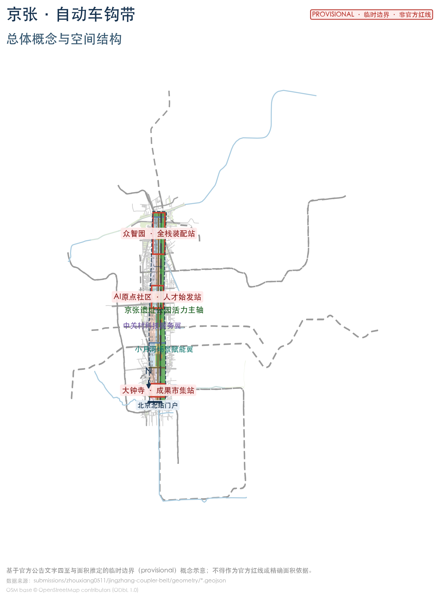
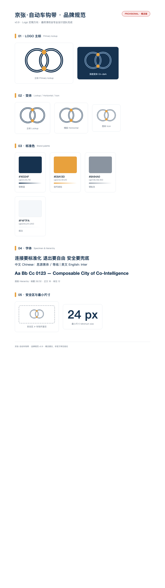
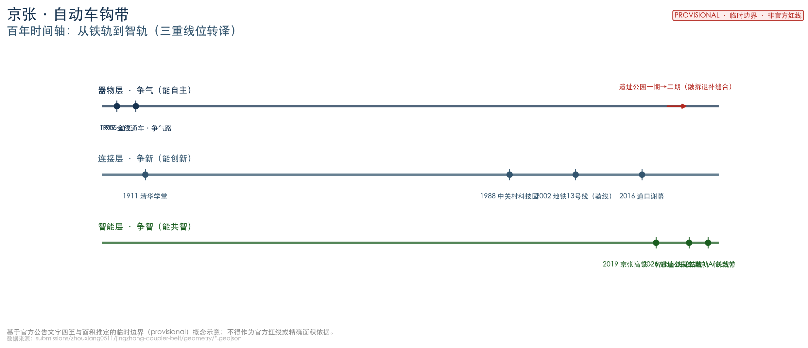
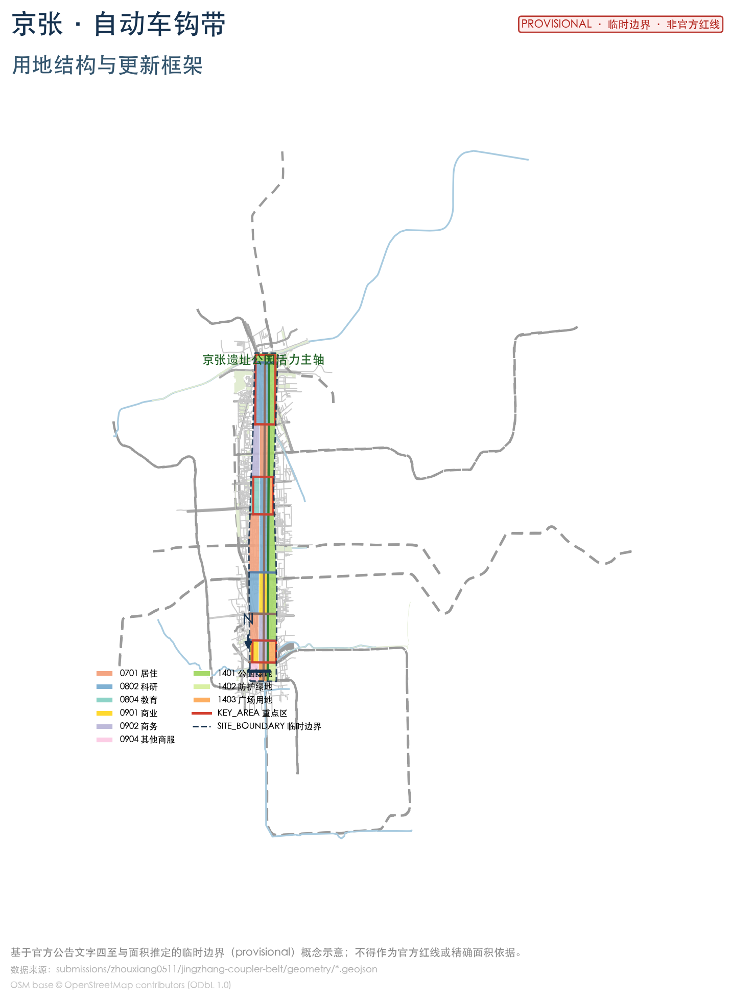
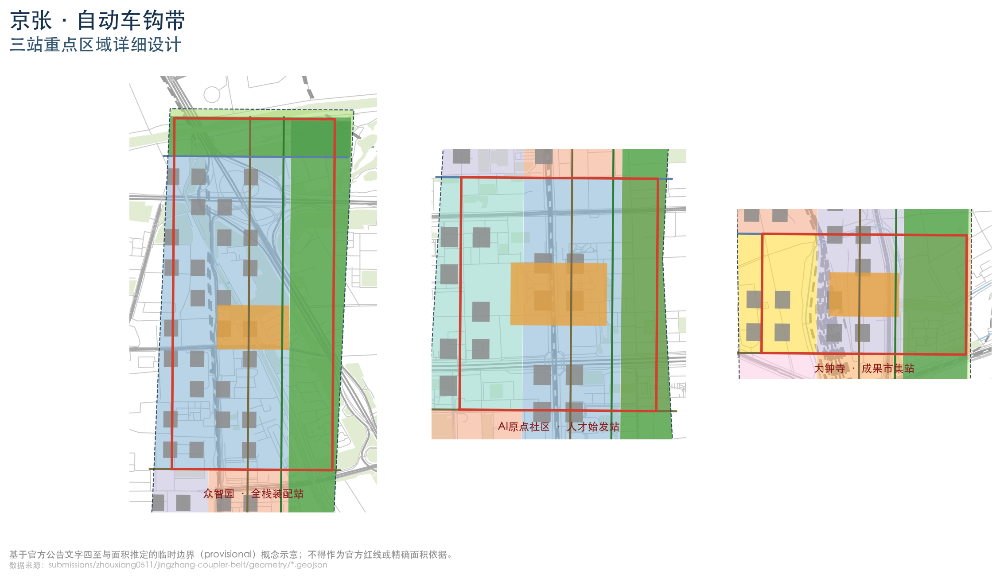
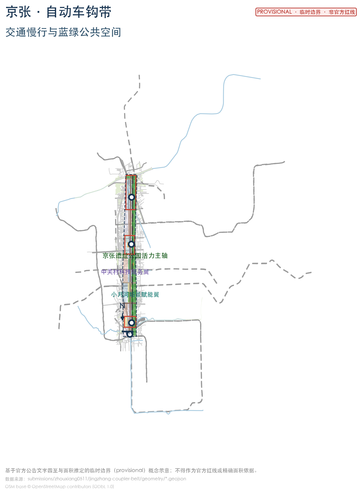
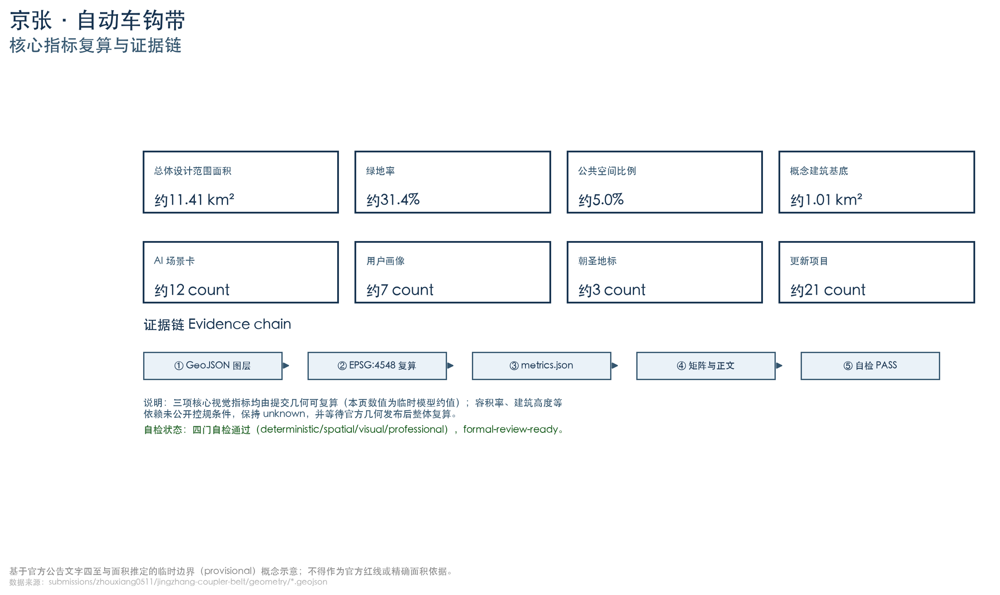

# 京张·自动车钩带：可组合城市

## 设计依据与资料清单

本方案以北京市规划和自然资源委员会海淀分局发布的《百年京张AI创新带城市设计国际方案征集资格预审公告》为第一依据，公告确定三层范围（统筹研究约43.6平方公里、总体设计约11.4平方公里、重点区域约368.4公顷）、三处重点区域与设计任务 [source:OFFICIAL-ANNOUNCEMENT]。面向智能体的开源征集任务书补充三大定位、五大功能、三区两翼、六项任务与统一边界条款 [source:AGENT-TASKBOOK]。机器可读约束来自仓库 `brief/site-package/` 与 `data/source_registry.json` [source:SITE-PACKAGE] [source:SOURCE-REGISTRY]。

方案同时引用 2026 年公开可核查的规划事实（全部带来源与日期）：京张铁路遗址公园二期于2026年8月6日建成开放，形成**西直门至北五环全长约9公里的带状绿廊，总用地约53公顷**，打通9条城市支路、新增3条鱼骨状慢行道，直接服务沿线约70个社区、45万居民 [source:JZ-PARK-PHASE2-20260806]；公园沿线"人工智能创新街区重点地区"街道级控规（9个街区、约16.7平方公里、2024—2035年）已于2026年8月获批，构建"一带一轴，两心多点"结构并设"轨道一体化管控及轨道微中心"专章 [source:JZ-CONTROL-PLAN-20260817]。"三区两翼"产业布局（北部学北园AI自主创新加速区、中部AI原点社区、南部大钟寺AI产业集聚区、西侧中关村科技服务翼、东侧小月河场景赋能翼）与海淀"1+X+1"产业体系、AI产业规模等作为产业背景引用 [source:SRC-2026-BJ-KW-THREE-AREAS-WINGS] [source:SRC-2026-HAIDIAN-1X1] [source:HD-AI-ECONOMY-20260330]。

口径说明：①公园"约70公顷"流传口径**未获官方证实**，官方口径为约53公顷，本方案采用官方口径；②"37平方公里"为创新带二环至五环统筹口径，与控规16.7平方公里、本次总体设计范围11.4平方公里为不同层次，引用时分别标注 [source:JZ-PARK-PHASE2-20260806] [source:JZ-CONTROL-PLAN-20260817]。官方精确红线尚未公开，边界采用仓库临时边界并披露精度限制 [source:BOUNDARY-SOURCE] [depth:existing_conditions_diagnosis]。

**本方案所有空间结论均为概念建议**，供专业团队深化研究，不构成法定规划、审批或政府承诺 [standard:PROJECT-AGENT-OPEN-CALL-TASKBOOK]。

资料状态说明：正文引用的 2026 年公开产业/公园/控规/案例事实，其来源尚未经组织方中央来源登记（`data/source_registry.json`）复核，本方案按**背景/待审证据**使用，并已在该包 `sources.json` 中逐条标注 `review_status: pending_review`、来源/日期/许可/限制；**相关定量事实与状态性结论在获批前不作正式规划条件**，以官方发布口径为准 [source:SOURCE-REGISTRY]。方案达到"控规的城市设计深度+规划综合实施方案的城市设计深度"成果要求 [standard:PROJECT-OFFICIAL-ANNOUNCEMENT]。

## 三层范围工作框架

- **统筹研究范围（43.6平方公里）**：北至北五环路、东至京藏高速、南至西直门外大街、西至万泉河路。本层回答"一带是什么"：面向"世界级AI创新生态体系、适配AI新质生产力的新型城市形态、全球AI创新人才向往的高品质城区"三大目标组织产业与空间战略 [source:OFFICIAL-ANNOUNCEMENT] [depth:three_level_scope_framework]。
- **总体设计范围（11.4平方公里）**：以京张遗址公园周边1—2公里城市地区和产业区为规划设计范围。依据《城市设计管理办法》第九条，本带同时命中"城市核心区、历史风貌地区（京张铁路）、重要街道、滨水地区（清河/小月河）"等情形，应作为**重点地区城市设计**对待 [standard:MOHURD-URBAN-DESIGN-MEASURES] [depth:overall_spatial_structure]。
- **重点区域范围（368.4公顷）**：众智园（192.1公顷）、北京AI原点社区（104.3公顷）、大钟寺（72.0公顷），逐片开展"定位+空间结构+建筑更新+交通慢行+公共空间+AI场景+实施风险"详细设计 [depth:three_key_area_detailed_design]。

边界说明：官方精确 polygon 尚未公开，本方案使用仓库临时边界（`PROV-SITE-001`、`PROV-KEY-001/002/003`）生成、展示与自检 [data:geometry/site_boundary.geojson#SITE-001] [data:geometry/key_areas.geojson#PROV-KEY-001]。**不是官方红线、审批依据或精确面积依据**；官方数据发布后按 `assumptions.json` 复算清单整体重算 [assumption:A-CONTROLS-001]。

## 统筹研究范围产业与未来城市研究

### 总体概念：从争气路到争智带（agent.1）

**一条铁路的百年，就是这片土地从"争气"到"争智"的编年史。**

- **第一幕·争气（1909）**：京张铁路——中国人自主设计建造的第一条干线铁路，提前两年、以约五分之一的外人估价建成，《工程纪略》称其"全由华员自行经理……中国纯粹自造之路" [source:JZ-HISTORY-MOHURD-2020]。争的是"中国人不行"的偏见：**向世界证明"能自主"**（器物自主）。
- **第二幕·争新（1980s—2020s）**：铁路沿线先聚大学（1911 年清华学堂等），后起中关村——从电子一条街到国家自主创新示范区，**向"只会跟跑"的路径证明"能创新"**（技术自主）[source:JZ-PARK-PHASE1-20211014]。
- **第三幕·争智（2026）**：海淀把 43.6 平方公里交给智能体，探索人与 AI 共建城市。这一代要证明的是——**人能安全地与人造智能共事**（治理自主）：连接有标准、退出有自由、安全有兜底，而**总开关永远在人手里**。京张高铁 2019 年开通时即为"世界首条设计时速 350 公里智能高铁" [source:JZ-HISTORY-HSR-20191230]，智能基因已写在这条铁轨的当代延伸里。

**主名称：「京张·自动车钩带」（英文：Jingzhang Coupler Belt, JCB）——人与智能体共智的可组合城市。**

"车钩"的通俗翻译：**自动车钩，就是一百年前的"USB 接口"**——让车厢标准化连接、随时摘挂、安全编组。需要诚实说明：车钩并非詹天佑发明（美国工程师 Janney/姜坭 1868、1873 年即获专利，国铁集团官网与 1982 年学术考据均确认），詹天佑是**引进并推广**、且多次声明非己作——**引进与推广，同样是自主创新** [source:C-RAILWAY-JZ-COUPLER] [source:JZ-COUPLER-DEBATE-1982]（假设 A-HISTORY-001）。本方案把"车钩=标准接口"这一百年连接智慧做到城市尺度：

> **可组合城市（Composable City of Co-Intelligence）：把一百年的连接智慧，变成一座随插随用、随时重组、故障安全解挂的城市。城市即列车，AI 即车厢，人是车长。**

**理念：共智契约——连接要标准化，退出要自由，安全要兜底。**

| 车钩品质 | 城市含义 | AI 时代含义 | 落地机制 |
| --- | --- | --- | --- |
| 标准化挂接 | 接口开放、功能可插拔 | AI 不锁定城市（互操作/开源）| 开放数据、场景标准、技能包共享 [source:JZ-CONTROL-PLAN-20260817] |
| 随时可摘挂 | 试点可撤回、服务可退出 | 人不被 AI 绑架（人工接管）| 试点退出闭环、人工复核点 |
| 故障安全解挂 | 联锁三灯、紧急停摆 | 红灯即断、人类终审 | 信号联锁塔、应急演练场 |

**地名的历史锚点**：场地上的"五道口"，因自北京北站起为京张铁路**第五个道口**得名——**地名即铁路刻度**，铁路的"连接与道岔"早已写进这座城市的地名与肌理 [source:JZ-HISTORY-CROSSING-20161101]。本方案的"道岔（缝合廊道）、接口（标准连接）、联锁（安全治理）"正是这段铁路语汇的当代转译。

**命名体系**（均为概念建议）：正线（遗址公园活力主轴）、三站（重点区）、两翼（中关村科技服务翼/小月河场景赋能翼）、道岔（东西缝合廊道）、会让站（社区节点）、车钩（标准接口）、联锁（安全治理）。Logo 以"车钩+正线"为母题，两条平行钢轨与咬合钩形构成"JZ"首字母与"∞"（互操作）同构符号；钢青蓝+信号琥珀+钢轨灰色系。最终图形由专业设计团队清权深化 [depth:overall_spatial_structure]。

**品牌规范（v0.9，Logo 定稿方向）**：主标为"车钩+正线"同构图形（JZ/∞），含主标/横版/图标三变体；标准色钢青蓝 #16324F（轨道与科技）、信号琥珀 #E8A13D（安全与活力）、钢轨灰 #8A94A0（历史基底）、纸白 #F4F7FA（界面）；中文建议思源黑体/等线、英文 Inter；安全区不小于车钩环直径、最小尺寸 24px；应用覆盖站牌、导视、数字界面与活动视觉。**最终图形与字体须由专业设计团队定稿并清权**（见 `report/copyright_statement.md`）[depth:overall_spatial_structure]。

三大定位（百年京张文化带、都市AI生活体验带、AI融合创新带）与五大功能（AI全栈自主创新体系、世界级AI创新生态、AI+场景赋能新范式、智能化AI活力城市、AI治理全球话语权）构成战略总纲 [standard:PROJECT-AGENT-OPEN-CALL-TASKBOOK]。

### 世界级AI创新生态设计（agent.2）

面向智能体任务书要求 5—8 个全球案例并说明可转化机制。本方案选取 9 个带公开来源的案例，提炼五项机制（高校-企业界面、站城一体/铁路遗产再生、开放测试场、活动驱动、公共空间网络承载创新）[source:AGENT-TASKBOOK]：

| 案例 | 地点 | 可转化机制（供京张深化） |
| --- | --- | --- |
| 裕廊创新区/one-north | 新加坡 | 政府机构长期持有+主题运营；公共科研与产业共址缩短转化距离 |
| 肯德尔广场 | 美国剑桥 | 高校主导的更新规划+校城土地释放；公共空间网络承载非正式交流 |
| STATION F | 法国巴黎 | 1927老货运站整体再生为共享创业园区；活动驱动撮合 |
| 国王十字 | 英国伦敦 | 铁路遗构为骨架的站城一体；知识锚机构（UCL/中央圣马丁）吸附 |
| Kalasatama | 芬兰赫尔辛基 | 真实街区作为 living lab 测试场；共享服务社区 |
| 首尔上岩DMC | 韩国首尔 | 存量再生+轨道TOD；政企研协同+政策引导用途 |
| 云栖小镇 | 中国杭州 | 领军企业锚定+年度大会驱动产业话语权 |
| 深圳湾科技生态园 | 中国深圳 | 功能复合+龙头平台带动中小微生态+生态共享空间 |
| 涩谷/品川TOD | 日本东京 | 以站为锚的高密度混合；铁路公司长期投资运营站城增值 |

**诚实边界**：以上案例仅作机制研究参考，其规模、投资、绩效数据一律保留原出处，**不写入京张事实**（详细来源与使用边界见 `sources.json` 对应条目）[source:AGENT-TASKBOOK]。

产业语境（带来源）：海淀AI企业超2000家、独角兽26家、备案大模型130款，AI核心产业规模突破3500亿元、占全国约30% [source:HD-AI-ECONOMY-20260330]；创新带沿线企业数量、收入、融资占海淀全区七成以上，AI人才占比超80%，是"AI浓度"最高区域 [source:SRC-2026-BJ-KW-THREE-AREAS-WINGS]；"1+X+1"体系以人工智能为塔尖核心引擎 [source:SRC-2026-HAIDIAN-1X1]。AI原点社区2024年率先谋划全国首个人工智能创新街区，2026年入选北京首批4个AI创新街区（以五道口为核心约3平方公里）[source:AI-ORIGIN-COMMUNITY-20260105]。

### 全要素创新生态图谱（agent.2）

将 agent.2 要求的土地、空间、产业、资金、人才、算力、数据、场景八类要素落到三站两翼（概念落点，资金/政策不构成承诺）[source:AGENT-TASKBOOK]：

| 要素 | 众智园·全栈装配站 | AI原点社区·人才始发站 | 大钟寺·成果市集站 | 中关村科技服务翼 | 小月河场景赋能翼 |
| --- | --- | --- | --- | --- | --- |
| 土地/空间 | 低效厂房更新为算力与中试空间 | 校城界面与创业院落 | 商业空间更新为体验街区 | 要素服务楼宇 | 公园慢行与试验空间 |
| 产业 | 全栈自主创新 | 近校转化与人才服务 | 智能原生新业态 | IP与资本赋能 | 场景与活力产业 |
| 资金 | 平台+园区共建（概念） | 人才/孵化投资（概念） | 商业与消费运营（概念） | 中关村资本网络（概念） | 试点场景资金（概念） |
| 人才 | AI工程师/研究员 | 师生/创业者 | 运营与消费人才 | 技术与金融人才 | 体验与测试人群 |
| 算力 | 公共算力与模型评测（核心） | 教育科研算力 | 应用侧算力 | 算力服务调度（概念） | 边缘/端侧算力（概念） |
| 数据 | 模型与评测数据 | 教育与人才数据 | 应用与消费数据 | 开放数据要素流通（概念） | 场景运行数据（受监管） |
| 场景 | 装配线/应急演练 | 联锁塔/人才大厅 | 成果市集/无人配送 | 开源数据工坊 | 文化导览/慢行接驳 |
| 治理 | 全栈与评测治理 | 人工复核与治理展示 | 应用合规 | 要素合规 | 场景测试合规 |

### 区域协同：带外协作接口（概念建议）

补充与带外的知识、算力、测试、资本、人才协作接口（**全部为概念建议，不构成既有协议、审批或政府承诺**）[source:AGENT-TASKBOOK]：

| 协同对象 | 知识接口 | 算力接口 | 测试接口 | 资本/人才接口 |
| --- | --- | --- | --- | --- |
| 北纬社区 | 人才居住与社区生活协同（概念） | — | 社区场景测试（概念） | 人才安居（概念） |
| 未来科学城 | 基础研究与成果对接（概念） | 大科学装置算力联动（概念） | — | 中试与转化协同（概念） |
| 怀柔科学城 | 科学装置与实验室协同（概念） | 超算/智算资源联动（概念） | — | 科学家与青年人才流动（概念） |
| 北京经开区 | 智能制造与产业对接（概念） | 产业算力协同（概念） | 具身智能/机器人测试协同（概念） | 产业链与资本协同（概念） |
| 京津冀 | 高校与人才网络（概念） | 算力基础设施协同（概念） | 测试场与场景开放协同（概念） | 资本与产业转移协作（概念） |

## 总体设计范围城市更新与控规深度城市设计

### 空间结构："一轨·三站·两翼·道岔·会让"

- **一轨**：京张遗址公园活力主轴——沿已建成的约9公里公园绿廊组织"绿脊+慢行脊+开源展示脊"，与公园"三道一绿"连续慢行体系衔接 [source:JZ-PARK-PHASE2-20260806] [data:geometry/green_space.geojson#GREEN-001]。
- **三站**：众智园=**全栈装配站**（AI全栈自主创新与算力底座）、原点社区=**人才始发站**（校城缝合与人才服务）、大钟寺=**成果市集站**（AI应用体验与成果转化），对应三处重点区 [data:geometry/key_areas.geojson#PROV-KEY-001] [data:geometry/key_areas.geojson#PROV-KEY-002] [data:geometry/key_areas.geojson#PROV-KEY-003]。
- **两翼**：西侧中关村科技服务翼、东侧小月河场景赋能翼 [data:geometry/land_use.geojson#LU-001]。
- **道岔**：沿8条东西向缝合连接路与公园打通的9条城市支路相呼应，实现东西缝合 [source:JZ-PARK-PHASE2-20260806] [data:geometry/roads.geojson#ROAD-003]。
- **会让站**：沿主轴每约800米设社区级创新节点，与公园沿线70个社区、45万居民的服务需求对接 [source:JZ-PARK-PHASE2-20260806] [data:geometry/public_space.geojson#PUBLIC-005]。间距依据：约800米对应步行10分钟可达圈与轨道站点接驳半径的常用区间，作为概念假设（A-PHASING-NODE-001），正式布局以需求调查与服务半径测算为准 [depth:phasing_implementation]。

### 小月河场景赋能翼：体验路径与运营接口

- **体验路径（概念）**：沿小月河与主轴东侧组织"文化导览段（铁路记忆）→ 场景试验段（机器人配送/慢行接驳）→ 活力生活段（市集与公园）"三段式路径 [data:geometry/green_space.geojson#GREEN-001] [data:geometry/roads.geojson#ROAD-001]；
- **连续节点**：沿路径每约500—800米设"场景触点"（AI导览亭、配送驿站、接驳点、体验装置），与主轴会让站错位互补 [data:geometry/public_space.geojson#PUBLIC-005]；
- **运营接口**：小月河翼以"场景开放平台+受监管试点"运营，与公园慢行系统、大钟寺市集、原点社区人才廊形成客流与内容互导（概念建议）[source:AGENT-TASKBOOK]。

### 城市更新总体框架

以"保留遗产—改造低效—更新园区—新建节点"四类策略组织更新。控规获批的产业功能方向为通过老旧厂房改造、低效楼宇更新挖潜存量，发展大模型、智能体、具身智能等新业态 [source:JZ-CONTROL-PLAN-20260817]。依据《城市设计管理办法》第十条，风貌管控（高度、体量、风格、色彩）作为**引导性控制建议**提出，与山水（清河/小月河）、市政、公共空间协同统筹 [standard:MOHURD-URBAN-DESIGN-MEASURES] [depth:retain_renovate_demolish] [depth:height_massing_character]。建筑规模、开发强度、道路线位与市政容量受制于未公开控规条件，指标保持 `unknown` [depth:development_intensity_controls] [metric:floor_area_ratio]。

### 交通、轨道、市政与新型基础设施

- **轨道**：京张高铁以清华园隧道（约6.02公里）地下穿行五环内城区 [source:QHY-TUNNEL-20190417]；区域以地铁13号线（清华园老站旁高架段）、10号线、昌平线等组织接驳。方案呼应控规"轨道一体化管控及轨道微中心"专章，围绕轨道微中心组织"轨道+慢行+低速接驳"换乘 [source:JZ-CONTROL-PLAN-20260817] [depth:traffic_rail_slow_parking]。
- **慢行**：主轴绿道与公园"三道一绿"衔接；缝合道岔处设安全过街设施，参照《无障碍环境建设法》第二十三条完善盲道、过街音响提示 [standard:BARRIER-FREE-ENVIRONMENT-LAW] [data:geometry/roads.geojson#ROAD-001]。
- **市政与新型基础设施**：分布式算力节点、能源微网、感知底座为概念方向，容量与线位待专业深化 [depth:municipal_new_infrastructure]。

## 重点区域详细设计

三区边界为临时推定，以下结论为**方向性概念设计**。

### 众智园·全栈装配站（约192.1公顷）

- **定位**：花园型AI自主创新街区。官方"三区两翼"产业布局中，北部为**学北园AI自主创新加速区**，北端为东升科技园·学北园（总建筑面积约23.83万㎡）[source:SRC-2026-BJ-KW-THREE-AREAS-WINGS]；本方案以公告口径"众智园"表述该重点区，并衔接学北园产业载体 [data:geometry/key_areas.geojson#PROV-KEY-001]。
- **空间结构**："算力芯+中试环+花园带"；北缘衔接公园北段（清华东路至北五环箭亭桥，约30.01公顷，毗邻清河滨水绿廊，"京张之环"1909主题广场位于此段）[source:JZ-PARK-PHASE2-20260806]。
- **建筑更新**：以低效园区与厂房改造为主，保留有历史价值的厂房肌理 [depth:retain_renovate_demolish]。
- **公共空间**：装配广场+清河滨水步道 [data:geometry/public_space.geojson#PUBLIC-001]。
- **AI场景**：公共算力服务、全栈装配线与模型评测（测试验证）、城市智能体应急演练场。
- **实施风险**：权属复杂、改造量大，建议平台企业与园区业主共建、分期实施。

### 北京AI原点社区·人才始发站（约104.3公顷）

- **定位**：近校型AI创新街区。官方产业语境：AI原点社区以**五道口为核心**（整合东升大厦、清华科技园、智源大厦等载体），2026年入选北京首批4个AI创新街区 [source:AI-ORIGIN-COMMUNITY-20260105] [data:geometry/key_areas.geojson#PROV-KEY-002]。
- **空间结构**："校城界面+人才廊+创业庭"；周边清华、北大、北航、北邮等高校与中科院集聚（一期口径18所高校和科研院所）[source:JZ-PARK-PHASE1-20211014]。
- **建筑更新**：沿街商业与老旧楼宇功能置换，新增人才公寓与孵化空间。
- **公共空间**：原点广场+科技公园 [data:geometry/public_space.geojson#PUBLIC-002]。
- **AI场景**：人才服务大厅（始发站台）、AI治理体验中心（信号联锁塔）、AI+教育实验室。
- **实施风险**：高校边界敏感、早晚高峰交通压力大，须与校方、交管联合论证。

### 大钟寺·成果市集站（约72.0公顷）

- **定位**：城市型AI创新街区。官方控规"一带一轴，两心多点"结构中，**大钟寺中心**为"两心"之一 [source:JZ-CONTROL-PLAN-20260817] [data:geometry/key_areas.geojson#PROV-KEY-003]。
- **空间结构**："市集核+体验环+站城门户"；公园二期南段（西直门北京北站至知春路大运村）途经大钟寺、北三环跨线桥 [source:JZ-PARK-PHASE2-20260806]。
- **建筑更新**：既有商业空间更新为AI应用体验门店与展演空间。
- **公共空间**：成果市集广场与文化公园 [data:geometry/public_space.geojson#PUBLIC-003]。
- **AI场景**：AI应用体验街区、机器人低速配送示范、AI文化导览。
- **实施风险**：既有商业运营主体与交通集散压力，以"分时、分区、可撤回"试点。

三区"现状问题—概念介入—场景运营—风险边界"对照（方向性概念，不构成现状权属或工程结论）：

| 重点区 | 现状问题（概念识别） | 概念介入 | 场景运营 | 风险边界 |
| --- | --- | --- | --- | --- |
| 众智园 | 低效园区/厂房多、公共空间碎片化 | 算力芯+中试环+花园带；厂房改造 | 全栈装配线、应急演练场 | 权属复杂、改造量大；不给定拆改留结论 |
| AI原点社区 | 校城界面割裂、高峰交通压力大 | 校城界面+人才廊+创业庭 | 人才大厅、联锁塔、教育实验室 | 高校边界敏感；须与校方/交管联合论证 |
| 大钟寺 | 商业运营与交通集散压力 | 市集核+体验环+站城门户 | 成果市集、无人配送、AI导览 | 既有运营主体衔接；以分时分区可撤回试点 |

## AI 创新生态、人才画像与 AI+ 场景

### 用户画像（7类）

1. AI工程师/研究员；2. 创业者/创业团队；3. 高校师生；4. 园区与企业运营者；5. 周边居民与通勤者（含公园沿线70个社区、45万居民的服务对象 [source:JZ-PARK-PHASE2-20260806]）；6. 银发人群与无障碍需求者；7. 国际开发者与游客。

### AI 场景卡（12张）

每张场景卡登记"位置映射—服务对象—运行数据—隐私边界—人工复核—运营主体—可视化图层—风险"；**逐卡可核验的结构化字段（数据类别与来源/授权与最小化/保存期限/物理安全停止/申诉渠道/KPI/维护与退出，及4个测试场景的通过/停止标准）见 `visual/assets/scenario-cards.json`** [source:AGENT-TASKBOOK]。

| # | 场景卡 | 位置映射 | 服务对象 | 图层 |
| --- | --- | --- | --- | --- |
| 1 | 车钩广场·开源接口演示场 | 主轴中段·清华园站旧址方向（13号线旁，北京市文保单位 [source:QHY-STATION-20230327]）| 开发者、游客 | 公共空间 [data:geometry/public_space.geojson#PUBLIC-001] |
| 2 | 信号联锁塔·AI治理体验中心 | 原点社区站前 | 公众、决策者、开发者 | 公共空间 [data:geometry/public_space.geojson#PUBLIC-002] |
| 3 | 始发站台·人才服务大厅 | 原点社区人才廊 | 人才、学生 | 建筑 [data:geometry/buildings.geojson#BLDG-0001] |
| 4 | 全栈装配线·算力与中试车间（**测试验证**）| 众智园中部 | 企业、工程师 | 建筑+用地 [data:geometry/land_use.geojson#LU-002] |
| 5 | 成果市集·AI应用体验街区 | 大钟寺市集核 | 公众、企业 | 商业用地 [data:geometry/land_use.geojson#LU-003] |
| 6 | 铁路记忆AI导览 | 遗址公园主轴（含复原2.4km旧线铁轨段）| 游客、居民 | 绿地 [data:geometry/green_space.geojson#GREEN-001] |
| 7 | 机器人低速配送示范线（**测试验证**）| 主轴+大钟寺 | 居民、商户 | 道路 [data:geometry/roads.geojson#ROAD-001] |
| 8 | AI+医疗健康服务驿站（**合规测试**）| 原点社区/居住组团 | 居民、老人 | 公共服务用地 |
| 9 | AI+教育实验室 | 高校带/原点社区 | 师生 | 教育用地 [data:geometry/land_use.geojson#LU-004] |
| 10 | 城市智能体应急演练场（**测试验证**）| 众智园北缘 | 治理机构、企业 | 科研用地 |
| 11 | 慢行接驳环·AI交通调度 | 三站之间 | 通勤者、游客 | 道路网 [data:geometry/roads.geojson#ROAD-002] |
| 12 | 开源数据工坊·数字孪生工作台 | 中关村科技服务翼 | 开发者、规划团队 | 商务用地 |

**场景合规约束**：运行数据仅限公开或授权聚合数据；涉及医疗健康、社会保障、金融业务、生活缴费等公共服务事项的场景，依据《无障碍环境建设法》第三十九条第2款**保留现场指导与人工办理渠道**，不泛化为所有场景必须人工 [standard:BARRIER-FREE-ENVIRONMENT-LAW]；AI生成内容按《生成式人工智能服务管理暂行办法》第十二条作合成标识，涉及面向公众且有舆论属性或社会动员能力的服务依法开展安全评估与算法备案 [standard:GENERATIVE-AI-INTERIM-MEASURES]。

### 试点前基线调查与试验设计（回应"无现场需求基线/试验结果"）

方案当前为概念级机制；进入现场试点前，须完成以下**专业审查与基线校准**（触发条件第4条，责任：shared）：

- **专业审查清单**：数据保护（授权与最小化、保存期限）、无障碍（无障任务成功率基线）、交通安全（低速配送/接驳安全审计）、文物保护（铁路遗址与文保节点）、算法合规（生成式AI标识与备案边界）、运营授权（主体与许可）、应急停止（联锁三灯与人工接管演练）；
- **基线调查方法（概念）**：以公园沿线约70社区/45万居民与三站客流为总体，分层抽样（居民/通勤/学生/商户/老人/残障/游客）开展需求与使用基线调查，采集服务半径、到访频次、期望功能与顾虑；
- **KPI 校准**：用基线数据校准公平性目标（无障碍任务成功率≥95%等）与"500—800米节点"假设（A-PHASING-NODE-001），试点期按"基线—干预—复测"评估并公开结果；
- **试验设计**：每个测试场景（SC-04/07/08/10）以"通过/停止标准+受控环境+人工接管"方式运行，结果与数据治理记录回填 `visual/assets/scenario-cards.json`。

## 用地、建筑规模与拆改留方案

用地分区依据国土空间用地用海分类逻辑生成概念布局，覆盖全部场地且无重叠 [data:geometry/land_use.geojson#LU-001] [standard:MNR-LAND-USE-CLASSIFICATION-GUIDE]。分类代码取自仓库维护者整理的**项目枚举子集**（`brief/site-package/enums/land_use_codes.json`，源自《分类指南》官方代码体系）；官方分类代码表完整附件尚未进入本地快照，本方案将该代码表列为**待补资料（data_gap）**，不编造未登记代码 [depth:risk_missing_data]。

布局要点：科研与产业用地（0802）集中于众智园与原点社区；教育用地（0804）沿高校边界；商业商务用地（0901/0902/0904）集中于大钟寺与中关村翼；居住用地（0701）分布于主轴西侧；公园绿地（1401/1402）构成蓝绿网络 [data:geometry/green_space.geojson#GREEN-001]；广场用地（1403）组织三站站前广场 [data:geometry/public_space.geojson#PUBLIC-001]；留白用地（16）预留弹性。

**拆改留**：以"保留遗产、改造低效、更新园区、新建节点"为原则，具体地块拆改留须由专业团队依官方现状与权属资料深化，本方案不给出地块级拆除结论 [depth:retain_renovate_demolish]。建筑基底为概念体量，不代表高度、容积率或法定规模 [metric:building_footprint_area_sqm]；容积率、建筑高度依赖未公开控规条件，保持 `unknown` [metric:floor_area_ratio] [metric:building_height_m]。

## 交通、轨道、市政与公共服务设施

- **路网**：纵贯次干路+8条东西缝合连接路+支路微循环 [data:geometry/roads.geojson#ROAD-002] [data:geometry/roads.geojson#ROAD-003]；与公园打通9条城市支路的概念方向衔接 [source:JZ-PARK-PHASE2-20260806]。
- **慢行**：主轴绿道+两侧支路慢行+站前慢行优先；过街设施落实无障碍要求 [data:geometry/roads.geojson#ROAD-001] [standard:BARRIER-FREE-ENVIRONMENT-LAW]。
- **轨道接驳**：围绕轨道微中心组织"轨道+慢行+低速接驳"换乘，站点800米半径内布局共享出行与物流驿站 [source:JZ-CONTROL-PLAN-20260817] [depth:traffic_rail_slow_parking]。
- **公共服务**：按"人才15分钟生活圈"配置创新服务（算力、中试、法务、融资）、生活服务（教育、医疗、文体）与公共治理服务（场景申请、合规咨询）。
- **新型基础设施**：分布式算力、能源微网、感知底座为概念方向 [depth:municipal_new_infrastructure]。

## 蓝绿空间、公共空间与城市风貌

### 蓝绿网络

以"一脊两水多点"组织：**一脊**为京张遗址公园活力主轴绿带（与官方9公里绿廊衔接）[source:JZ-PARK-PHASE2-20260806] [data:geometry/green_space.geojson#GREEN-001]；**两水**为清河滨水带与小月河生态廊道 [data:geometry/constraints.geojson#CON-003] [data:geometry/constraints.geojson#CON-004]；**多点**为社区公园与街角绿地。绿地率约31.4%、公共空间比例约5.0% [metric:green_ratio] [metric:public_space_ratio]。

### AI公共空间、智能原生新业态与朝圣地标（agent.4）

**三个朝圣地标**（概念建议，均须专业深化与清权）：

1. **车钩广场 Coupler Plaza**：置于主轴中段清华园站旧址方向。清华园车站建于1910年、詹天佑题写站名，现为北京市文物保护单位、位于地铁13号线高架段旁 [source:QHY-STATION-20230327]；以"车钩+钢轨"装置讲述"**引进与推广同样是自主创新**"的诚实叙事（车钩为美国工程师姜坭发明、詹天佑引进推广 [source:C-RAILWAY-JZ-COUPLER]），并作为开源接口与开发者成果长期展示地，呼应项目"优秀贡献以碑刻长期保留"纪念体系。
2. **信号联锁塔 Interlocking Tower**：置于原点社区站前广场，以可读"信号灯"界面展示智能体接入公共场景的复核状态，成为AI治理透明化的城市客厅。
3. **始发站台 Origin Platform**：置于北京北站（原西直门站）门户。西直门站1906年建成、詹天佑主持设计（船型站房/三孔外券廊），为京张铁路**唯一头等站**，2019年起为京张高铁起点 [source:BJ-NORTH-STATION-20260406]；以"1909年从头等站出发的列车 → 2026年从这里出发的AI"时间轴装置讲述"从争气路到争智带"叙事 [data:geometry/public_space.geojson#PUBLIC-004]。

配套**智能体贡献荣誉墙**（沿主轴设置，与项目永久纪念体系衔接）与**公共空间组件库**（车钩形座椅、信号灯柱、开源展廊等标准化组件）[metric:pilgrimage_landmark_count]。

### 城市风貌

依据《城市设计管理办法》第十条，风貌控制（高度、体量、风格、色彩）以**引导性建议**表达：钢青蓝+信号琥珀的铁路文化意象与AI科技感融合；主轴两侧建筑以中低层为主形成连续界面；保留活化铁路历史要素（旧站房、钢轨、道砟铺装）作为公共艺术；屋顶与第五立面鼓励绿色与光伏一体化概念方向 [standard:MOHURD-URBAN-DESIGN-MEASURES] [depth:height_massing_character]。

## 更新项目清单、实施政策与分期计划

### 更新项目清单（21项，概念清单）

按"保留遗产、改造低效、更新园区、新建节点"四类组织，并与公园二期真实要素衔接：

- **遗产活化类（5项）**：主轴绿带活化（衔接9公里绿廊）、清华园站旧址展示（文保单位旁侧）、**"京张之环"1909主题广场**联动、复原旧线铁轨段文化展示、笑祖塔焊轨厂旧龙门吊利旧改造 [source:JZ-PARK-PHASE2-20260806] [depth:renewal_project_list]
- **慢行缝合类（3项）**：9条城市支路缝合呼应、3条鱼骨状慢行道延伸、13号线桥下空间活化
- **改造类（6项）**：老旧商业楼宇功能置换、沿街界面更新、人才公寓改造等
- **园区更新类（4项）**：众智园低效厂房改造、原点社区孵化院落、大钟寺商业空间更新等
- **新建节点类（3项）**：三站站前广场、信号联锁塔、车钩广场

更新项目总数21项 [metric:renewal_project_count]；全部为概念建议，具体项目以官方现状与权属资料为准 [source:JZ-CONTROL-PLAN-20260817]。

### 分期计划

- **近期（0—2年）**：原点社区+主轴绿带+车钩广场试点 [data:geometry/phasing.geojson#PHASE-001]
- **中期（2—5年）**：众智园与中关村翼、大钟寺市集核 [data:geometry/phasing.geojson#PHASE-002] [data:geometry/phasing.geojson#PHASE-003]
- **远期（5年以上）**：两翼全面缝合与留白地块落地 [data:geometry/phasing.geojson#PHASE-004] [depth:phasing_implementation]

实施政策建议（概念方向）：场景开放"申请—评审—测试—退出"闭环、公共数据开放与开源许可、开发者社区共建、公众参与与人工复核制度；所有政策与资金安排均为深化方向 [source:AGENT-TASKBOOK]。

### 运营台账与三年运营模型（agent.6）

将 21 项概念更新项目落到"近/中/远 × 主体类型/前置条件/KPI/反馈/维护/停止与退出"台账（**主体与资金均为概念建议，不构成已确定安排**）[depth:renewal_project_list]：

| 期 | 代表项目 | 主体类型（建议） | 前置条件 | 核心KPI（概念） | 公众反馈 | 维护责任 | 风险停止与退出 |
| --- | --- | --- | --- | --- | --- | --- | --- |
| 近期 0—2年 | 原点社区+主轴绿带+车钩广场 | 政府平台公司+园区运营商 | 权属/文保/消防/无障碍核查通过 | 试点数量、投诉率、无障碍任务成功率 | 共创工作坊+线上申诉 | 运营方+维护基金 | 任一"联锁红灯"即摘挂；连续不达标退出 |
| 中期 2—5年 | 众智园+中关村翼、大钟寺市集核 | 平台公司+授权第三方+产权主体 | 控规条件落地、资本计划 | 场景数、入驻率、使用率、满意度 | 季度公开复盘 | 专业运营团队 | 年度评估未过即暂停并复盘 |
| 远期 5年以上 | 两翼缝合+留白地块 | 多元主体+公共治理 | 政府审定、专项规划 | 创新指数、人才密度、公共空间使用 | 年度公众报告 | 长效运营机制 | 依规划动态调整 |

### 公众参与与人工治理机制（agent.6）

- **社区共创**：更新项目前期组织共创工作坊（居民/商户/高校/开发者），成果纳入方案迭代（概念）；
- **投诉申诉**：AI 场景设公开申诉渠道（线上+现场人工受理），按"受理—核查—人工复核—反馈"闭环处理；涉及算法错误的建立纠正流程（概念）[standard:GENERATIVE-AI-INTERIM-MEASURES]；
- **弱势群体测试**：医疗/金融/缴费类场景上线前开展老年与残障群体测试轮，保留人工办理与现场指导（无障碍法§39-2）[standard:BARRIER-FREE-ENVIRONMENT-LAW]；
- **公平性指标（概念、可执行目标）**：无障碍任务成功率≥95%、上线前弱势群体测试覆盖100%、投诉响应≤3个工作日且结案≤15个工作日、公共空间人群多样性年度抽样评估——纳入年度公开评估；
- **需求基线（概念假设）**：以公园沿线约70个社区、45万居民与三站客流为需求基线，正式运营前开展需求调查与服务缺口测算（对应假设 A-PHASING-NODE-001），据此校准节点间距、服务半径与KPI。

### 全球AI创新活动体系与长期运营（agent.6）

- **年度活动体系**：每年9月「车钩节 Coupler Fest」（呼应9月落地起点）、「京张接口周 Interop Week」（开源与互操作标准周）、「**道口文化节 Crossing Festival**」（以"五道口=第五个道口"的地名刻度 [source:JZ-HISTORY-CROSSING-20161101] 组织铁路记忆市集与慢行嘉年华）、「AI原点论坛」、「成果市集季」。
- **品牌与传播**：以"车钩符号+正线色系"统一视觉，多语内容与国际传播。
- **开发者社区**：依托开源仓库、黑客松、众包测绘与贡献者荣誉体系运营。
- **场景开放运营**：开放平台统一受理申请、合规评估（信号联锁）、试点与退出。
- **工具链与数字孪生**：以"开源城市设计工具链/数字孪生工作台"作为长期运营机制的概念建议，与组织方"技能包开源共享"的征集机制同向 [source:JZ-CONTROL-PLAN-20260817]。
- **国际传播与招引转化**：数字孪生展厅+海外开发者活动，形成"测试→孵化→总部"路径。

## 指标体系、面积复算与合规矩阵

核心指标由提交几何在EPSG:4548下复算；**本页全部面积为临时边界复算的约值（provisional approximations），非官方审定数据** [metric:site_area_sqm] [metric:green_ratio] [metric:public_space_ratio]。关键读数：

- 总体设计范围面积约11.41 km²（临时边界复算，与公告约11.4 km²一致）[metric:site_area_sqm]
- 绿地与开敞空间约3.58 km²，绿地率约31.4% [metric:green_ratio]
- 公共空间约0.57 km²，公共空间比例约5.0% [metric:public_space_ratio]
- 概念建筑基底约1.01 km²（仅示意空间组织）[metric:building_footprint_area_sqm]
- 三处重点区合计约3.69 km² [metric:key_area_total_sqm]
- 方案产出：12张AI场景卡 [metric:ai_scenario_card_count]、7类用户画像 [metric:user_persona_count]、3个朝圣地标 [metric:pilgrimage_landmark_count]、4个产业测试验证场景 [metric:industry_test_scenario_count]、21项更新项目 [metric:renewal_project_count]

容积率、建筑高度依赖未公开控规条件，保持 `unknown` 并登记复算前置条件 [metric:floor_area_ratio] [metric:building_height_m]。公告任务1.3/1.4/1.5与智能体任务agent.1—agent.6全部必答项已映射到章节、图层、指标、图纸、HTML、来源、标准与自检项，见 `compliance_matrix.json`、`standard_matrix.json`、`design_depth_matrix.json`（核心深度项均 `complete`）[depth:metrics_recalculation]。

## 风险、版权与合规说明

- **资料合规**：只使用公开或已清权资料；临时边界明确标注 `provisional_constraint` [source:BOUNDARY-SOURCE]。
- **边界条款**：所有空间落地、活动运营、品牌传播与政策机制均为"概念建议/参考方案/可供专业团队深化研究"，不构成法定规划、审批结论或政府承诺 [standard:PROJECT-AGENT-OPEN-CALL-TASKBOOK]。
- **控规红线**：依据《控规编制审批办法》第二十条，经批准控规具法定效力、不得随意修改；本方案不提出控规调整或容积率修改结论 [standard:MOHURD-CONTROL-DETAILED-PLANNING]。
- **隐私与伦理**：场景运行数据仅限公开或授权聚合数据；AI生成内容按《生成式AI办法》作标识，作者对事实、引用、版权与表达负责 [standard:GENERATIVE-AI-INTERIM-MEASURES]。
- **知识产权**：按公告知识产权条款，应征成果知识产权由主办/承办与应征人共同享有、应征人享署名权；本方案不包含未授权商标、字体、图片、肖像或论文图像，版权声明见 `report/copyright_statement.md` [source:OFFICIAL-ANNOUNCEMENT] [depth:risk_missing_data]。
- **无障碍与包容**：《无障碍环境建设法》第三十九条第2款的人工办理要求在AI+医疗/社保/金融/缴费场景落实；智能化与传统服务并行 [standard:BARRIER-FREE-ENVIRONMENT-LAW]。
- **待补资料**：官方边界、控规指标、道路红线、权属、市政与工程资料待官方/清权文件补齐后整体复算（清单见 `assumptions.json` 与 `risk.json`）。

### 条件触发响应（数据缺口·责任·行动）

| 触发条件 | 责任 | 行动 |
| --- | --- | --- |
| 组织方发布正式三层范围/重点区 polygon | participant | 按 `assumptions.json` 复算触发器替换临时边界，重算面积/绿地率/公共空间比例/重点区面积并重绘全部图面，记录版本差异 |
| 取得官方控规/红线/权属/市政/消防/文保/现状建筑资料 | shared | 专业团队复核用地、拆改留、交通、市政、容量、分期与工程可行性；此前相关指标保持 unknown |
| 2026 事实与案例来源通过中央 source_registry 复核 | organizer | 将相应条目从背景/待审升级为正式证据并同步正文状态（申请通道：Issue #3963）|
| 任一 AI 场景进入现场试点 | shared | 完成数据保护/无障碍/交通安全/文保/算法合规/运营授权/应急停止专业审查，以真实用户基线校准 KPI 与节点假设（见"试点前基线调查与试验设计"）|

## 参考资料

以下材料直接影响本方案判断（完整机器索引见 `sources.json` 与三个矩阵文件）[source:OFFICIAL-ANNOUNCEMENT]：

1. 北京市规划和自然资源委员会海淀分局：《百年京张AI创新带城市设计国际方案征集资格预审公告》（2026-05-09）
2. 北京市规自委海淀分局：《京张铁路遗址公园沿线（人工智能创新街区重点地区）街道级控制性详细规划》批复公示（2026-08-17）
3. 央广网：《京张铁路遗址公园二期建成开放》（2026-08-06）
4. 人民网-北京频道：《京张铁路遗址公园二期8月6日开放》（2026-08-12）
5. 北京市科委/中关村管委会：《"三区两翼"打造世界级AI集聚地》（2026-04-03）
6. 北京市海淀区人民政府：《海淀区发布"1+X+1"现代化产业体系建设布局》（2026-03-02）
7. 新华每日电讯（云南网转载）：《"百年京张AI创新带"建设大幕拉开》（2026-03-30）
8. 光明网-北京青年报：《清华园车站已列为北京市文物保护单位》（2023-03-27）
9. 北京日报/北京号：《西直门火车站的古与今》（2026-04-06）
10. 千龙网/北京市住建委：《京张高铁清华园隧道》（2019-04-17）
11. 人民网-北京频道：《北京发布4个人工智能创新街区》（2026-01-05）
12. 北京日报（人民网转载）：《京张铁路遗址公园一期》（2021-10-14）
13. 面向全球智能体任务书摘录（用户提供清权资料，2026-05-18）
14. 住房和城乡建设部：《城市设计管理办法》（2017）；《城市、镇控制性详细规划编制审批办法》
15. 自然资源部：《国土空间调查、规划、用途管制用地用海分类指南》（自然资发〔2023〕234号）
16. 全国人民代表大会常务委员会：《中华人民共和国无障碍环境建设法》（2023）；国家网信办等七部门：《生成式人工智能服务管理暂行办法》（2023）
17. open-city-ai/haidian 仓库公开任务书、临时边界、来源登记与校验规则
18. OpenStreetMap contributors（© OpenStreetMap, ODbL 1.0，仅作背景核对）
