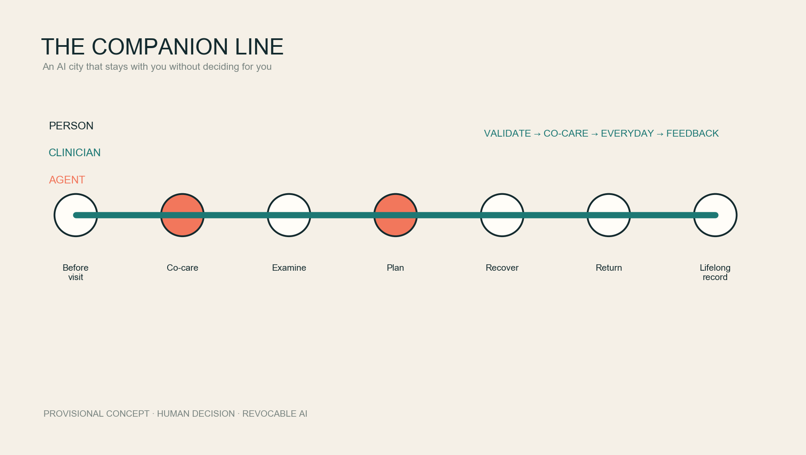
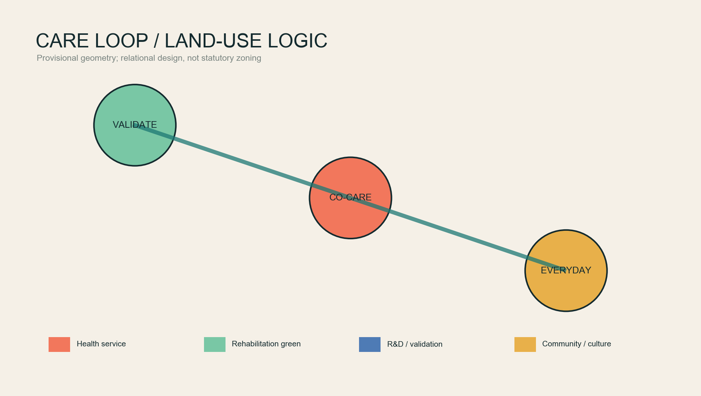
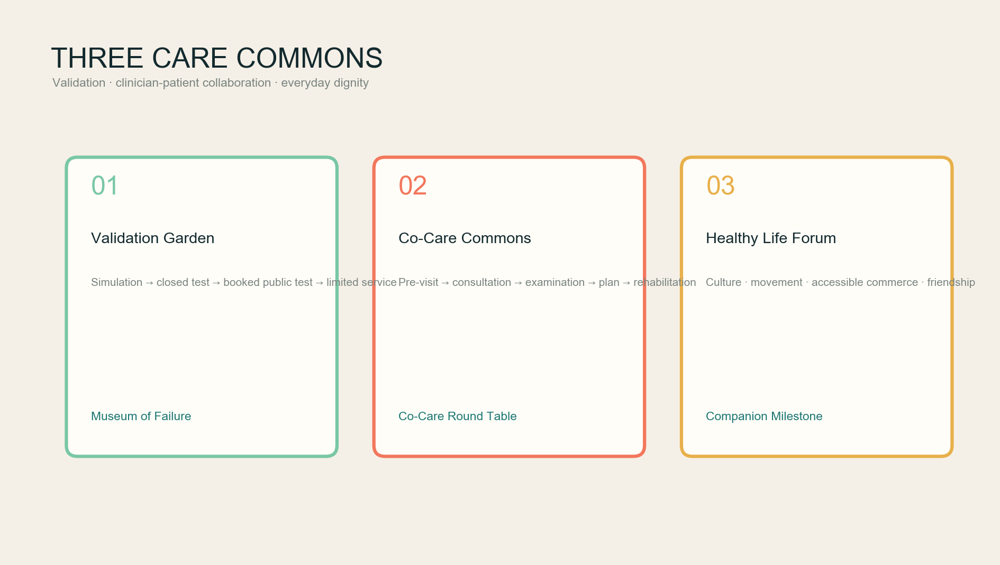
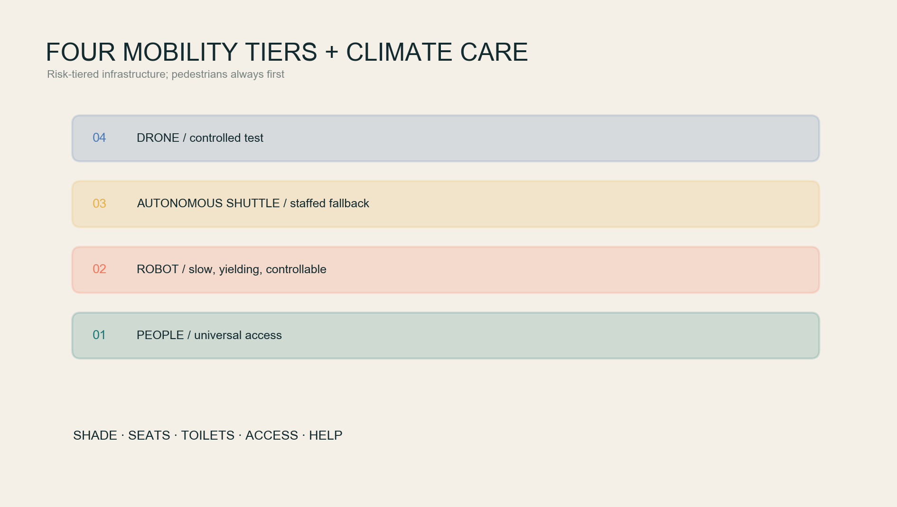
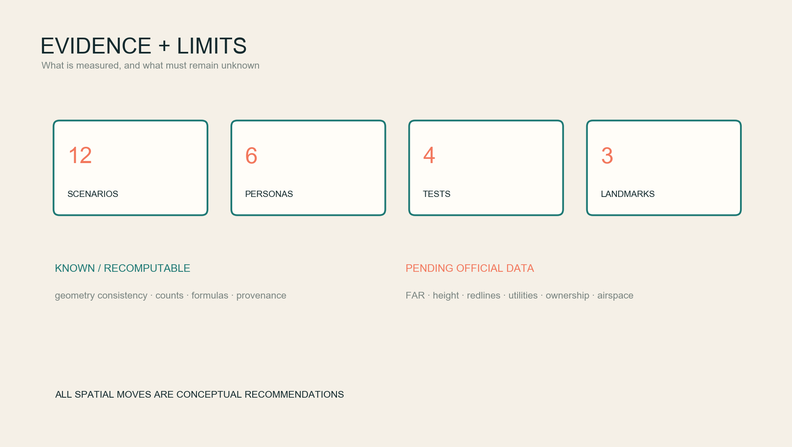

# THE COMPANION LINE / 京张伴行线

> An AI city that never decides for you, yet stays with you throughout the journey.

The scarce resource in a future city is continuity. A person should be able to explain a concern before entering a clinic; share a transparent interface with the clinician; retain context across examination, treatment and rehabilitation; and return to daily life with a health record that remains under personal control. The Companion Line turns this experience of being continuously understood into an urban principle: technology stays behind the person, while parks, culture, mobility and health services support dignity together.

This is an open co-creation concept and reference scheme. It does not replace statutory planning, clinical judgement, government approval or engineering design. All current polygons are provisional rough constraints; all geometry-sensitive outputs must be recalculated when official polygons become available.

## Design Basis and Source List

The official announcement defines the three scope levels, three key areas and professional tasks [source:OFFICIAL-ANNOUNCEMENT]. The Agent Taskbook supplies the three positionings, five functions, six Agent tasks and human-centred charter [source:AGENT-TASKBOOK]. Local snapshots of urban-design, regulatory-planning and land-use references guide professional wording. The official text of the 2016 architectural design-depth regulation is missing, so it remains a data gap rather than a claimed compliance item [standard:MOHURD-ARCH-DESIGN-DEPTH-2016].

Exact official site and key-area polygons are not yet public. This package uses the repository's provisional rough geometry, with `official_boundary=false`; it cannot support an official redline, precise area or approval claim [data:geometry/site_boundary.geojson#SITE-001] [metric:site_area_sqm].

Six public practices inform transferable mechanisms only: WHO health-AI ethics; WHO age-friendly environments; Helsinki's AI Register; the EU TEF-Health and CitCom.AI real-world testing network; the FDA's public AI-enabled device list; and the NHS AI buyer's guide. Together they support a “validate before service; clinician responsible, AI augmenting; understandable and revocable by the person” approach, but do not prove local readiness [source:WHO-AI-HEALTH] [source:EU-TEF] [source:FDA-AI-DEVICES].

## Three-Level Scope Framework

The 43.6 km² Coordinated Research Area links universities, healthcare providers, enterprises, computing, governance and communities through a knowledge-validation-service-feedback loop. The roughly 11.4 km² Overall Design Area hosts a continuous climate-care walking and cycling spine. The three key areas specialise in validation, co-care and everyday health [depth:three_level_scope_framework].

| Level | Question | Companion Line response |
|---|---|---|
| Coordinated Research Area | How does innovation create public health value? | An open health-AI validation alliance, public participation and living evidence archive |
| Overall Design Area | How do people move and stay comfortably and safely? | A climate-care spine, cross-links, four mobility tiers and non-AI equivalents |
| Key areas | Where is technology validated, used with clinicians and tested in daily life? | Zhongzhiyuan Validation Garden—AI Origin Co-Care Commons—Dazhongsi Healthy Life Forum |

The structure is a care loop rather than three isolated cores. Zhongzhiyuan validates safety and intended use; AI Origin embeds tools in shared clinician-patient decisions; Dazhongsi tests whether services remain polite, accessible and optional in everyday life; evidence returns to the validation end [data:geometry/land_use.geojson#LU-001] [data:geometry/public_space.geojson#PUBLIC-001].

## Coordinated Research Area: Industry and Future City Research

The Chinese name is 京张伴行线 and the English name is THE COMPANION LINE. “Companion” joins railway travel, clinician-patient relationships, rehabilitation walking and a long-term agent. The identity uses two parallel lines and an open circle: person and AI move together; the opening guarantees exit. Every C+distance node displays responsibility, data use, human review and exit routes.

Six cases become six urban components: WHO ethics becomes the Companion Contract; age-friendly guidance becomes a bench, toilet, access and shade checklist; Helsinki becomes public algorithm plaques; EU TEFs become the Validation Garden; the FDA list becomes visible intended-use and status labels; and the NHS procurement questions become a “why AI?” gate before a public service can launch [source:HELSINKI-AI-REGISTER] [source:NHS-AI-BUYERS-GUIDE].

Three gates organise the ecosystem: the R&D gate supports synthetic data and laboratory work; the Validation gate requires controlled settings, safety, ethics and accessibility review plus failure records; the Service gate requires a defined population, accountable human and exit option. The Technology Services Wing supplies conceptual IP, methods and compliance support; the Xiaoyue River Wing supplies non-medicalised daily-life feedback. No enterprise list, investment, output or fiscal promise is invented [standard:PROJECT-AGENT-OPEN-CALL-TASKBOOK].

## Overall Design Area: Urban Renewal and Regulatory-Plan-Level Urban Design

The proposal does not medicalise the whole city. It embeds care in ordinary urban life: R&D and validation near key areas, street-facing co-care and community services, a green climate spine for movement and rest, and cultural spaces that prevent disease from defining identity. The complete provisional land-use partition expresses relationships, not statutory land-use change [data:geometry/land_use.geojson#LU-001] [standard:MNR-LAND-USE-CLASSIFICATION-GUIDE].

Renewal follows four levels: retain, light retrofit, reversible insert and pending survey. Because no building survey, ownership or structural data is supplied, building polygons represent reversible prototypes only. No demolition, height, roof or development-intensity conclusion is claimed [depth:retain_renovate_demolish] [metric:building_footprint_area_sqm].

Services follow “15 minutes to reach, five minutes to exit”: a service node may be close, but every AI service must provide a nearby human, paper/telephone or non-AI mobility route. Edge computing processes only necessary data. Personal health records remain permissioned by the person; urban indicators must be aggregated, de-identified and auditable.

## Detailed Design of Key Areas

**Zhongzhiyuan: Companion Validation Garden.** A conceptual, tiered environment for health AI, low-speed robots, accessible navigation and emergency logistics: simulation, closed site, booked public test, then limited service. Failures, near misses and intended populations are recorded. The river-facing edge prioritises shade, rainwater, walking and exchange; robots remain slow, visible and human-controllable [data:geometry/key_areas.geojson#PROV-KEY-001].

**Beijing AI Origin Community: Co-Care and Lifelong Record Commons.** This is not an autonomous hospital. It connects pre-visit narrative, the consultation, examination, care planning, rehabilitation and follow-up without losing context. The agent organises information before the visit; clinician and patient share it during consultation; quality controls support examinations; the clinician confirms the final plan; and the individual manages longitudinal permissions. Spatial components include a Co-Care Forum, private consultation rooms, an examination-explanation gallery, rehabilitation garden and caregiver station [data:geometry/key_areas.geojson#PROV-KEY-002].

**Dazhongsi: Healthy Everyday Life and Culture Forum.** Walking connections around the station combine culture, movement, nutrition, accessible commerce and light-touch health services. Life continues after illness: reading, music, art, adaptive exercise and friendship are part of recovery. Technology is tested for clarity and respectful exit across ages, languages, abilities and people who decline digital services [data:geometry/key_areas.geojson#PROV-KEY-003].

Three pilgrimage landmarks are the Museum of Failure in Zhongzhiyuan, the eye-level Co-Care Round Table at AI Origin, and the Centennial Companion Milestone in Dazhongsi. They are seats, learning devices and maintained public records rather than giant technology icons.

## AI Innovation Ecosystem, Personas, and AI+ Scenarios

Six personas are patients/residents, clinicians and nurses, caregivers, health-AI developers, older/young/disabled users, and international visitors/city workers. Permissions, risk and non-AI routes differ; the proposal rejects a universal digital-citizen score [source:WHO-AI-HEALTH].

| # | Scenario card | Space | Human boundary |
|---|---|---|---|
| 01 | Pre-visit health narrative assistant | Home/community | Organises, never diagnoses; sharing requires confirmation |
| 02 | Triage and department matching | Co-Care Forum | High-risk signs move immediately to human emergency pathways |
| 03 | Shared-screen clinician-patient decision | Consultation room | Clinician signs the judgement; patient may decline AI |
| 04 | Examination quality and personalised explanation | Explanation gallery | Intended use, version and accountability remain visible |
| 05 | Care-plan explanation and multilingual communication | Round Table | Never changes a prescription; questions return to clinician |
| 06 | Rehabilitation walking prescription | Climate-care spine | Does not replace assessment; route works without devices |
| 07 | Lifelong personal health record | Personal data vault | Granular consent, revoke, export and delete |
| 08 | Caregiver coordination | Caregiver station | Patient authorisation takes priority; emergency access is logged |
| 09 | Low-speed medicine/sample robot logistics | Validation Garden | Pedestrian priority, speed limit and remote takeover |
| 10 | Accessible autonomous shuttle | Key areas/stations | Booking and staffed access coexist; no sidewalk capture |
| 11 | Emergency drone logistics window | Controlled roof/test site | Validation concept only; airspace and approval pending |
| 12 | Art and culture rehabilitation guide | Dazhongsi/park | No emotion or disease inference; no commercial profiling |

Four testing and validation scenarios cover co-care health AI, mixed low-speed robotics, accessible autonomous shuttle, and simulated/closed-site emergency drone logistics. Each has stop conditions, human takeover, incident summaries and an exit path [metric:testing_scenario_count].

## Land Use, Building Scale, and Retain-Renovate-Demolish Strategy

Four conceptual zones support co-care health services, rehabilitation park space, health-AI/robotics R&D and community-cultural daily services. They share one topology and fully cover the provisional boundary; they do not amend statutory uses [data:geometry/land_use.geojson#LU-001]. Green and public-space values are design-package calculations, not official planning controls [metric:green_ratio] [metric:public_space_ratio].

Six small reversible-care prototypes are tagged `renovate_or_reuse_subject_to_survey`. Existing fabric, structure, ownership, height and total floor area remain unknown, so FAR and height remain explicitly pending [metric:floor_area_ratio] [metric:building_height_m].

## Transport, Rail, Municipal Infrastructure, and Public Services

Mobility has four tiers: pedestrians and wheelchairs always first; slow, yielding and controllable robots second; conceptual inter-node autonomous shuttles third; low-altitude logistics only after approval and safety review. Every tier has a human alternative and a stop condition [data:geometry/roads.geojson#ROAD-001] [depth:traffic_rail_slow_parking].

Five continuities define walking quality: shade, seating, toilets, universal access and help. Summer cool routes combine trees, canopies, drinking water and controlled mist; winter pockets retain sun; rain shelters avoid ponding; night lighting supports visibility without glare. AI supports maintenance and opening hours without persistent tracking.

New infrastructure includes personal permission credentials, algorithm plaques, edge boxes, robot takeover points, help columns and low-altitude test interfaces. Utility, energy, fire, road, rail and airspace conditions require official data and professional work [depth:municipal_new_infrastructure].

## Blue-Green Network, Public Space, and Urban Character

The Jing-Zhang Railway Heritage Park carries a simple proposition: rehabilitation is not a room; it is a city segment one can walk every day. The spine connects three care commons and cross-links communities, campuses, workplaces and stations. A conceptual 300–500 m rhythm of seats, water, toilets, turning space and quiet rest must be calibrated through field survey. The calculated green share is not a statutory green ratio [data:geometry/green_space.geojson#GREEN-001] [standard:MOHURD-URBAN-DESIGN-MEASURES].

Urban character layers railway engineering discipline, Zhongguancun openness and the warmth of care. Brick, weathered metal, timber and textile shade are material directions. Interfaces use high contrast, multilingual and tactile information. Art carries illness experience, care labour and learning from failure into public memory rather than decorating technology.

## Renewal Projects, Implementation Policy, and Phasing

| Phase | Concept project | Preconditions |
|---|---|---|
| 1 light pilots | Companion signs, shade/seats, Round Table prototype, algorithm plaques, non-AI counter | Public-space permission, privacy and accessibility review |
| 2 controlled validation | Validation Garden, robot/shuttle tests, AI Origin co-care sandbox | Professional operator, ethics and safety review, incident reporting |
| 3 network extension | Inter-key-area services, record interoperability, low-altitude emergency test | Official polygons, planning, utilities, mobility, health and airspace approvals |

The annual operating concept is “one forum, four seasonal clinics, twelve public rounds.” A Companion City Forum publishes a public ledger; seasons address heat, rehabilitation walking, caregiver support and technology exit; monthly rounds bring residents, clinicians, designers and developers onto one segment. Reproducible tests, repaired problems, accessibility gains and public explanations—not spectacle—enter the honour band [data:geometry/phasing.geojson#PHASE-001].

Policy concepts include data portability, algorithm registration, risk-tiered validation, public failure summaries, non-AI equivalents, community review and funded decommissioning. They are recommendations, not government commitments [source:AGENT-TASKBOOK].

## Metrics, Area Recalculation, and Compliance Matrix

Reproducible metrics test internal package consistency: provisional area, conceptual green/public space, prototype footprints, walking-network length, three key areas, 12 scenario cards, six personas, four validation scenarios and three landmarks. Values, formulas and confidence are in `metrics.json` [metric:scenario_card_count] [metric:persona_count] [metric:landmark_count].

FAR, height, statutory green ratio, road redlines, utility capacity, ownership and real healthcare resources remain pending. The compliance matrix maps announcement tasks 1.3–1.5 and Agent tasks 1–6; standards and design-depth matrices connect text, geometry, drawings, metrics and risk [depth:metrics_recalculation].

## Risk, Copyright, and Compliance

Health data is highly sensitive. The proposal applies data minimisation, granular consent, purpose limitation, human review, revoke/export/delete controls and incident notification. It rejects non-public medical records, ubiquitous biometrics, emotion-based service decisions and the conversion of public space into a diagnostic environment. Qualified institutions and professionals remain responsible for clinical functions [source:WHO-AI-HEALTH].

Every spatial move is conceptual. Official polygons, buildings, roads, rail, utilities, heritage, fire, airspace, ownership, approvals and finance are missing. Trusted updates trigger constraint replacement, full geometry/metric recalculation, redrawing and renewed self-check [depth:risk_missing_data]. Figures are original, generated from repository geometry and original diagrams; no unauthorised map tiles, logos, portraits, news images or remote fonts are used.

## References

- Beijing Municipal Commission of Planning and Natural Resources, Haidian Branch, official open-call announcement, 2026.
- Agent Open Call Taskbook, rights-cleared structured repository excerpt.
- World Health Organization, *Ethics and governance of artificial intelligence for health*, 2021.
- World Health Organization, *National programmes for age-friendly cities and communities*, 2023.
- City of Helsinki, *AI Register*.
- European Commission, *Sectorial AI Testing and Experimentation Facilities*.
- U.S. FDA, *Artificial Intelligence-Enabled Medical Devices*.
- NHSX, *A Buyer's Guide to AI in Health and Care*.

The complete machine-readable index is maintained in the structured source list [source:SITE-PACKAGE].
