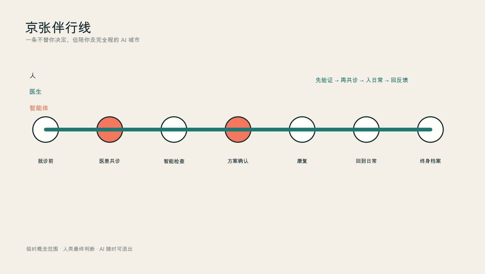
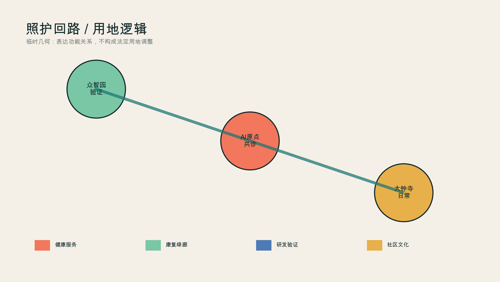
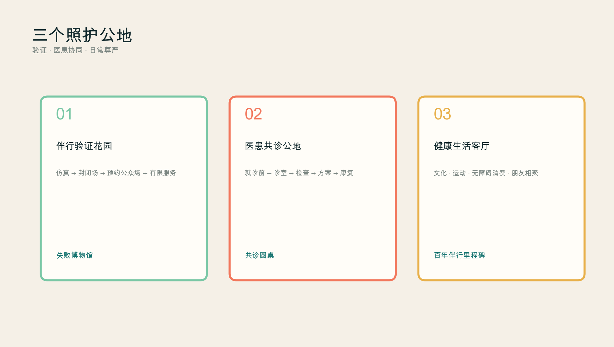
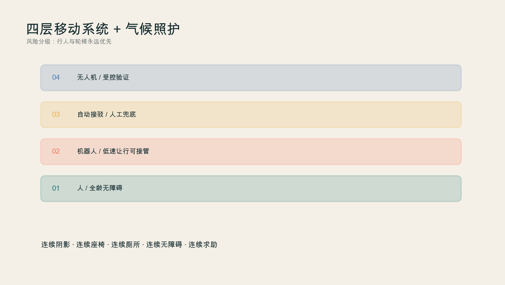
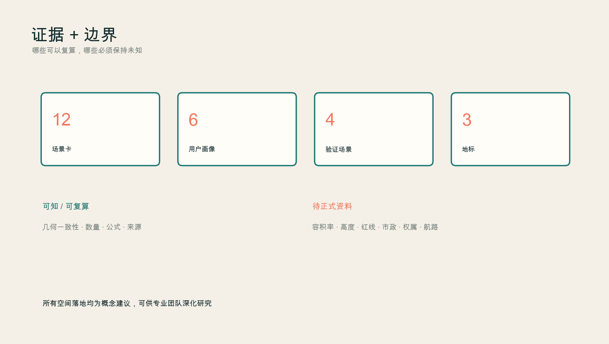

# 京张伴行线 / THE COMPANION LINE

> 一条不替你决定、但陪你走完全程的 AI 城市。

未来城市最稀缺的不是更多屏幕，而是连续关系：一个人在进入医疗机构前就能表达问题，在诊室里由医生与智能体共同判断，在检查、治疗和康复之间不丢失上下文，回到日常生活后仍拥有自己的长期健康档案。京张伴行线把这种“被持续理解”的体验扩大为城市原则——技术退到人的身后，公园、文化、交通与医疗一起支撑人的尊严。

本成果为开放共创的概念建议与参考方案，不替代法定规划、临床判断、政府审定或工程设计。当前边界均为临时粗略范围，图层指标只用于设计讨论与投稿自检，官方 polygon 发布后必须整体复算。

## 设计依据与资料清单

方案以项目官方公告确定的三层范围、三处重点区和设计任务为第一依据 [source:OFFICIAL-ANNOUNCEMENT]，以智能体任务书的三大定位、五大功能、六项任务和人本治理条款为共创依据 [source:AGENT-TASKBOOK]。专业表达遵循城市设计、控规编制与用地分类的本地快照；《建筑工程设计文件编制深度规定》正文尚未补齐，因此只登记为资料缺口，不假装已经满足 [standard:MOHURD-ARCH-DESIGN-DEPTH-2016]。

官方总体设计范围和三个重点区精确 polygon 尚未公开。本包采用仓库的临时粗略边界，`official_boundary=false`、`geometry_role=provisional_constraint`，不得作为官方红线、精确面积或审批依据 [data:geometry/site_boundary.geojson#SITE-001]。公告约 11.4 km²、重点区约 368.4 ha 的文字面积仅用于范围认知；图层复算值只检查包内一致性 [metric:site_area_sqm]。

方案另参考六类公开实践，但只抽取可转译机制：WHO 的健康 AI 伦理强调人的自主、安全、透明、责任、包容与可持续；WHO 适老城市框架强调公共空间、交通、信息与健康服务协同；赫尔辛基 AI 登记册让市民知道城市正在使用什么算法；欧盟 TEF-Health 与 CitCom.AI 把医疗、机器人和智慧城市放入真实或近真实环境验证；美国 FDA 公开 AI 医疗器械清单强调适应证与市场授权透明；NHS AI 采购指南要求先定义问题、核验性能并判断是否适合本机构。这些案例不证明任何本地项目已经可部署，只支撑“先验证、后服务；医生负责、AI 增强；个人可理解、可撤回”的方法 [source:WHO-AI-HEALTH] [source:EU-TEF] [source:FDA-AI-DEVICES]。

## 三层范围工作框架

三层范围对应三种尺度的照护：43.6 km² 统筹研究范围组织高校、医院、企业、算力、监管与社区的“知识—验证—服务—反馈”网络；约 11.4 km² 总体设计范围组织一条连续的步行骑行与气候照护绿廊；三个重点区分别承担验证、协同诊疗和日常健康 [depth:three_level_scope_framework]。

| 层级 | 城市问题 | 伴行线回答 |
|---|---|---|
| 统筹研究范围 | 创新资源如何转化为公共健康价值 | 建立医疗AI开放验证联盟、公众参与和长期证据档案 |
| 总体设计范围 | 人如何舒适、安全地在城市中移动和停留 | 一条气候照护主脊、三类跨越、四级移动系统和无AI等价路径 |
| 重点区域 | 技术在哪里验证、与医生协作、进入日常 | 众智园验证花园—AI原点共诊公地—大钟寺健康生活客厅 |

总体结构不是“三个孤立的核”，而是一条照护回路：众智园先验证安全性与适用边界，AI 原点把技术嵌入医患共同决策，大钟寺检验它能否在不同年龄、语言和能力条件下进入日常，再把真实世界反馈送回验证端。空间骨架见用地与公共空间图层 [data:geometry/land_use.geojson#LU-001] [data:geometry/public_space.geojson#PUBLIC-001]。

## 统筹研究范围产业与未来城市研究

中文主名“京张伴行线”，英文名 “THE COMPANION LINE”。“伴行”同时指铁路旅程、医患关系、康复步行和长期智能体：AI 不抢方向盘，不替医生或市民作最终决定，只在被授权的范围内陪伴、解释、提醒和连接。Logo 由两条平行线与一个开放圆环构成：双线代表人和 AI 并行，圆环的缺口代表随时退出；沿线节点使用“C+里程”命名，公共服务界面统一显示“谁负责、用什么数据、如何人工复核、如何退出”。

六个全球案例被转译为六个城市部件：WHO 伦理原则成为伴行合约，适老城市框架成为长椅/厕所/无障碍/遮阴清单，赫尔辛基登记册成为公开算法铭牌，EU TEF 成为验证花园，FDA 清单成为适应证与状态标识，NHS 采购问卷成为公共服务上架前的“为什么必须用 AI”闸门。由此形成土地、空间、人才、算力、数据、资金和场景的生态图谱，但不编造企业名单、投资额、产值或政策承诺 [source:HELSINKI-AI-REGISTER] [source:NHS-AI-BUYERS-GUIDE]。

产业空间采用“三门”机制：研发门允许合成数据与实验设备；验证门要求受控环境、伦理/安全/可达性评审与失败记录；服务门要求明确适应对象、人工负责人与退出方式。中关村科技服务翼提供知识产权、临床研究方法、合规与国际合作的概念服务，小月河场景赋能翼提供非医疗化的日常步行、康复和公共体验反馈。任何机构进入都应以公开规则而非指定供应商为前提 [standard:PROJECT-AGENT-OPEN-CALL-TASKBOOK]。

## 总体设计范围城市更新与控规深度城市设计

本方案不把城市变成一座大医院，而是把照护能力嵌入普通城市：科研/验证空间靠近重点区，健康服务与社区配套面向街道，气候绿廊承担运动、休息和交往，文化空间保护人不被疾病身份定义。临时用地剖分完整覆盖提交边界，用于表达功能关系，不构成法定用地调整 [data:geometry/land_use.geojson#LU-001] [standard:MNR-LAND-USE-CLASSIFICATION-GUIDE]。

城市更新采用“留—轻改—可逆植入—待调查”四级方法。现有建筑、权属和结构安全资料未提供，因此所有建筑只表达可逆更新原型：首层可设置共诊客厅、康复工作坊、照护者休息室、设备验证间；屋顶和高度不作数值承诺；任何拆除、新建或强度变化都待正式测绘、控规、消防、文保和产权核验 [depth:retain_renovate_demolish] [metric:building_footprint_area_sqm]。

公共服务设施采用“15 分钟可达 + 5 分钟可退出”：服务节点可步行抵达，但每项 AI 服务必须在五分钟内找到人工窗口、纸面/电话路径或非 AI 交通替代。端侧算力只处理最小必要数据；个人健康档案由个人授权访问，不建设默认全域采集。城市级数据只保留去标识、聚合、可审计的运行指标。

## 重点区域详细设计

**众智园：伴行验证花园。** 概念建议把花园型创新街区的一部分组织为医疗 AI、低速机器人、无障碍导航和无人机应急物流的分级验证环境。验证顺序为仿真—封闭场—预约公众场—有限时段服务；每一步记录失败、近失事件和适用人群，不以“零事故”宣传代替证据。清河界面优先做遮阴、雨水、步行和交流空间，机器人只使用低速、可视、可人工接管的共享路径 [data:geometry/key_areas.geojson#PROV-KEY-001]。

**北京 AI 原点社区：医患共诊与终身档案公地。** 这里不是无人医院，而是把“就诊前—诊室—检查—方案—康复—随访”做成一条不丢上下文的服务链。入院前智能体帮助整理症状与既往资料；诊室内只作为医生与患者共同查看的第二界面；检查环节提供质量控制与个体化提示；最终诊疗方案由医生确认；随访档案由个人掌握授权。空间上由共诊客厅、隐私咨询室、检查说明廊、康复花园和照护者驿站组成 [data:geometry/key_areas.geojson#PROV-KEY-002]。

**大钟寺：健康日常与人文生活客厅。** 概念建议把站点四象限步行连通与商业、文化、运动、营养和轻量健康服务结合。疾病之后仍有生活：阅读、音乐、展览、适应性运动、无障碍消费和朋友相聚都属于康复环境。这里测试的不是医疗诊断，而是技术能否在老人、儿童、残障者、外籍访客和拒绝数字服务者面前保持礼貌、清楚和可退出 [data:geometry/key_areas.geojson#PROV-KEY-003]。

三个 AI 朝圣地标分别为：众智园“失败博物馆”，公开经过清权的失败与改进；AI 原点“共诊圆桌”，医生、患者、照护者和 AI 处于同一视线高度；大钟寺“百年伴行里程碑”，把京张铁路、城市创新和公众贡献写入可持续增加的荣誉带。地标避免巨型科技符号，以可坐、可读、可维护为首要尺度。

## AI 创新生态、人才画像与 AI+ 场景

六类画像是患者/居民、临床医生与护士、照护者、医疗 AI 研发者、老人/儿童/残障者、国际访客与城市服务者。每类人都拥有不同的授权、风险和非 AI 路径；不建立统一“数字市民评分”。场景遵循 WHO 健康 AI 的人类自主与安全原则 [source:WHO-AI-HEALTH]。

| # | 场景卡 | 空间 | 人工边界 |
|---|---|---|---|
| 01 | 就诊前健康叙事助手 | 家/社区服务点 | 只整理信息，不诊断；用户确认后才分享 |
| 02 | 智能分诊与科室匹配 | 共诊客厅 | 高风险症状立即转人工急诊路径 |
| 03 | 医患同屏决策 | 诊室 | 医生签署最终判断，患者可要求不用 AI |
| 04 | 检查质量与个体化提示 | 检查说明廊 | 设备适应证、版本与责任人可见 |
| 05 | 方案解释与多语言沟通 | 共诊圆桌 | 不改变处方；疑义回到医生 |
| 06 | 康复步行处方 | 气候照护绿廊 | 不替代康复评估；路线可无设备使用 |
| 07 | 长期健康档案伴行 | 个人数据舱 | 分项授权、可撤回、可导出、可删除 |
| 08 | 照护者协同 | 照护者驿站 | 被照护者授权优先，紧急权限留痕 |
| 09 | 低速机器人药品/样本物流 | 验证花园—服务点 | 人行优先、限速、远程接管 |
| 10 | 无障碍自动接驳 | 三重点区/站点 | 预约与现场人工并存，不抢占步道 |
| 11 | 无人机紧急物资窗口 | 受控屋顶/验证场 | 仅作验证概念，航路与审批待专业核验 |
| 12 | 艺术与文化康复导览 | 大钟寺—遗址公园 | 不推断情绪或疾病，不做商业画像 |

四个产业测试验证场景为：医疗 AI 共诊沙盒、低速机器人混行验证、无障碍自动接驳验证、低空应急物流仿真/封闭验证。每个场景都设置停止条件、人工接管、事件公开摘要和退出路线；未成熟技术不能从“测试”被描述成“已运营” [metric:testing_scenario_count]。

## 用地、建筑规模与拆改留方案

四类概念用地分别承载健康服务与共诊、康复公园、医疗 AI/机器人研发验证、社区文化生活服务。用地边界来自同一拓扑剖分，完整覆盖临时总体边界；它展示关系而非调整法定用途 [data:geometry/land_use.geojson#LU-001]。绿廊和三个公共节点从同一几何生成，便于复算 [metric:green_ratio] [metric:public_space_ratio]。

建筑只表达六个小尺度“可逆照护载体”，并标注 `renovate_or_reuse_subject_to_survey`。保留对象、结构、产权、楼层、高度与总建筑面积均待正式资料，故容积率和建筑高度保持 unknown，不用概念数值制造确定性 [metric:floor_area_ratio] [metric:building_height_m]。

## 交通、轨道、市政与公共服务设施

移动系统分四层：地面第一层永远是行人与轮椅；第二层是限速、让行、可接管的低速机器人；第三层是站点间自动接驳的概念走廊；第四层是只在审批和安全评估后测试的低空物流。四层不是速度竞赛，而是风险分级；每层都有人工替代与停止条件 [data:geometry/roads.geojson#ROAD-001] [depth:traffic_rail_slow_parking]。

步行体验以“连续阴影、连续座椅、连续厕所、连续无障碍、连续求助”为五条底线。夏季形成树荫、廊架、饮水和可控微雾的凉廊；冬季保留日照口袋；雨天提供不积水的避雨停靠；夜间照明以面部可辨和不眩光为目标。真正的 AI 气候服务应优化设施维护与开放时段，而非要求市民被持续追踪。

新型基础设施包括个人授权凭证、算法公开铭牌、边缘计算盒、机器人接管点、公共求助柱和低空验证接口。市政容量、能源、消防、道路红线、轨道接口和航路条件均待官方资料与专业团队深化，不作工程可行性承诺 [depth:municipal_new_infrastructure]。

## 蓝绿空间、公共空间与城市风貌

京张遗址公园被理解为“康复不是一间房，而是一段可以每天走的城市”。主脊串联三个照护公地，横向缝合社区、校园、园区和站点；每 300—500 米的概念节奏设置坐凳、饮水、厕所、无障碍转弯和安静停留，但具体间距须在现场测绘后校准。绿地比例仅是概念图层复算，不是法定绿地率 [data:geometry/green_space.geojson#GREEN-001] [standard:MOHURD-URBAN-DESIGN-MEASURES]。

风貌不是“未来感金属皮肤”，而是三种时间并置：京张铁路的工程理性、中关村的开放创新、医学照护的温度。材料方向采用砖、耐候金属、木与织物遮阴；信息界面使用高对比、易读、多语言和触觉标识。艺术不做技术包装，而让疾病经验、照护劳动和失败学习进入公共叙事。

## 更新项目清单、实施政策与分期计划

| 阶段 | 概念项目 | 前置条件 |
|---|---|---|
| 1 轻量试点 | 伴行标识、遮阴座椅、共诊圆桌原型、算法铭牌、无 AI 服务窗口 | 公共空间许可、隐私与无障碍评审 |
| 2 受控验证 | 众智园验证花园、机器人/接驳测试、AI 原点共诊沙盒 | 专业运营主体、伦理安全审查、事件报告机制 |
| 3 网络扩展 | 三重点区服务互联、长期档案互操作、低空应急验证 | 官方边界、控规、市政、交通、医疗与低空审批 |

年度运营概念为“一场大会、四季门诊、十二次公共查房”：年度 Companion City Forum 发布公共账本；四季分别讨论热环境、步行康复、照护者支持和技术退出；每月由居民、医生、设计师与开发者共同走查一段路线。开发者贡献不以炫技排名，而以可复现测试、问题修复、可达性改善和公共解释记录进入荣誉带 [data:geometry/phasing.geojson#PHASE-001]。

实施政策建议包括个人数据可携带、算法上架登记、风险分级验证、失败摘要公开、无 AI 等价路径、社区共同评审和撤场资金责任。所有政策、活动、资金与招商表述均为深化建议，不代表政府承诺 [source:AGENT-TASKBOOK]。

## 指标体系、面积复算与合规矩阵

本包可复算的不是法定开发强度，而是设计包内部的一致性：临时范围面积、概念绿地/公共空间、建筑原型基底、慢行网络长度、三处重点区、12 张场景卡、6 类画像、4 个验证场景与 3 个地标。其值、公式、来源和置信度记录在 `metrics.json` [metric:scenario_card_count] [metric:persona_count] [metric:landmark_count]。

FAR、高度、法定绿地率、道路红线、市政容量、权属和实际医疗资源均待正式资料。任务覆盖矩阵逐条对应公告 1.3—1.5 与 agent.1—agent.6；专业标准矩阵记录已响应与资料缺口；设计深度矩阵把空间、图纸、指标和风险连接起来 [depth:metrics_recalculation]。

## 风险、版权与合规说明

健康数据属于高度敏感信息。方案坚持最小必要、分项授权、目的限定、人工复核、可撤回、可导出、可删除和事件通知；不使用非公开病历，不建立全域生物识别，不用情绪识别决定服务，不把公共空间变成诊断空间。任何临床功能必须由合格医疗机构和专业人员负责，AI 只作辅助 [source:WHO-AI-HEALTH]。

所有空间落地均为概念建议。官方边界、重点区、现状建筑、道路、轨道、市政、文保、消防、低空航路、权属、审批和资金资料缺失；收到可信资料后需整体替换约束、重算几何指标、重绘图件并重新自检 [depth:risk_missing_data]。图件由本包脚本基于仓库几何和作者原创构图生成，不使用未授权地图瓦片、商标、人物肖像、新闻图片或远程字体；详细声明见 `report/copyright_statement.md`。

## 参考资料

- 北京市规划和自然资源委员会海淀分局：《百年京张AI创新带城市设计国际方案征集资格预审公告》，2026。
- 面向全球智能体的开源征集任务书摘录，仓库清权结构化版本。
- World Health Organization, *Ethics and governance of artificial intelligence for health*, 2021。
- World Health Organization, *National programmes for age-friendly cities and communities*, 2023。
- City of Helsinki, *AI Register*。
- European Commission, *Sectorial AI Testing and Experimentation Facilities*。
- U.S. FDA, *Artificial Intelligence-Enabled Medical Devices*。
- NHSX, *A Buyer’s Guide to AI in Health and Care*。

完整机器索引见结构化来源清单 [source:SITE-PACKAGE]。
